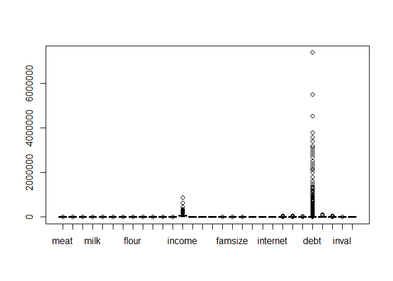
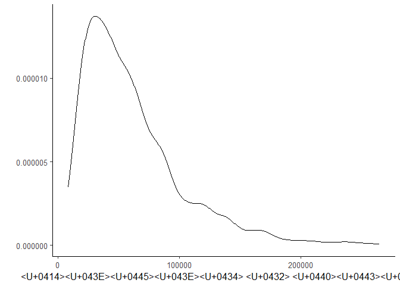
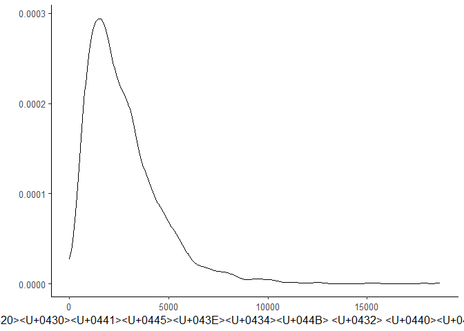
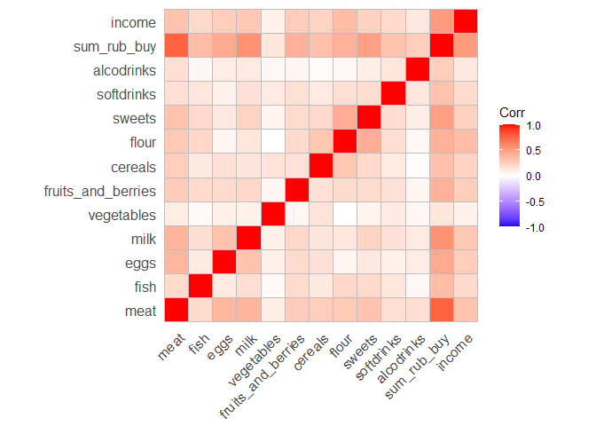
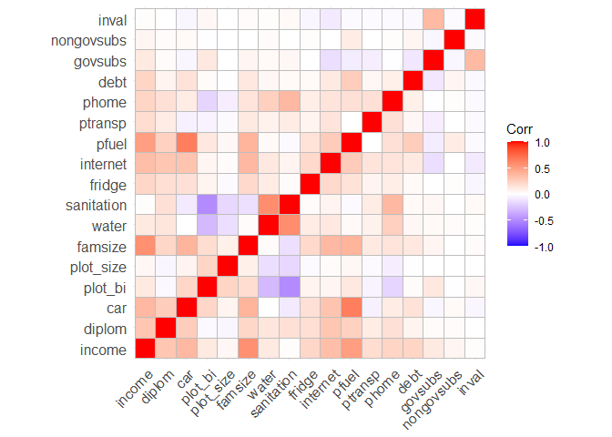
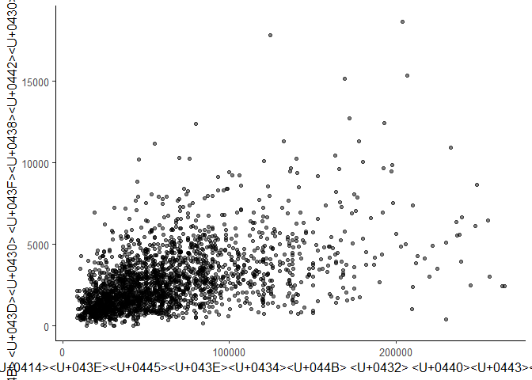

KRcodeR
================

# Подготовка к работе

## Загрузка пакетов

``` r
library(readr)
library(dplyr)
library(tidyr)
library(ggplot2)
library(GGally)
library(sandwich)
library(lmtest)
library(broom)
library(xtable)
library(ggpubr)
library(stargazer)
library(modelsummary)
library(nlWaldTest)
library(car)
library(margins)
library(Hmisc)
library(ggcorrplot)
library(ggstatsplot)
library(flextable)
```

### Общая тема оформления для всех графиков и отключение экспоненциальной записи чисел

``` r
theme_set(theme_classic(base_size = 12))
options(scipen = 999) 
```

# Загрузка данных

``` r
my_data <- read.csv("dataset.csv")
```

# Избавляем от пустых значений и убираем выбросы

``` r
data <- replace(my_data,is.na(my_data),0) 

boxplot(data) # Checking outliers
```

<!-- -->

``` r
# Removing outliers from income
x <- data[data$'income' > quantile(data$'income', 0.005) & data$'income' < quantile(data$'income', 0.995),]
```

# Типы данных

``` r
x$status <- as.factor(x$status)

glimpse(x)
```

    ## Rows: 2,365
    ## Columns: 30
    ## $ meat               <dbl> 0.20, 3.30, 4.50, 1.50, 1.60, 1.50, 1.60, 4.00, 1.6~
    ## $ fish               <dbl> 1.0, 0.0, 1.5, 0.0, 0.0, 0.0, 1.0, 0.0, 0.0, 0.0, 1~
    ## $ eggs               <dbl> 0, 20, 10, 20, 0, 0, 10, 0, 0, 50, 10, 20, 0, 20, 2~
    ## $ milk               <dbl> 0.00, 1.00, 3.00, 2.00, 2.50, 7.00, 2.40, 5.00, 2.0~
    ## $ vegetables         <dbl> 5.0, 1.5, 1.0, 12.5, 0.0, 0.0, 0.0, 0.0, 0.0, 0.0, ~
    ## $ fruits_and_berries <dbl> 1.0, 0.3, 0.0, 1.5, 0.0, 0.0, 0.0, 1.0, 0.0, 1.5, 0~
    ## $ cereals            <dbl> 0.0, 1.0, 1.0, 0.0, 1.0, 0.0, 0.0, 3.0, 1.0, 0.0, 1~
    ## $ flour              <dbl> 1.30, 1.50, 1.40, 1.20, 3.50, 8.80, 4.20, 6.40, 3.2~
    ## $ sweets             <dbl> 0.0, 1.2, 2.0, 2.0, 1.5, 7.0, 1.0, 2.0, 1.0, 4.0, 0~
    ## $ softdrinks         <dbl> 0.00, 0.00, 0.00, 0.00, 0.15, 0.00, 0.00, 0.25, 0.0~
    ## $ alcodrinks         <dbl> 0.0, 0.0, 0.0, 0.0, 0.0, 0.0, 0.0, 0.0, 0.0, 0.0, 0~
    ## $ sum_rub_buy        <dbl> 336, 1298, 1834, 924, 1208, 2644, 1331, 3528, 844, ~
    ## $ income             <dbl> 28161, 36900, 68070, 59000, 25000, 105400, 28900, 6~
    ## $ diplom             <int> 1, 0, 1, 1, 0, 0, 0, 0, 0, 0, 0, 1, 0, 0, 0, 0, 0, ~
    ## $ car                <int> 0, 1, 1, 0, 0, 1, 0, 1, 0, 1, 0, 1, 0, 0, 0, 0, 0, ~
    ## $ plot_bi            <int> 0, 1, 1, 1, 1, 1, 1, 1, 0, 1, 0, 0, 1, 1, 1, 0, 1, ~
    ## $ plot_size          <dbl> 0.0, 12.0, 10.4, 6.0, 6.0, 25.0, 2.0, 10.0, 0.0, 8.~
    ## $ famsize            <int> 1, 2, 2, 2, 1, 3, 1, 2, 1, 2, 1, 2, 2, 2, 1, 1, 2, ~
    ## $ water              <int> 1, 1, 0, 1, 1, 1, 1, 1, 1, 1, 1, 1, 0, 1, 1, 1, 0, ~
    ## $ sanitation         <int> 1, 1, 0, 1, 1, 1, 1, 1, 1, 1, 1, 1, 0, 1, 1, 1, 0, ~
    ## $ fridge             <int> 1, 0, 0, 1, 1, 1, 1, 1, 1, 1, 1, 1, 1, 1, 1, 1, 1, ~
    ## $ internet           <int> 0, 1, 0, 1, 0, 1, 0, 1, 0, 1, 0, 1, 1, 1, 0, 0, 1, ~
    ## $ pfuel              <dbl> 0, 0, 0, 0, 0, 5000, 0, 4000, 0, 3000, 0, 6000, 0, ~
    ## $ ptransp            <dbl> 0, 3000, 0, 1200, 0, 0, 0, 0, 0, 0, 0, 430, 410, 90~
    ## $ phome              <dbl> 6200.00, 10000.00, 0.00, 5800.00, 7000.00, 11000.00~
    ## $ debt               <int> 0, 0, 0, 0, 0, 500000, 100000, 0, 0, 0, 0, 0, 0, 20~
    ## $ govsubs            <dbl> 26732, 26300, 66100, 29720, 23000, 105400, 26900, 5~
    ## $ nongovsubs         <int> 0, 0, 0, 0, 0, 0, 0, 0, 0, 0, 0, 0, 0, 0, 0, 0, 0, ~
    ## $ inval              <int> 0, 0, 1, 0, 0, 0, 1, 0, 1, 0, 0, 1, 0, 0, 0, 0, 0, ~
    ## $ status             <fct> 3, 3, 3, 3, 4, 4, 4, 4, 4, 4, 4, 4, 4, 4, 4, 4, 4, ~

# Описательные статистики

``` r
#summary(x)
desc <- datasummary(All(x) ~ mean + SD + Min + Max,data = x, output = 'krdatatable.docx')
desc_print <- datasummary(All(x) ~ mean + SD + Min + Max,data = x)
desc
```

    ## [1] "krdatatable.docx"

``` r
desc_print
```

|                    |     mean |        SD |     Min |        Max |
|:-------------------|---------:|----------:|--------:|-----------:|
| meat               |     3.42 |      2.73 |    0.00 |      27.00 |
| fish               |     0.51 |      0.83 |    0.00 |       7.00 |
| eggs               |    10.78 |     10.84 |    0.00 |     100.00 |
| milk               |     3.73 |      3.25 |    0.00 |      26.00 |
| vegetables         |     4.75 |     15.14 |    0.00 |     352.00 |
| fruits_and_berries |     2.49 |      3.29 |    0.00 |      30.00 |
| cereals            |     0.64 |      0.96 |    0.00 |      12.00 |
| flour              |     4.13 |      5.01 |    0.00 |      56.45 |
| sweets             |     1.98 |      2.55 |    0.00 |      35.00 |
| softdrinks         |     0.60 |      1.46 |    0.00 |      25.05 |
| alcodrinks         |     0.45 |      1.32 |    0.00 |      28.00 |
| sum_rub_buy        |  2717.05 |   1903.88 |    0.00 |   18671.00 |
| income             | 61296.61 |  41319.05 | 8300.00 |  265000.00 |
| diplom             |     0.43 |      0.49 |    0.00 |       1.00 |
| car                |     0.42 |      0.49 |    0.00 |       1.00 |
| plot_bi            |     0.47 |      0.50 |    0.00 |       1.00 |
| plot_size          |     6.30 |     31.43 |    0.00 |    1430.00 |
| famsize            |     2.57 |      1.60 |    1.00 |      13.00 |
| water              |     0.90 |      0.31 |    0.00 |       1.00 |
| sanitation         |     0.74 |      0.44 |    0.00 |       1.00 |
| fridge             |     0.73 |      0.44 |    0.00 |       1.00 |
| internet           |     0.70 |      0.46 |    0.00 |       1.00 |
| pfuel              |  1880.02 |   3118.73 |    0.00 |   41000.00 |
| ptransp            |   833.41 |   1911.98 |    0.00 |   50000.00 |
| phome              |  4284.80 |   3289.21 |    0.00 |   35500.00 |
| debt               | 82621.56 | 378334.52 |    0.00 | 7380000.00 |
| govsubs            | 19912.93 |  18513.17 |    0.00 |  106595.00 |
| nongovsubs         |    88.59 |   1530.12 |    0.00 |   50000.00 |
| inval              |     0.16 |      0.37 |    0.00 |       1.00 |

# Графики

## Плотность распределения: доход в руб.

``` r
x %>% 
  ggplot(aes(income)) + 
  geom_density(alpha = 0.25) +
  xlab("Доход в руб.") +
  ylab("")
```

<!-- -->

## Плотность распределения: расходы на питание в руб.

``` r
x %>% 
  ggplot(aes(sum_rub_buy)) + 
  geom_density(alpha = 0.25) +
  xlab("Расходы в руб.") +
  ylab("")
```

<!-- -->

## Корреляция между категориями еды и доходом

``` r
correlation = x %>% select(1:13)
rcorr(as.matrix(correlation))
```

    ##                    meat fish eggs milk vegetables fruits_and_berries cereals
    ## meat               1.00 0.19 0.38 0.39       0.10               0.27    0.26
    ## fish               0.19 1.00 0.11 0.17       0.03               0.19    0.12
    ## eggs               0.38 0.11 1.00 0.31       0.08               0.19    0.16
    ## milk               0.39 0.17 0.31 1.00       0.07               0.21    0.14
    ## vegetables         0.10 0.03 0.08 0.07       1.00               0.05    0.15
    ## fruits_and_berries 0.27 0.19 0.19 0.21       0.05               1.00    0.16
    ## cereals            0.26 0.12 0.16 0.14       0.15               0.16    1.00
    ## flour              0.28 0.21 0.05 0.13       0.00               0.19    0.30
    ## sweets             0.31 0.20 0.12 0.23       0.06               0.19    0.20
    ## softdrinks         0.17 0.13 0.07 0.16       0.11               0.16    0.11
    ## alcodrinks         0.17 0.04 0.10 0.11       0.04               0.05    0.02
    ## sum_rub_buy        0.77 0.35 0.44 0.56       0.13               0.40    0.33
    ## income             0.31 0.20 0.26 0.29       0.07               0.26    0.23
    ##                    flour sweets softdrinks alcodrinks sum_rub_buy income
    ## meat                0.28   0.31       0.17       0.17        0.77   0.31
    ## fish                0.21   0.20       0.13       0.04        0.35   0.20
    ## eggs                0.05   0.12       0.07       0.10        0.44   0.26
    ## milk                0.13   0.23       0.16       0.11        0.56   0.29
    ## vegetables          0.00   0.06       0.11       0.04        0.13   0.07
    ## fruits_and_berries  0.19   0.19       0.16       0.05        0.40   0.26
    ## cereals             0.30   0.20       0.11       0.02        0.33   0.23
    ## flour               1.00   0.42       0.17       0.04        0.40   0.35
    ## sweets              0.42   1.00       0.18       0.09        0.49   0.24
    ## softdrinks          0.17   0.18       1.00       0.13        0.31   0.19
    ## alcodrinks          0.04   0.09       0.13       1.00        0.26   0.12
    ## sum_rub_buy         0.40   0.49       0.31       0.26        1.00   0.51
    ## income              0.35   0.24       0.19       0.12        0.51   1.00
    ## 
    ## n= 2365 
    ## 
    ## 
    ## P
    ##                    meat   fish   eggs   milk   vegetables fruits_and_berries
    ## meat                      0.0000 0.0000 0.0000 0.0000     0.0000            
    ## fish               0.0000        0.0000 0.0000 0.1684     0.0000            
    ## eggs               0.0000 0.0000        0.0000 0.0002     0.0000            
    ## milk               0.0000 0.0000 0.0000        0.0010     0.0000            
    ## vegetables         0.0000 0.1684 0.0002 0.0010            0.0195            
    ## fruits_and_berries 0.0000 0.0000 0.0000 0.0000 0.0195                       
    ## cereals            0.0000 0.0000 0.0000 0.0000 0.0000     0.0000            
    ## flour              0.0000 0.0000 0.0203 0.0000 0.8686     0.0000            
    ## sweets             0.0000 0.0000 0.0000 0.0000 0.0043     0.0000            
    ## softdrinks         0.0000 0.0000 0.0006 0.0000 0.0000     0.0000            
    ## alcodrinks         0.0000 0.0733 0.0000 0.0000 0.0583     0.0095            
    ## sum_rub_buy        0.0000 0.0000 0.0000 0.0000 0.0000     0.0000            
    ## income             0.0000 0.0000 0.0000 0.0000 0.0004     0.0000            
    ##                    cereals flour  sweets softdrinks alcodrinks sum_rub_buy
    ## meat               0.0000  0.0000 0.0000 0.0000     0.0000     0.0000     
    ## fish               0.0000  0.0000 0.0000 0.0000     0.0733     0.0000     
    ## eggs               0.0000  0.0203 0.0000 0.0006     0.0000     0.0000     
    ## milk               0.0000  0.0000 0.0000 0.0000     0.0000     0.0000     
    ## vegetables         0.0000  0.8686 0.0043 0.0000     0.0583     0.0000     
    ## fruits_and_berries 0.0000  0.0000 0.0000 0.0000     0.0095     0.0000     
    ## cereals                    0.0000 0.0000 0.0000     0.3126     0.0000     
    ## flour              0.0000         0.0000 0.0000     0.0800     0.0000     
    ## sweets             0.0000  0.0000        0.0000     0.0000     0.0000     
    ## softdrinks         0.0000  0.0000 0.0000            0.0000     0.0000     
    ## alcodrinks         0.3126  0.0800 0.0000 0.0000                0.0000     
    ## sum_rub_buy        0.0000  0.0000 0.0000 0.0000     0.0000                
    ## income             0.0000  0.0000 0.0000 0.0000     0.0000     0.0000     
    ##                    income
    ## meat               0.0000
    ## fish               0.0000
    ## eggs               0.0000
    ## milk               0.0000
    ## vegetables         0.0004
    ## fruits_and_berries 0.0000
    ## cereals            0.0000
    ## flour              0.0000
    ## sweets             0.0000
    ## softdrinks         0.0000
    ## alcodrinks         0.0000
    ## sum_rub_buy        0.0000
    ## income

## Корреляция между независимыми переменными

``` r
correlation1 = data %>% select(13:29)
rcorr(as.matrix(correlation1))
```

    ##            income diplom   car plot_bi plot_size famsize water sanitation
    ## income       1.00   0.30  0.37    0.11      0.04    0.57  0.11       0.01
    ## diplom       0.30   1.00  0.26   -0.03     -0.04    0.21  0.13       0.16
    ## car          0.37   0.26  1.00    0.21      0.06    0.39  0.00      -0.09
    ## plot_bi      0.11  -0.03  0.21    1.00      0.22    0.18 -0.30      -0.50
    ## plot_size    0.04  -0.04  0.06    0.22      1.00    0.08 -0.14      -0.17
    ## famsize      0.57   0.21  0.39    0.18      0.08    1.00  0.02      -0.13
    ## water        0.11   0.13  0.00   -0.30     -0.14    0.02  1.00       0.58
    ## sanitation   0.01   0.16 -0.09   -0.50     -0.17   -0.13  0.58       1.00
    ## fridge       0.21   0.17  0.16    0.06     -0.02    0.20  0.10       0.02
    ## internet     0.34   0.30  0.31    0.05      0.02    0.37  0.12       0.06
    ## pfuel        0.50   0.24  0.65    0.12      0.04    0.39  0.03      -0.02
    ## ptransp      0.18   0.10 -0.06   -0.05     -0.02    0.11  0.07       0.10
    ## phome        0.22   0.16  0.10   -0.18     -0.07    0.14  0.25       0.37
    ## debt         0.22   0.06  0.15    0.02     -0.01    0.12  0.04       0.03
    ## govsubs      0.11   0.02 -0.04    0.12      0.00    0.05  0.03       0.04
    ## nongovsubs   0.05   0.02  0.03   -0.01      0.00    0.00  0.02       0.00
    ## inval        0.01   0.00 -0.04    0.04      0.00    0.02  0.01       0.03
    ##            fridge internet pfuel ptransp phome  debt govsubs nongovsubs inval
    ## income       0.21     0.34  0.50    0.18  0.22  0.22    0.11       0.05  0.01
    ## diplom       0.17     0.30  0.24    0.10  0.16  0.06    0.02       0.02  0.00
    ## car          0.16     0.31  0.65   -0.06  0.10  0.15   -0.04       0.03 -0.04
    ## plot_bi      0.06     0.05  0.12   -0.05 -0.18  0.02    0.12      -0.01  0.04
    ## plot_size   -0.02     0.02  0.04   -0.02 -0.07 -0.01    0.00       0.00  0.00
    ## famsize      0.20     0.37  0.39    0.11  0.14  0.12    0.05       0.00  0.02
    ## water        0.10     0.12  0.03    0.07  0.25  0.04    0.03       0.02  0.01
    ## sanitation   0.02     0.06 -0.02    0.10  0.37  0.03    0.04       0.00  0.03
    ## fridge       1.00     0.20  0.15    0.06  0.09  0.03    0.00       0.01 -0.04
    ## internet     0.20     1.00  0.27    0.14  0.14  0.11   -0.14       0.00 -0.09
    ## pfuel        0.15     0.27  1.00    0.00  0.16  0.26   -0.08       0.10 -0.02
    ## ptransp      0.06     0.14  0.00    1.00  0.16  0.04   -0.07       0.00 -0.02
    ## phome        0.09     0.14  0.16    0.16  1.00  0.08   -0.01       0.01 -0.02
    ## debt         0.03     0.11  0.26    0.04  0.08  1.00   -0.10       0.05 -0.03
    ## govsubs      0.00    -0.14 -0.08   -0.07 -0.01 -0.10    1.00      -0.04  0.36
    ## nongovsubs   0.01     0.00  0.10    0.00  0.01  0.05   -0.04       1.00 -0.02
    ## inval       -0.04    -0.09 -0.02   -0.02 -0.02 -0.03    0.36      -0.02  1.00
    ## 
    ## n= 2390 
    ## 
    ## 
    ## P
    ##            income diplom car    plot_bi plot_size famsize water  sanitation
    ## income            0.0000 0.0000 0.0000  0.0759    0.0000  0.0000 0.4877    
    ## diplom     0.0000        0.0000 0.1549  0.0735    0.0000  0.0000 0.0000    
    ## car        0.0000 0.0000        0.0000  0.0033    0.0000  0.8158 0.0000    
    ## plot_bi    0.0000 0.1549 0.0000         0.0000    0.0000  0.0000 0.0000    
    ## plot_size  0.0759 0.0735 0.0033 0.0000            0.0002  0.0000 0.0000    
    ## famsize    0.0000 0.0000 0.0000 0.0000  0.0002            0.3819 0.0000    
    ## water      0.0000 0.0000 0.8158 0.0000  0.0000    0.3819         0.0000    
    ## sanitation 0.4877 0.0000 0.0000 0.0000  0.0000    0.0000  0.0000           
    ## fridge     0.0000 0.0000 0.0000 0.0061  0.3559    0.0000  0.0000 0.2461    
    ## internet   0.0000 0.0000 0.0000 0.0170  0.2617    0.0000  0.0000 0.0030    
    ## pfuel      0.0000 0.0000 0.0000 0.0000  0.0331    0.0000  0.1717 0.3119    
    ## ptransp    0.0000 0.0000 0.0064 0.0206  0.2266    0.0000  0.0004 0.0000    
    ## phome      0.0000 0.0000 0.0000 0.0000  0.0004    0.0000  0.0000 0.0000    
    ## debt       0.0000 0.0027 0.0000 0.2920  0.6735    0.0000  0.0424 0.2160    
    ## govsubs    0.0000 0.3437 0.0498 0.0000  0.9447    0.0178  0.1581 0.0523    
    ## nongovsubs 0.0226 0.2301 0.1850 0.5341  0.8375    0.9959  0.3382 0.9329    
    ## inval      0.6374 0.8571 0.0631 0.0421  0.8106    0.3457  0.7361 0.1810    
    ##            fridge internet pfuel  ptransp phome  debt   govsubs nongovsubs
    ## income     0.0000 0.0000   0.0000 0.0000  0.0000 0.0000 0.0000  0.0226    
    ## diplom     0.0000 0.0000   0.0000 0.0000  0.0000 0.0027 0.3437  0.2301    
    ## car        0.0000 0.0000   0.0000 0.0064  0.0000 0.0000 0.0498  0.1850    
    ## plot_bi    0.0061 0.0170   0.0000 0.0206  0.0000 0.2920 0.0000  0.5341    
    ## plot_size  0.3559 0.2617   0.0331 0.2266  0.0004 0.6735 0.9447  0.8375    
    ## famsize    0.0000 0.0000   0.0000 0.0000  0.0000 0.0000 0.0178  0.9959    
    ## water      0.0000 0.0000   0.1717 0.0004  0.0000 0.0424 0.1581  0.3382    
    ## sanitation 0.2461 0.0030   0.3119 0.0000  0.0000 0.2160 0.0523  0.9329    
    ## fridge            0.0000   0.0000 0.0053  0.0000 0.1483 0.9425  0.6278    
    ## internet   0.0000          0.0000 0.0000  0.0000 0.0000 0.0000  0.8902    
    ## pfuel      0.0000 0.0000          0.9366  0.0000 0.0000 0.0002  0.0000    
    ## ptransp    0.0053 0.0000   0.9366         0.0000 0.0467 0.0004  0.9903    
    ## phome      0.0000 0.0000   0.0000 0.0000         0.0002 0.7441  0.6506    
    ## debt       0.1483 0.0000   0.0000 0.0467  0.0002        0.0000  0.0240    
    ## govsubs    0.9425 0.0000   0.0002 0.0004  0.7441 0.0000         0.0780    
    ## nongovsubs 0.6278 0.8902   0.0000 0.9903  0.6506 0.0240 0.0780            
    ## inval      0.0716 0.0000   0.2750 0.2838  0.3576 0.1806 0.0000  0.4453    
    ##            inval 
    ## income     0.6374
    ## diplom     0.8571
    ## car        0.0631
    ## plot_bi    0.0421
    ## plot_size  0.8106
    ## famsize    0.3457
    ## water      0.7361
    ## sanitation 0.1810
    ## fridge     0.0716
    ## internet   0.0000
    ## pfuel      0.2750
    ## ptransp    0.2838
    ## phome      0.3576
    ## debt       0.1806
    ## govsubs    0.0000
    ## nongovsubs 0.4453
    ## inval

### График корреляции между категориями еды и доходом

``` r
ggcorrplot(cor(correlation))
```

<!-- -->

``` r
b = rcorr(as.matrix(data))
tidy(b)
```

    ## # A tibble: 435 x 5
    ##    column1    column2 estimate     n      p.value
    ##    <chr>      <chr>      <dbl> <int>        <dbl>
    ##  1 fish       meat      0.191   2390 0           
    ##  2 eggs       meat      0.383   2390 0           
    ##  3 eggs       fish      0.116   2390 0.0000000131
    ##  4 milk       meat      0.400   2390 0           
    ##  5 milk       fish      0.178   2390 0           
    ##  6 milk       eggs      0.318   2390 0           
    ##  7 vegetables meat      0.109   2390 0.0000000937
    ##  8 vegetables fish      0.0300  2390 0.143       
    ##  9 vegetables eggs      0.0815  2390 0.0000670   
    ## 10 vegetables milk      0.0741  2390 0.000286    
    ## # ... with 425 more rows

### График корреляции между независимыми переменными

``` r
ggcorrplot(cor(correlation1))
```

<!-- -->

## Совместное распределение дохода в руб. и расходы на питание в руб.

``` r
x %>% 
  ggplot(aes(x = income, y = sum_rub_buy)) +
  geom_jitter(width = 0.25, alpha = 0.5) +  
  scale_y_continuous(name = "Расходы на питание в руб.") +
  scale_x_continuous(name = "Доходы в руб.")
```

<!-- -->

``` r
abs_inq <- select(x, meat, fish, eggs, milk, vegetables, fruits_and_berries, cereals, flour, sweets, softdrinks, alcodrinks, income)

abs_inq <- abs_inq %>% 
  mutate(decile = ntile(income, 10))

food_consumption_long <- abs_inq %>% 
  pivot_longer(cols = -c(income, decile), names_to = "food_category", values_to = "consumption")

food_consumption_by_decile <- food_consumption_long %>% 
  group_by(food_category, decile)

food_consumption_table <- food_consumption_by_decile %>% 
  summarise(avg_consumption = mean(consumption)) %>% 
  pivot_wider(names_from = decile, values_from = avg_consumption)
```

    ## `summarise()` has grouped output by 'food_category'. You can override using the
    ## `.groups` argument.

``` r
names(food_consumption_table)[-1] <- paste0("Decile ", 1:10)

food_consumption_table
```

    ## # A tibble: 11 x 11
    ## # Groups:   food_category [11]
    ##    food_category Decil~1 Decil~2 Decil~3 Decil~4 Decil~5 Decil~6 Decil~7 Decil~8
    ##    <chr>           <dbl>   <dbl>   <dbl>   <dbl>   <dbl>   <dbl>   <dbl>   <dbl>
    ##  1 alcodrinks      0.262   0.183   0.283   0.288   0.344   0.618   0.495   0.583
    ##  2 cereals         0.348   0.421   0.455   0.578   0.709   0.592   0.635   0.758
    ##  3 eggs            7.14    7.55    8.27    9.33   10.2     9.98   11.9    13.3  
    ##  4 fish            0.224   0.392   0.360   0.405   0.506   0.456   0.621   0.581
    ##  5 flour           2.00    2.43    2.80    3.44    3.66    3.57    4.07    4.62 
    ##  6 fruits_and_b~   1.10    1.19    1.92    2.12    2.32    2.31    3.07    3.46 
    ##  7 meat            1.98    2.25    2.47    3.23    3.35    3.59    3.71    4.37 
    ##  8 milk            2.13    2.56    2.98    3.33    3.52    3.76    4.11    4.71 
    ##  9 softdrinks      0.249   0.271   0.336   0.496   0.539   0.488   0.669   0.835
    ## 10 sweets          1.11    1.18    1.48    1.79    1.91    1.70    2.33    2.36 
    ## 11 vegetables      2.20    4.23    2.86    6.52    4.55    4.47    3.94    6.43 
    ## # ... with 2 more variables: `Decile 9` <dbl>, `Decile 10` <dbl>, and
    ## #   abbreviated variable names 1: `Decile 1`, 2: `Decile 2`, 3: `Decile 3`,
    ## #   4: `Decile 4`, 5: `Decile 5`, 6: `Decile 6`, 7: `Decile 7`, 8: `Decile 8`

``` r
# Step 1: Reshape the data from wide to long format
abs_inq <- select(x, meat, fish, eggs, milk, vegetables, fruits_and_berries, cereals, flour, sweets, softdrinks, alcodrinks, diplom)
food_consumption_long <- abs_inq %>% 
  pivot_longer(cols = -diplom, names_to = "food_category", values_to = "consumption")


# Step 2: Group the data by food_category and diplom
food_consumption_by_diplom <- food_consumption_long %>% 
  group_by(food_category, diplom)

# Step 3: Calculate the average consumption for each food category and for each value of diplom
food_consumption_table <- food_consumption_by_diplom %>% 
  summarise(avg_consumption = mean(consumption)) %>% 
  pivot_wider(names_from = diplom, values_from = avg_consumption)
```

    ## `summarise()` has grouped output by 'food_category'. You can override using the
    ## `.groups` argument.

``` r
# Step 4: Rename the column names to show the binary variable
names(food_consumption_table)[-1] <- c("No diploma", "At least one member with diploma")

# View the resulting table
food_consumption_table
```

    ## # A tibble: 11 x 3
    ## # Groups:   food_category [11]
    ##    food_category      `No diploma` `At least one member with diploma`
    ##    <chr>                     <dbl>                              <dbl>
    ##  1 alcodrinks                0.419                              0.495
    ##  2 cereals                   0.615                              0.676
    ##  3 eggs                      9.57                              12.4  
    ##  4 fish                      0.457                              0.573
    ##  5 flour                     4.03                               4.26 
    ##  6 fruits_and_berries        2.24                               2.83 
    ##  7 meat                      3.19                               3.72 
    ##  8 milk                      3.27                               4.35 
    ##  9 softdrinks                0.546                              0.670
    ## 10 sweets                    1.92                               2.07 
    ## 11 vegetables                4.20                               5.50

``` r
# Step 1: Reshape the data from wide to long format
abs_inq <- select(x, meat, fish, eggs, milk, vegetables, fruits_and_berries, cereals, flour, sweets, softdrinks, alcodrinks, car)
food_consumption_long <- abs_inq %>% 
  pivot_longer(cols = -car, names_to = "food_category", values_to = "consumption")


# Step 2: Group the data by food_category and diplom
food_consumption_by_car <- food_consumption_long %>% 
  group_by(food_category, car)

# Step 3: Calculate the average consumption for each food category and for each value of diplom
food_consumption_table <- food_consumption_by_car%>% 
  summarise(avg_consumption = mean(consumption)) %>% 
  pivot_wider(names_from = car, values_from = avg_consumption)
```

    ## `summarise()` has grouped output by 'food_category'. You can override using the
    ## `.groups` argument.

``` r
# Step 4: Rename the column names to show the binary variable
names(food_consumption_table)[-1] <- c("No car", "At least one member with a car")

# View the resulting table
food_consumption_table
```

    ## # A tibble: 11 x 3
    ## # Groups:   food_category [11]
    ##    food_category      `No car` `At least one member with a car`
    ##    <chr>                 <dbl>                            <dbl>
    ##  1 alcodrinks            0.349                            0.592
    ##  2 cereals               0.567                            0.742
    ##  3 eggs                  9.83                            12.1  
    ##  4 fish                  0.437                            0.603
    ##  5 flour                 3.51                             4.99 
    ##  6 fruits_and_berries    2.16                             2.95 
    ##  7 meat                  2.92                             4.11 
    ##  8 milk                  3.10                             4.61 
    ##  9 softdrinks            0.513                            0.717
    ## 10 sweets                1.62                             2.48 
    ## 11 vegetables            4.16                             5.57

# Построение регрессий

## Модель 1: линейная

### Зависиая перменная: количество купленного за 7 дней мяса и мясных продуктов, кг. (meat)

``` r
model1_meat <- lm(meat ~ 1 + income + diplom + status + famsize + 
               water + fridge + sanitation + internet +
               car + pfuel + ptransp + govsubs + nongovsubs + 
               debt + plot_bi + phome + inval, data = x)
cov_model1_meat <- vcovHC(model1_meat, type = "HC0")
coeftest(model1_meat, df = Inf, vcov = cov_model1_meat)
```

    ## 
    ## z test of coefficients:
    ## 
    ##                    Estimate      Std. Error z value          Pr(>|z|)    
    ## (Intercept)  1.046642976863  0.261753114086  3.9986 0.000063721370201 ***
    ## income       0.000005869734  0.000002196241  2.6726          0.007526 ** 
    ## diplom      -0.201991774651  0.114547023017 -1.7634          0.077834 .  
    ## status2      0.037032307365  0.117061493186  0.3163          0.751737    
    ## status3      0.728635891595  0.231293164786  3.1503          0.001631 ** 
    ## status4      0.025984705464  0.200989193022  0.1293          0.897133    
    ## famsize      0.451361774832  0.065114154655  6.9319 0.000000000004154 ***
    ## water       -0.104611938769  0.223014889809 -0.4691          0.639012    
    ## fridge       0.162139521457  0.127963132442  1.2671          0.205127    
    ## sanitation   0.508517965918  0.213359806903  2.3834          0.017154 *  
    ## internet    -0.031899403768  0.132987326867 -0.2399          0.810433    
    ## car          0.183196558925  0.161236144077  1.1362          0.255873    
    ## pfuel        0.000061449684  0.000033068170  1.8583          0.063130 .  
    ## ptransp      0.000031996162  0.000034358186  0.9313          0.351723    
    ## govsubs      0.000002347031  0.000003309718  0.7091          0.478242    
    ## nongovsubs  -0.000033144078  0.000023800084 -1.3926          0.163740    
    ## debt         0.000000036168  0.000000172995  0.2091          0.834395    
    ## plot_bi      0.176512843231  0.130441391878  1.3532          0.175993    
    ## phome        0.000032167297  0.000017811012  1.8060          0.070913 .  
    ## inval        0.036952966066  0.165411158864  0.2234          0.823224    
    ## ---
    ## Signif. codes:  0 '***' 0.001 '**' 0.01 '*' 0.05 '.' 0.1 ' ' 1

### Зависиая перменная: количество купленной за 7 дней рыбы и морепродуктов, кг. (fish)

``` r
model1_fish <- lm(fish ~ 1 + income + diplom + status + famsize + 
               water + fridge + sanitation + internet +
               car + pfuel + ptransp + govsubs + nongovsubs + 
               debt + plot_bi + phome + inval, data = x)
cov_model1_fish <- vcovHC(model1_fish, type = "HC0")
coeftest(model1_fish, df = Inf, vcov = cov_model1_fish)
```

    ## 
    ## z test of coefficients:
    ## 
    ##                    Estimate      Std. Error z value    Pr(>|z|)    
    ## (Intercept)  0.069579761559  0.097791852395  0.7115     0.47677    
    ## income       0.000001642535  0.000000726225  2.2617     0.02371 *  
    ## diplom       0.028365280754  0.037773429824  0.7509     0.45269    
    ## status2     -0.003252994102  0.038843911253 -0.0837     0.93326    
    ## status3     -0.070242004037  0.072653764502 -0.9668     0.33364    
    ## status4      0.092491401207  0.070867020314  1.3051     0.19185    
    ## famsize      0.087139377653  0.019225077132  4.5326 0.000005827 ***
    ## water        0.005237587640  0.078133244005  0.0670     0.94655    
    ## fridge       0.056033036664  0.037044434270  1.5126     0.13038    
    ## sanitation   0.018630009517  0.065251161044  0.2855     0.77525    
    ## internet    -0.020788233021  0.039642424961 -0.5244     0.60000    
    ## car         -0.047441079790  0.051576447035 -0.9198     0.35767    
    ## pfuel        0.000009309274  0.000009091236  1.0240     0.30584    
    ## ptransp     -0.000005806163  0.000007199094 -0.8065     0.41995    
    ## govsubs      0.000002314988  0.000001092627  2.1187     0.03411 *  
    ## nongovsubs   0.000010901866  0.000017498376  0.6230     0.53327    
    ## debt        -0.000000111882  0.000000050905 -2.1979     0.02796 *  
    ## plot_bi      0.064550624230  0.037353869884  1.7281     0.08397 .  
    ## phome       -0.000004803209  0.000005630160 -0.8531     0.39359    
    ## inval       -0.002921676321  0.046969114057 -0.0622     0.95040    
    ## ---
    ## Signif. codes:  0 '***' 0.001 '**' 0.01 '*' 0.05 '.' 0.1 ' ' 1

### Зависиая перменная: количество купленных за 7 дней яиц, шт. (eggs)

``` r
model1_eggs <- lm(eggs ~ 1 + income + diplom + status + famsize + 
               water + fridge + sanitation + internet +
               car + pfuel + ptransp + govsubs + nongovsubs + 
               debt + plot_bi + phome + inval, data = x)
cov_model1_eggs <- vcovHC(model1_eggs, type = "HC0")
coeftest(model1_eggs, df = Inf, vcov = cov_model1_eggs)
```

    ## 
    ## z test of coefficients:
    ## 
    ##                   Estimate     Std. Error z value    Pr(>|z|)    
    ## (Intercept)  4.41891369767  1.12727898227  3.9200 0.000088555 ***
    ## income       0.00003036246  0.00000867098  3.5016   0.0004624 ***
    ## diplom       0.28634423622  0.48223211762  0.5938   0.5526531    
    ## status2      0.13269228494  0.49436219699  0.2684   0.7883829    
    ## status3     -1.64830506663  0.84677286455 -1.9466   0.0515860 .  
    ## status4     -1.99454765984  0.81591302508 -2.4446   0.0145029 *  
    ## famsize      1.11230739593  0.24788202284  4.4872 0.000007215 ***
    ## water       -0.31992577314  0.91176395161 -0.3509   0.7256734    
    ## fridge       0.26126569009  0.45903674284  0.5692   0.5692471    
    ## sanitation   1.57695251686  0.90387538455  1.7447   0.0810446 .  
    ## internet    -0.60441642666  0.51125591552 -1.1822   0.2371188    
    ## car         -1.40559489471  0.87720959706 -1.6023   0.1090787    
    ## pfuel        0.00039139724  0.00018881039  2.0730   0.0381756 *  
    ## ptransp      0.00001055928  0.00011734519  0.0900   0.9282993    
    ## govsubs      0.00002093098  0.00001386669  1.5094   0.1311856    
    ## nongovsubs  -0.00008228478  0.00017907300 -0.4595   0.6458722    
    ## debt         0.00000015226  0.00000106134  0.1435   0.8859270    
    ## plot_bi     -1.08145286112  0.50181785671 -2.1551   0.0311563 *  
    ## phome        0.00029018379  0.00008206158  3.5362   0.0004060 ***
    ## inval        0.59137778053  0.60684675913  0.9745   0.3298037    
    ## ---
    ## Signif. codes:  0 '***' 0.001 '**' 0.01 '*' 0.05 '.' 0.1 ' ' 1

### Зависиая перменная: количество купленного за 7 дней молока и молочных продуктов, л. (milk)

``` r
model1_milk <- lm(milk ~ 1 + income + diplom + status + famsize + 
               water + fridge + sanitation + internet +
               car + pfuel + ptransp + govsubs + nongovsubs + 
               debt + plot_bi + phome + inval, data = x)
cov_model1_milk <- vcovHC(model1_milk, type = "HC0")
coeftest(model1_milk, df = Inf, vcov = cov_model1_milk)
```

    ## 
    ## z test of coefficients:
    ## 
    ##                   Estimate     Std. Error z value             Pr(>|z|)    
    ## (Intercept)  0.15238349368  0.32272566368  0.4722            0.6368008    
    ## income      -0.00000047548  0.00000266537 -0.1784            0.8584161    
    ## diplom       0.29395719991  0.13756769260  2.1368            0.0326128 *  
    ## status2      0.22247018716  0.14567759412  1.5271            0.1267260    
    ## status3      0.24868648026  0.28689634161  0.8668            0.3860426    
    ## status4      0.28342640369  0.23221957115  1.2205            0.2222714    
    ## famsize      0.62215667714  0.07782585445  7.9942 0.000000000000001304 ***
    ## water       -0.83411579207  0.24794074648 -3.3642            0.0007677 ***
    ## fridge      -0.05344694013  0.13344677445 -0.4005            0.6887800    
    ## sanitation   1.42830059479  0.24315002405  5.8742 0.000000004250091123 ***
    ## internet    -0.14123733290  0.13775643667 -1.0253            0.3052365    
    ## car          0.54515515035  0.18862855932  2.8901            0.0038512 ** 
    ## pfuel        0.00001834662  0.00003423677  0.5359            0.5920451    
    ## ptransp      0.00004624563  0.00002564136  1.8036            0.0713010 .  
    ## govsubs      0.00001780562  0.00000413659  4.3044 0.000016742234506882 ***
    ## nongovsubs  -0.00002318262  0.00002775460 -0.8353            0.4035649    
    ## debt         0.00000021288  0.00000020533  1.0368            0.2998372    
    ## plot_bi      0.62294355644  0.14774544289  4.2163 0.000024831021911305 ***
    ## phome        0.00013592808  0.00002241354  6.0646 0.000000001323221719 ***
    ## inval        0.07454266278  0.17480793454  0.4264            0.6697974    
    ## ---
    ## Signif. codes:  0 '***' 0.001 '**' 0.01 '*' 0.05 '.' 0.1 ' ' 1

### Зависиая перменная: количество купленных за 7 дней овощей, кг. (vegetables)

``` r
model1_vegetables <- lm(vegetables ~ 1 + income + diplom + status + famsize + 
               water + fridge + sanitation + internet +
               car + pfuel + ptransp + govsubs + nongovsubs + 
               debt + plot_bi + phome + inval, data = x)
cov_model1_vegetables <- vcovHC(model1_vegetables, type = "HC0")
coeftest(model1_vegetables, df = Inf, vcov = cov_model1_vegetables)
```

    ## 
    ## z test of coefficients:
    ## 
    ##                  Estimate    Std. Error z value  Pr(>|z|)    
    ## (Intercept)  6.3860759036  1.7273359469  3.6971 0.0002181 ***
    ## income       0.0000119632  0.0000120770  0.9906 0.3218940    
    ## diplom       0.4383416481  0.6536346933  0.6706 0.5024615    
    ## status2      1.2078840511  0.7813162027  1.5460 0.1221141    
    ## status3     -0.4190834310  1.1043406789 -0.3795 0.7043259    
    ## status4     -2.8040747557  1.5081552798 -1.8593 0.0629882 .  
    ## famsize      0.5220843181  0.2528396911  2.0649 0.0389341 *  
    ## water       -0.8789519574  1.9035816669 -0.4617 0.6442707    
    ## fridge       0.8246911831  0.6230536544  1.3236 0.1856267    
    ## sanitation  -2.8713492273  1.9181116053 -1.4970 0.1344019    
    ## internet    -0.7149486469  0.8480924428 -0.8430 0.3992240    
    ## car          0.4836806249  0.8613526388  0.5615 0.5744321    
    ## pfuel        0.0000125039  0.0001471229  0.0850 0.9322696    
    ## ptransp      0.0000719693  0.0000835058  0.8618 0.3887712    
    ## govsubs     -0.0000083324  0.0000153656 -0.5423 0.5876252    
    ## nongovsubs  -0.0001796853  0.0000738402 -2.4334 0.0149564 *  
    ## debt         0.0000022687  0.0000018023  1.2588 0.2081098    
    ## plot_bi     -2.3328089748  0.6770817085 -3.4454 0.0005702 ***
    ## phome        0.0000411722  0.0000744629  0.5529 0.5803161    
    ## inval       -0.7882965546  0.5644306582 -1.3966 0.1625271    
    ## ---
    ## Signif. codes:  0 '***' 0.001 '**' 0.01 '*' 0.05 '.' 0.1 ' ' 1

### Зависиая перменная: количество купленных за 7 дней фруктов и ягод, кг. (fruits_and_berries)

``` r
model1_fruits_and_berries <- lm(fruits_and_berries ~ 1 + income + diplom + status + famsize + 
               water + fridge + sanitation + internet +
               car + pfuel + ptransp + govsubs + nongovsubs + 
               debt + plot_bi + phome + inval, data = x)
cov_model1_fruits_and_berries <- vcovHC(model1_fruits_and_berries, type = "HC0")
coeftest(model1_fruits_and_berries, df = Inf, vcov = cov_model1_fruits_and_berries)
```

    ## 
    ## z test of coefficients:
    ## 
    ##                   Estimate     Std. Error z value     Pr(>|z|)    
    ## (Intercept)  0.56362792753  0.25899646685  2.1762    0.0295404 *  
    ## income       0.00001344578  0.00000325899  4.1258 0.0000369524 ***
    ## diplom      -0.17022995460  0.15109714391 -1.1266    0.2599007    
    ## status2     -0.51059792720  0.13652731911 -3.7399    0.0001841 ***
    ## status3     -0.36476981895  0.29080846226 -1.2543    0.2097220    
    ## status4     -0.31657434949  0.21142082319 -1.4974    0.1342981    
    ## famsize      0.16855566445  0.06840114459  2.4642    0.0137311 *  
    ## water        0.50250582602  0.28256700919  1.7784    0.0753448 .  
    ## fridge       0.61606605930  0.12523491414  4.9193 0.0000008686 ***
    ## sanitation  -0.07251090803  0.25890528530 -0.2801    0.7794259    
    ## internet     0.40564849435  0.14169269183  2.8629    0.0041982 ** 
    ## car          0.17266222522  0.19476059500  0.8865    0.3753289    
    ## pfuel       -0.00002254816  0.00003127690 -0.7209    0.4709584    
    ## ptransp      0.00006652032  0.00003562702  1.8671    0.0618833 .  
    ## govsubs      0.00000433801  0.00000428571  1.0122    0.3114417    
    ## nongovsubs  -0.00006201625  0.00003308395 -1.8745    0.0608599 .  
    ## debt        -0.00000015834  0.00000016047 -0.9867    0.3237994    
    ## plot_bi     -0.12014347714  0.14592251078 -0.8233    0.4103161    
    ## phome       -0.00005195012  0.00002186025 -2.3765    0.0174794 *  
    ## inval       -0.03423571342  0.18097084880 -0.1892    0.8499533    
    ## ---
    ## Signif. codes:  0 '***' 0.001 '**' 0.01 '*' 0.05 '.' 0.1 ' ' 1

### Зависиая перменная: количество купленных за 7 дней круп и злаковых, кг. (cereals)

``` r
model1_cereals <- lm(cereals ~ 1 + income + diplom + status + famsize + 
               water + fridge + sanitation + internet +
               car + pfuel + ptransp + govsubs + nongovsubs + 
               debt + plot_bi + phome + inval, data = x)
cov_model1_cereals <- vcovHC(model1_cereals, type = "HC0")
coeftest(model1_cereals, df = Inf, vcov = cov_model1_cereals)
```

    ## 
    ## z test of coefficients:
    ## 
    ##                   Estimate     Std. Error z value      Pr(>|z|)    
    ## (Intercept)  0.04060413139  0.09136189039  0.4444     0.6567304    
    ## income       0.00000236833  0.00000075802  3.1244     0.0017819 ** 
    ## diplom      -0.07841087772  0.04525029589 -1.7328     0.0831266 .  
    ## status2      0.02207236310  0.04399315627  0.5017     0.6158626    
    ## status3      0.18869583077  0.08658167720  2.1794     0.0293022 *  
    ## status4      0.10618481394  0.06644965842  1.5980     0.1100488    
    ## famsize      0.11395995894  0.01901291099  5.9938 0.00000000205 ***
    ## water       -0.03697752981  0.07990816311 -0.4628     0.6435433    
    ## fridge       0.04790480467  0.04117106912  1.1636     0.2446044    
    ## sanitation   0.11213170346  0.08042204852  1.3943     0.1632299    
    ## internet    -0.03937817271  0.04565723114 -0.8625     0.3884268    
    ## car         -0.15389291161  0.09477079928 -1.6238     0.1044093    
    ## pfuel        0.00001694664  0.00002053781  0.8251     0.4092902    
    ## ptransp      0.00000555164  0.00001099579  0.5049     0.6136378    
    ## govsubs     -0.00000029466  0.00000128269 -0.2297     0.8183063    
    ## nongovsubs  -0.00001209402  0.00001465126 -0.8255     0.4091110    
    ## debt         0.00000014516  0.00000012175  1.1922     0.2331753    
    ## plot_bi      0.17133735540  0.04696136197  3.6485     0.0002638 ***
    ## phome        0.00001049304  0.00001038979  1.0099     0.3125252    
    ## inval       -0.05082233270  0.05434921657 -0.9351     0.3497332    
    ## ---
    ## Signif. codes:  0 '***' 0.001 '**' 0.01 '*' 0.05 '.' 0.1 ' ' 1

### Зависиая перменная: количество купленных за 7 дней муки и мучных продуктов (flour)

``` r
model1_flour <- lm(flour ~ 1 + income + diplom + status + famsize + 
               water + fridge + sanitation + internet +
               car + pfuel + ptransp + govsubs + nongovsubs + 
               debt + plot_bi + phome + inval, data = x)
cov_model1_flour <- vcovHC(model1_flour, type = "HC0")
coeftest(model1_flour, df = Inf, vcov = cov_model1_flour)
```

    ## 
    ## z test of coefficients:
    ## 
    ##                   Estimate     Std. Error z value              Pr(>|z|)    
    ## (Intercept) -1.84621903839  0.46263225291 -3.9907   0.00006588306795266 ***
    ## income       0.00001326341  0.00000391968  3.3838             0.0007149 ***
    ## diplom      -0.47211408698  0.18157083150 -2.6002             0.0093179 ** 
    ## status2      0.67448949599  0.13842312507  4.8727   0.00000110102915594 ***
    ## status3      2.72114925285  0.44372945567  6.1325   0.00000000086535233 ***
    ## status4      2.49459351717  0.31327487585  7.9630   0.00000000000000168 ***
    ## famsize      1.52265714802  0.11826149657 12.8753 < 0.00000000000000022 ***
    ## water        1.64242140027  0.41728066562  3.9360   0.00008284708589743 ***
    ## fridge       0.44184745162  0.13915634737  3.1752             0.0014974 ** 
    ## sanitation  -0.13382071197  0.37154129205 -0.3602             0.7187146    
    ## internet     0.16077622942  0.16738390412  0.9605             0.3367916    
    ## car         -1.06191047860  0.23213415612 -4.5746   0.00000477233094058 ***
    ## pfuel       -0.00000570355  0.00003663935 -0.1557             0.8762952    
    ## ptransp     -0.00006696737  0.00003218295 -2.0808             0.0374492 *  
    ## govsubs     -0.00001471489  0.00000531760 -2.7672             0.0056539 ** 
    ## nongovsubs  -0.00006631144  0.00001709029 -3.8801             0.0001044 ***
    ## debt        -0.00000046188  0.00000019189 -2.4070             0.0160847 *  
    ## plot_bi      0.83260996374  0.16364648553  5.0879   0.00000036213171130 ***
    ## phome       -0.00020169297  0.00003190593 -6.3215   0.00000000025905494 ***
    ## inval       -0.06112018538  0.22069248696 -0.2769             0.7818206    
    ## ---
    ## Signif. codes:  0 '***' 0.001 '**' 0.01 '*' 0.05 '.' 0.1 ' ' 1

### Зависиая перменная: количество купленных за 7 дней кондитерских и содержащих высокий уровень сахара изделий, кг. (sweets)

``` r
model1_sweets <- lm(sweets ~ 1 + income + diplom + status + famsize + 
               water + fridge + sanitation + internet +
               car + pfuel + ptransp + govsubs + nongovsubs + 
               debt + plot_bi + phome + inval, data = x)
cov_model1_sweets <- vcovHC(model1_sweets, type = "HC0")
coeftest(model1_sweets, df = Inf, vcov = cov_model1_sweets)
```

    ## 
    ## z test of coefficients:
    ## 
    ##                    Estimate      Std. Error z value           Pr(>|z|)    
    ## (Intercept)  0.117286917846  0.258746077523  0.4533          0.6503402    
    ## income       0.000001008257  0.000001810196  0.5570          0.5775360    
    ## diplom      -0.141610140724  0.104333575957 -1.3573          0.1746915    
    ## status2      0.194595329843  0.088109079197  2.2086          0.0272044 *  
    ## status3      0.668016482938  0.199257912593  3.3525          0.0008008 ***
    ## status4      0.914663662266  0.199475280351  4.5853 0.0000045322998218 ***
    ## famsize      0.471451078760  0.065241354284  7.2263 0.0000000000004965 ***
    ## water        0.011187121594  0.250050741116  0.0447          0.9643150    
    ## fridge       0.033000244272  0.103816087012  0.3179          0.7505819    
    ## sanitation  -0.083125553076  0.231701878188 -0.3588          0.7197740    
    ## internet     0.093818975665  0.111021701957  0.8451          0.3980825    
    ## car         -0.209335436104  0.155658355927 -1.3448          0.1786772    
    ## pfuel        0.000063142354  0.000029494772  2.1408          0.0322903 *  
    ## ptransp      0.000035002384  0.000017184506  2.0369          0.0416644 *  
    ## govsubs      0.000003280005  0.000003106078  1.0560          0.2909703    
    ## nongovsubs  -0.000051773539  0.000011036188 -4.6913 0.0000027153814024 ***
    ## debt         0.000000029623  0.000000142791  0.2075          0.8356537    
    ## plot_bi      0.483475001046  0.098757303353  4.8956 0.0000009801256309 ***
    ## phome        0.000004421117  0.000015731471  0.2810          0.7786824    
    ## inval       -0.456209420435  0.119016574890 -3.8332          0.0001265 ***
    ## ---
    ## Signif. codes:  0 '***' 0.001 '**' 0.01 '*' 0.05 '.' 0.1 ' ' 1

### Зависиая перменная: количество купленных за 7 дней безалкогольных напитков, л. (softdrinks)

``` r
model1_softdrinks <- lm(softdrinks ~ 1 + income + diplom + status + famsize + 
               water + fridge + sanitation + internet +
               car + pfuel + ptransp + govsubs + nongovsubs + 
               debt + plot_bi + phome + inval, data = x)
cov_model1_softdrinks <- vcovHC(model1_softdrinks, type = "HC0")
coeftest(model1_softdrinks, df = Inf, vcov = cov_model1_softdrinks)
```

    ## 
    ## z test of coefficients:
    ## 
    ##                   Estimate     Std. Error z value  Pr(>|z|)    
    ## (Intercept) -0.10064347151  0.14015721415 -0.7181 0.4727107    
    ## income       0.00000397880  0.00000187950  2.1169 0.0342643 *  
    ## diplom      -0.08911083838  0.07505949092 -1.1872 0.2351476    
    ## status2     -0.05205364248  0.07107712358 -0.7324 0.4639523    
    ## status3      0.29887144664  0.15581033953  1.9182 0.0550889 .  
    ## status4      0.09829372912  0.10005339409  0.9824 0.3258966    
    ## famsize      0.10607684415  0.04372395809  2.4261 0.0152638 *  
    ## water        0.14176693509  0.11337698758  1.2504 0.2111523    
    ## fridge      -0.05586436486  0.06270972852 -0.8908 0.3730148    
    ## sanitation   0.14745535885  0.11627686841  1.2681 0.2047479    
    ## internet     0.11981721043  0.05899301950  2.0310 0.0422509 *  
    ## car         -0.09582821975  0.09745371920 -0.9833 0.3254498    
    ## pfuel       -0.00000625243  0.00001821336 -0.3433 0.7313817    
    ## ptransp      0.00004296004  0.00002525120  1.7013 0.0888854 .  
    ## govsubs     -0.00000532881  0.00000179407 -2.9702 0.0029757 ** 
    ## nongovsubs  -0.00002559595  0.00000772906 -3.3116 0.0009275 ***
    ## debt         0.00000029834  0.00000016163  1.8458 0.0649150 .  
    ## plot_bi      0.12754021533  0.07226245318  1.7650 0.0775708 .  
    ## phome       -0.00000693194  0.00001071103 -0.6472 0.5175169    
    ## inval       -0.10403539693  0.06253615978 -1.6636 0.0961916 .  
    ## ---
    ## Signif. codes:  0 '***' 0.001 '**' 0.01 '*' 0.05 '.' 0.1 ' ' 1

### Зависиая перменная: количество купленных за 7 дней алкогольных напитков, л. (alcodrinks)

``` r
model1_alcodrinks <- lm(alcodrinks ~ 1 + income + diplom + status + famsize + 
               water + fridge + sanitation + internet +
               car + pfuel + ptransp + govsubs + nongovsubs + 
               debt + plot_bi + phome + inval, data = x)
cov_model1_alcodrinks <- vcovHC(model1_alcodrinks, type = "HC0")
coeftest(model1_softdrinks, df = Inf, vcov = cov_model1_alcodrinks)
```

    ## 
    ## z test of coefficients:
    ## 
    ##                   Estimate     Std. Error z value   Pr(>|z|)    
    ## (Intercept) -0.10064347151  0.22020020111 -0.4571  0.6476319    
    ## income       0.00000397880  0.00000099963  3.9803 0.00006884 ***
    ## diplom      -0.08911083838  0.05525851893 -1.6126  0.1068277    
    ## status2     -0.05205364248  0.05749413092 -0.9054  0.3652677    
    ## status3      0.29887144664  0.09258635523  3.2280  0.0012465 ** 
    ## status4      0.09829372912  0.09942648748  0.9886  0.3228554    
    ## famsize      0.10607684415  0.02702498099  3.9251 0.00008668 ***
    ## water        0.14176693509  0.15143189581  0.9362  0.3491825    
    ## fridge      -0.05586436486  0.06987607294 -0.7995  0.4240134    
    ## sanitation   0.14745535885  0.08880375415  1.6605  0.0968213 .  
    ## internet     0.11981721043  0.05469891427  2.1905  0.0284890 *  
    ## car         -0.09582821975  0.08128526272 -1.1789  0.2384330    
    ## pfuel       -0.00000625243  0.00001599454 -0.3909  0.6958636    
    ## ptransp      0.00004296004  0.00003666360  1.1717  0.2413033    
    ## govsubs     -0.00000532881  0.00000180204 -2.9571  0.0031056 ** 
    ## nongovsubs  -0.00002559595  0.00000679713 -3.7657  0.0001661 ***
    ## debt         0.00000029834  0.00000010456  2.8533  0.0043273 ** 
    ## plot_bi      0.12754021533  0.08008924255  1.5925  0.1112777    
    ## phome       -0.00000693194  0.00000727923 -0.9523  0.3409499    
    ## inval       -0.10403539693  0.05733570560 -1.8145  0.0696014 .  
    ## ---
    ## Signif. codes:  0 '***' 0.001 '**' 0.01 '*' 0.05 '.' 0.1 ' ' 1

### Зависиая перменная: сумма, потраченная на покупку продуктов питания за 7 дней, руб. (sum_rub_buy)

``` r
model1_sum_rub_buy <- lm(sum_rub_buy ~ 1 + income + diplom + status + famsize + 
               water + fridge + sanitation + internet +
               car + pfuel + ptransp + govsubs + nongovsubs + 
               debt + plot_bi + phome + inval, data = x)
cov_model1_sum_rub_buy <- vcovHC(model1_sum_rub_buy, type = "HC0")
coeftest(model1_sum_rub_buy, df = Inf, vcov = cov_model1_sum_rub_buy)
```

    ## 
    ## z test of coefficients:
    ## 
    ##                    Estimate      Std. Error z value              Pr(>|z|)    
    ## (Intercept)  279.8762883867  161.9462105392  1.7282             0.0839514 .  
    ## income         0.0100643194    0.0015734775  6.3962       0.0000000001593 ***
    ## diplom       -15.2706219098   69.1753343256 -0.2208             0.8252852    
    ## status2      -23.7842833025   74.1024292685 -0.3210             0.7482369    
    ## status3      606.9570580079  165.1903119536  3.6743             0.0002385 ***
    ## status4      266.0784086549  129.3825583954  2.0565             0.0397320 *  
    ## famsize      334.5047106588   39.6653932811  8.4332 < 0.00000000000000022 ***
    ## water       -300.4401333813  116.6157832104 -2.5763             0.0099857 ** 
    ## fridge       266.6979319504   72.3107724576  3.6882             0.0002258 ***
    ## sanitation   561.3794845059  128.2596775146  4.3769       0.0000120380452 ***
    ## internet      38.5266220940   73.2596294181  0.5259             0.5989635    
    ## car           66.6080610061  108.6121817407  0.6133             0.5397011    
    ## pfuel          0.0651471346    0.0244518532  2.6643             0.0077148 ** 
    ## ptransp        0.0401032715    0.0306659121  1.3077             0.1909589    
    ## govsubs       -0.0014303984    0.0021694644 -0.6593             0.5096823    
    ## nongovsubs    -0.0490729299    0.0157461035 -3.1165             0.0018300 ** 
    ## debt          -0.0000020696    0.0001109467 -0.0187             0.9851169    
    ## plot_bi      269.7849297470   80.5529810768  3.3492             0.0008106 ***
    ## phome          0.0567898070    0.0139468180  4.0719       0.0000466346617 ***
    ## inval       -117.6994583671   86.6724419808 -1.3580             0.1744700    
    ## ---
    ## Signif. codes:  0 '***' 0.001 '**' 0.01 '*' 0.05 '.' 0.1 ' ' 1

# Построение регрессий

## Модель 2: с логарифмированным доходом

### Зависиая перменная: количество купленного за 7 дней мяса и мясных продуктов, кг. (meat)

``` r
model2_meat <- lm(meat ~ 1 + log(income) + diplom + status + famsize + 
               water + fridge + sanitation + internet +
               car + pfuel + ptransp + govsubs + nongovsubs + 
               debt + plot_bi + phome + inval, data = x)
cov_model2_meat <- vcovHC(model2_meat, type = "HC0")
coeftest(model2_meat, df = Inf, vcov = cov_model2_meat)
```

    ## 
    ## z test of coefficients:
    ## 
    ##                    Estimate      Std. Error z value        Pr(>|z|)    
    ## (Intercept) -4.280454766093  1.215586406322 -3.5213       0.0004294 ***
    ## log(income)  0.547882127392  0.125194861178  4.3762 0.0000120746858 ***
    ## diplom      -0.235623570172  0.115878653992 -2.0334       0.0420157 *  
    ## status2      0.031029893962  0.116456410662  0.2665       0.7898921    
    ## status3      0.722611143564  0.230136844080  3.1399       0.0016899 ** 
    ## status4      0.031426349190  0.200832336140  0.1565       0.8756543    
    ## famsize      0.422357823625  0.068366178577  6.1779 0.0000000006497 ***
    ## water       -0.098641687202  0.222621448810 -0.4431       0.6576995    
    ## fridge       0.136754640186  0.126794834946  1.0786       0.2807881    
    ## sanitation   0.502579111670  0.213148207075  2.3579       0.0183794 *  
    ## internet    -0.106105091845  0.133613820421 -0.7941       0.4271269    
    ## car          0.119797508045  0.162372976731  0.7378       0.4606408    
    ## pfuel        0.000064084585  0.000032206315  1.9898       0.0466114 *  
    ## ptransp      0.000025313349  0.000032361570  0.7822       0.4340947    
    ## govsubs      0.000000733552  0.000003403960  0.2155       0.8293779    
    ## nongovsubs  -0.000034212115  0.000023334197 -1.4662       0.1425995    
    ## debt         0.000000019191  0.000000176884  0.1085       0.9136035    
    ## plot_bi      0.171422636126  0.130125997691  1.3174       0.1877184    
    ## phome        0.000028183957  0.000017815414  1.5820       0.1136499    
    ## inval        0.040039485782  0.165087206135  0.2425       0.8083654    
    ## ---
    ## Signif. codes:  0 '***' 0.001 '**' 0.01 '*' 0.05 '.' 0.1 ' ' 1

### Зависиая перменная: количество купленной за 7 дней рыбы и морепродуктов, кг. (fish)

``` r
model2_fish <- lm(fish ~ 1 + log(income) + diplom + status + famsize + 
               water + fridge + sanitation + internet +
               car + pfuel + ptransp + govsubs + nongovsubs + 
               debt + plot_bi + phome + inval, data = x)
cov_model2_fish <- vcovHC(model2_fish, type = "HC0")
coeftest(model2_fish, df = Inf, vcov = cov_model2_fish)
```

    ## 
    ## z test of coefficients:
    ## 
    ##                    Estimate      Std. Error z value   Pr(>|z|)    
    ## (Intercept) -1.182156607348  0.418525366398 -2.8246   0.004734 ** 
    ## log(income)  0.128633994793  0.042166030214  3.0507   0.002283 ** 
    ## diplom       0.023033147621  0.038131269218  0.6040   0.545811    
    ## status2     -0.006041342409  0.038839800074 -0.1555   0.876392    
    ## status3     -0.072373452954  0.072786210999 -0.9943   0.320063    
    ## status4      0.093456504283  0.070938135632  1.3174   0.187692    
    ## famsize      0.083392258872  0.019753758854  4.2216 0.00002426 ***
    ## water        0.008517489221  0.078245154292  0.1089   0.913316    
    ## fridge       0.051296848467  0.036974747899  1.3873   0.165336    
    ## sanitation   0.017102108295  0.065268046730  0.2620   0.793299    
    ## internet    -0.036171131744  0.039769587545 -0.9095   0.363077    
    ## car         -0.062688085239  0.052228889805 -1.2003   0.230040    
    ## pfuel        0.000010772229  0.000009021441  1.1941   0.232451    
    ## ptransp     -0.000006743540  0.000006932787 -0.9727   0.330701    
    ## govsubs      0.000002018244  0.000001123024  1.7972   0.072312 .  
    ## nongovsubs   0.000010844861  0.000017429359  0.6222   0.533799    
    ## debt        -0.000000114378  0.000000051214 -2.2333   0.025528 *  
    ## plot_bi      0.063918520834  0.037390811266  1.7095   0.087364 .  
    ## phome       -0.000005502099  0.000005668142 -0.9707   0.331695    
    ## inval       -0.002941830702  0.046935007886 -0.0627   0.950022    
    ## ---
    ## Signif. codes:  0 '***' 0.001 '**' 0.01 '*' 0.05 '.' 0.1 ' ' 1

### Зависиая перменная: количество купленных за 7 дней яиц, шт. (eggs)

``` r
model2_eggs <- lm(eggs ~ 1 + log(income) + diplom + status + famsize + 
               water + fridge + sanitation + internet +
               car + pfuel + ptransp + govsubs + nongovsubs + 
               debt + plot_bi + phome + inval, data = x)
cov_model2_eggs <- vcovHC(model2_eggs, type = "HC0")
coeftest(model2_eggs, df = Inf, vcov = cov_model2_eggs)
```

    ## 
    ## z test of coefficients:
    ## 
    ##                    Estimate      Std. Error z value    Pr(>|z|)    
    ## (Intercept) -13.43932177434   5.21838667512 -2.5754   0.0100130 *  
    ## log(income)   1.83243454950   0.53510500476  3.4244   0.0006161 ***
    ## diplom        0.27791729617   0.47712726426  0.5825   0.5602431    
    ## status2       0.05665002652   0.49536679313  0.1144   0.9089526    
    ## status3      -1.69755044714   0.84768124721 -2.0026   0.0452223 *  
    ## status4      -1.98903009198   0.81836790325 -2.4305   0.0150787 *  
    ## famsize       1.13958792472   0.25544781542  4.4611 0.000008153 ***
    ## water        -0.22373606584   0.91296488498 -0.2451   0.8064058    
    ## fridge        0.22602820265   0.45977842174  0.4916   0.6230004    
    ## sanitation    1.55166961570   0.90644311691  1.7118   0.0869294 .  
    ## internet     -0.76983813470   0.51884853240 -1.4837   0.1378770    
    ## car          -1.63232560455   0.87971627889 -1.8555   0.0635229 .  
    ## pfuel         0.00043447480   0.00019288093  2.2526   0.0242873 *  
    ## ptransp       0.00001384181   0.00011600660  0.1193   0.9050225    
    ## govsubs       0.00001886542   0.00001434876  1.3148   0.1885848    
    ## nongovsubs   -0.00007799390   0.00017814602 -0.4378   0.6615249    
    ## debt          0.00000015595   0.00000108656  0.1435   0.8858760    
    ## plot_bi      -1.07562953693   0.50198567025 -2.1427   0.0321332 *  
    ## phome         0.00028645229   0.00008251129  3.4717   0.0005172 ***
    ## inval         0.57147405747   0.60808458176  0.9398   0.3473234    
    ## ---
    ## Signif. codes:  0 '***' 0.001 '**' 0.01 '*' 0.05 '.' 0.1 ' ' 1

### Зависиая перменная: количество купленного за 7 дней молока и молочных продуктов, л. (milk)

``` r
model2_milk <- lm(milk ~ 1 + log(income) + diplom + status + famsize + 
               water + fridge + sanitation + internet +
               car + pfuel + ptransp + govsubs + nongovsubs + 
               debt + plot_bi + phome + inval, data = x)
cov_model2_milk <- vcovHC(model2_milk, type = "HC0")
coeftest(model2_milk, df = Inf, vcov = cov_model2_milk)
```

    ## 
    ## z test of coefficients:
    ## 
    ##                   Estimate     Std. Error z value             Pr(>|z|)    
    ## (Intercept)  0.10169444871  1.42763238394  0.0712            0.9432124    
    ## log(income)  0.00542470297  0.14882186504  0.0365            0.9709228    
    ## diplom       0.28844984147  0.13671743205  2.1098            0.0348734 *  
    ## status2      0.22519376391  0.14496104697  1.5535            0.1203090    
    ## status3      0.25007361646  0.28635613955  0.8733            0.3825019    
    ## status4      0.28411093093  0.23230829657  1.2230            0.2213331    
    ## famsize      0.61568921622  0.07921381205  7.7725 0.000000000000007695 ***
    ## water       -0.83784689074  0.24770585236 -3.3824            0.0007185 ***
    ## fridge      -0.05616789116  0.13283680041 -0.4228            0.6724165    
    ## sanitation   1.42851130546  0.24319501459  5.8739 0.000000004255745441 ***
    ## internet    -0.14608764308  0.13864738903 -1.0537            0.2920372    
    ## car          0.54525778136  0.18853516079  2.8921            0.0038271 ** 
    ## pfuel        0.00001666885  0.00003314453  0.5029            0.6150248    
    ## ptransp      0.00004490480  0.00002537399  1.7697            0.0767742 .  
    ## govsubs      0.00001762402  0.00000425023  4.1466 0.000033744230437380 ***
    ## nongovsubs  -0.00002358419  0.00002785948 -0.8465            0.3972509    
    ## debt         0.00000020970  0.00000020654  1.0153            0.3099604    
    ## plot_bi      0.62175701869  0.14790370128  4.2038 0.000026247527489828 ***
    ## phome        0.00013541172  0.00002250060  6.0181 0.000000001764355000 ***
    ## inval        0.07607628617  0.17468111582  0.4355            0.6631885    
    ## ---
    ## Signif. codes:  0 '***' 0.001 '**' 0.01 '*' 0.05 '.' 0.1 ' ' 1

### Зависиая перменная: количество купленных за 7 дней овощей, кг. (vegetables)

``` r
model2_vegetables <- lm(vegetables ~ 1 + log(income) + diplom + status + famsize + 
               water + fridge + sanitation + internet +
               car + pfuel + ptransp + govsubs + nongovsubs + 
               debt + plot_bi + phome + inval, data = x)
cov_model2_vegetables <- vcovHC(model2_vegetables, type = "HC0")
coeftest(model2_vegetables, df = Inf, vcov = cov_model2_vegetables)
```

    ## 
    ## z test of coefficients:
    ## 
    ##                  Estimate    Std. Error z value  Pr(>|z|)    
    ## (Intercept) -3.1430734029  6.1304019280 -0.5127 0.6081593    
    ## log(income)  0.9794730424  0.6384986678  1.5340 0.1250235    
    ## diplom       0.3924673831  0.6595963515  0.5950 0.5518358    
    ## status2      1.1894885534  0.7918017649  1.5023 0.1330311    
    ## status3     -0.4338387579  1.1055006883 -0.3924 0.6947358    
    ## status4     -2.7960833660  1.5059087554 -1.8567 0.0633479 .  
    ## famsize      0.4872538823  0.2477938642  1.9664 0.0492561 *  
    ## water       -0.8578400047  1.8834818139 -0.4555 0.6487824    
    ## fridge       0.7861110954  0.6209091765  1.2661 0.2054900    
    ## sanitation  -2.8827086471  1.9168053395 -1.5039 0.1326037    
    ## internet    -0.8362746472  0.8746741518 -0.9561 0.3390225    
    ## car          0.3683278540  0.8561387182  0.4302 0.6670357    
    ## pfuel        0.0000219071  0.0001387520  0.1579 0.8745461    
    ## ptransp      0.0000635327  0.0000810447  0.7839 0.4330860    
    ## govsubs     -0.0000107608  0.0000158217 -0.6801 0.4964253    
    ## nongovsubs  -0.0001805178  0.0000724051 -2.4932 0.0126610 *  
    ## debt         0.0000022466  0.0000018013  1.2472 0.2123272    
    ## plot_bi     -2.3387799088  0.6764924455 -3.4572 0.0005458 ***
    ## phome        0.0000353645  0.0000752898  0.4697 0.6385605    
    ## inval       -0.7869182527  0.5655905994 -1.3913 0.1641280    
    ## ---
    ## Signif. codes:  0 '***' 0.001 '**' 0.01 '*' 0.05 '.' 0.1 ' ' 1

### Зависиая перменная: количество купленных за 7 дней фруктов и ягод, кг. (fruits_and_berries)

``` r
model2_fruits_and_berries <- lm(fruits_and_berries ~ 1 + log(income) + diplom + status + famsize + 
               water + fridge + sanitation + internet +
               car + pfuel + ptransp + govsubs + nongovsubs + 
               debt + plot_bi + phome + inval, data = x)
cov_model2_fruits_and_berries <- vcovHC(model2_fruits_and_berries, type = "HC0")
coeftest(model2_fruits_and_berries, df = Inf, vcov = cov_model2_fruits_and_berries)
```

    ## 
    ## z test of coefficients:
    ## 
    ##                   Estimate     Std. Error z value      Pr(>|z|)    
    ## (Intercept) -9.98533395929  1.84244716688 -5.4196 0.00000005973 ***
    ## log(income)  1.08421605362  0.18346814572  5.9096 0.00000000343 ***
    ## diplom      -0.21903854600  0.15118174545 -1.4488      0.147382    
    ## status2     -0.53202090367  0.13552953300 -3.9255 0.00008655051 ***
    ## status3     -0.38165426520  0.29168993135 -1.3084      0.190729    
    ## status4     -0.30796864631  0.21148138285 -1.4562      0.145325    
    ## famsize      0.13235515576  0.06826567012  1.9388      0.052523 .  
    ## water        0.52731948482  0.28426571935  1.8550      0.063593 .  
    ## fridge       0.57430118643  0.12465391471  4.6072 0.00000408196 ***
    ## sanitation  -0.08518776451  0.25865329890 -0.3294      0.741890    
    ## internet     0.27291611592  0.13890257588  1.9648      0.049437 *  
    ## car          0.04469558549  0.20027509738  0.2232      0.823402    
    ## pfuel       -0.00001149029  0.00003007804 -0.3820      0.702449    
    ## ptransp      0.00005766718  0.00003686559  1.5643      0.117758    
    ## govsubs      0.00000171310  0.00000432602  0.3960      0.692105    
    ## nongovsubs  -0.00006278884  0.00003229456 -1.9443      0.051865 .  
    ## debt        -0.00000018162  0.00000016542 -1.0979      0.272237    
    ## plot_bi     -0.12632007399  0.14549011954 -0.8682      0.385264    
    ## phome       -0.00005819716  0.00002235013 -2.6039      0.009217 ** 
    ## inval       -0.03328267083  0.17997598681 -0.1849      0.853285    
    ## ---
    ## Signif. codes:  0 '***' 0.001 '**' 0.01 '*' 0.05 '.' 0.1 ' ' 1

### Зависиая перменная: количество купленных за 7 дней круп и злаковых, кг. (cereals)

``` r
model2_cereals <- lm(cereals ~ 1 + log(income) + diplom + status + famsize + 
               water + fridge + sanitation + internet +
               car + pfuel + ptransp + govsubs + nongovsubs + 
               debt + plot_bi + phome + inval, data = x)
cov_model2_cereals <- vcovHC(model2_cereals, type = "HC0")
coeftest(model2_cereals, df = Inf, vcov = cov_model2_cereals)
```

    ## 
    ## z test of coefficients:
    ## 
    ##                   Estimate     Std. Error z value       Pr(>|z|)    
    ## (Intercept) -1.15179140315  0.49531848299 -2.3254      0.0200530 *  
    ## log(income)  0.12221607209  0.05008767276  2.4400      0.0146855 *  
    ## diplom      -0.07564416042  0.04502986325 -1.6799      0.0929833 .  
    ## status2      0.01521028877  0.04395418524  0.3460      0.7293061    
    ## status3      0.18448061528  0.08698878718  2.1207      0.0339437 *  
    ## status4      0.10614710629  0.06665166277  1.5926      0.1112578    
    ## famsize      0.11975535082  0.01992414917  6.0106 0.000000001849 ***
    ## water       -0.02812374892  0.07998052593 -0.3516      0.7251139    
    ## fridge       0.04714334923  0.04072311940  1.1577      0.2470046    
    ## sanitation   0.11027205254  0.08047407864  1.3703      0.1705994    
    ## internet    -0.04776351180  0.04598694180 -1.0386      0.2989759    
    ## car         -0.16948479837  0.09418300904 -1.7995      0.0719355 .  
    ## pfuel        0.00002091587  0.00002090047  1.0007      0.3169541    
    ## ptransp      0.00000659059  0.00001080801  0.6098      0.5420025    
    ## govsubs     -0.00000032588  0.00000135914 -0.2398      0.8105115    
    ## nongovsubs  -0.00001155630  0.00001431176 -0.8075      0.4193964    
    ## debt         0.00000014734  0.00000012423  1.1860      0.2356208    
    ## plot_bi      0.17245664622  0.04680907388  3.6843      0.0002294 ***
    ## phome        0.00001055098  0.00001048285  1.0065      0.3141756    
    ## inval       -0.05311677914  0.05422981947 -0.9795      0.3273451    
    ## ---
    ## Signif. codes:  0 '***' 0.001 '**' 0.01 '*' 0.05 '.' 0.1 ' ' 1

### Зависиая перменная: количество купленных за 7 дней муки и мучных продуктов (flour)

``` r
model2_flour <- lm(flour ~ 1 + log(income) + diplom + status + famsize + 
               water + fridge + sanitation + internet +
               car + pfuel + ptransp + govsubs + nongovsubs + 
               debt + plot_bi + phome + inval, data = x)
cov_model2_flour <- vcovHC(model2_flour, type = "HC0")
coeftest(model2_flour, df = Inf, vcov = cov_model2_flour)
```

    ## 
    ## z test of coefficients:
    ## 
    ##                   Estimate     Std. Error z value              Pr(>|z|)    
    ## (Intercept) -9.07456614882  2.11488316966 -4.2908   0.00001780209541083 ***
    ## log(income)  0.74131359987  0.21740465413  3.4098              0.000650 ***
    ## diplom      -0.46601767420  0.18326994491 -2.5428              0.010997 *  
    ## status2      0.63861399551  0.13787977845  4.6317   0.00000362723381758 ***
    ## status3      2.69856915796  0.44426325490  6.0743   0.00000000124563150 ***
    ## status4      2.49566712599  0.31418725484  7.9432   0.00000000000000197 ***
    ## famsize      1.54504698846  0.12074558729 12.7959 < 0.00000000000000022 ***
    ## water        1.68829785443  0.42123023229  4.0080   0.00006123076139846 ***
    ## fridge       0.43212887004  0.13842233051  3.1218              0.001797 ** 
    ## sanitation  -0.14454404702  0.37322308843 -0.3873              0.698545    
    ## internet     0.10141519370  0.16442647942  0.6168              0.537379    
    ## car         -1.15497636309  0.23676845027 -4.8781   0.00000107121366188 ***
    ## pfuel        0.00001485360  0.00003485018  0.4262              0.669953    
    ## ptransp     -0.00006329779  0.00003153410 -2.0073              0.044720 *  
    ## govsubs     -0.00001524625  0.00000550144 -2.7713              0.005583 ** 
    ## nongovsubs  -0.00006385728  0.00001562940 -4.0857   0.00004394140929338 ***
    ## debt        -0.00000045487  0.00000019119 -2.3792              0.017352 *  
    ## plot_bi      0.83705293508  0.16269758430  5.1448   0.00000026774982893 ***
    ## phome       -0.00020232642  0.00003210178 -6.3027   0.00000000029259088 ***
    ## inval       -0.07193345633  0.22067843776 -0.3260              0.744451    
    ## ---
    ## Signif. codes:  0 '***' 0.001 '**' 0.01 '*' 0.05 '.' 0.1 ' ' 1

### Зависиая перменная: количество купленных за 7 дней кондитерских и содержащих высокий уровень сахара изделий, кг. (sweets)

``` r
model2_sweets <- lm(sweets ~ 1 + log(income) + diplom + status + famsize + 
               water + fridge + sanitation + internet +
               car + pfuel + ptransp + govsubs + nongovsubs + 
               debt + plot_bi + phome + inval, data = x)
cov_model2_sweets <- vcovHC(model2_sweets, type = "HC0")
coeftest(model2_sweets, df = Inf, vcov = cov_model2_sweets)
```

    ## 
    ## z test of coefficients:
    ## 
    ##                    Estimate      Std. Error z value          Pr(>|z|)    
    ## (Intercept) -1.092488635344  1.094165613323 -0.9985         0.3180528    
    ## log(income)  0.124552398897  0.112464272563  1.1075         0.2680847    
    ## diplom      -0.152418390262  0.106094794190 -1.4366         0.1508247    
    ## status2      0.194931759847  0.087889284477  2.2179         0.0265600 *  
    ## status3      0.667531133423  0.199032914178  3.3539         0.0007969 ***
    ## status4      0.916286189028  0.199635979626  4.5898 0.000004437031762 ***
    ## famsize      0.461080072732  0.066670198447  6.9158 0.000000000004651 ***
    ## water        0.010227773732  0.248834427308  0.0411         0.9672140    
    ## fridge       0.025719955837  0.103525702504  0.2484         0.8037938    
    ## sanitation  -0.084310931282  0.231341199884 -0.3644         0.7155264    
    ## internet     0.074434018506  0.110623859112  0.6729         0.5010384    
    ## car         -0.223301816721  0.155254414820 -1.4383         0.1503501    
    ## pfuel        0.000062699950  0.000029246015  2.1439         0.0320425 *  
    ## ptransp      0.000032704071  0.000016993053  1.9246         0.0542850 .  
    ## govsubs      0.000002811972  0.000003141671  0.8951         0.3707572    
    ## nongovsubs  -0.000052255319  0.000010838590 -4.8212 0.000001426767943 ***
    ## debt         0.000000023926  0.000000145233  0.1647         0.8691489    
    ## plot_bi      0.481623410485  0.098543296801  4.8874 0.000001021610884 ***
    ## phome        0.000003224067  0.000015974034  0.2018         0.8400483    
    ## inval       -0.454589071115  0.118797321575 -3.8266         0.0001299 ***
    ## ---
    ## Signif. codes:  0 '***' 0.001 '**' 0.01 '*' 0.05 '.' 0.1 ' ' 1

### Зависиая перменная: количество купленных за 7 дней безалкогольных напитков, л. (softdrinks)

``` r
model2_softdrinks <- lm(softdrinks ~ 1 + log(income) + diplom + status + famsize + 
               water + fridge + sanitation + internet +
               car + pfuel + ptransp + govsubs + nongovsubs + 
               debt + plot_bi + phome + inval, data = x)
cov_model2_softdrinks <- vcovHC(model2_softdrinks, type = "HC0")
coeftest(model2_softdrinks, df = Inf, vcov = cov_model2_softdrinks)
```

    ## 
    ## z test of coefficients:
    ## 
    ##                   Estimate     Std. Error z value  Pr(>|z|)    
    ## (Intercept) -2.85253595478  0.95950607582 -2.9729 0.0029498 ** 
    ## log(income)  0.28265037036  0.09620261178  2.9381 0.0033026 ** 
    ## diplom      -0.09724298926  0.07310669080 -1.3302 0.1834683    
    ## status2     -0.06010832411  0.06926069312 -0.8679 0.3854730    
    ## status3      0.29318577995  0.15554948526  1.8848 0.0594515 .  
    ## status4      0.09997752365  0.10005106811  0.9993 0.3176664    
    ## famsize      0.10212428133  0.04167860270  2.4503 0.0142745 *  
    ## water        0.15159940457  0.11319203158  1.3393 0.1804692    
    ## fridge      -0.06456060662  0.06244909278 -1.0338 0.3012242    
    ## sanitation   0.14391137658  0.11620212898  1.2385 0.2155465    
    ## internet     0.08886687295  0.05837652029  1.5223 0.1279327    
    ## car         -0.12983672536  0.09417208509 -1.3787 0.1679818    
    ## pfuel       -0.00000185758  0.00001655691 -0.1122 0.9106697    
    ## ptransp      0.00004178328  0.00002467279  1.6935 0.0903610 .  
    ## govsubs     -0.00000586612  0.00000184261 -3.1836 0.0014546 ** 
    ## nongovsubs  -0.00002545037  0.00000698627 -3.6429 0.0002696 ***
    ## debt         0.00000029493  0.00000016240  1.8161 0.0693598 .  
    ## plot_bi      0.12693827998  0.07264901449  1.7473 0.0805885 .  
    ## phome       -0.00000813726  0.00001062453 -0.7659 0.4437395    
    ## inval       -0.10512084982  0.06287922095 -1.6718 0.0945657 .  
    ## ---
    ## Signif. codes:  0 '***' 0.001 '**' 0.01 '*' 0.05 '.' 0.1 ' ' 1

### Зависиая перменная: количество купленных за 7 дней алкогольных напитков, л. (alcodrinks)

``` r
model2_alcodrinks <- lm(alcodrinks ~ 1 + log(income) + diplom + status + famsize + 
               water + fridge + sanitation + internet +
               car + pfuel + ptransp + govsubs + nongovsubs + 
               debt + plot_bi + phome + inval, data = x)
cov_model2_alcodrinks <- vcovHC(model2_alcodrinks, type = "HC0")
coeftest(model2_softdrinks, df = Inf, vcov = cov_model2_alcodrinks)
```

    ## 
    ## z test of coefficients:
    ## 
    ##                   Estimate     Std. Error z value   Pr(>|z|)    
    ## (Intercept) -2.85253595478  0.67578157307 -4.2211 0.00002431 ***
    ## log(income)  0.28265037036  0.06490926293  4.3545 0.00001333 ***
    ## diplom      -0.09724298926  0.05515507239 -1.7631  0.0778864 .  
    ## status2     -0.06010832411  0.05758156482 -1.0439  0.2965403    
    ## status3      0.29318577995  0.09265208967  3.1644  0.0015542 ** 
    ## status4      0.09997752365  0.09910006584  1.0089  0.3130445    
    ## famsize      0.10212428133  0.02760426111  3.6996  0.0002160 ***
    ## water        0.15159940457  0.15059718914  1.0067  0.3141006    
    ## fridge      -0.06456060662  0.06940251321 -0.9302  0.3522497    
    ## sanitation   0.14391137658  0.08872445410  1.6220  0.1048026    
    ## internet     0.08886687295  0.05336768613  1.6652  0.0958766 .  
    ## car         -0.12983672536  0.08130953022 -1.5968  0.1103057    
    ## pfuel       -0.00000185758  0.00001597261 -0.1163  0.9074163    
    ## ptransp      0.00004178328  0.00003646773  1.1458  0.2518943    
    ## govsubs     -0.00000586612  0.00000183748 -3.1925  0.0014106 ** 
    ## nongovsubs  -0.00002545037  0.00000682144 -3.7309  0.0001908 ***
    ## debt         0.00000029493  0.00000010381  2.8412  0.0044945 ** 
    ## plot_bi      0.12693827998  0.07962170479  1.5943  0.1108762    
    ## phome       -0.00000813726  0.00000719895 -1.1303  0.2583328    
    ## inval       -0.10512084982  0.05752283131 -1.8275  0.0676302 .  
    ## ---
    ## Signif. codes:  0 '***' 0.001 '**' 0.01 '*' 0.05 '.' 0.1 ' ' 1

### Зависиая перменная: сумма, потраченная на покупку продуктов питания за 7 дней, руб. (sum_rub_buy)

``` r
model2_sum_rub_buy <- lm(sum_rub_buy ~ 1 + log(income) + diplom + status + famsize + 
               water + fridge + sanitation + internet +
               car + pfuel + ptransp + govsubs + nongovsubs + 
               debt + plot_bi + phome + inval, data = x)
cov_model2_sum_rub_buy <- vcovHC(model2_sum_rub_buy, type = "HC0")
coeftest(model2_sum_rub_buy, df = Inf, vcov = cov_model2_sum_rub_buy)
```

    ## 
    ## z test of coefficients:
    ## 
    ##                     Estimate       Std. Error z value              Pr(>|z|)    
    ## (Intercept) -6151.0436983906   764.6373918344 -8.0444 0.0000000000000008667 ***
    ## log(income)   660.2230537797    78.9416965338  8.3634 < 0.00000000000000022 ***
    ## diplom        -26.7940333332    69.9271496683 -0.3832             0.7015932    
    ## status2       -46.6173772335    73.7753693509 -0.6319             0.5274635    
    ## status3       591.5871123744   166.1686820577  3.5602             0.0003706 ***
    ## status4       269.1007939083   130.0760861519  2.0688             0.0385653 *  
    ## famsize       334.1966825644    41.8385654291  7.9878 0.0000000000000013741 ***
    ## water        -272.0000038399   116.1306059436 -2.3422             0.0191709 *  
    ## fridge        249.9511712096    71.8124283740  3.4806             0.0005003 ***
    ## sanitation    552.7121636555   128.7419139726  4.2932 0.0000176132386330837 ***
    ## internet      -27.8250844880    73.2179295305 -0.3800             0.7039224    
    ## car           -13.8846637274   110.5888069428 -0.1256             0.9000864    
    ## pfuel           0.0778731649     0.0246755376  3.1559             0.0016001 ** 
    ## ptransp         0.0391952037     0.0287894957  1.3614             0.1733743    
    ## govsubs        -0.0024462901     0.0022320009 -1.0960             0.2730754    
    ## nongovsubs     -0.0481682624     0.0140477717 -3.4289             0.0006061 ***
    ## debt           -0.0000056728     0.0001145662 -0.0495             0.9605083    
    ## plot_bi       270.0195231680    80.5407727943  3.3526             0.0008006 ***
    ## phome           0.0546630778     0.0140706650  3.8849             0.0001024 ***
    ## inval        -122.4053509729    86.6953627670 -1.4119             0.1579788    
    ## ---
    ## Signif. codes:  0 '***' 0.001 '**' 0.01 '*' 0.05 '.' 0.1 ' ' 1
