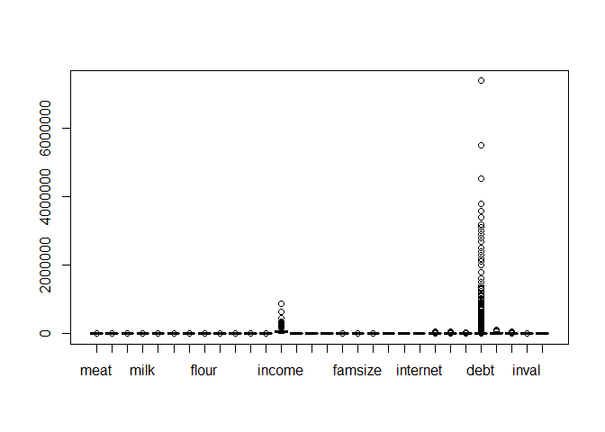
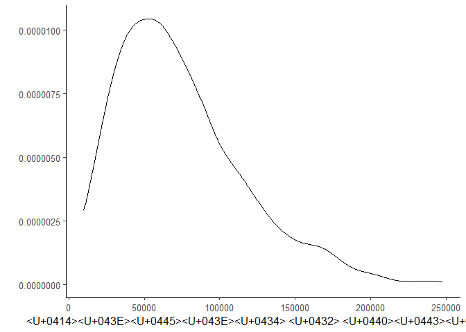
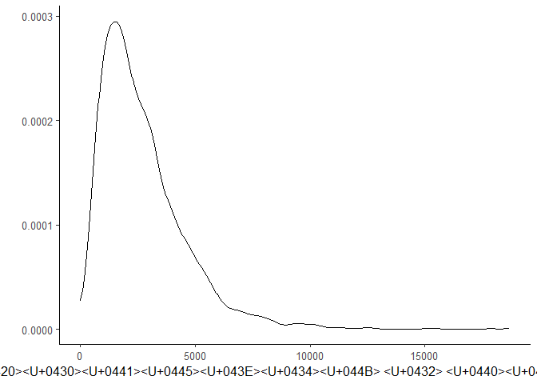
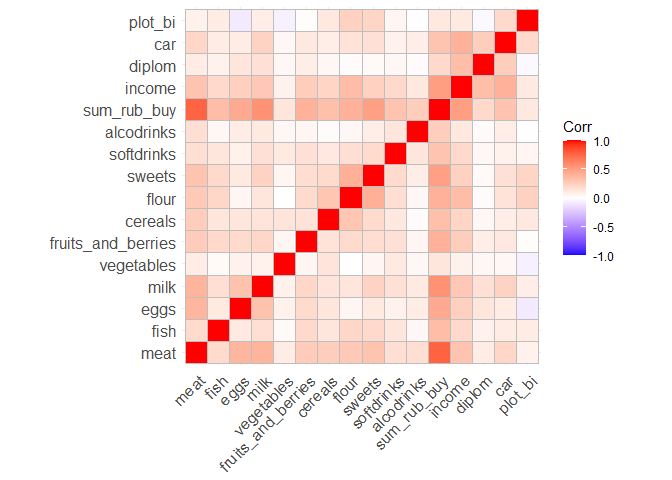
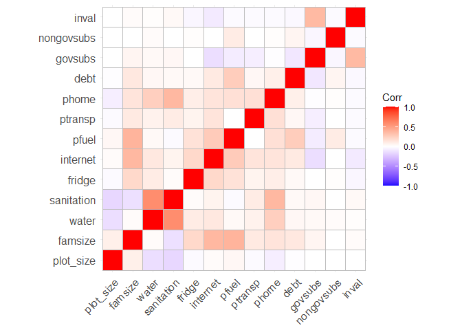

KRcodeR
================

# Подготовка к работе

## Загрузка пакетов

``` r
library(readr)
library(dplyr)
library(tidyr)
library(ggplot2)
library(GGally)
library(sandwich)
library(lmtest)
library(broom)
library(xtable)
library(ggpubr)
library(stargazer)
library(modelsummary)
library(nlWaldTest)
library(car)
library(margins)
library(Hmisc)
library(ggcorrplot)
library(ggstatsplot)
library(flextable)
library(car)
library(vcd)
```

### Общая тема оформления для всех графиков и отключение экспоненциальной записи чисел

``` r
theme_set(theme_classic(base_size = 12))
options(scipen = 999) 
```

# Загрузка данных

``` r
my_data <- read.csv("dataset.csv")
```

# Избавляем от пустых значений и убираем выбросы

``` r
data <- replace(my_data,is.na(my_data),0) 

boxplot(data) # Checking outliers
```

<!-- -->

``` r
# Removing outliers from income
x <- data[data$'income' > quantile(data$'income', 0.005) & data$'income' < quantile(data$'income', 0.995),]
x <- x[x$'debt' < quantile(x$'debt', 0.995),]
```

# Типы данных

``` r
x$status <- as.factor(x$status)

glimpse(x)
```

    ## Rows: 2,353
    ## Columns: 30
    ## $ meat               <dbl> 0.20, 3.30, 4.50, 1.50, 1.60, 1.50, 1.60, 4.00, 1.6~
    ## $ fish               <dbl> 1.0, 0.0, 1.5, 0.0, 0.0, 0.0, 1.0, 0.0, 0.0, 0.0, 1~
    ## $ eggs               <dbl> 0, 20, 10, 20, 0, 0, 10, 0, 0, 50, 10, 20, 0, 20, 2~
    ## $ milk               <dbl> 0.00, 1.00, 3.00, 2.00, 2.50, 7.00, 2.40, 5.00, 2.0~
    ## $ vegetables         <dbl> 5.0, 1.5, 1.0, 12.5, 0.0, 0.0, 0.0, 0.0, 0.0, 0.0, ~
    ## $ fruits_and_berries <dbl> 1.0, 0.3, 0.0, 1.5, 0.0, 0.0, 0.0, 1.0, 0.0, 1.5, 0~
    ## $ cereals            <dbl> 0.0, 1.0, 1.0, 0.0, 1.0, 0.0, 0.0, 3.0, 1.0, 0.0, 1~
    ## $ flour              <dbl> 1.30, 1.50, 1.40, 1.20, 3.50, 8.80, 4.20, 6.40, 3.2~
    ## $ sweets             <dbl> 0.0, 1.2, 2.0, 2.0, 1.5, 7.0, 1.0, 2.0, 1.0, 4.0, 0~
    ## $ softdrinks         <dbl> 0.00, 0.00, 0.00, 0.00, 0.15, 0.00, 0.00, 0.25, 0.0~
    ## $ alcodrinks         <dbl> 0.0, 0.0, 0.0, 0.0, 0.0, 0.0, 0.0, 0.0, 0.0, 0.0, 0~
    ## $ sum_rub_buy        <dbl> 336, 1298, 1834, 924, 1208, 2644, 1331, 3528, 844, ~
    ## $ income             <dbl> 28161, 36900, 68070, 59000, 25000, 105400, 28900, 6~
    ## $ diplom             <int> 1, 0, 1, 1, 0, 0, 0, 0, 0, 0, 0, 1, 0, 0, 0, 0, 0, ~
    ## $ car                <int> 0, 1, 1, 0, 0, 1, 0, 1, 0, 1, 0, 1, 0, 0, 0, 0, 0, ~
    ## $ plot_bi            <int> 0, 1, 1, 1, 1, 1, 1, 1, 0, 1, 0, 0, 1, 1, 1, 0, 1, ~
    ## $ plot_size          <dbl> 0.0, 12.0, 10.4, 6.0, 6.0, 25.0, 2.0, 10.0, 0.0, 8.~
    ## $ famsize            <int> 1, 2, 2, 2, 1, 3, 1, 2, 1, 2, 1, 2, 2, 2, 1, 1, 2, ~
    ## $ water              <int> 1, 1, 0, 1, 1, 1, 1, 1, 1, 1, 1, 1, 0, 1, 1, 1, 0, ~
    ## $ sanitation         <int> 1, 1, 0, 1, 1, 1, 1, 1, 1, 1, 1, 1, 0, 1, 1, 1, 0, ~
    ## $ fridge             <int> 1, 0, 0, 1, 1, 1, 1, 1, 1, 1, 1, 1, 1, 1, 1, 1, 1, ~
    ## $ internet           <int> 0, 1, 0, 1, 0, 1, 0, 1, 0, 1, 0, 1, 1, 1, 0, 0, 1, ~
    ## $ pfuel              <dbl> 0, 0, 0, 0, 0, 5000, 0, 4000, 0, 3000, 0, 6000, 0, ~
    ## $ ptransp            <dbl> 0, 3000, 0, 1200, 0, 0, 0, 0, 0, 0, 0, 430, 410, 90~
    ## $ phome              <dbl> 6200.00, 10000.00, 0.00, 5800.00, 7000.00, 11000.00~
    ## $ debt               <int> 0, 0, 0, 0, 0, 500000, 100000, 0, 0, 0, 0, 0, 0, 20~
    ## $ govsubs            <dbl> 26732, 26300, 66100, 29720, 23000, 105400, 26900, 5~
    ## $ nongovsubs         <int> 0, 0, 0, 0, 0, 0, 0, 0, 0, 0, 0, 0, 0, 0, 0, 0, 0, ~
    ## $ inval              <int> 0, 0, 1, 0, 0, 0, 1, 0, 1, 0, 0, 1, 0, 0, 0, 0, 0, ~
    ## $ status             <fct> 3, 3, 3, 3, 4, 4, 4, 4, 4, 4, 4, 4, 4, 4, 4, 4, 4, ~

# Описательные статистики

``` r
#summary(x)
desc <- datasummary(All(x) ~ mean + SD + Min + Max,data = x, output = 'krdatatable.docx')
desc_print <- datasummary(All(x) ~ mean + SD + Min + Max,data = x)
desc
```

    ## [1] "krdatatable.docx"

``` r
desc_print
```

|                    |     mean |        SD |     Min |        Max |
|:-------------------|---------:|----------:|--------:|-----------:|
| meat               |     3.41 |      2.73 |    0.00 |      27.00 |
| fish               |     0.51 |      0.83 |    0.00 |       7.00 |
| eggs               |    10.73 |     10.68 |    0.00 |     100.00 |
| milk               |     3.73 |      3.26 |    0.00 |      26.00 |
| vegetables         |     4.70 |     15.00 |    0.00 |     352.00 |
| fruits_and_berries |     2.49 |      3.29 |    0.00 |      30.00 |
| cereals            |     0.64 |      0.94 |    0.00 |      12.00 |
| flour              |     4.12 |      5.02 |    0.00 |      56.45 |
| sweets             |     1.98 |      2.55 |    0.00 |      35.00 |
| softdrinks         |     0.60 |      1.46 |    0.00 |      25.05 |
| alcodrinks         |     0.45 |      1.32 |    0.00 |      28.00 |
| sum_rub_buy        |  2709.93 |   1899.31 |    0.00 |   18671.00 |
| income             | 61036.70 |  41016.09 | 8300.00 |  265000.00 |
| diplom             |     0.43 |      0.49 |    0.00 |       1.00 |
| car                |     0.42 |      0.49 |    0.00 |       1.00 |
| plot_bi            |     0.47 |      0.50 |    0.00 |       1.00 |
| plot_size          |     6.31 |     31.51 |    0.00 |    1430.00 |
| famsize            |     2.56 |      1.59 |    1.00 |      13.00 |
| water              |     0.90 |      0.31 |    0.00 |       1.00 |
| sanitation         |     0.74 |      0.44 |    0.00 |       1.00 |
| fridge             |     0.73 |      0.44 |    0.00 |       1.00 |
| internet           |     0.70 |      0.46 |    0.00 |       1.00 |
| pfuel              |  1845.41 |   2992.00 |    0.00 |   41000.00 |
| ptransp            |   831.65 |   1913.55 |    0.00 |   50000.00 |
| phome              |  4274.95 |   3284.93 |    0.00 |   35500.00 |
| debt               | 63368.72 | 249417.59 |    0.00 | 2800000.00 |
| govsubs            | 19991.90 |  18513.67 |    0.00 |  106595.00 |
| nongovsubs         |    78.41 |   1445.42 |    0.00 |   50000.00 |
| inval              |     0.16 |      0.37 |    0.00 |       1.00 |

# Графики

## Плотность распределения: доход в руб.

``` r
x %>% 
  ggplot(aes(income)) + 
  geom_density(alpha = 0.25) +
  xlab("Доход в руб.") +
  ylab("")
```

<!-- -->

## Плотность распределения: расходы на питание в руб.

``` r
x %>% 
  ggplot(aes(sum_rub_buy)) + 
  geom_density(alpha = 0.25) +
  xlab("Расходы в руб.") +
  ylab("")
```

<!-- -->

## Корреляция между категориями еды и доходом

``` r
correlation = x %>% select(1:16)
rcorr(as.matrix(correlation))
```

    ##                    meat fish  eggs milk vegetables fruits_and_berries cereals
    ## meat               1.00 0.19  0.38 0.39       0.10               0.27    0.26
    ## fish               0.19 1.00  0.11 0.17       0.03               0.20    0.13
    ## eggs               0.38 0.11  1.00 0.32       0.07               0.19    0.13
    ## milk               0.39 0.17  0.32 1.00       0.07               0.21    0.14
    ## vegetables         0.10 0.03  0.07 0.07       1.00               0.05    0.14
    ## fruits_and_berries 0.27 0.20  0.19 0.21       0.05               1.00    0.15
    ## cereals            0.26 0.13  0.13 0.14       0.14               0.15    1.00
    ## flour              0.28 0.21  0.05 0.13       0.00               0.19    0.30
    ## sweets             0.31 0.20  0.11 0.23       0.05               0.18    0.19
    ## softdrinks         0.17 0.13  0.07 0.16       0.11               0.16    0.12
    ## alcodrinks         0.17 0.04  0.10 0.11       0.04               0.05    0.02
    ## sum_rub_buy        0.77 0.35  0.44 0.56       0.13               0.40    0.33
    ## income             0.31 0.20  0.25 0.29       0.07               0.26    0.22
    ## diplom             0.10 0.07  0.13 0.16       0.04               0.09    0.04
    ## car                0.21 0.10  0.10 0.23       0.04               0.12    0.09
    ## plot_bi            0.07 0.10 -0.09 0.09      -0.06               0.01    0.12
    ##                    flour sweets softdrinks alcodrinks sum_rub_buy income diplom
    ## meat                0.28   0.31       0.17       0.17        0.77   0.31   0.10
    ## fish                0.21   0.20       0.13       0.04        0.35   0.20   0.07
    ## eggs                0.05   0.11       0.07       0.10        0.44   0.25   0.13
    ## milk                0.13   0.23       0.16       0.11        0.56   0.29   0.16
    ## vegetables          0.00   0.05       0.11       0.04        0.13   0.07   0.04
    ## fruits_and_berries  0.19   0.18       0.16       0.05        0.40   0.26   0.09
    ## cereals             0.30   0.19       0.12       0.02        0.33   0.22   0.04
    ## flour               1.00   0.41       0.17       0.04        0.40   0.35   0.02
    ## sweets              0.41   1.00       0.19       0.09        0.49   0.24   0.03
    ## softdrinks          0.17   0.19       1.00       0.13        0.31   0.20   0.04
    ## alcodrinks          0.04   0.09       0.13       1.00        0.26   0.12   0.02
    ## sum_rub_buy         0.40   0.49       0.31       0.26        1.00   0.50   0.20
    ## income              0.35   0.24       0.20       0.12        0.50   1.00   0.34
    ## diplom              0.02   0.03       0.04       0.02        0.20   0.34   1.00
    ## car                 0.15   0.16       0.07       0.09        0.31   0.40   0.26
    ## plot_bi             0.24   0.22       0.05      -0.01        0.12   0.11  -0.03
    ##                     car plot_bi
    ## meat               0.21    0.07
    ## fish               0.10    0.10
    ## eggs               0.10   -0.09
    ## milk               0.23    0.09
    ## vegetables         0.04   -0.06
    ## fruits_and_berries 0.12    0.01
    ## cereals            0.09    0.12
    ## flour              0.15    0.24
    ## sweets             0.16    0.22
    ## softdrinks         0.07    0.05
    ## alcodrinks         0.09   -0.01
    ## sum_rub_buy        0.31    0.12
    ## income             0.40    0.11
    ## diplom             0.26   -0.03
    ## car                1.00    0.20
    ## plot_bi            0.20    1.00
    ## 
    ## n= 2353 
    ## 
    ## 
    ## P
    ##                    meat   fish   eggs   milk   vegetables fruits_and_berries
    ## meat                      0.0000 0.0000 0.0000 0.0000     0.0000            
    ## fish               0.0000        0.0000 0.0000 0.1341     0.0000            
    ## eggs               0.0000 0.0000        0.0000 0.0004     0.0000            
    ## milk               0.0000 0.0000 0.0000        0.0006     0.0000            
    ## vegetables         0.0000 0.1341 0.0004 0.0006            0.0270            
    ## fruits_and_berries 0.0000 0.0000 0.0000 0.0000 0.0270                       
    ## cereals            0.0000 0.0000 0.0000 0.0000 0.0000     0.0000            
    ## flour              0.0000 0.0000 0.0264 0.0000 0.8513     0.0000            
    ## sweets             0.0000 0.0000 0.0000 0.0000 0.0078     0.0000            
    ## softdrinks         0.0000 0.0000 0.0007 0.0000 0.0000     0.0000            
    ## alcodrinks         0.0000 0.0673 0.0000 0.0000 0.0471     0.0092            
    ## sum_rub_buy        0.0000 0.0000 0.0000 0.0000 0.0000     0.0000            
    ## income             0.0000 0.0000 0.0000 0.0000 0.0012     0.0000            
    ## diplom             0.0000 0.0008 0.0000 0.0000 0.0508     0.0000            
    ## car                0.0000 0.0000 0.0000 0.0000 0.0400     0.0000            
    ## plot_bi            0.0013 0.0000 0.0000 0.0000 0.0059     0.4979            
    ##                    cereals flour  sweets softdrinks alcodrinks sum_rub_buy
    ## meat               0.0000  0.0000 0.0000 0.0000     0.0000     0.0000     
    ## fish               0.0000  0.0000 0.0000 0.0000     0.0673     0.0000     
    ## eggs               0.0000  0.0264 0.0000 0.0007     0.0000     0.0000     
    ## milk               0.0000  0.0000 0.0000 0.0000     0.0000     0.0000     
    ## vegetables         0.0000  0.8513 0.0078 0.0000     0.0471     0.0000     
    ## fruits_and_berries 0.0000  0.0000 0.0000 0.0000     0.0092     0.0000     
    ## cereals                    0.0000 0.0000 0.0000     0.2912     0.0000     
    ## flour              0.0000         0.0000 0.0000     0.0699     0.0000     
    ## sweets             0.0000  0.0000        0.0000     0.0000     0.0000     
    ## softdrinks         0.0000  0.0000 0.0000            0.0000     0.0000     
    ## alcodrinks         0.2912  0.0699 0.0000 0.0000                0.0000     
    ## sum_rub_buy        0.0000  0.0000 0.0000 0.0000     0.0000                
    ## income             0.0000  0.0000 0.0000 0.0000     0.0000     0.0000     
    ## diplom             0.0891  0.2302 0.1399 0.0412     0.2363     0.0000     
    ## car                0.0000  0.0000 0.0000 0.0006     0.0000     0.0000     
    ## plot_bi            0.0000  0.0000 0.0000 0.0178     0.6444     0.0000     
    ##                    income diplom car    plot_bi
    ## meat               0.0000 0.0000 0.0000 0.0013 
    ## fish               0.0000 0.0008 0.0000 0.0000 
    ## eggs               0.0000 0.0000 0.0000 0.0000 
    ## milk               0.0000 0.0000 0.0000 0.0000 
    ## vegetables         0.0012 0.0508 0.0400 0.0059 
    ## fruits_and_berries 0.0000 0.0000 0.0000 0.4979 
    ## cereals            0.0000 0.0891 0.0000 0.0000 
    ## flour              0.0000 0.2302 0.0000 0.0000 
    ## sweets             0.0000 0.1399 0.0000 0.0000 
    ## softdrinks         0.0000 0.0412 0.0006 0.0178 
    ## alcodrinks         0.0000 0.2363 0.0000 0.6444 
    ## sum_rub_buy        0.0000 0.0000 0.0000 0.0000 
    ## income                    0.0000 0.0000 0.0000 
    ## diplom             0.0000        0.0000 0.1327 
    ## car                0.0000 0.0000        0.0000 
    ## plot_bi            0.0000 0.1327 0.0000

## Корреляция между независимыми переменными

``` r
correlation1 = data %>% select(17:29)
rcorr(as.matrix(correlation1))
```

    ##            plot_size famsize water sanitation fridge internet pfuel ptransp
    ## plot_size       1.00    0.08 -0.14      -0.17  -0.02     0.02  0.04   -0.02
    ## famsize         0.08    1.00  0.02      -0.13   0.20     0.37  0.39    0.11
    ## water          -0.14    0.02  1.00       0.58   0.10     0.12  0.03    0.07
    ## sanitation     -0.17   -0.13  0.58       1.00   0.02     0.06 -0.02    0.10
    ## fridge         -0.02    0.20  0.10       0.02   1.00     0.20  0.15    0.06
    ## internet        0.02    0.37  0.12       0.06   0.20     1.00  0.27    0.14
    ## pfuel           0.04    0.39  0.03      -0.02   0.15     0.27  1.00    0.00
    ## ptransp        -0.02    0.11  0.07       0.10   0.06     0.14  0.00    1.00
    ## phome          -0.07    0.14  0.25       0.37   0.09     0.14  0.16    0.16
    ## debt           -0.01    0.12  0.04       0.03   0.03     0.11  0.26    0.04
    ## govsubs         0.00    0.05  0.03       0.04   0.00    -0.14 -0.08   -0.07
    ## nongovsubs      0.00    0.00  0.02       0.00   0.01     0.00  0.10    0.00
    ## inval           0.00    0.02  0.01       0.03  -0.04    -0.09 -0.02   -0.02
    ##            phome  debt govsubs nongovsubs inval
    ## plot_size  -0.07 -0.01    0.00       0.00  0.00
    ## famsize     0.14  0.12    0.05       0.00  0.02
    ## water       0.25  0.04    0.03       0.02  0.01
    ## sanitation  0.37  0.03    0.04       0.00  0.03
    ## fridge      0.09  0.03    0.00       0.01 -0.04
    ## internet    0.14  0.11   -0.14       0.00 -0.09
    ## pfuel       0.16  0.26   -0.08       0.10 -0.02
    ## ptransp     0.16  0.04   -0.07       0.00 -0.02
    ## phome       1.00  0.08   -0.01       0.01 -0.02
    ## debt        0.08  1.00   -0.10       0.05 -0.03
    ## govsubs    -0.01 -0.10    1.00      -0.04  0.36
    ## nongovsubs  0.01  0.05   -0.04       1.00 -0.02
    ## inval      -0.02 -0.03    0.36      -0.02  1.00
    ## 
    ## n= 2390 
    ## 
    ## 
    ## P
    ##            plot_size famsize water  sanitation fridge internet pfuel  ptransp
    ## plot_size            0.0002  0.0000 0.0000     0.3559 0.2617   0.0331 0.2266 
    ## famsize    0.0002            0.3819 0.0000     0.0000 0.0000   0.0000 0.0000 
    ## water      0.0000    0.3819         0.0000     0.0000 0.0000   0.1717 0.0004 
    ## sanitation 0.0000    0.0000  0.0000            0.2461 0.0030   0.3119 0.0000 
    ## fridge     0.3559    0.0000  0.0000 0.2461            0.0000   0.0000 0.0053 
    ## internet   0.2617    0.0000  0.0000 0.0030     0.0000          0.0000 0.0000 
    ## pfuel      0.0331    0.0000  0.1717 0.3119     0.0000 0.0000          0.9366 
    ## ptransp    0.2266    0.0000  0.0004 0.0000     0.0053 0.0000   0.9366        
    ## phome      0.0004    0.0000  0.0000 0.0000     0.0000 0.0000   0.0000 0.0000 
    ## debt       0.6735    0.0000  0.0424 0.2160     0.1483 0.0000   0.0000 0.0467 
    ## govsubs    0.9447    0.0178  0.1581 0.0523     0.9425 0.0000   0.0002 0.0004 
    ## nongovsubs 0.8375    0.9959  0.3382 0.9329     0.6278 0.8902   0.0000 0.9903 
    ## inval      0.8106    0.3457  0.7361 0.1810     0.0716 0.0000   0.2750 0.2838 
    ##            phome  debt   govsubs nongovsubs inval 
    ## plot_size  0.0004 0.6735 0.9447  0.8375     0.8106
    ## famsize    0.0000 0.0000 0.0178  0.9959     0.3457
    ## water      0.0000 0.0424 0.1581  0.3382     0.7361
    ## sanitation 0.0000 0.2160 0.0523  0.9329     0.1810
    ## fridge     0.0000 0.1483 0.9425  0.6278     0.0716
    ## internet   0.0000 0.0000 0.0000  0.8902     0.0000
    ## pfuel      0.0000 0.0000 0.0002  0.0000     0.2750
    ## ptransp    0.0000 0.0467 0.0004  0.9903     0.2838
    ## phome             0.0002 0.7441  0.6506     0.3576
    ## debt       0.0002        0.0000  0.0240     0.1806
    ## govsubs    0.7441 0.0000         0.0780     0.0000
    ## nongovsubs 0.6506 0.0240 0.0780             0.4453
    ## inval      0.3576 0.1806 0.0000  0.4453

### График корреляции между категориями еды и доходом

``` r
ggcorrplot(cor(correlation))
```

<!-- -->

``` r
b = rcorr(as.matrix(data),type=c("pearson"))
tidy(b)
```

    ## # A tibble: 435 x 5
    ##    column1    column2 estimate     n      p.value
    ##    <chr>      <chr>      <dbl> <int>        <dbl>
    ##  1 fish       meat      0.191   2390 0           
    ##  2 eggs       meat      0.383   2390 0           
    ##  3 eggs       fish      0.116   2390 0.0000000131
    ##  4 milk       meat      0.400   2390 0           
    ##  5 milk       fish      0.178   2390 0           
    ##  6 milk       eggs      0.318   2390 0           
    ##  7 vegetables meat      0.109   2390 0.0000000937
    ##  8 vegetables fish      0.0300  2390 0.143       
    ##  9 vegetables eggs      0.0815  2390 0.0000670   
    ## 10 vegetables milk      0.0741  2390 0.000286    
    ## # ... with 425 more rows

### График корреляции между независимыми переменными

``` r
ggcorrplot(cor(correlation1))
```

<!-- -->

``` r
# Diplom

t.test(x$meat ~ x$diplom)
```

    ## 
    ##  Welch Two Sample t-test
    ## 
    ## data:  x$meat by x$diplom
    ## t = -4.7123, df = 2021.1, p-value = 0.000002616
    ## alternative hypothesis: true difference in means is not equal to 0
    ## 95 percent confidence interval:
    ##  -0.7683382 -0.3167509
    ## sample estimates:
    ## mean in group 0 mean in group 1 
    ##        3.181457        3.724002

``` r
t.test(x$fish ~ x$diplom)
```

    ## 
    ##  Welch Two Sample t-test
    ## 
    ## data:  x$fish by x$diplom
    ## t = -3.2999, df = 2015.7, p-value = 0.0009839
    ## alternative hypothesis: true difference in means is not equal to 0
    ## 95 percent confidence interval:
    ##  -0.1854716 -0.0471973
    ## sample estimates:
    ## mean in group 0 mean in group 1 
    ##       0.4580118       0.5743463

``` r
t.test(x$eggs ~ x$diplom)
```

    ## 
    ##  Welch Two Sample t-test
    ## 
    ## data:  x$eggs by x$diplom
    ## t = -6.3433, df = 1944.5, p-value = 0.0000000002791
    ## alternative hypothesis: true difference in means is not equal to 0
    ## 95 percent confidence interval:
    ##  -3.755972 -1.981943
    ## sample estimates:
    ## mean in group 0 mean in group 1 
    ##        9.506292       12.375250

``` r
t.test(x$milk ~ x$diplom)
```

    ## 
    ##  Welch Two Sample t-test
    ## 
    ## data:  x$milk by x$diplom
    ## t = -7.8216, df = 1904.3, p-value = 0.000000000000008573
    ## alternative hypothesis: true difference in means is not equal to 0
    ## 95 percent confidence interval:
    ##  -1.3493025 -0.8082977
    ## sample estimates:
    ## mean in group 0 mean in group 1 
    ##        3.270197        4.348997

``` r
t.test(x$vegetables ~ x$diplom)
```

    ## 
    ##  Welch Two Sample t-test
    ## 
    ## data:  x$vegetables by x$diplom
    ## t = -1.9175, df = 1994.8, p-value = 0.05531
    ## alternative hypothesis: true difference in means is not equal to 0
    ## 95 percent confidence interval:
    ##  -2.47007482  0.02777041
    ## sample estimates:
    ## mean in group 0 mean in group 1 
    ##        4.178623        5.399775

``` r
t.test(x$fruits_and_berries ~ x$diplom)
```

    ## 
    ##  Welch Two Sample t-test
    ## 
    ## data:  x$fruits_and_berries by x$diplom
    ## t = -4.4132, df = 2211.1, p-value = 0.00001068
    ## alternative hypothesis: true difference in means is not equal to 0
    ## 95 percent confidence interval:
    ##  -0.8644080 -0.3325364
    ## sample estimates:
    ## mean in group 0 mean in group 1 
    ##        2.233923        2.832395

``` r
t.test(x$cereals ~ x$diplom)
```

    ## 
    ##  Welch Two Sample t-test
    ## 
    ## data:  x$cereals by x$diplom
    ## t = -1.7157, df = 2221.7, p-value = 0.08636
    ## alternative hypothesis: true difference in means is not equal to 0
    ## 95 percent confidence interval:
    ##  -0.142022715  0.009476276
    ## sample estimates:
    ## mean in group 0 mean in group 1 
    ##       0.6080681       0.6743413

``` r
t.test(x$flour ~ x$diplom)
```

    ## 
    ##  Welch Two Sample t-test
    ## 
    ## data:  x$flour by x$diplom
    ## t = -1.1928, df = 2105.8, p-value = 0.2331
    ## alternative hypothesis: true difference in means is not equal to 0
    ## 95 percent confidence interval:
    ##  -0.6637496  0.1616782
    ## sample estimates:
    ## mean in group 0 mean in group 1 
    ##        4.017028        4.268064

``` r
t.test(x$sweets ~ x$diplom)
```

    ## 
    ##  Welch Two Sample t-test
    ## 
    ## data:  x$sweets by x$diplom
    ## t = -1.4526, df = 2015.1, p-value = 0.1465
    ## alternative hypothesis: true difference in means is not equal to 0
    ## 95 percent confidence interval:
    ##  -0.3683048  0.0548714
    ## sample estimates:
    ## mean in group 0 mean in group 1 
    ##        1.909611        2.066327

``` r
t.test(x$softdrinks ~ x$diplom)
```

    ## 
    ##  Welch Two Sample t-test
    ## 
    ## data:  x$softdrinks by x$diplom
    ## t = -2.0468, df = 2171.1, p-value = 0.0408
    ## alternative hypothesis: true difference in means is not equal to 0
    ## 95 percent confidence interval:
    ##  -0.242989448 -0.005195867
    ## sample estimates:
    ## mean in group 0 mean in group 1 
    ##       0.5448305       0.6689232

``` r
t.test(x$alcodrinks ~ x$diplom)
```

    ## 
    ##  Welch Two Sample t-test
    ## 
    ## data:  x$alcodrinks by x$diplom
    ## t = -1.1911, df = 2198.3, p-value = 0.2337
    ## alternative hypothesis: true difference in means is not equal to 0
    ## 95 percent confidence interval:
    ##  -0.17285962  0.04222174
    ## sample estimates:
    ## mean in group 0 mean in group 1 
    ##       0.4206292       0.4859481

``` r
# Car

t.test(x$meat ~ x$car)
```

    ## 
    ##  Welch Two Sample t-test
    ## 
    ## data:  x$meat by x$car
    ## t = -10.186, df = 1752.5, p-value < 0.00000000000000022
    ## alternative hypothesis: true difference in means is not equal to 0
    ## 95 percent confidence interval:
    ##  -1.4150414 -0.9581006
    ## sample estimates:
    ## mean in group 0 mean in group 1 
    ##        2.916283        4.102854

``` r
t.test(x$fish ~ x$car)
```

    ## 
    ##  Welch Two Sample t-test
    ## 
    ## data:  x$fish by x$car
    ## t = -4.6923, df = 1752.8, p-value = 0.000002911
    ## alternative hypothesis: true difference in means is not equal to 0
    ## 95 percent confidence interval:
    ##  -0.24099504 -0.09891741
    ## sample estimates:
    ## mean in group 0 mean in group 1 
    ##       0.4364777       0.6064339

``` r
t.test(x$eggs ~ x$car)
```

    ## 
    ##  Welch Two Sample t-test
    ## 
    ## data:  x$eggs by x$car
    ## t = -4.7717, df = 1766.6, p-value = 0.000001977
    ## alternative hypothesis: true difference in means is not equal to 0
    ## 95 percent confidence interval:
    ##  -3.119384 -1.302058
    ## sample estimates:
    ## mean in group 0 mean in group 1 
    ##        9.803506       12.014228

``` r
t.test(x$milk ~ x$car)
```

    ## 
    ##  Welch Two Sample t-test
    ## 
    ## data:  x$milk by x$car
    ## t = -10.911, df = 1730.9, p-value < 0.00000000000000022
    ## alternative hypothesis: true difference in means is not equal to 0
    ## 95 percent confidence interval:
    ##  -1.787677 -1.242890
    ## sample estimates:
    ## mean in group 0 mean in group 1 
    ##        3.095917        4.611200

``` r
t.test(x$vegetables ~ x$car)
```

    ## 
    ##  Welch Two Sample t-test
    ## 
    ## data:  x$vegetables by x$car
    ## t = -1.8789, df = 1397.1, p-value = 0.06047
    ## alternative hypothesis: true difference in means is not equal to 0
    ## 95 percent confidence interval:
    ##  -2.63161521  0.05673877
    ## sample estimates:
    ## mean in group 0 mean in group 1 
    ##        4.160245        5.447683

``` r
t.test(x$fruits_and_berries ~ x$car)
```

    ## 
    ##  Welch Two Sample t-test
    ## 
    ## data:  x$fruits_and_berries by x$car
    ## t = -5.713, df = 2080.8, p-value = 0.0000000127
    ## alternative hypothesis: true difference in means is not equal to 0
    ## 95 percent confidence interval:
    ##  -1.0527562 -0.5146961
    ## sample estimates:
    ## mean in group 0 mean in group 1 
    ##        2.161030        2.944756

``` r
t.test(x$cereals ~ x$car)
```

    ## 
    ##  Welch Two Sample t-test
    ## 
    ## data:  x$cereals by x$car
    ## t = -4.1201, df = 1966.6, p-value = 0.00003944
    ## alternative hypothesis: true difference in means is not equal to 0
    ## 95 percent confidence interval:
    ##  -0.24126564 -0.08565332
    ## sample estimates:
    ## mean in group 0 mean in group 1 
    ##       0.5679328       0.7313923

``` r
t.test(x$flour ~ x$car)
```

    ## 
    ##  Welch Two Sample t-test
    ## 
    ## data:  x$flour by x$car
    ## t = -6.9194, df = 1872.7, p-value = 0.000000000006205
    ## alternative hypothesis: true difference in means is not equal to 0
    ## 95 percent confidence interval:
    ##  -1.898127 -1.059748
    ## sample estimates:
    ## mean in group 0 mean in group 1 
    ##        3.505453        4.984390

``` r
t.test(x$sweets ~ x$car)
```

    ## 
    ##  Welch Two Sample t-test
    ## 
    ## data:  x$sweets by x$car
    ## t = -7.5772, df = 1641.6, p-value = 0.00000000000005866
    ## alternative hypothesis: true difference in means is not equal to 0
    ## 95 percent confidence interval:
    ##  -1.0605277 -0.6243788
    ## sample estimates:
    ## mean in group 0 mean in group 1 
    ##        1.624042        2.466495

``` r
t.test(x$softdrinks ~ x$car)
```

    ## 
    ##  Welch Two Sample t-test
    ## 
    ## data:  x$softdrinks by x$car
    ## t = -3.274, df = 1745.1, p-value = 0.001081
    ## alternative hypothesis: true difference in means is not equal to 0
    ## 95 percent confidence interval:
    ##  -0.33279422 -0.08344139
    ## sample estimates:
    ## mean in group 0 mean in group 1 
    ##       0.5106413       0.7187591

``` r
t.test(x$alcodrinks ~ x$car)
```

    ## 
    ##  Welch Two Sample t-test
    ## 
    ## data:  x$alcodrinks by x$car
    ## t = -4.4266, df = 1995.2, p-value = 0.00001009
    ## alternative hypothesis: true difference in means is not equal to 0
    ## 95 percent confidence interval:
    ##  -0.3570676 -0.1378152
    ## sample estimates:
    ## mean in group 0 mean in group 1 
    ##       0.3449671       0.5924085

``` r
# Plot_bi

t.test(x$meat ~ x$plot_bi)
```

    ## 
    ##  Welch Two Sample t-test
    ## 
    ## data:  x$meat by x$plot_bi
    ## t = -3.1795, df = 2081, p-value = 0.001497
    ## alternative hypothesis: true difference in means is not equal to 0
    ## 95 percent confidence interval:
    ##  -0.5878199 -0.1393228
    ## sample estimates:
    ## mean in group 0 mean in group 1 
    ##        3.242683        3.606255

``` r
t.test(x$fish ~ x$plot_bi)
```

    ## 
    ##  Welch Two Sample t-test
    ## 
    ## data:  x$fish by x$plot_bi
    ## t = -4.727, df = 2017.2, p-value = 0.000002437
    ## alternative hypothesis: true difference in means is not equal to 0
    ## 95 percent confidence interval:
    ##  -0.23356869 -0.09659071
    ## sample estimates:
    ## mean in group 0 mean in group 1 
    ##       0.4304490       0.5955287

``` r
t.test(x$eggs ~ x$plot_bi)
```

    ## 
    ##  Welch Two Sample t-test
    ## 
    ## data:  x$eggs by x$plot_bi
    ## t = 4.121, df = 2212, p-value = 0.00003912
    ## alternative hypothesis: true difference in means is not equal to 0
    ## 95 percent confidence interval:
    ##  0.9576008 2.6964344
    ## sample estimates:
    ## mean in group 0 mean in group 1 
    ##       11.581340        9.754322

``` r
t.test(x$milk ~ x$plot_bi)
```

    ## 
    ##  Welch Two Sample t-test
    ## 
    ## data:  x$milk by x$plot_bi
    ## t = -4.4104, df = 2095.7, p-value = 0.00001084
    ## alternative hypothesis: true difference in means is not equal to 0
    ## 95 percent confidence interval:
    ##  -0.8670197 -0.3332995
    ## sample estimates:
    ## mean in group 0 mean in group 1 
    ##        3.449280        4.049439

``` r
t.test(x$vegetables ~ x$plot_bi)
```

    ## 
    ##  Welch Two Sample t-test
    ## 
    ## data:  x$vegetables by x$plot_bi
    ## t = 2.6932, df = 1921.2, p-value = 0.007138
    ## alternative hypothesis: true difference in means is not equal to 0
    ## 95 percent confidence interval:
    ##  0.4636366 2.9479820
    ## sample estimates:
    ## mean in group 0 mean in group 1 
    ##        5.495359        3.789550

``` r
t.test(x$fruits_and_berries ~ x$plot_bi)
```

    ## 
    ##  Welch Two Sample t-test
    ## 
    ## data:  x$fruits_and_berries by x$plot_bi
    ## t = -0.6688, df = 2114.9, p-value = 0.5037
    ## alternative hypothesis: true difference in means is not equal to 0
    ## 95 percent confidence interval:
    ##  -0.3623090  0.1780325
    ## sample estimates:
    ## mean in group 0 mean in group 1 
    ##        2.445742        2.537880

``` r
t.test(x$cereals ~ x$plot_bi)
```

    ## 
    ##  Welch Two Sample t-test
    ## 
    ## data:  x$cereals by x$plot_bi
    ## t = -5.5308, df = 2057.1, p-value = 0.00000003594
    ## alternative hypothesis: true difference in means is not equal to 0
    ## 95 percent confidence interval:
    ##  -0.2923742 -0.1393076
    ## sample estimates:
    ## mean in group 0 mean in group 1 
    ##       0.5354785       0.7513194

``` r
t.test(x$flour ~ x$plot_bi)
```

    ## 
    ##  Welch Two Sample t-test
    ## 
    ## data:  x$flour by x$plot_bi
    ## t = -11.691, df = 1436, p-value < 0.00000000000000022
    ## alternative hypothesis: true difference in means is not equal to 0
    ## 95 percent confidence interval:
    ##  -2.873974 -2.048079
    ## sample estimates:
    ## mean in group 0 mean in group 1 
    ##        2.974474        5.435500

``` r
t.test(x$sweets ~ x$plot_bi)
```

    ## 
    ##  Welch Two Sample t-test
    ## 
    ## data:  x$sweets by x$plot_bi
    ## t = -10.306, df = 1536.2, p-value < 0.00000000000000022
    ## alternative hypothesis: true difference in means is not equal to 0
    ## 95 percent confidence interval:
    ##  -1.3131366 -0.8932173
    ## sample estimates:
    ## mean in group 0 mean in group 1 
    ##        1.461093        2.564270

``` r
t.test(x$softdrinks ~ x$plot_bi)
```

    ## 
    ##  Welch Two Sample t-test
    ## 
    ## data:  x$softdrinks by x$plot_bi
    ## t = -2.3256, df = 1987.8, p-value = 0.02014
    ## alternative hypothesis: true difference in means is not equal to 0
    ## 95 percent confidence interval:
    ##  -0.26316299 -0.02237093
    ## sample estimates:
    ## mean in group 0 mean in group 1 
    ##       0.5309928       0.6737598

``` r
t.test(x$alcodrinks ~ x$plot_bi)
```

    ## 
    ##  Welch Two Sample t-test
    ## 
    ## data:  x$alcodrinks by x$plot_bi
    ## t = 0.46512, df = 2350.2, p-value = 0.6419
    ## alternative hypothesis: true difference in means is not equal to 0
    ## 95 percent confidence interval:
    ##  -0.08116101  0.13163263
    ## sample estimates:
    ## mean in group 0 mean in group 1 
    ##       0.4602313       0.4349955

## Совместное распределение дохода в руб. и потребления овощей в руб.

``` r
x %>% 
  ggplot(aes(x = income, y = vegetables)) +
  geom_jitter(width = 0.25, alpha = 0.5) +  
  scale_y_continuous(name = "потребление овощей") +
  scale_x_continuous(name = "Доходы в руб.")
```

<!-- -->

``` r
abs_inq <- select(x, meat, fish, eggs, milk, vegetables, fruits_and_berries, cereals, flour, sweets, softdrinks, alcodrinks, income)

abs_inq <- abs_inq %>% 
  mutate(decile = ntile(income, 10))

food_consumption_long <- abs_inq %>% 
  pivot_longer(cols = -c(income, decile), names_to = "food_category", values_to = "consumption")

food_consumption_by_decile <- food_consumption_long %>% 
  group_by(food_category, decile)

food_consumption_table <- food_consumption_by_decile %>% 
  summarise(avg_consumption = mean(consumption)) %>% 
  pivot_wider(names_from = decile, values_from = avg_consumption)
```

    ## `summarise()` has grouped output by 'food_category'. You can override using the
    ## `.groups` argument.

``` r
names(food_consumption_table)[-1] <- paste0("Decile ", 1:10)

food_consumption_table
```

    ## # A tibble: 11 x 11
    ## # Groups:   food_category [11]
    ##    food_category Decil~1 Decil~2 Decil~3 Decil~4 Decil~5 Decil~6 Decil~7 Decil~8
    ##    <chr>           <dbl>   <dbl>   <dbl>   <dbl>   <dbl>   <dbl>   <dbl>   <dbl>
    ##  1 alcodrinks      0.263   0.184   0.284   0.284   0.336   0.632   0.461   0.602
    ##  2 cereals         0.346   0.414   0.459   0.593   0.686   0.613   0.638   0.766
    ##  3 eggs            7.17    7.46    8.26    9.37   10.0    10.1    11.7    13.6  
    ##  4 fish            0.225   0.385   0.370   0.400   0.500   0.447   0.635   0.583
    ##  5 flour           2.01    2.41    2.81    3.45    3.67    3.51    4.01    4.66 
    ##  6 fruits_and_b~   1.10    1.19    1.90    2.15    2.31    2.33    2.95    3.57 
    ##  7 meat            1.97    2.25    2.47    3.25    3.29    3.64    3.61    4.43 
    ##  8 milk            2.14    2.53    2.96    3.38    3.52    3.77    4.02    4.76 
    ##  9 softdrinks      0.249   0.272   0.337   0.496   0.518   0.486   0.651   0.854
    ## 10 sweets          1.11    1.17    1.48    1.79    1.92    1.67    2.32    2.35 
    ## 11 vegetables      2.21    4.24    2.86    6.53    4.52    4.32    4.08    6.41 
    ## # ... with 2 more variables: `Decile 9` <dbl>, `Decile 10` <dbl>, and
    ## #   abbreviated variable names 1: `Decile 1`, 2: `Decile 2`, 3: `Decile 3`,
    ## #   4: `Decile 4`, 5: `Decile 5`, 6: `Decile 6`, 7: `Decile 7`, 8: `Decile 8`

``` r
abs_inq <- select(x, meat, fish, eggs, milk, vegetables, fruits_and_berries, cereals, flour, sweets, softdrinks, alcodrinks, income)

abs_inq <- abs_inq %>% 
  mutate(quarter = ntile(income, 4))

food_consumption_long <- abs_inq %>% 
  pivot_longer(cols = -c(income, quarter), names_to = "food_category", values_to = "consumption")

food_consumption_by_quarter <- food_consumption_long %>% 
  group_by(food_category, quarter)

food_consumption_table <- food_consumption_by_quarter %>% 
  summarise(avg_consumption = mean(consumption)) %>% 
  pivot_wider(names_from = quarter, values_from = avg_consumption)
```

    ## `summarise()` has grouped output by 'food_category'. You can override using the
    ## `.groups` argument.

``` r
names(food_consumption_table)[-1] <- paste0("Quarter ", 1:4)

food_consumption_table
```

    ## # A tibble: 11 x 5
    ## # Groups:   food_category [11]
    ##    food_category      `Quarter 1` `Quarter 2` `Quarter 3` `Quarter 4`
    ##    <chr>                    <dbl>       <dbl>       <dbl>       <dbl>
    ##  1 alcodrinks               0.217       0.324       0.538       0.716
    ##  2 cereals                  0.394       0.606       0.668       0.877
    ##  3 eggs                     7.40        9.50       11.5        14.5  
    ##  4 fish                     0.310       0.443       0.550       0.727
    ##  5 flour                    2.26        3.47        4.06        6.71 
    ##  6 fruits_and_berries       1.29        2.16        2.87        3.63 
    ##  7 meat                     2.16        3.13        3.85        4.51 
    ##  8 milk                     2.51        3.30        4.07        5.04 
    ##  9 softdrinks               0.255       0.494       0.639       1.00 
    ## 10 sweets                   1.17        1.82        2.06        2.85 
    ## 11 vegetables               3.17        4.98        4.39        6.26

``` r
# Step 1: Reshape the data from wide to long format
abs_inq <- select(x, meat, fish, eggs, milk, vegetables, fruits_and_berries, cereals, flour, sweets, softdrinks, alcodrinks, diplom)
food_consumption_long <- abs_inq %>% 
  pivot_longer(cols = -diplom, names_to = "food_category", values_to = "consumption")


# Step 2: Group the data by food_category and diplom
food_consumption_by_diplom <- food_consumption_long %>% 
  group_by(food_category, diplom)

# Step 3: Calculate the average consumption for each food category and for each value of diplom
food_consumption_table <- food_consumption_by_diplom %>% 
  summarise(avg_consumption = mean(consumption)) %>% 
  pivot_wider(names_from = diplom, values_from = avg_consumption)
```

    ## `summarise()` has grouped output by 'food_category'. You can override using the
    ## `.groups` argument.

``` r
# Step 4: Rename the column names to show the binary variable
names(food_consumption_table)[-1] <- c("No diploma", "At least one member with diploma")

# View the resulting table
food_consumption_table
```

    ## # A tibble: 11 x 3
    ## # Groups:   food_category [11]
    ##    food_category      `No diploma` `At least one member with diploma`
    ##    <chr>                     <dbl>                              <dbl>
    ##  1 alcodrinks                0.421                              0.486
    ##  2 cereals                   0.608                              0.674
    ##  3 eggs                      9.51                              12.4  
    ##  4 fish                      0.458                              0.574
    ##  5 flour                     4.02                               4.27 
    ##  6 fruits_and_berries        2.23                               2.83 
    ##  7 meat                      3.18                               3.72 
    ##  8 milk                      3.27                               4.35 
    ##  9 softdrinks                0.545                              0.669
    ## 10 sweets                    1.91                               2.07 
    ## 11 vegetables                4.18                               5.40

``` r
# Step 1: Reshape the data from wide to long format
abs_inq <- select(x, meat, fish, eggs, milk, vegetables, fruits_and_berries, cereals, flour, sweets, softdrinks, alcodrinks, car)
food_consumption_long <- abs_inq %>% 
  pivot_longer(cols = -car, names_to = "food_category", values_to = "consumption")


# Step 2: Group the data by food_category and diplom
food_consumption_by_car <- food_consumption_long %>% 
  group_by(food_category, car)

# Step 3: Calculate the average consumption for each food category and for each value of diplom
food_consumption_table <- food_consumption_by_car%>% 
  summarise(avg_consumption = mean(consumption)) %>% 
  pivot_wider(names_from = car, values_from = avg_consumption)
```

    ## `summarise()` has grouped output by 'food_category'. You can override using the
    ## `.groups` argument.

``` r
# Step 4: Rename the column names to show the binary variable
names(food_consumption_table)[-1] <- c("No car", "At least one member with a car")

# View the resulting table
food_consumption_table
```

    ## # A tibble: 11 x 3
    ## # Groups:   food_category [11]
    ##    food_category      `No car` `At least one member with a car`
    ##    <chr>                 <dbl>                            <dbl>
    ##  1 alcodrinks            0.345                            0.592
    ##  2 cereals               0.568                            0.731
    ##  3 eggs                  9.80                            12.0  
    ##  4 fish                  0.436                            0.606
    ##  5 flour                 3.51                             4.98 
    ##  6 fruits_and_berries    2.16                             2.94 
    ##  7 meat                  2.92                             4.10 
    ##  8 milk                  3.10                             4.61 
    ##  9 softdrinks            0.511                            0.719
    ## 10 sweets                1.62                             2.47 
    ## 11 vegetables            4.16                             5.45

``` r
# Step 1: Reshape the data from wide to long format
abs_inq <- select(x, meat, fish, eggs, milk, vegetables, fruits_and_berries, cereals, flour, sweets, softdrinks, alcodrinks, plot_bi)
food_consumption_long <- abs_inq %>% 
  pivot_longer(cols = -plot_bi, names_to = "food_category", values_to = "consumption")


# Step 2: Group the data by food_category and diplom
food_consumption_by_plot <- food_consumption_long %>% 
  group_by(food_category, plot_bi)

# Step 3: Calculate the average consumption for each food category and for each value of diplom
food_consumption_table <- food_consumption_by_plot%>% 
  summarise(avg_consumption = mean(consumption)) %>% 
  pivot_wider(names_from = plot_bi, values_from = avg_consumption)
```

    ## `summarise()` has grouped output by 'food_category'. You can override using the
    ## `.groups` argument.

``` r
# Step 4: Rename the column names to show the binary variable
names(food_consumption_table)[-1] <- c("No plot", "Had a plot")

# View the resulting table
food_consumption_table
```

    ## # A tibble: 11 x 3
    ## # Groups:   food_category [11]
    ##    food_category      `No plot` `Had a plot`
    ##    <chr>                  <dbl>        <dbl>
    ##  1 alcodrinks             0.460        0.435
    ##  2 cereals                0.535        0.751
    ##  3 eggs                  11.6          9.75 
    ##  4 fish                   0.430        0.596
    ##  5 flour                  2.97         5.44 
    ##  6 fruits_and_berries     2.45         2.54 
    ##  7 meat                   3.24         3.61 
    ##  8 milk                   3.45         4.05 
    ##  9 softdrinks             0.531        0.674
    ## 10 sweets                 1.46         2.56 
    ## 11 vegetables             5.50         3.79


    # Построение регрессий 

    ## Модель общая (доход логарифмируем)

    ### Зависимая переменная: количество купленного за 7 дней мяса и мясных продуктов, кг. (meat)


    ```r
    model2_meat <- lm(meat ~ 1 + log(income) + diplom + car + plot_bi + famsize + water + sanitation + fridge + internet +  pfuel + ptransp + phome
                             + debt + govsubs + inval + factor(status), data = x)
    cov_model2_meat <- vcovHC(model2_meat, type = "HC0")
    coeftest(model2_meat, df = Inf, vcov = cov_model2_meat)

    ## 
    ## z test of coefficients:
    ## 
    ##                        Estimate      Std. Error z value       Pr(>|z|)    
    ## (Intercept)     -4.292875287778  1.236540220558 -3.4717      0.0005172 ***
    ## log(income)      0.547863136964  0.127486222883  4.2974 0.000017278969 ***
    ## diplom          -0.230660388426  0.116051482113 -1.9876      0.0468593 *  
    ## car              0.121199897127  0.170430117478  0.7111      0.4769967    
    ## plot_bi          0.178136731492  0.130433021832  1.3657      0.1720227    
    ## famsize          0.420118249419  0.068742229741  6.1115 0.000000000987 ***
    ## water           -0.105207394981  0.223076923223 -0.4716      0.6371985    
    ## sanitation       0.508702874894  0.213562347468  2.3820      0.0172195 *  
    ## fridge           0.146138083755  0.127463883132  1.1465      0.2515859    
    ## internet        -0.104529221157  0.133507681282 -0.7829      0.4336592    
    ## pfuel            0.000064167474  0.000035168557  1.8246      0.0680660 .  
    ## ptransp          0.000025050759  0.000032359077  0.7741      0.4388425    
    ## phome            0.000029034261  0.000017902989  1.6218      0.1048558    
    ## debt            -0.000000010843  0.000000364639 -0.0297      0.9762784    
    ## govsubs          0.000000669123  0.000003461978  0.1933      0.8467415    
    ## inval            0.050083075221  0.167274699745  0.2994      0.7646302    
    ## factor(status)2  0.034100922976  0.117509279718  0.2902      0.7716650    
    ## factor(status)3  0.726129658651  0.230542932942  3.1497      0.0016347 ** 
    ## factor(status)4  0.034529148466  0.201790469831  0.1711      0.8641342    
    ## ---
    ## Signif. codes:  0 '***' 0.001 '**' 0.01 '*' 0.05 '.' 0.1 ' ' 1

### Зависимая переменная: количество купленной за 7 дней рыбы и морепродуктов, кг. (fish)

``` r
model2_fish <- lm(fish ~ 1 + log(income) + diplom + car + plot_bi + famsize + water + sanitation + fridge + internet +  pfuel + ptransp + phome
                         + debt + govsubs + inval + factor(status), data = x)
cov_model2_fish <- vcovHC(model2_fish, type = "HC0")
coeftest(model2_fish, df = Inf, vcov = cov_model2_fish)
```

    ## 
    ## z test of coefficients:
    ## 
    ##                        Estimate      Std. Error z value   Pr(>|z|)    
    ## (Intercept)     -1.201911574886  0.422465799961 -2.8450   0.004441 ** 
    ## log(income)      0.130576272027  0.042595738958  3.0655   0.002173 ** 
    ## diplom           0.021421538326  0.038205147250  0.5607   0.575004    
    ## car             -0.081038389456  0.054418007273 -1.4892   0.136439    
    ## plot_bi          0.062476551950  0.037438623154  1.6688   0.095162 .  
    ## famsize          0.081340178363  0.019888709187  4.0898 0.00004318 ***
    ## water            0.012527417958  0.078322762751  0.1599   0.872924    
    ## sanitation       0.010848927129  0.065364441645  0.1660   0.868176    
    ## fridge           0.054047859817  0.037102776155  1.4567   0.145197    
    ## internet        -0.037789907465  0.039715858255 -0.9515   0.341347    
    ## pfuel            0.000016488732  0.000010111466  1.6307   0.102954    
    ## ptransp         -0.000007624196  0.000006938455 -1.0988   0.271841    
    ## phome           -0.000005048393  0.000005692975 -0.8868   0.375200    
    ## debt            -0.000000130881  0.000000094959 -1.3783   0.168116    
    ## govsubs          0.000002051508  0.000001134297  1.8086   0.070511 .  
    ## inval            0.001944062224  0.047514238911  0.0409   0.967363    
    ## factor(status)2 -0.002411091023  0.038964716228 -0.0619   0.950659    
    ## factor(status)3 -0.072327860056  0.072897332731 -0.9922   0.321106    
    ## factor(status)4  0.096046926090  0.071216248822  1.3487   0.177444    
    ## ---
    ## Signif. codes:  0 '***' 0.001 '**' 0.01 '*' 0.05 '.' 0.1 ' ' 1

### Зависимая переменная: количество купленных за 7 дней яиц, шт. (eggs)

``` r
model2_eggs <- lm(eggs ~ 1 + log(income) + diplom + car + plot_bi + famsize + water + sanitation + fridge + internet +  pfuel + ptransp + phome
                         + debt + govsubs + inval + factor(status), data = x)
cov_model2_eggs <- vcovHC(model2_eggs, type = "HC0")
coeftest(model2_eggs, df = Inf, vcov = cov_model2_eggs)
```

    ## 
    ## z test of coefficients:
    ## 
    ##                        Estimate      Std. Error z value   Pr(>|z|)    
    ## (Intercept)     -15.85116563054   4.96859278931 -3.1903   0.001421 ** 
    ## log(income)       2.07641511217   0.50814640584  4.0863 0.00004384 ***
    ## diplom            0.38565951669   0.46592192295  0.8277   0.407821    
    ## car              -0.80989902729   0.62561860184 -1.2946   0.195473    
    ## plot_bi          -0.98674024072   0.50312745028 -1.9612   0.049854 *  
    ## famsize           1.09329849172   0.25366014281  4.3101 0.00001632 ***
    ## water            -0.39931925951   0.90434137634 -0.4416   0.658809    
    ## sanitation        1.92510530853   0.87212604766  2.2074   0.027288 *  
    ## fridge            0.21469312467   0.46068151338  0.4660   0.641191    
    ## internet         -0.77379784735   0.52022774434 -1.4874   0.136904    
    ## pfuel             0.00025275709   0.00011585597  2.1816   0.029135 *  
    ## ptransp           0.00001716496   0.00011728563  0.1464   0.883644    
    ## phome             0.00026487463   0.00008105126  3.2680   0.001083 ** 
    ## debt             -0.00000174513   0.00000097508 -1.7897   0.073497 .  
    ## govsubs           0.00001224712   0.00001349578  0.9075   0.364154    
    ## inval             0.44370484004   0.59265373331  0.7487   0.454053    
    ## factor(status)2   0.06778228345   0.49714822083  0.1363   0.891551    
    ## factor(status)3  -1.64072735977   0.83702889988 -1.9602   0.049975 *  
    ## factor(status)4  -1.92667290290   0.81489200684 -2.3643   0.018063 *  
    ## ---
    ## Signif. codes:  0 '***' 0.001 '**' 0.01 '*' 0.05 '.' 0.1 ' ' 1

### Зависимая переменная: количество купленного за 7 дней молока и молочных продуктов, л. (milk)

``` r
model2_milk <- lm(milk ~ 1 + log(income) + diplom + car + plot_bi + famsize + water + sanitation + fridge + internet +  pfuel + ptransp + phome
                         + debt + govsubs + inval + factor(status), data = x)
cov_model2_milk <- vcovHC(model2_milk, type = "HC0")
coeftest(model2_milk, df = Inf, vcov = cov_model2_milk)
```

    ## 
    ## z test of coefficients:
    ## 
    ##                       Estimate     Std. Error z value             Pr(>|z|)    
    ## (Intercept)      0.40102776030  1.43659158485  0.2792             0.780128    
    ## log(income)     -0.02525097891  0.14988482960 -0.1685             0.866214    
    ## diplom           0.27549956879  0.13656448788  2.0174             0.043658 *  
    ## car              0.48613944506  0.19184745310  2.5340             0.011277 *  
    ## plot_bi          0.62600066485  0.14768746311  4.2387 0.000022483265995652 ***
    ## famsize          0.61648995039  0.07907932245  7.7958 0.000000000000006398 ***
    ## water           -0.81112480380  0.24771374472 -3.2744             0.001059 ** 
    ## sanitation       1.37756859307  0.24052482650  5.7273 0.000000010201474554 ***
    ## fridge          -0.05310550119  0.13288279873 -0.3996             0.689420    
    ## internet        -0.14430160124  0.13866164183 -1.0407             0.298027    
    ## pfuel            0.00002805502  0.00003457417  0.8114             0.417111    
    ## ptransp          0.00004570071  0.00002541085  1.7985             0.072102 .  
    ## phome            0.00013781619  0.00002263849  6.0877 0.000000001145483403 ***
    ## debt             0.00000069956  0.00000039912  1.7527             0.079649 .  
    ## govsubs          0.00001829717  0.00000425410  4.3011 0.000016998013827063 ***
    ## inval            0.11126970112  0.17516078226  0.6352             0.525270    
    ## factor(status)2  0.21683881492  0.14524768260  1.4929             0.135466    
    ## factor(status)3  0.23933123816  0.28471672805  0.8406             0.400575    
    ## factor(status)4  0.26537607345  0.23181295294  1.1448             0.252298    
    ## ---
    ## Signif. codes:  0 '***' 0.001 '**' 0.01 '*' 0.05 '.' 0.1 ' ' 1

### Зависимая переменная: количество купленных за 7 дней овощей, кг. (vegetables)

``` r
model2_vegetables <- lm(vegetables ~ 1 + log(income) + diplom + car + plot_bi + famsize + water + sanitation + fridge + internet +  pfuel + ptransp + phome
                         + debt + govsubs + inval + factor(status), data = x)
cov_model2_vegetables <- vcovHC(model2_vegetables, type = "HC0")
coeftest(model2_vegetables, df = Inf, vcov = cov_model2_vegetables)
```

    ## 
    ## z test of coefficients:
    ## 
    ##                      Estimate    Std. Error z value  Pr(>|z|)    
    ## (Intercept)     -3.8125766296  6.3993402144 -0.5958 0.5513245    
    ## log(income)      1.0569574196  0.6651331965  1.5891 0.1120398    
    ## diplom           0.3607349111  0.6487904770  0.5560 0.5782031    
    ## car              0.5494797560  0.8098779332  0.6785 0.4974723    
    ## plot_bi         -2.5073131033  0.6806355099 -3.6838 0.0002298 ***
    ## famsize          0.4657779943  0.2505143152  1.8593 0.0629865 .  
    ## water           -0.8826009493  1.8778191769 -0.4700 0.6383451    
    ## sanitation      -2.9091511868  1.9086668035 -1.5242 0.1274638    
    ## fridge           0.7099087519  0.6173019212  1.1500 0.2501362    
    ## internet        -0.7807850635  0.8729209883 -0.8945 0.3710806    
    ## pfuel           -0.0000372307  0.0001239118 -0.3005 0.7638254    
    ## ptransp          0.0000502995  0.0000788546  0.6379 0.5235543    
    ## phome            0.0000401988  0.0000738053  0.5447 0.5859871    
    ## debt             0.0000021333  0.0000031380  0.6798 0.4966193    
    ## govsubs         -0.0000099984  0.0000152530 -0.6555 0.5121441    
    ## inval           -1.1293286207  0.4812458243 -2.3467 0.0189417 *  
    ## factor(status)2  1.3263417899  0.7747553255  1.7119 0.0869060 .  
    ## factor(status)3 -0.2904489128  1.0972274275 -0.2647 0.7912316    
    ## factor(status)4 -2.6455442468  1.4934410599 -1.7714 0.0764872 .  
    ## ---
    ## Signif. codes:  0 '***' 0.001 '**' 0.01 '*' 0.05 '.' 0.1 ' ' 1

### Зависимая переменная: количество купленных за 7 дней фруктов и ягод, кг. (fruits_and_berries)

``` r
model2_fruits_and_berries <- lm(fruits_and_berries ~ 1 + log(income) + diplom + car + plot_bi + famsize + water + sanitation + fridge + internet +  pfuel + ptransp + phome
                         + debt + govsubs + inval + factor(status), data = x)
cov_model2_fruits_and_berries <- vcovHC(model2_fruits_and_berries, type = "HC0")
coeftest(model2_fruits_and_berries, df = Inf, vcov = cov_model2_fruits_and_berries)
```

    ## 
    ## z test of coefficients:
    ## 
    ##                        Estimate      Std. Error z value       Pr(>|z|)    
    ## (Intercept)     -10.12569220382   1.85047404786 -5.4719 0.000000044512 ***
    ## log(income)       1.09676444403   0.18426023784  5.9523 0.000000002645 ***
    ## diplom           -0.20852773323   0.15133014961 -1.3780      0.1682139    
    ## car               0.07283929324   0.19941997073  0.3653      0.7149205    
    ## plot_bi          -0.11695027456   0.14594189146 -0.8013      0.4229301    
    ## famsize           0.13026437806   0.06864142685  1.8978      0.0577288 .  
    ## water             0.48848064188   0.28490712811  1.7145      0.0864322 .  
    ## sanitation       -0.03327445569   0.25946446731 -0.1282      0.8979568    
    ## fridge            0.58180526330   0.12527110325  4.6444 0.000003411170 ***
    ## internet          0.27874483425   0.13932984974  2.0006      0.0454343 *  
    ## pfuel            -0.00001623865   0.00003028536 -0.5362      0.5918286    
    ## ptransp           0.00005790380   0.00003667502  1.5788      0.1143739    
    ## phome            -0.00005703258   0.00002238022 -2.5483      0.0108235 *  
    ## debt             -0.00000060615   0.00000025800 -2.3494      0.0188049 *  
    ## govsubs           0.00000132942   0.00000433757  0.3065      0.7592320    
    ## inval            -0.05585499369   0.18154397394 -0.3077      0.7583361    
    ## factor(status)2  -0.52239409701   0.13595999190 -3.8423      0.0001219 ***
    ## factor(status)3  -0.36416671527   0.29206603231 -1.2469      0.2124473    
    ## factor(status)4  -0.29194344133   0.21127187686 -1.3818      0.1670215    
    ## ---
    ## Signif. codes:  0 '***' 0.001 '**' 0.01 '*' 0.05 '.' 0.1 ' ' 1

### Зависимая переменная: количество купленных за 7 дней круп и злаковых, кг. (cereals)

``` r
model2_cereals <- lm(cereals ~ 1 + log(income) + diplom + car + plot_bi + famsize + water + sanitation + fridge + internet +  pfuel + ptransp + phome
                         + debt + govsubs + inval + factor(status), data = x)
cov_model2_cereals <- vcovHC(model2_cereals, type = "HC0")
coeftest(model2_cereals, df = Inf, vcov = cov_model2_cereals)
```

    ## 
    ## z test of coefficients:
    ## 
    ##                        Estimate      Std. Error z value       Pr(>|z|)    
    ## (Intercept)     -1.347880118408  0.456218748920 -2.9545      0.0031322 ** 
    ## log(income)      0.143136891026  0.045781156527  3.1265      0.0017687 ** 
    ## diplom          -0.063813472411  0.043344242748 -1.4722      0.1409539    
    ## car             -0.078929276620  0.058275299559 -1.3544      0.1756022    
    ## plot_bi          0.173695676180  0.046722233329  3.7176      0.0002011 ***
    ## famsize          0.116535422763  0.019604715297  5.9443 0.000000002777 ***
    ## water           -0.046832671025  0.077993830320 -0.6005      0.5481955    
    ## sanitation       0.142528502078  0.074856511293  1.9040      0.0569072 .  
    ## fridge           0.042262944485  0.040618092166  1.0405      0.2981097    
    ## internet        -0.045455734214  0.046010983978 -0.9879      0.3231858    
    ## pfuel           -0.000002347722  0.000009746202 -0.2409      0.8096436    
    ## ptransp          0.000007828336  0.000011285800  0.6936      0.4879050    
    ## phome            0.000008213092  0.000010398479  0.7898      0.4296236    
    ## debt             0.000000075802  0.000000106897  0.7091      0.4782575    
    ## govsubs         -0.000000959901  0.000001252986 -0.7661      0.4436223    
    ## inval           -0.070574749315  0.051840553437 -1.3614      0.1733933    
    ## factor(status)2  0.013814832336  0.044054663458  0.3136      0.7538371    
    ## factor(status)3  0.188805045474  0.086219547090  2.1898      0.0285375 *  
    ## factor(status)4  0.107680285798  0.066480790763  1.6197      0.1052924    
    ## ---
    ## Signif. codes:  0 '***' 0.001 '**' 0.01 '*' 0.05 '.' 0.1 ' ' 1

### Зависимая переменная: количество купленных за 7 дней муки и мучных продуктов (flour)

``` r
model2_flour <- lm(flour ~ 1 + log(income) + diplom + car + plot_bi + famsize + water + sanitation + fridge + internet +  pfuel + ptransp + phome
                         + debt + govsubs + inval + factor(status), data = x)
cov_model2_flour <- vcovHC(model2_flour, type = "HC0")
coeftest(model2_flour, df = Inf, vcov = cov_model2_flour)
```

    ## 
    ## z test of coefficients:
    ## 
    ##                       Estimate     Std. Error z value              Pr(>|z|)    
    ## (Intercept)     -9.03499236409  2.13243596673 -4.2369  0.000022659180109284 ***
    ## log(income)      0.73462520354  0.21970012819  3.3438             0.0008265 ***
    ## diplom          -0.46239551475  0.18328533223 -2.5228             0.0116419 *  
    ## car             -1.18579389019  0.24160668820 -4.9080  0.000000920326391832 ***
    ## plot_bi          0.83435910112  0.16295591340  5.1202  0.000000305288940978 ***
    ## famsize          1.54813822600  0.12135899500 12.7567 < 0.00000000000000022 ***
    ## water            1.66388313821  0.42147077062  3.9478  0.000078872002446216 ***
    ## sanitation      -0.12480266556  0.37025808463 -0.3371             0.7360646    
    ## fridge           0.44635178791  0.13861161185  3.2202             0.0012812 ** 
    ## internet         0.10032420262  0.16448295429  0.6099             0.5419037    
    ## pfuel            0.00002299091  0.00003808774  0.6036             0.5460895    
    ## ptransp         -0.00006266260  0.00003158930 -1.9837             0.0472931 *  
    ## phome           -0.00020226849  0.00003222651 -6.2765  0.000000000346362993 ***
    ## debt            -0.00000055142  0.00000037628 -1.4655             0.1427952    
    ## govsubs         -0.00001498955  0.00000559068 -2.6812             0.0073366 ** 
    ## inval           -0.04978554892  0.22154695357 -0.2247             0.8221988    
    ## factor(status)2  0.65876018474  0.13852918225  4.7554  0.000001980644134309 ***
    ## factor(status)3  2.71162883777  0.44406872123  6.1063  0.000000001019500062 ***
    ## factor(status)4  2.50629791090  0.31359546723  7.9921  0.000000000000001326 ***
    ## ---
    ## Signif. codes:  0 '***' 0.001 '**' 0.01 '*' 0.05 '.' 0.1 ' ' 1

### Зависимая переменная: количество купленных за 7 дней кондитерских и содержащих высокий уровень сахара изделий, кг. (sweets)

``` r
model2_sweets <- lm(sweets ~ 1 + log(income) + diplom + car + plot_bi + famsize + water + sanitation + fridge + internet +  pfuel + ptransp + phome
                         + debt + govsubs + inval + factor(status), data = x)
cov_model2_sweets <- vcovHC(model2_sweets, type = "HC0")
coeftest(model2_sweets, df = Inf, vcov = cov_model2_sweets)
```

    ## 
    ## z test of coefficients:
    ## 
    ##                        Estimate      Std. Error z value          Pr(>|z|)    
    ## (Intercept)     -1.179753803723  1.105908939855 -1.0668         0.2860744    
    ## log(income)      0.133000428313  0.113802474068  1.1687         0.2425264    
    ## diplom          -0.143164691317  0.105846469144 -1.3526         0.1761932    
    ## car             -0.181211238219  0.155448704066 -1.1657         0.2437236    
    ## plot_bi          0.481181127856  0.098683428730  4.8760 0.000001082545541 ***
    ## famsize          0.460339973922  0.067059363337  6.8647 0.000000000006665 ***
    ## water           -0.015560968780  0.249176457815 -0.0624         0.9502048    
    ## sanitation      -0.056989632458  0.230292095313 -0.2475         0.8045470    
    ## fridge           0.025866060109  0.104090248446  0.2485         0.8037503    
    ## internet         0.077520202095  0.110645338371  0.7006         0.4835410    
    ## pfuel            0.000050317176  0.000029211769  1.7225         0.0849796 .  
    ## ptransp          0.000033325169  0.000017062369  1.9531         0.0508032 .  
    ## phome            0.000003208044  0.000015998775  0.2005         0.8410754    
    ## debt            -0.000000052745  0.000000273253 -0.1930         0.8469372    
    ## govsubs          0.000002653040  0.000003172967  0.8361         0.4030771    
    ## inval           -0.472498355757  0.119649942223 -3.9490 0.000078476340978 ***
    ## factor(status)2  0.202261567068  0.088813605067  2.2774         0.0227641 *  
    ## factor(status)3  0.680421980434  0.199087929592  3.4177         0.0006315 ***
    ## factor(status)4  0.922834325306  0.200329572150  4.6066 0.000004093443935 ***
    ## ---
    ## Signif. codes:  0 '***' 0.001 '**' 0.01 '*' 0.05 '.' 0.1 ' ' 1

### Зависимая переменная: количество купленных за 7 дней безалкогольных напитков, л. (softdrinks)

``` r
model2_softdrinks <- lm(softdrinks ~ 1 + log(income) + diplom + car + plot_bi + famsize + water + sanitation + fridge + internet +  pfuel + ptransp + phome
                         + debt + govsubs + inval + factor(status), data = x)
cov_model2_softdrinks <- vcovHC(model2_softdrinks, type = "HC0")
coeftest(model2_softdrinks, df = Inf, vcov = cov_model2_softdrinks)
```

    ## 
    ## z test of coefficients:
    ## 
    ##                       Estimate     Std. Error z value Pr(>|z|)   
    ## (Intercept)     -2.68051964998  0.93173249154 -2.8769 0.004016 **
    ## log(income)      0.26511041971  0.09371413671  2.8289 0.004670 **
    ## diplom          -0.10659582742  0.07328733485 -1.4545 0.145810   
    ## car             -0.14551144848  0.09277245190 -1.5685 0.116770   
    ## plot_bi          0.12167521776  0.07196004503  1.6909 0.090861 . 
    ## famsize          0.10195268343  0.04139419360  2.4630 0.013779 * 
    ## water            0.17460961206  0.11256579345  1.5512 0.120859   
    ## sanitation       0.10022553123  0.11383812077  0.8804 0.378631   
    ## fridge          -0.06368027738  0.06183827485 -1.0298 0.303110   
    ## internet         0.09092638160  0.05848404416  1.5547 0.120012   
    ## pfuel           -0.00000195365  0.00001695719 -0.1152 0.908278   
    ## ptransp          0.00004156885  0.00002433656  1.7081 0.087621 . 
    ## phome           -0.00000720227  0.00001060256 -0.6793 0.496951   
    ## debt             0.00000076188  0.00000031251  2.4380 0.014770 * 
    ## govsubs         -0.00000534650  0.00000184722 -2.8943 0.003799 **
    ## inval           -0.08212969128  0.06171595451 -1.3308 0.183265   
    ## factor(status)2 -0.06035313197  0.06759523366 -0.8929 0.371932   
    ## factor(status)3  0.29002271803  0.15506268195  1.8704 0.061434 . 
    ## factor(status)4  0.09124555393  0.10055084632  0.9075 0.364165   
    ## ---
    ## Signif. codes:  0 '***' 0.001 '**' 0.01 '*' 0.05 '.' 0.1 ' ' 1

### Зависимая переменная: количество купленных за 7 дней алкогольных напитков, л. (alcodrinks)

``` r
model2_alcodrinks <- lm(alcodrinks ~ 1 + log(income) + diplom + car + plot_bi + famsize + water + sanitation + fridge + internet +  pfuel + ptransp + phome
                         + debt + govsubs + inval + factor(status), data = x)
cov_model2_alcodrinks <- vcovHC(model2_alcodrinks, type = "HC0")
coeftest(model2_alcodrinks, df = Inf, vcov = cov_model2_alcodrinks)
```

    ## 
    ## z test of coefficients:
    ## 
    ##                       Estimate     Std. Error z value  Pr(>|z|)    
    ## (Intercept)     -0.93156918796  0.67106171356 -1.3882 0.1650756    
    ## log(income)      0.13998442167  0.06413307139  2.1827 0.0290566 *  
    ## diplom          -0.10241864080  0.05502397682 -1.8613 0.0626954 .  
    ## car              0.13355438138  0.08283208527  1.6124 0.1068856    
    ## plot_bi         -0.06119180972  0.07992419097 -0.7656 0.4439006    
    ## famsize          0.05280487735  0.02751763758  1.9189 0.0549911 .  
    ## water           -0.23141874573  0.15072376144 -1.5354 0.1246897    
    ## sanitation       0.09487663879  0.08905535632  1.0654 0.2867099    
    ## fridge          -0.20620344795  0.06934485927 -2.9736 0.0029433 ** 
    ## internet         0.04690252653  0.05342550147  0.8779 0.3799952    
    ## pfuel            0.00000040192  0.00001658832  0.0242 0.9806701    
    ## ptransp          0.00005971451  0.00003649236  1.6364 0.1017650    
    ## phome           -0.00000129577  0.00000707294 -0.1832 0.8546399    
    ## debt             0.00000048672  0.00000014517  3.3528 0.0007999 ***
    ## govsubs         -0.00000147178  0.00000182793 -0.8052 0.4207252    
    ## inval           -0.15033407112  0.05704241820 -2.6355 0.0084019 ** 
    ## factor(status)2  0.00848185697  0.05774328712  0.1469 0.8832196    
    ## factor(status)3 -0.14524780853  0.09327918607 -1.5571 0.1194397    
    ## factor(status)4 -0.05740857469  0.09949656129 -0.5770 0.5639458    
    ## ---
    ## Signif. codes:  0 '***' 0.001 '**' 0.01 '*' 0.05 '.' 0.1 ' ' 1

``` r
# Analysing first quarter


# Calculate first quantile of income variable

first_quantile <- quantile(x$income, probs = 0.25)

# Create new dataframe with only observations under first income quantile

quantile1 <- x[x$income <= first_quantile, ]

model2_meat <- lm(meat ~ 1 + log(income) + diplom + car + plot_bi + famsize + water + sanitation + fridge + internet +  pfuel + ptransp + phome
                               + debt + govsubs + inval + factor(status), data = quantile1)
cov_model2_meat <- vcovHC(model2_meat, type = "HC0")
coeftest(model2_meat, df = Inf, vcov = cov_model2_meat)
```

    ## 
    ## z test of coefficients:
    ## 
    ##                      Estimate    Std. Error z value Pr(>|z|)  
    ## (Intercept)     -1.3474169546  2.5677949770 -0.5247  0.59977  
    ## log(income)      0.3102227265  0.2633784636  1.1779  0.23885  
    ## diplom          -0.0900419467  0.1691942195 -0.5322  0.59460  
    ## car              0.3470628439  0.4108077223  0.8448  0.39821  
    ## plot_bi          0.1494133983  0.1479758251  1.0097  0.31263  
    ## famsize          0.1800089818  0.1321727058  1.3619  0.17322  
    ## water           -0.3104984663  0.3589937555 -0.8649  0.38709  
    ## sanitation      -0.0527230970  0.2805844181 -0.1879  0.85095  
    ## fridge           0.3547512237  0.1456241732  2.4361  0.01485 *
    ## internet        -0.2000167326  0.1563940192 -1.2789  0.20092  
    ## pfuel           -0.0000528966  0.0001582721 -0.3342  0.73822  
    ## ptransp          0.0000542383  0.0000743086  0.7299  0.46545  
    ## phome            0.0000216903  0.0000402116  0.5394  0.58961  
    ## debt             0.0000010370  0.0000013597  0.7627  0.44566  
    ## govsubs          0.0000069832  0.0000091962  0.7594  0.44764  
    ## inval           -0.1012322866  0.2316353044 -0.4370  0.66209  
    ## factor(status)2  0.1742839112  0.1475436519  1.1812  0.23751  
    ## factor(status)3  0.0682542645  0.3255267635  0.2097  0.83392  
    ## factor(status)4  0.1848901937  0.2396801504  0.7714  0.44047  
    ## ---
    ## Signif. codes:  0 '***' 0.001 '**' 0.01 '*' 0.05 '.' 0.1 ' ' 1

``` r
model2_fish <- lm(fish ~ 1 + log(income) + diplom + car + plot_bi + famsize + water + sanitation + fridge + internet +  pfuel + ptransp + phome
                  + debt + govsubs + inval + status, data = quantile1)
cov_model2_fish <- vcovHC(model2_fish, type = "HC0")
coeftest(model2_fish, df = Inf, vcov = cov_model2_fish)
```

    ## 
    ## z test of coefficients:
    ## 
    ##                   Estimate     Std. Error z value Pr(>|z|)   
    ## (Intercept) -0.97642477126  0.67945787207 -1.4371 0.150700   
    ## log(income)  0.09814503745  0.07249122375  1.3539 0.175772   
    ## diplom       0.10413584153  0.06609397609  1.5756 0.115124   
    ## car         -0.30030715691  0.16154054940 -1.8590 0.063024 . 
    ## plot_bi     -0.01539710844  0.05729425165 -0.2687 0.788132   
    ## famsize      0.07144869742  0.04942046482  1.4457 0.148253   
    ## water       -0.18107705745  0.12875041362 -1.4064 0.159600   
    ## sanitation   0.10211284951  0.09687937687  1.0540 0.291874   
    ## fridge       0.08724192517  0.04816699470  1.8112 0.070104 . 
    ## internet     0.01547955204  0.06058875189  0.2555 0.798348   
    ## pfuel        0.00027509858  0.00013056725  2.1069 0.035122 * 
    ## ptransp      0.00001312029  0.00002472921  0.5306 0.595725   
    ## phome        0.00000811137  0.00001238176  0.6551 0.512399   
    ## debt        -0.00000044350  0.00000024395 -1.8180 0.069065 . 
    ## govsubs      0.00000777336  0.00000280614  2.7701 0.005603 **
    ## inval       -0.09629928213  0.06597429435 -1.4596 0.144387   
    ## status2      0.11118764174  0.05888141692  1.8883 0.058981 . 
    ## status3     -0.05167134220  0.13607773827 -0.3797 0.704154   
    ## status4      0.11671142201  0.12943111677  0.9017 0.367202   
    ## ---
    ## Signif. codes:  0 '***' 0.001 '**' 0.01 '*' 0.05 '.' 0.1 ' ' 1

``` r
model2_eggs<- lm(eggs ~ 1 + log(income) + diplom + car + plot_bi + famsize + water + sanitation + fridge + internet +  pfuel + ptransp + phome
                 + debt + govsubs + inval + status, data = quantile1)
cov_model2_eggs <- vcovHC(model2_eggs, type = "HC0")
coeftest(model2_eggs, df = Inf, vcov = cov_model2_eggs)
```

    ## 
    ## z test of coefficients:
    ## 
    ##                  Estimate    Std. Error z value Pr(>|z|)   
    ## (Intercept) -3.4767295508 12.5384137059 -0.2773 0.781560   
    ## log(income)  1.0446676123  1.3091901386  0.7979 0.424900   
    ## diplom      -0.6453388574  0.7422898781 -0.8694 0.384634   
    ## car          0.3510976566  1.9269599060  0.1822 0.855424   
    ## plot_bi     -1.3210170161  0.6859474988 -1.9258 0.054126 . 
    ## famsize      0.5843460768  0.7416329148  0.7879 0.430745   
    ## water        0.5814492310  1.5672601008  0.3710 0.710640   
    ## sanitation  -1.3541558136  1.4660127751 -0.9237 0.355643   
    ## fridge       1.2943699584  0.6235936974  2.0757 0.037925 * 
    ## internet    -1.2462472953  0.7400225836 -1.6841 0.092169 . 
    ## pfuel        0.0002231772  0.0008378610  0.2664 0.789958   
    ## ptransp      0.0003336795  0.0004335924  0.7696 0.441555   
    ## phome        0.0002895472  0.0001681185  1.7223 0.085019 . 
    ## debt        -0.0000071593  0.0000025208 -2.8401 0.004509 **
    ## govsubs     -0.0000266110  0.0000390828 -0.6809 0.495943   
    ## inval        1.3186446402  1.0559489687  1.2488 0.211747   
    ## status2      0.6467649386  0.6628854541  0.9757 0.329222   
    ## status3     -2.8300419521  1.4703602109 -1.9247 0.054264 . 
    ## status4     -1.0330431324  1.2440018403 -0.8304 0.406302   
    ## ---
    ## Signif. codes:  0 '***' 0.001 '**' 0.01 '*' 0.05 '.' 0.1 ' ' 1

``` r
model2_milk<- lm(milk ~ 1 + log(income) + diplom + car + plot_bi + famsize + water + sanitation + fridge + internet +  pfuel + ptransp + phome
                 + debt + govsubs + inval + status, data = quantile1)
cov_model2_milk <- vcovHC(model2_milk, type = "HC0")
coeftest(model2_milk, df = Inf, vcov = cov_model2_milk)
```

    ## 
    ## z test of coefficients:
    ## 
    ##                  Estimate    Std. Error z value Pr(>|z|)   
    ## (Intercept) -4.6024496305  2.9061934099 -1.5837 0.113269   
    ## log(income)  0.4328807508  0.2943078453  1.4708 0.141333   
    ## diplom       0.4197148867  0.2373801137  1.7681 0.077042 . 
    ## car          0.4042732808  0.6701570462  0.6033 0.546341   
    ## plot_bi      0.4279049971  0.2182845741  1.9603 0.049960 * 
    ## famsize      0.8263065119  0.2965806511  2.7861 0.005334 **
    ## water        0.1618772893  0.4659664687  0.3474 0.728290   
    ## sanitation  -0.0596091731  0.3638075385 -0.1638 0.869851   
    ## fridge       0.0509229200  0.1860756606  0.2737 0.784340   
    ## internet    -0.1100311424  0.2222478870 -0.4951 0.620542   
    ## pfuel       -0.0001040678  0.0002423313 -0.4294 0.667600   
    ## ptransp      0.0000720864  0.0000934058  0.7718 0.440260   
    ## phome        0.0002005855  0.0000645991  3.1051 0.001902 **
    ## debt        -0.0000017985  0.0000011537 -1.5589 0.119031   
    ## govsubs      0.0000236741  0.0000110635  2.1398 0.032368 * 
    ## inval       -0.0697977565  0.2715158468 -0.2571 0.797127   
    ## status2      0.6713532825  0.2129666103  3.1524 0.001619 **
    ## status3     -0.1991315347  0.4151269969 -0.4797 0.631449   
    ## status4      0.6181248985  0.2911205794  2.1233 0.033732 * 
    ## ---
    ## Signif. codes:  0 '***' 0.001 '**' 0.01 '*' 0.05 '.' 0.1 ' ' 1

``` r
model2_vegetables<- lm(vegetables ~ 1 + log(income) + diplom + car + plot_bi + famsize + water + sanitation + fridge + internet +  pfuel + ptransp + phome
                       + debt + govsubs + inval + status, data = quantile1)
cov_model2_vegetables <- vcovHC(model2_vegetables, type = "HC0")
coeftest(model2_vegetables, df = Inf, vcov = cov_model2_vegetables)
```

    ## 
    ## z test of coefficients:
    ## 
    ##                  Estimate    Std. Error z value Pr(>|z|)  
    ## (Intercept) -7.5235257746  7.0854114561 -1.0618  0.28831  
    ## log(income)  0.9377230238  0.7349607531  1.2759  0.20200  
    ## diplom       0.9530108717  1.0233491400  0.9313  0.35172  
    ## car         -0.4851451871  1.4380886246 -0.3374  0.73585  
    ## plot_bi     -1.9061728328  0.7812241035 -2.4400  0.01469 *
    ## famsize      1.4668853722  0.7904803757  1.8557  0.06350 .
    ## water        0.4380569443  3.1304407726  0.1399  0.88871  
    ## sanitation  -3.1584380359  2.7775530308 -1.1371  0.25548  
    ## fridge       0.0310092401  1.1283589081  0.0275  0.97808  
    ## internet     0.1525988296  1.4386440578  0.1061  0.91553  
    ## pfuel       -0.0002354407  0.0003790533 -0.6211  0.53452  
    ## ptransp      0.0000608230  0.0003700130  0.1644  0.86943  
    ## phome        0.0001196246  0.0002107543  0.5676  0.57031  
    ## debt        -0.0000032504  0.0000022956 -1.4159  0.15680  
    ## govsubs      0.0001003933  0.0000718063  1.3981  0.16208  
    ## inval       -1.7135924514  0.8758205479 -1.9566  0.05040 .
    ## status2      1.2357714596  0.7564085797  1.6337  0.10231  
    ## status3     -0.9834501545  1.4520689135 -0.6773  0.49823  
    ## status4     -0.5110000564  2.0761990142 -0.2461  0.80559  
    ## ---
    ## Signif. codes:  0 '***' 0.001 '**' 0.01 '*' 0.05 '.' 0.1 ' ' 1

``` r
model2_fruits_and_berries<- lm(fruits_and_berries ~ 1 + log(income) + diplom + car + plot_bi + famsize + water + sanitation + fridge + internet +  pfuel + ptransp + phome
                               + debt + govsubs + inval + status, data = quantile1)
cov_model2_fruits_and_berries <- vcovHC(model2_fruits_and_berries, type = "HC0")
coeftest(model2_fruits_and_berries, df = Inf, vcov = cov_model2_fruits_and_berries)
```

    ## 
    ## z test of coefficients:
    ## 
    ##                   Estimate     Std. Error z value Pr(>|z|)  
    ## (Intercept) -4.38504406888  4.11851579621 -1.0647  0.28701  
    ## log(income)  0.45620652581  0.42020688321  1.0857  0.27762  
    ## diplom       0.03204450065  0.15497228236  0.2068  0.83619  
    ## car         -0.67973394349  0.31503736768 -2.1576  0.03096 *
    ## plot_bi      0.30340336877  0.17325523081  1.7512  0.07991 .
    ## famsize      0.28361216264  0.16483422945  1.7206  0.08533 .
    ## water        0.37132718794  0.43231020820  0.8589  0.39038  
    ## sanitation   0.07453570429  0.30550311263  0.2440  0.80725  
    ## fridge       0.37931824874  0.15648418564  2.4240  0.01535 *
    ## internet    -0.00120161108  0.17420176222 -0.0069  0.99450  
    ## pfuel        0.00036518928  0.00019333003  1.8889  0.05890 .
    ## ptransp      0.00013769014  0.00011116204  1.2386  0.21548  
    ## phome       -0.00003416837  0.00003478956 -0.9821  0.32603  
    ## debt         0.00000051542  0.00000079315  0.6498  0.51580  
    ## govsubs      0.00001640568  0.00001023857  1.6023  0.10908  
    ## inval       -0.34945152377  0.19903916865 -1.7557  0.07914 .
    ## status2     -0.20736612229  0.14916071427 -1.3902  0.16446  
    ## status3     -0.40073341659  0.30757352672 -1.3029  0.19261  
    ## status4     -0.08679947105  0.23523795284 -0.3690  0.71214  
    ## ---
    ## Signif. codes:  0 '***' 0.001 '**' 0.01 '*' 0.05 '.' 0.1 ' ' 1

``` r
model2_cereals<- lm(cereals ~ 1 + log(income) + diplom + car + plot_bi + famsize + water + sanitation + fridge + internet +  pfuel + ptransp + phome
                    + debt + govsubs + inval + status, data = quantile1)
cov_model2_cereals <- vcovHC(model2_cereals, type = "HC0")
coeftest(model2_cereals, df = Inf, vcov = cov_model2_cereals)
```

    ## 
    ## z test of coefficients:
    ## 
    ##                    Estimate      Std. Error z value   Pr(>|z|)    
    ## (Intercept)  1.520090269539  0.888046880757  1.7117  0.0869477 .  
    ## log(income) -0.154411893398  0.092070288523 -1.6771  0.0935212 .  
    ## diplom       0.091170869098  0.066685703020  1.3672  0.1715712    
    ## car          0.270377115815  0.177292113942  1.5250  0.1272498    
    ## plot_bi      0.067988285773  0.062517397024  1.0875  0.2768115    
    ## famsize      0.234702319085  0.063665761467  3.6865  0.0002274 ***
    ## water       -0.090973369075  0.107316349315 -0.8477  0.3965983    
    ## sanitation   0.013807746775  0.113783098316  0.1214  0.9034127    
    ## fridge      -0.024030726773  0.056917840014 -0.4222  0.6728789    
    ## internet    -0.006226131760  0.058552409852 -0.1063  0.9153171    
    ## pfuel       -0.000087695478  0.000057236385 -1.5322  0.1254822    
    ## ptransp     -0.000010683034  0.000025541881 -0.4183  0.6757603    
    ## phome       -0.000000024765  0.000015021458 -0.0016  0.9986846    
    ## debt         0.000000812533  0.000000483214  1.6815  0.0926624 .  
    ## govsubs      0.000012587062  0.000002976944  4.2282 0.00002356 ***
    ## inval       -0.024254386082  0.080585235224 -0.3010  0.7634312    
    ## status2     -0.006147946251  0.060999300279 -0.1008  0.9197194    
    ## status3     -0.314382515139  0.097163738754 -3.2356  0.0012139 ** 
    ## status4     -0.162358791351  0.113101893773 -1.4355  0.1511421    
    ## ---
    ## Signif. codes:  0 '***' 0.001 '**' 0.01 '*' 0.05 '.' 0.1 ' ' 1

``` r
model2_flour<- lm(flour ~ 1 + log(income) + diplom + car + plot_bi + famsize + water + sanitation + fridge + internet +  pfuel + ptransp + phome
                  + debt + govsubs + inval + status, data = quantile1)
cov_model2_flour <- vcovHC(model2_flour, type = "HC0")
coeftest(model2_flour, df = Inf, vcov = cov_model2_flour)
```

    ## 
    ## z test of coefficients:
    ## 
    ##                  Estimate    Std. Error z value           Pr(>|z|)    
    ## (Intercept)  0.7064699234  2.7339744116  0.2584          0.7960951    
    ## log(income) -0.0470660763  0.2848036574 -0.1653          0.8687409    
    ## diplom       0.0336982390  0.1915989172  0.1759          0.8603890    
    ## car          0.0775116293  0.4440696093  0.1745          0.8614345    
    ## plot_bi     -0.0240429810  0.1529916659 -0.1572          0.8751249    
    ## famsize      1.2470960644  0.1738707323  7.1725 0.0000000000007361 ***
    ## water       -0.3477953277  0.3293266164 -1.0561          0.2909316    
    ## sanitation  -0.0296167669  0.2628150007 -0.1127          0.9102759    
    ## fridge       0.3091077319  0.1408264345  2.1950          0.0281668 *  
    ## internet    -0.2100426342  0.1668457286 -1.2589          0.2080653    
    ## pfuel        0.0001175212  0.0002230391  0.5269          0.5982570    
    ## ptransp      0.0001624662  0.0001003662  1.6187          0.1055043    
    ## phome        0.0000534788  0.0000388687  1.3759          0.1688574    
    ## debt        -0.0000018212  0.0000006703 -2.7170          0.0065877 ** 
    ## govsubs      0.0000027337  0.0000102480  0.2668          0.7896610    
    ## inval       -0.0301271182  0.1860005493 -0.1620          0.8713269    
    ## status2      0.5312567518  0.1596279922  3.3281          0.0008744 ***
    ## status3      0.0071913062  0.2692723624  0.0267          0.9786939    
    ## status4      0.8142083498  0.2167417088  3.7566          0.0001722 ***
    ## ---
    ## Signif. codes:  0 '***' 0.001 '**' 0.01 '*' 0.05 '.' 0.1 ' ' 1

``` r
model2_sweets<- lm(sweets ~ 1 + log(income) + diplom + car + plot_bi + famsize + water + sanitation + fridge + internet +  pfuel + ptransp + phome
                   + debt + govsubs + inval + status, data = quantile1)
cov_model2_sweets <- vcovHC(model2_sweets, type = "HC0")
coeftest(model2_sweets, df = Inf, vcov = cov_model2_sweets)
```

    ## 
    ## z test of coefficients:
    ## 
    ##                   Estimate     Std. Error z value    Pr(>|z|)    
    ## (Intercept) -0.08344354949  2.10764873868 -0.0396    0.968419    
    ## log(income)  0.02141840720  0.22783100947  0.0940    0.925101    
    ## diplom      -0.01233070572  0.16472824843 -0.0749    0.940330    
    ## car          0.01698448933  0.26325570181  0.0645    0.948559    
    ## plot_bi      0.23782145406  0.13118261072  1.8129    0.069847 .  
    ## famsize      0.62636490679  0.13334677797  4.6973 0.000002637 ***
    ## water       -0.22842084704  0.29301113083 -0.7796    0.435648    
    ## sanitation   0.24518340140  0.29279531281  0.8374    0.402374    
    ## fridge      -0.10746364460  0.12206537317 -0.8804    0.378655    
    ## internet    -0.06228321848  0.15553191320 -0.4005    0.688823    
    ## pfuel        0.00002824316  0.00012324706  0.2292    0.818745    
    ## ptransp      0.00012170769  0.00005955222  2.0437    0.040982 *  
    ## phome        0.00000579787  0.00002572152  0.2254    0.821661    
    ## debt        -0.00000059433  0.00000056048 -1.0604    0.288968    
    ## govsubs     -0.00000423737  0.00000837657 -0.5059    0.612955    
    ## inval       -0.19472494218  0.14218004812 -1.3696    0.170822    
    ## status2      0.27835545573  0.09634505133  2.8892    0.003863 ** 
    ## status3      0.42372168098  0.30214990724  1.4024    0.160809    
    ## status4      0.66837967775  0.25503861882  2.6207    0.008775 ** 
    ## ---
    ## Signif. codes:  0 '***' 0.001 '**' 0.01 '*' 0.05 '.' 0.1 ' ' 1

``` r
model2_softdrinks<- lm(softdrinks ~ 1 + log(income) + diplom + car + plot_bi + famsize + water + sanitation + fridge + internet +  pfuel + ptransp + phome
                       + debt + govsubs + inval + status, data = quantile1)
cov_model2_softdrinks <- vcovHC(model2_softdrinks, type = "HC0")
coeftest(model2_softdrinks, df = Inf, vcov = cov_model2_softdrinks)
```

    ## 
    ## z test of coefficients:
    ## 
    ##                   Estimate     Std. Error z value Pr(>|z|)   
    ## (Intercept) -1.49411708786  0.95527725743 -1.5641  0.11780   
    ## log(income)  0.16258842666  0.10267556515  1.5835  0.11330   
    ## diplom      -0.00278294976  0.08498630703 -0.0327  0.97388   
    ## car          0.27745117045  0.18045499740  1.5375  0.12417   
    ## plot_bi     -0.01187078970  0.08265794003 -0.1436  0.88581   
    ## famsize      0.00069484664  0.05157458933  0.0135  0.98925   
    ## water        0.04488338571  0.09677859340  0.4638  0.64281   
    ## sanitation   0.33595202443  0.18328092419  1.8330  0.06680 . 
    ## fridge      -0.13112428347  0.07215975757 -1.8171  0.06920 . 
    ## internet     0.04224636618  0.06572632488  0.6428  0.52038   
    ## pfuel       -0.00006523389  0.00003916772 -1.6655  0.09581 . 
    ## ptransp      0.00011217942  0.00008355455  1.3426  0.17941   
    ## phome       -0.00001537113  0.00001959011 -0.7846  0.43267   
    ## debt         0.00000047165  0.00000086550  0.5449  0.58579   
    ## govsubs     -0.00000611886  0.00000419168 -1.4598  0.14436   
    ## inval       -0.16269813136  0.05105879660 -3.1865  0.00144 **
    ## status2     -0.15789495761  0.06750226383 -2.3391  0.01933 * 
    ## status3      0.05018802759  0.12301625549  0.4080  0.68329   
    ## status4      0.24457067568  0.18908424793  1.2934  0.19586   
    ## ---
    ## Signif. codes:  0 '***' 0.001 '**' 0.01 '*' 0.05 '.' 0.1 ' ' 1

``` r
model2_alcodrinks<- lm(alcodrinks ~ 1 + log(income) + diplom + car + plot_bi + famsize + water + sanitation + fridge + internet +  pfuel + ptransp + phome
                       + debt + govsubs + inval + status, data = quantile1)
cov_model2_alcodrinks <- vcovHC(model2_alcodrinks, type = "HC0")
coeftest(model2_alcodrinks, df = Inf, vcov = cov_model2_alcodrinks)
```

    ## 
    ## z test of coefficients:
    ## 
    ##                  Estimate    Std. Error z value Pr(>|z|)  
    ## (Intercept) -1.4806254455  1.2714256694 -1.1645  0.24421  
    ## log(income)  0.2556410310  0.1118781456  2.2850  0.02231 *
    ## diplom      -0.1413490768  0.0554988378 -2.5469  0.01087 *
    ## car         -0.8128405466  0.6873068719 -1.1826  0.23695  
    ## plot_bi     -0.4013517317  0.2525297389 -1.5893  0.11199  
    ## famsize     -0.1133998899  0.0985092844 -1.1512  0.24967  
    ## water       -0.4093729347  0.3611157155 -1.1336  0.25695  
    ## sanitation   0.0504000991  0.1214081811  0.4151  0.67805  
    ## fridge      -0.1850343437  0.0954268924 -1.9390  0.05250 .
    ## internet    -0.0601082797  0.0970152486 -0.6196  0.53554  
    ## pfuel        0.0004682444  0.0003646032  1.2843  0.19905  
    ## ptransp      0.0001030557  0.0000503811  2.0455  0.04080 *
    ## phome        0.0000337725  0.0000173691  1.9444  0.05185 .
    ## debt         0.0000001863  0.0000004188  0.4449  0.65643  
    ## govsubs     -0.0000204581  0.0000080353 -2.5460  0.01090 *
    ## inval       -0.0246793664  0.0680872407 -0.3625  0.71700  
    ## status2      0.0535255362  0.0948073247  0.5646  0.57237  
    ## status3     -0.0531132318  0.1122902085 -0.4730  0.63621  
    ## status4      0.3064920790  0.2344230917  1.3074  0.19107  
    ## ---
    ## Signif. codes:  0 '***' 0.001 '**' 0.01 '*' 0.05 '.' 0.1 ' ' 1

``` r
#####################################################################################################
```

``` r
# Analysing second quarter


# Calculate first and second quantile of income variable

first_quantile <- quantile(x$income, probs = 0.25)
second_quantile <- quantile(x$income, probs = 0.5)

# Create new dataframe with only observations between first and second income quantiles

quantile2 <- x[x$income > first_quantile & x$income <= second_quantile, ]


model2_meat <- lm(meat ~ 1 + log(income) + diplom + car + plot_bi + famsize + water + sanitation + fridge + internet +  pfuel + ptransp + phome
                  + debt + govsubs + inval + status, data = quantile2)
cov_model2_meat <- vcovHC(model2_meat, type = "HC0")
coeftest(model2_meat, df = Inf, vcov = cov_model2_meat)
```

    ## 
    ## z test of coefficients:
    ## 
    ##                    Estimate      Std. Error z value  Pr(>|z|)    
    ## (Intercept) -5.659082456774  7.243609081345 -0.7813 0.4346544    
    ## log(income)  0.651702592735  0.693946239024  0.9391 0.3476663    
    ## diplom      -0.047969502831  0.226450970666 -0.2118 0.8322383    
    ## car          0.011264581012  0.303155657738  0.0372 0.9703592    
    ## plot_bi      0.289718986387  0.257719888028  1.1242 0.2609442    
    ## famsize      0.497104087921  0.133131028979  3.7339 0.0001885 ***
    ## water        0.564803194796  0.395079200142  1.4296 0.1528333    
    ## sanitation   0.176047127691  0.374110424224  0.4706 0.6379440    
    ## fridge       0.401364742799  0.198870032559  2.0182 0.0435677 *  
    ## internet    -0.390526258617  0.254210346903 -1.5362 0.1244813    
    ## pfuel        0.000069863231  0.000067124125  1.0408 0.2979653    
    ## ptransp     -0.000038021873  0.000075529133 -0.5034 0.6146784    
    ## phome        0.000027354969  0.000040152021  0.6813 0.4956912    
    ## debt         0.000000084726  0.000000542171  0.1563 0.8758187    
    ## govsubs     -0.000007669852  0.000007218006 -1.0626 0.2879635    
    ## inval        0.344028908925  0.331394205376  1.0381 0.2992114    
    ## status2     -0.047435088610  0.232504431066 -0.2040 0.8383394    
    ## status3      0.732208707918  0.349540826860  2.0948 0.0361912 *  
    ## status4     -0.395271166030  0.365394634569 -1.0818 0.2793569    
    ## ---
    ## Signif. codes:  0 '***' 0.001 '**' 0.01 '*' 0.05 '.' 0.1 ' ' 1

``` r
model2_fish <- lm(fish ~ 1 + log(income) + diplom + car + plot_bi + famsize + water + sanitation + fridge + internet +  pfuel + ptransp + phome
                  + debt + govsubs + inval + status, data = quantile2)
cov_model2_fish <- vcovHC(model2_fish, type = "HC0")
coeftest(model2_fish, df = Inf, vcov = cov_model2_fish)
```

    ## 
    ## z test of coefficients:
    ## 
    ##                    Estimate      Std. Error z value Pr(>|z|)  
    ## (Intercept) -3.585381202283  2.615887382097 -1.3706  0.17049  
    ## log(income)  0.344404633281  0.248844573227  1.3840  0.16635  
    ## diplom       0.103964132274  0.066261866783  1.5690  0.11665  
    ## car         -0.022866656480  0.099157858827 -0.2306  0.81762  
    ## plot_bi      0.146468359053  0.074818435772  1.9577  0.05027 .
    ## famsize      0.029489546414  0.031711528579  0.9299  0.35241  
    ## water        0.064945288490  0.126703507487  0.5126  0.60825  
    ## sanitation   0.088667482916  0.121170935765  0.7318  0.46432  
    ## fridge       0.107131510708  0.065345675983  1.6395  0.10112  
    ## internet    -0.154354605955  0.077336908080 -1.9959  0.04595 *
    ## pfuel        0.000029251049  0.000022924468  1.2760  0.20196  
    ## ptransp     -0.000002606742  0.000021085067 -0.1236  0.90161  
    ## phome        0.000000976955  0.000008798144  0.1110  0.91158  
    ## debt        -0.000000035822  0.000000122362 -0.2928  0.76971  
    ## govsubs      0.000000832878  0.000002231286  0.3733  0.70895  
    ## inval        0.054105115171  0.098433831404  0.5497  0.58255  
    ## status2      0.074649214943  0.068526646002  1.0893  0.27600  
    ## status3     -0.018194379651  0.103917591151 -0.1751  0.86101  
    ## status4      0.160502805913  0.112865896714  1.4221  0.15501  
    ## ---
    ## Signif. codes:  0 '***' 0.001 '**' 0.01 '*' 0.05 '.' 0.1 ' ' 1

``` r
model2_eggs<- lm(eggs ~ 1 + log(income) + diplom + car + plot_bi + famsize + water + sanitation + fridge + internet +  pfuel + ptransp + phome
                 + debt + govsubs + inval + status, data = quantile2)
cov_model2_eggs <- vcovHC(model2_eggs, type = "HC0")
coeftest(model2_eggs, df = Inf, vcov = cov_model2_eggs)
```

    ## 
    ## z test of coefficients:
    ## 
    ##                   Estimate     Std. Error z value Pr(>|z|)  
    ## (Intercept) -26.0418059345  28.2459691049 -0.9220  0.35655  
    ## log(income)   3.0171745224   2.6930014561  1.1204  0.26255  
    ## diplom        0.3571929561   0.8213133540  0.4349  0.66363  
    ## car           1.0134145220   1.1726070783  0.8642  0.38746  
    ## plot_bi       0.4127805727   0.9481681338  0.4353  0.66331  
    ## famsize       0.3876501980   0.4049582340  0.9573  0.33844  
    ## water         3.2910047596   1.3666104350  2.4082  0.01603 *
    ## sanitation    1.4566213286   1.3788878123  1.0564  0.29080  
    ## fridge       -1.8525009594   0.8558736053 -2.1645  0.03043 *
    ## internet     -0.3646672733   0.8908184635 -0.4094  0.68227  
    ## pfuel        -0.0003506690   0.0002340618 -1.4982  0.13408  
    ## ptransp      -0.0000258919   0.0002942241 -0.0880  0.92988  
    ## phome         0.0002793873   0.0001519335  1.8389  0.06593 .
    ## debt         -0.0000011549   0.0000016449 -0.7021  0.48263  
    ## govsubs      -0.0000147702   0.0000275385 -0.5363  0.59172  
    ## inval         0.4890058363   1.0291375658  0.4752  0.63467  
    ## status2      -1.3284750633   0.8936556318 -1.4866  0.13713  
    ## status3       0.0802731681   1.5128055392  0.0531  0.95768  
    ## status4      -1.2505968734   1.3013835671 -0.9610  0.33656  
    ## ---
    ## Signif. codes:  0 '***' 0.001 '**' 0.01 '*' 0.05 '.' 0.1 ' ' 1

``` r
model2_milk<- lm(milk ~ 1 + log(income) + diplom + car + plot_bi + famsize + water + sanitation + fridge + internet +  pfuel + ptransp + phome
                 + debt + govsubs + inval + status, data = quantile2)
cov_model2_milk <- vcovHC(model2_milk, type = "HC0")
coeftest(model2_milk, df = Inf, vcov = cov_model2_milk)
```

    ## 
    ## z test of coefficients:
    ## 
    ##                    Estimate      Std. Error z value    Pr(>|z|)    
    ## (Intercept) -15.27694840299   7.66277395639 -1.9937   0.0461895 *  
    ## log(income)   1.51206697855   0.73715219452  2.0512   0.0402448 *  
    ## diplom        0.24628532054   0.24527824098  1.0041   0.3153276    
    ## car           0.35672577750   0.32027902911  1.1138   0.2653663    
    ## plot_bi       1.00103366662   0.28645614076  3.4945   0.0004749 ***
    ## famsize       0.48513494949   0.10967310550  4.4235 0.000009713 ***
    ## water        -0.26321803376   0.40686134658 -0.6469   0.5176658    
    ## sanitation    1.16738569992   0.38310091559  3.0472   0.0023098 ** 
    ## fridge       -0.09289603423   0.21773206539 -0.4267   0.6696321    
    ## internet     -0.19479773298   0.24946624785 -0.7809   0.4348860    
    ## pfuel         0.00001494146   0.00007529465  0.1984   0.8427009    
    ## ptransp      -0.00000578660   0.00008927667 -0.0648   0.9483201    
    ## phome         0.00003721628   0.00003525587  1.0556   0.2911486    
    ## debt         -0.00000010446   0.00000039280 -0.2659   0.7902834    
    ## govsubs       0.00000668584   0.00000792636  0.8435   0.3989523    
    ## inval         0.43276460544   0.27280834151  1.5863   0.1126640    
    ## status2       0.09727668209   0.24574635899  0.3958   0.6922217    
    ## status3      -0.22098683905   0.41484325475 -0.5327   0.5942415    
    ## status4       0.13865156569   0.35748698148  0.3879   0.6981265    
    ## ---
    ## Signif. codes:  0 '***' 0.001 '**' 0.01 '*' 0.05 '.' 0.1 ' ' 1

``` r
model2_vegetables<- lm(vegetables ~ 1 + log(income) + diplom + car + plot_bi + famsize + water + sanitation + fridge + internet +  pfuel + ptransp + phome + debt + govsubs + inval + status, data = quantile2)
cov_model2_vegetables <- vcovHC(model2_vegetables, type = "HC0")
coeftest(model2_vegetables, df = Inf, vcov = cov_model2_vegetables)
```

    ## 
    ## z test of coefficients:
    ## 
    ##                  Estimate    Std. Error z value Pr(>|z|)
    ## (Intercept) -2.7852954574 31.2145843006 -0.0892   0.9289
    ## log(income)  1.2875569386  2.9131308018  0.4420   0.6585
    ## diplom      -1.4506467204  1.6655473889 -0.8710   0.3838
    ## car          1.5839197498  1.7111852299  0.9256   0.3546
    ## plot_bi     -1.6032203053  1.4047477686 -1.1413   0.2538
    ## famsize      0.0229006161  0.7064050417  0.0324   0.9741
    ## water        2.5661630630  4.8567591663  0.5284   0.5972
    ## sanitation  -7.7198252262  6.3173760114 -1.2220   0.2217
    ## fridge       0.4308384129  1.2307428338  0.3501   0.7263
    ## internet    -0.0258455681  1.1019805816 -0.0235   0.9813
    ## pfuel        0.0003112246  0.0003124883  0.9960   0.3193
    ## ptransp      0.0002277145  0.0003786795  0.6013   0.5476
    ## phome       -0.0001755304  0.0001756921 -0.9991   0.3178
    ## debt        -0.0000021508  0.0000022675 -0.9485   0.3429
    ## govsubs     -0.0000296015  0.0000615594 -0.4809   0.6306
    ## inval       -1.4062102668  1.0173615360 -1.3822   0.1669
    ## status2      2.0142334046  1.5059226846  1.3375   0.1810
    ## status3     -1.8115092011  3.9181740816 -0.4623   0.6438
    ## status4     -7.2006324641  4.8527520320 -1.4838   0.1379

``` r
model2_fruits_and_berries<- lm(fruits_and_berries ~ 1 + log(income) + diplom + car + plot_bi + famsize + water + sanitation + fridge + internet +  pfuel + ptransp + phome
                               + debt + govsubs + inval + status, data = quantile2)
cov_model2_fruits_and_berries <- vcovHC(model2_fruits_and_berries, type = "HC0")
coeftest(model2_fruits_and_berries, df = Inf, vcov = cov_model2_fruits_and_berries)
```

    ## 
    ## z test of coefficients:
    ## 
    ##                    Estimate      Std. Error z value Pr(>|z|)  
    ## (Intercept) -7.958115858912 10.423563237166 -0.7635  0.44518  
    ## log(income)  0.890622849978  0.990250576090  0.8994  0.36844  
    ## diplom       0.258267316361  0.279217589442  0.9250  0.35498  
    ## car          0.846554086245  0.419899679914  2.0161  0.04379 *
    ## plot_bi     -0.470029141273  0.276194766696 -1.7018  0.08879 .
    ## famsize      0.126759157980  0.109165216863  1.1612  0.24557  
    ## water        0.213234090168  0.447795205818  0.4762  0.63394  
    ## sanitation   0.034020357382  0.484780461496  0.0702  0.94405  
    ## fridge       0.421024436904  0.244257577405  1.7237  0.08476 .
    ## internet     0.069463827094  0.296442563957  0.2343  0.81473  
    ## pfuel       -0.000000592477  0.000084699024 -0.0070  0.99442  
    ## ptransp     -0.000057439309  0.000084077853 -0.6832  0.49450  
    ## phome       -0.000057280526  0.000031656926 -1.8094  0.07039 .
    ## debt        -0.000000058197  0.000000436427 -0.1333  0.89392  
    ## govsubs      0.000009567159  0.000008936757  1.0705  0.28438  
    ## inval        0.075701184990  0.341118131982  0.2219  0.82438  
    ## status2     -0.549204642406  0.264778291429 -2.0742  0.03806 *
    ## status3     -0.125729775148  0.525509166693 -0.2393  0.81091  
    ## status4     -0.264911261944  0.410104277941 -0.6460  0.51830  
    ## ---
    ## Signif. codes:  0 '***' 0.001 '**' 0.01 '*' 0.05 '.' 0.1 ' ' 1

``` r
model2_cereals<- lm(cereals ~ 1 + log(income) + diplom + car + plot_bi + famsize + water + sanitation + fridge + internet +  pfuel + ptransp + phome
                    + debt + govsubs + inval + status, data = quantile2)
cov_model2_cereals <- vcovHC(model2_cereals, type = "HC0")
coeftest(model2_cereals, df = Inf, vcov = cov_model2_cereals)
```

    ## 
    ## z test of coefficients:
    ## 
    ##                   Estimate     Std. Error z value Pr(>|z|)  
    ## (Intercept) -5.55344149884  3.11531131907 -1.7826  0.07465 .
    ## log(income)  0.55217412679  0.29539666941  1.8693  0.06159 .
    ## diplom      -0.10589039183  0.07745672244 -1.3671  0.17160  
    ## car          0.10317313535  0.11818838936  0.8730  0.38269  
    ## plot_bi      0.09571207152  0.08858659832  1.0804  0.27995  
    ## famsize      0.02640474105  0.04134577703  0.6386  0.52306  
    ## water       -0.05234190554  0.15973257943 -0.3277  0.74315  
    ## sanitation   0.03973526276  0.14816454604  0.2682  0.78856  
    ## fridge       0.00497178888  0.08847530003  0.0562  0.95519  
    ## internet    -0.05687623375  0.09595766853 -0.5927  0.55337  
    ## pfuel        0.00000224008  0.00002927827  0.0765  0.93901  
    ## ptransp     -0.00000748063  0.00002983449 -0.2507  0.80202  
    ## phome        0.00003657150  0.00002408926  1.5182  0.12897  
    ## debt         0.00000014712  0.00000016391  0.8976  0.36942  
    ## govsubs      0.00000237093  0.00000271542  0.8731  0.38259  
    ## inval       -0.06089835707  0.11558694408 -0.5269  0.59829  
    ## status2     -0.01651430677  0.08293015670 -0.1991  0.84216  
    ## status3      0.11468283111  0.13617450714  0.8422  0.39969  
    ## status4      0.24993615356  0.13499891927  1.8514  0.06411 .
    ## ---
    ## Signif. codes:  0 '***' 0.001 '**' 0.01 '*' 0.05 '.' 0.1 ' ' 1

``` r
model2_flour<- lm(flour ~ 1 + log(income) + diplom + car + plot_bi + famsize + water + sanitation + fridge + internet +  pfuel + ptransp + phome
                  + debt + govsubs + inval + status, data = quantile2)
cov_model2_flour <- vcovHC(model2_flour, type = "HC0")
coeftest(model2_flour, df = Inf, vcov = cov_model2_flour)
```

    ## 
    ## z test of coefficients:
    ## 
    ##                   Estimate     Std. Error z value         Pr(>|z|)    
    ## (Intercept) -0.65859285406 10.08829611353 -0.0653          0.94795    
    ## log(income)  0.12967632226  0.98209798746  0.1320          0.89495    
    ## diplom      -0.41910994817  0.24880727984 -1.6845          0.09209 .  
    ## car         -0.45708497692  0.41307704542 -1.1065          0.26849    
    ## plot_bi      0.60033536925  0.26625272964  2.2548          0.02415 *  
    ## famsize      1.02189507202  0.14929999282  6.8446 0.00000000000767 ***
    ## water       -0.59280617858  0.84792140399 -0.6991          0.48447    
    ## sanitation  -0.03137882471  0.41897492850 -0.0749          0.94030    
    ## fridge       0.31368133535  0.28538033799  1.0992          0.27169    
    ## internet     0.40457783881  0.34781878102  1.1632          0.24475    
    ## pfuel        0.00008967254  0.00008854145  1.0128          0.31117    
    ## ptransp     -0.00001577758  0.00013410456 -0.1177          0.90634    
    ## phome       -0.00000352239  0.00003733509 -0.0943          0.92483    
    ## debt        -0.00000087485  0.00000040604 -2.1546          0.03119 *  
    ## govsubs      0.00000823982  0.00000822533  1.0018          0.31646    
    ## inval       -0.28930531385  0.30339102802 -0.9536          0.34030    
    ## status2      0.46122780629  0.23912468016  1.9288          0.05375 .  
    ## status3      0.51376809659  0.52019443558  0.9876          0.32333    
    ## status4      1.13327054397  0.41110568762  2.7566          0.00584 ** 
    ## ---
    ## Signif. codes:  0 '***' 0.001 '**' 0.01 '*' 0.05 '.' 0.1 ' ' 1

``` r
model2_sweets<- lm(sweets ~ 1 + log(income) + diplom + car + plot_bi + famsize + water + sanitation + fridge + internet +  pfuel + ptransp + phome
                   + debt + govsubs + inval + status, data = quantile2)
cov_model2_sweets <- vcovHC(model2_sweets, type = "HC0")
coeftest(model2_sweets, df = Inf, vcov = cov_model2_sweets)
```

    ## 
    ## z test of coefficients:
    ## 
    ##                   Estimate     Std. Error z value Pr(>|z|)  
    ## (Intercept)  1.83288390038  6.85925720116  0.2672  0.78931  
    ## log(income) -0.07431811366  0.64780488541 -0.1147  0.90866  
    ## diplom       0.05699194309  0.19434041455  0.2933  0.76932  
    ## car          0.13826950946  0.30627080848  0.4515  0.65166  
    ## plot_bi      0.37298466098  0.18671818359  1.9976  0.04576 *
    ## famsize      0.20216194507  0.08266159608  2.4457  0.01446 *
    ## water       -0.14948504914  0.44706294007 -0.3344  0.73810  
    ## sanitation  -0.45058916321  0.37133139780 -1.2134  0.22496  
    ## fridge       0.22833961481  0.15840376398  1.4415  0.14944  
    ## internet    -0.07982903062  0.19478662574 -0.4098  0.68193  
    ## pfuel        0.00011344418  0.00007169071  1.5824  0.11356  
    ## ptransp      0.00008028976  0.00009522412  0.8432  0.39914  
    ## phome        0.00003442665  0.00002519810  1.3662  0.17186  
    ## debt        -0.00000051763  0.00000026290 -1.9689  0.04896 *
    ## govsubs     -0.00000124559  0.00000590403 -0.2110  0.83291  
    ## inval       -0.25521367306  0.22014024385 -1.1593  0.24632  
    ## status2      0.09186226108  0.16227997949  0.5661  0.57134  
    ## status3      0.38413976200  0.32696814994  1.1749  0.24005  
    ## status4      0.59444263989  0.31899378872  1.8635  0.06239 .
    ## ---
    ## Signif. codes:  0 '***' 0.001 '**' 0.01 '*' 0.05 '.' 0.1 ' ' 1

``` r
model2_softdrinks<- lm(softdrinks ~ 1 + log(income) + diplom + car + plot_bi + famsize + water + sanitation + fridge + internet +  pfuel + ptransp + phome
                       + debt + govsubs + inval + status, data = quantile2)
cov_model2_softdrinks <- vcovHC(model2_softdrinks, type = "HC0")
coeftest(model2_softdrinks, df = Inf, vcov = cov_model2_softdrinks)
```

    ## 
    ## z test of coefficients:
    ## 
    ##                   Estimate     Std. Error z value Pr(>|z|)  
    ## (Intercept) -0.31045096995  3.57823030389 -0.0868   0.9309  
    ## log(income)  0.04387246902  0.33926850847  0.1293   0.8971  
    ## diplom      -0.08328846174  0.10879128955 -0.7656   0.4439  
    ## car         -0.12178838196  0.14388882655 -0.8464   0.3973  
    ## plot_bi      0.11597666292  0.13218824649  0.8774   0.3803  
    ## famsize      0.02038823481  0.04755706345  0.4287   0.6681  
    ## water        0.08074396735  0.17266781678  0.4676   0.6401  
    ## sanitation  -0.05326864819  0.19114351122 -0.2787   0.7805  
    ## fridge       0.05928673474  0.09708474273  0.6107   0.5414  
    ## internet     0.24662853203  0.10872225533  2.2684   0.0233 *
    ## pfuel       -0.00000066763  0.00003130990 -0.0213   0.9830  
    ## ptransp      0.00007592357  0.00007675071  0.9892   0.3226  
    ## phome        0.00002233044  0.00002429493  0.9191   0.3580  
    ## debt         0.00000027466  0.00000031393  0.8749   0.3816  
    ## govsubs     -0.00000028318  0.00000411691 -0.0688   0.9452  
    ## inval       -0.09205747997  0.11461908537 -0.8032   0.4219  
    ## status2     -0.02940401735  0.10800969693 -0.2722   0.7854  
    ## status3     -0.15199534897  0.16481222786 -0.9222   0.3564  
    ## status4     -0.11112117173  0.14816921978 -0.7500   0.4533  
    ## ---
    ## Signif. codes:  0 '***' 0.001 '**' 0.01 '*' 0.05 '.' 0.1 ' ' 1

``` r
model2_alcodrinks<- lm(alcodrinks ~ 1 + log(income) + diplom + car + plot_bi + famsize + water + sanitation + fridge + internet +  pfuel + ptransp + phome
                       + debt + govsubs + inval + status, data = quantile2)
cov_model2_alcodrinks <- vcovHC(model2_alcodrinks, type = "HC0")
coeftest(model2_alcodrinks, df = Inf, vcov = cov_model2_alcodrinks)
```

    ## 
    ## z test of coefficients:
    ## 
    ##                   Estimate     Std. Error z value Pr(>|z|)  
    ## (Intercept)  0.97871076474  2.78982662979  0.3508  0.72573  
    ## log(income) -0.08378600441  0.26733264876 -0.3134  0.75397  
    ## diplom      -0.12326255849  0.08076006137 -1.5263  0.12694  
    ## car          0.00157364173  0.13542260655  0.0116  0.99073  
    ## plot_bi      0.17247545045  0.12269240821  1.4058  0.15980  
    ## famsize      0.06901392771  0.04836790958  1.4269  0.15362  
    ## water        0.03520787052  0.12116890173  0.2906  0.77138  
    ## sanitation   0.15680041850  0.11893392145  1.3184  0.18738  
    ## fridge       0.02170672109  0.08468327374  0.2563  0.79770  
    ## internet    -0.00173941814  0.08557530781 -0.0203  0.98378  
    ## pfuel        0.00001196501  0.00003407278  0.3512  0.72547  
    ## ptransp      0.00000525233  0.00003951221  0.1329  0.89425  
    ## phome        0.00000454316  0.00001480054  0.3070  0.75887  
    ## debt         0.00000066007  0.00000030663  2.1527  0.03134 *
    ## govsubs     -0.00000527321  0.00000326727 -1.6140  0.10654  
    ## inval       -0.01031792447  0.08984337312 -0.1148  0.90857  
    ## status2     -0.08100465441  0.10399281238 -0.7789  0.43601  
    ## status3     -0.09392296128  0.14848176799 -0.6326  0.52702  
    ## status4     -0.17131768267  0.13879564137 -1.2343  0.21709  
    ## ---
    ## Signif. codes:  0 '***' 0.001 '**' 0.01 '*' 0.05 '.' 0.1 ' ' 1

``` r
####################################################################################################################################
```

``` r
# Analysing third quarter

# Calculate second and third quantiles of income variable

second_quantile <- quantile(x$income, probs = 0.5)
third_quantile<- quantile(x$income, probs = 0.75)

# Create new dataframe with only observations between second and third income quantiles

quantile3 <- x[x$income > second_quantile & x$income <= third_quantile, ]


model2_meat <- lm(meat ~ 1 + log(income) + diplom + car + plot_bi + famsize + water + sanitation + fridge + internet +  pfuel + ptransp + phome
                  + debt + govsubs + inval + factor(status), data = quantile3)
cov_model2_meat <- vcovHC(model2_meat, type = "HC0")
coeftest(model2_meat, df = Inf, vcov = cov_model2_meat)
```

    ## 
    ## z test of coefficients:
    ## 
    ##                        Estimate      Std. Error z value   Pr(>|z|)    
    ## (Intercept)     -10.72113011991  10.83082572018 -0.9899    0.32224    
    ## log(income)       1.14602551924   0.99232288000  1.1549    0.24813    
    ## diplom           -0.41010475488   0.22244508811 -1.8436    0.06524 .  
    ## car              -0.01905371486   0.34647373056 -0.0550    0.95614    
    ## plot_bi           0.06203843328   0.30796981744  0.2014    0.84035    
    ## famsize           0.49409484920   0.12614186060  3.9170 0.00008967 ***
    ## water            -0.26683937413   0.45282743628 -0.5893    0.55568    
    ## sanitation        0.68963883897   0.41594495670  1.6580    0.09732 .  
    ## fridge           -0.38694396711   0.26419624945 -1.4646    0.14303    
    ## internet          0.12595382299   0.36389729597  0.3461    0.72925    
    ## pfuel             0.00012563089   0.00008836886  1.4217    0.15512    
    ## ptransp           0.00010140427   0.00009713660  1.0439    0.29652    
    ## phome             0.00003596304   0.00004390170  0.8192    0.41269    
    ## debt             -0.00000061833   0.00000048346 -1.2790    0.20091    
    ## govsubs           0.00000336660   0.00000591320  0.5693    0.56913    
    ## inval            -0.30959600490   0.29014487991 -1.0670    0.28595    
    ## factor(status)2   0.11514985004   0.25703298366  0.4480    0.65416    
    ## factor(status)3   1.21190930905   0.52701206525  2.2996    0.02147 *  
    ## factor(status)4   0.25607429287   0.39708605747  0.6449    0.51900    
    ## ---
    ## Signif. codes:  0 '***' 0.001 '**' 0.01 '*' 0.05 '.' 0.1 ' ' 1

``` r
model2_fish <- lm(fish ~ 1 + log(income) + diplom + car + plot_bi + famsize + water + sanitation + fridge + internet +  pfuel + ptransp + phome
                  + debt + govsubs + inval + factor(status), data = quantile3)
cov_model2_fish <- vcovHC(model2_fish, type = "HC0")
coeftest(model2_fish, df = Inf, vcov = cov_model2_fish)
```

    ## 
    ## z test of coefficients:
    ## 
    ##                       Estimate     Std. Error z value Pr(>|z|)  
    ## (Intercept)     -4.53624733707  3.19604137146 -1.4193  0.15580  
    ## log(income)      0.45416506604  0.29420715305  1.5437  0.12266  
    ## diplom          -0.05791770236  0.07172141206 -0.8075  0.41936  
    ## car             -0.05778545417  0.10565282001 -0.5469  0.58442  
    ## plot_bi          0.05668041527  0.07698020294  0.7363  0.46155  
    ## famsize          0.05954704581  0.03023933591  1.9692  0.04893 *
    ## water           -0.24848897795  0.16479062840 -1.5079  0.13158  
    ## sanitation       0.16156317341  0.11651834338  1.3866  0.16557  
    ## fridge          -0.10564718818  0.08265527294 -1.2782  0.20119  
    ## internet         0.00097166631  0.09214765923  0.0105  0.99159  
    ## pfuel            0.00002441298  0.00002085315  1.1707  0.24172  
    ## ptransp          0.00001804567  0.00002165520  0.8333  0.40467  
    ## phome           -0.00000446586  0.00001141375 -0.3913  0.69560  
    ## debt            -0.00000023915  0.00000012178 -1.9638  0.04956 *
    ## govsubs          0.00000378406  0.00000196352  1.9272  0.05396 .
    ## inval           -0.04151589300  0.08945574535 -0.4641  0.64258  
    ## factor(status)2 -0.06932750129  0.08408227571 -0.8245  0.40964  
    ## factor(status)3  0.08112304929  0.17064317972  0.4754  0.63450  
    ## factor(status)4  0.14969277904  0.14285122758  1.0479  0.29469  
    ## ---
    ## Signif. codes:  0 '***' 0.001 '**' 0.01 '*' 0.05 '.' 0.1 ' ' 1

``` r
model2_eggs<- lm(eggs ~ 1 + log(income) + diplom + car + plot_bi + famsize + water + sanitation + fridge + internet +  pfuel + ptransp + phome
                 + debt + govsubs + inval + factor(status), data = quantile3)
cov_model2_eggs <- vcovHC(model2_eggs, type = "HC0")
coeftest(model2_eggs, df = Inf, vcov = cov_model2_eggs)
```

    ## 
    ## z test of coefficients:
    ## 
    ##                        Estimate      Std. Error z value Pr(>|z|)  
    ## (Intercept)     -65.89180160302  38.87107353193 -1.6951  0.09005 .
    ## log(income)       6.47001111287   3.54774362423  1.8237  0.06820 .
    ## diplom            0.62079952550   0.91965771179  0.6750  0.49965  
    ## car              -2.95451549801   1.28953696413 -2.2911  0.02196 *
    ## plot_bi          -0.02635639115   1.04415094702 -0.0252  0.97986  
    ## famsize           1.12990211260   0.52383361617  2.1570  0.03101 *
    ## water             0.12443631578   1.97148464856  0.0631  0.94967  
    ## sanitation        1.90800848564   1.64605161746  1.1591  0.24640  
    ## fridge           -0.15088540349   1.01273595913 -0.1490  0.88156  
    ## internet         -0.64790845531   1.41622658200 -0.4575  0.64732  
    ## pfuel             0.00036861025   0.00027536709  1.3386  0.18070  
    ## ptransp           0.00025755772   0.00032988164  0.7808  0.43494  
    ## phome             0.00028093248   0.00016245468  1.7293  0.08376 .
    ## debt             -0.00000010004   0.00000190663 -0.0525  0.95816  
    ## govsubs           0.00001221442   0.00002451151  0.4983  0.61826  
    ## inval            -0.59863902494   1.17242641013 -0.5106  0.60963  
    ## factor(status)2   2.25704976495   0.97977968606  2.3036  0.02124 *
    ## factor(status)3   1.44942537464   1.81135243337  0.8002  0.42360  
    ## factor(status)4  -0.49168800495   1.68590751209 -0.2916  0.77056  
    ## ---
    ## Signif. codes:  0 '***' 0.001 '**' 0.01 '*' 0.05 '.' 0.1 ' ' 1

``` r
model2_milk<- lm(milk ~ 1 + log(income) + diplom + car + plot_bi + famsize + water + sanitation + fridge + internet +  pfuel + ptransp + phome
                 + debt + govsubs + inval + factor(status), data = quantile3)
cov_model2_milk <- vcovHC(model2_milk, type = "HC0")
coeftest(model2_milk, df = Inf, vcov = cov_model2_milk)
```

    ## 
    ## z test of coefficients:
    ## 
    ##                        Estimate      Std. Error z value  Pr(>|z|)    
    ## (Intercept)     -16.12346319458  12.23823304827 -1.3175 0.1876823    
    ## log(income)       1.48303912028   1.13565240166  1.3059 0.1915894    
    ## diplom            0.33916815766   0.26264971265  1.2913 0.1965883    
    ## car               0.17129042806   0.35957400530  0.4764 0.6338105    
    ## plot_bi           0.06895503595   0.29295932746  0.2354 0.8139184    
    ## famsize           0.62374555277   0.17771630990  3.5098 0.0004485 ***
    ## water            -1.14222996299   0.52787769381 -2.1638 0.0304785 *  
    ## sanitation        1.51075835351   0.49687901277  3.0405 0.0023619 ** 
    ## fridge            0.11824750646   0.27275574853  0.4335 0.6646306    
    ## internet          0.00519831676   0.31517439649  0.0165 0.9868407    
    ## pfuel             0.00006748026   0.00006659514  1.0133 0.3109211    
    ## ptransp           0.00014396118   0.00008478361  1.6980 0.0895109 .  
    ## phome             0.00009666858   0.00005234323  1.8468 0.0647731 .  
    ## debt              0.00000112291   0.00000078932  1.4226 0.1548408    
    ## govsubs           0.00001803677   0.00000713307  2.5286 0.0114515 *  
    ## inval             0.42856375682   0.33802765503  1.2678 0.2048564    
    ## factor(status)2   0.07991577856   0.28928394933  0.2763 0.7823532    
    ## factor(status)3   1.68338766207   0.69145602304  2.4346 0.0149101 *  
    ## factor(status)4   0.98342327575   0.51496178141  1.9097 0.0561717 .  
    ## ---
    ## Signif. codes:  0 '***' 0.001 '**' 0.01 '*' 0.05 '.' 0.1 ' ' 1

``` r
model2_vegetables<- lm(vegetables ~ 1 + log(income) + diplom + car + plot_bi + famsize + water + sanitation + fridge + internet +  pfuel + ptransp + phome
                       + debt + govsubs + inval + factor(status), data = quantile3)
cov_model2_vegetables <- vcovHC(model2_vegetables, type = "HC0")
coeftest(model2_vegetables, df = Inf, vcov = cov_model2_vegetables)
```

    ## 
    ## z test of coefficients:
    ## 
    ##                        Estimate      Std. Error z value  Pr(>|z|)    
    ## (Intercept)     -32.57808854973  33.83875288026 -0.9627 0.3356755    
    ## log(income)       3.65568693989   3.15879827102  1.1573 0.2471486    
    ## diplom            0.00027748476   0.75886850344  0.0004 0.9997082    
    ## car              -0.29358782170   1.01319743437 -0.2898 0.7719970    
    ## plot_bi          -3.05270812405   0.81995165148 -3.7230 0.0001968 ***
    ## famsize           0.42646098946   0.30715730177  1.3884 0.1650115    
    ## water            -0.56672353654   1.78219842983 -0.3180 0.7504916    
    ## sanitation       -1.54429000568   1.60365667269 -0.9630 0.3355573    
    ## fridge           -0.37032019180   1.12449918401 -0.3293 0.7419137    
    ## internet         -0.78226253732   1.38939578644 -0.5630 0.5734189    
    ## pfuel            -0.00009822202   0.00019541086 -0.5026 0.6152149    
    ## ptransp           0.00050112279   0.00035571847  1.4088 0.1589055    
    ## phome            -0.00001416984   0.00013858028 -0.1023 0.9185582    
    ## debt             -0.00000193004   0.00000056751 -3.4009 0.0006716 ***
    ## govsubs           0.00002032638   0.00002568540  0.7914 0.4287344    
    ## inval            -1.55936282837   1.02921664279 -1.5151 0.1297479    
    ## factor(status)2  -0.40212584947   0.96613991188 -0.4162 0.6772497    
    ## factor(status)3  -0.53563547551   1.31429630480 -0.4075 0.6836074    
    ## factor(status)4  -2.32187157444   1.39255643945 -1.6673 0.0954459 .  
    ## ---
    ## Signif. codes:  0 '***' 0.001 '**' 0.01 '*' 0.05 '.' 0.1 ' ' 1

``` r
model2_fruits_and_berries<- lm(fruits_and_berries ~ 1 + log(income) + diplom + car + plot_bi + famsize + water + sanitation + fridge + internet +  pfuel + ptransp + phome
                               + debt + govsubs + inval + factor(status), data = quantile3)
cov_model2_fruits_and_berries <- vcovHC(model2_fruits_and_berries, type = "HC0")
coeftest(model2_fruits_and_berries, df = Inf, vcov = cov_model2_fruits_and_berries)
```

    ## 
    ## z test of coefficients:
    ## 
    ##                        Estimate      Std. Error z value Pr(>|z|)   
    ## (Intercept)     -36.22768082622  14.31586111513 -2.5306 0.011387 * 
    ## log(income)       3.39030175317   1.31499513054  2.5782 0.009932 **
    ## diplom           -0.07699915924   0.28348773797 -0.2716 0.785919   
    ## car              -0.41206354917   0.44168132702 -0.9329 0.350849   
    ## plot_bi          -0.48872054003   0.32291195579 -1.5135 0.130158   
    ## famsize           0.18505834120   0.12040441896  1.5370 0.124300   
    ## water             0.19901516802   0.50269061312  0.3959 0.692179   
    ## sanitation        0.20584872387   0.53230608741  0.3867 0.698970   
    ## fridge            0.55167582652   0.31443435982  1.7545 0.079344 . 
    ## internet          0.71672725679   0.33088629503  2.1661 0.030305 * 
    ## pfuel             0.00017544575   0.00009564188  1.8344 0.066594 . 
    ## ptransp           0.00017960235   0.00011827358  1.5185 0.128880   
    ## phome            -0.00005987090   0.00005040379 -1.1878 0.234902   
    ## debt             -0.00000094112   0.00000051779 -1.8176 0.069127 . 
    ## govsubs           0.00002112386   0.00000758648  2.7844 0.005363 **
    ## inval            -0.15662836433   0.38118037645 -0.4109 0.681143   
    ## factor(status)2  -0.64812691680   0.30991607119 -2.0913 0.036501 * 
    ## factor(status)3  -0.23887637499   0.57539010661 -0.4152 0.678028   
    ## factor(status)4  -0.60950465704   0.49599099941 -1.2289 0.219123   
    ## ---
    ## Signif. codes:  0 '***' 0.001 '**' 0.01 '*' 0.05 '.' 0.1 ' ' 1

``` r
model2_cereals<- lm(cereals ~ 1 + log(income) + diplom + car + plot_bi + famsize + water + sanitation + fridge + internet +  pfuel + ptransp + phome
                    + debt + govsubs + inval + factor(status), data = quantile3)
cov_model2_cereals <- vcovHC(model2_cereals, type = "HC0")
coeftest(model2_cereals, df = Inf, vcov = cov_model2_cereals)
```

    ## 
    ## z test of coefficients:
    ## 
    ##                       Estimate     Std. Error z value   Pr(>|z|)    
    ## (Intercept)      0.81304974271  3.40881050583  0.2385   0.811482    
    ## log(income)     -0.08312151066  0.31119018960 -0.2671   0.789386    
    ## diplom          -0.04290809352  0.08377545277 -0.5122   0.608525    
    ## car             -0.20038714146  0.11078336285 -1.8088   0.070479 .  
    ## plot_bi          0.21844444247  0.11757574246  1.8579   0.063183 .  
    ## famsize          0.15916974833  0.03671030870  4.3358 0.00001452 ***
    ## water           -0.11862353098  0.14408783057 -0.8233   0.410353    
    ## sanitation       0.41544294819  0.13701373534  3.0321   0.002428 ** 
    ## fridge           0.03304863301  0.08385877489  0.3941   0.693508    
    ## internet         0.00755188898  0.10025523696  0.0753   0.939955    
    ## pfuel            0.00002020431  0.00002176019  0.9285   0.353149    
    ## ptransp          0.00003921947  0.00002912123  1.3468   0.178056    
    ## phome            0.00000022624  0.00001350385  0.0168   0.986633    
    ## debt            -0.00000025067  0.00000009864 -2.5412   0.011046 *  
    ## govsubs         -0.00000171868  0.00000237215 -0.7245   0.468742    
    ## inval           -0.14524288652  0.09346659974 -1.5540   0.120195    
    ## factor(status)2  0.15458274285  0.10701269092  1.4445   0.148591    
    ## factor(status)3  0.20239560051  0.17122641500  1.1820   0.237192    
    ## factor(status)4  0.27905223978  0.12971202202  2.1513   0.031451 *  
    ## ---
    ## Signif. codes:  0 '***' 0.001 '**' 0.01 '*' 0.05 '.' 0.1 ' ' 1

``` r
model2_flour<- lm(flour ~ 1 + log(income) + diplom + car + plot_bi + famsize + water + sanitation + fridge + internet +  pfuel + ptransp + phome
                  + debt + govsubs + inval + factor(status), data = quantile3)
cov_model2_flour <- vcovHC(model2_flour, type = "HC0")
coeftest(model2_flour, df = Inf, vcov = cov_model2_flour)
```

    ## 
    ## z test of coefficients:
    ## 
    ##                        Estimate      Std. Error z value        Pr(>|z|)    
    ## (Intercept)     -17.97417005283  12.56509063481 -1.4305       0.1525780    
    ## log(income)       1.50029018988   1.14634605920  1.3088       0.1906162    
    ## diplom           -0.26742770130   0.24883444269 -1.0747       0.2824995    
    ## car              -0.45350256275   0.43513484844 -1.0422       0.2973136    
    ## plot_bi           0.59083152567   0.29992470307  1.9699       0.0488461 *  
    ## famsize           1.12535132285   0.17898943813  6.2872 0.0000000003231 ***
    ## water             1.29984235491   0.59828835278  2.1726       0.0298103 *  
    ## sanitation        0.01791466571   0.53860960704  0.0333       0.9734665    
    ## fridge            0.17343953960   0.27201459718  0.6376       0.5237268    
    ## internet          0.20522205739   0.32791136522  0.6258       0.5314159    
    ## pfuel             0.00003706561   0.00008870459  0.4179       0.6760535    
    ## ptransp           0.00011683944   0.00009720248  1.2020       0.2293553    
    ## phome            -0.00005076808   0.00004767327 -1.0649       0.2869134    
    ## debt             -0.00000027486   0.00000044421 -0.6188       0.5360756    
    ## govsubs          -0.00000298379   0.00000708277 -0.4213       0.6735544    
    ## inval             0.10522295302   0.39399365798  0.2671       0.7894171    
    ## factor(status)2   0.99980365962   0.27323965499  3.6591       0.0002531 ***
    ## factor(status)3   2.56323643682   0.75374044641  3.4007       0.0006722 ***
    ## factor(status)4   2.60899098139   0.50499538232  5.1664 0.0000002386892 ***
    ## ---
    ## Signif. codes:  0 '***' 0.001 '**' 0.01 '*' 0.05 '.' 0.1 ' ' 1

``` r
model2_sweets<- lm(sweets ~ 1 + log(income) + diplom + car + plot_bi + famsize + water + sanitation + fridge + internet +  pfuel + ptransp + phome
                   + debt + govsubs + inval + factor(status), data = quantile3)
cov_model2_sweets <- vcovHC(model2_sweets, type = "HC0")
coeftest(model2_sweets, df = Inf, vcov = cov_model2_sweets)
```

    ## 
    ## z test of coefficients:
    ## 
    ##                        Estimate      Std. Error z value  Pr(>|z|)    
    ## (Intercept)     -10.58501766163  11.37025810096 -0.9309 0.3518851    
    ## log(income)       1.01189246688   1.04957970475  0.9641 0.3349993    
    ## diplom           -0.44098648815   0.18202591214 -2.4227 0.0154074 *  
    ## car              -0.61223129054   0.37854822253 -1.6173 0.1058105    
    ## plot_bi           0.56301397529   0.21823469829  2.5799 0.0098842 ** 
    ## famsize           0.35632894118   0.10628325665  3.3526 0.0008005 ***
    ## water             0.10690563284   0.57133664327  0.1871 0.8515705    
    ## sanitation        0.01021333172   0.49053979219  0.0208 0.9833888    
    ## fridge           -0.09375410463   0.25568039998 -0.3667 0.7138542    
    ## internet          0.42860370941   0.28433195056  1.5074 0.1317066    
    ## pfuel             0.00005733487   0.00007000184  0.8190 0.4127590    
    ## ptransp           0.00006260823   0.00004696058  1.3332 0.1824635    
    ## phome            -0.00004761922   0.00003914991 -1.2163 0.2238591    
    ## debt             -0.00000033606   0.00000043443 -0.7736 0.4391773    
    ## govsubs           0.00000554488   0.00000539602  1.0276 0.3041436    
    ## inval            -0.68696938601   0.26710009785 -2.5720 0.0101126 *  
    ## factor(status)2   0.09514018789   0.17019775113  0.5590 0.5761631    
    ## factor(status)3   1.60930980166   0.49221260496  3.2695 0.0010772 ** 
    ## factor(status)4   1.37843751337   0.46632376879  2.9560 0.0031169 ** 
    ## ---
    ## Signif. codes:  0 '***' 0.001 '**' 0.01 '*' 0.05 '.' 0.1 ' ' 1

``` r
model2_softdrinks<- lm(softdrinks ~ 1 + log(income) + diplom + car + plot_bi + famsize + water + sanitation + fridge + internet +  pfuel + ptransp + phome
                       + debt + govsubs + inval + factor(status), data = quantile3)
cov_model2_softdrinks <- vcovHC(model2_softdrinks, type = "HC0")
coeftest(model2_softdrinks, df = Inf, vcov = cov_model2_softdrinks)
```

    ## 
    ## z test of coefficients:
    ## 
    ##                       Estimate     Std. Error z value Pr(>|z|)  
    ## (Intercept)     -8.00936899397  5.61057967252 -1.4275  0.15342  
    ## log(income)      0.78569594124  0.51480633235  1.5262  0.12696  
    ## diplom          -0.02876989284  0.10432356977 -0.2758  0.78272  
    ## car             -0.16239254412  0.15860278176 -1.0239  0.30589  
    ## plot_bi          0.15760902356  0.15281305360  1.0314  0.30236  
    ## famsize          0.03478155407  0.06435725072  0.5404  0.58889  
    ## water           -0.20333822333  0.27323892931 -0.7442  0.45677  
    ## sanitation       0.18415595265  0.20832776242  0.8840  0.37671  
    ## fridge          -0.03919578861  0.12479172485 -0.3141  0.75345  
    ## internet        -0.01728608444  0.12831368695 -0.1347  0.89284  
    ## pfuel            0.00004183547  0.00003238591  1.2918  0.19643  
    ## ptransp          0.00006313726  0.00003953219  1.5971  0.11024  
    ## phome           -0.00001299829  0.00001927861 -0.6742  0.50016  
    ## debt             0.00000038350  0.00000033368  1.1493  0.25043  
    ## govsubs         -0.00000580581  0.00000296104 -1.9607  0.04991 *
    ## inval           -0.10051807076  0.10970911317 -0.9162  0.35955  
    ## factor(status)2 -0.12335207145  0.10413468790 -1.1845  0.23620  
    ## factor(status)3  1.01014579321  0.42260567631  2.3903  0.01684 *
    ## factor(status)4  0.01861608875  0.18701145974  0.0995  0.92071  
    ## ---
    ## Signif. codes:  0 '***' 0.001 '**' 0.01 '*' 0.05 '.' 0.1 ' ' 1

``` r
model2_alcodrinks<- lm(alcodrinks ~ 1 + log(income) + diplom + car + plot_bi + famsize + water + sanitation + fridge + internet +  pfuel + ptransp + phome
                       + debt + govsubs + inval + factor(status), data = quantile3)
cov_model2_alcodrinks <- vcovHC(model2_alcodrinks, type = "HC0")
coeftest(model2_alcodrinks, df = Inf, vcov = cov_model2_alcodrinks)
```

    ## 
    ## z test of coefficients:
    ## 
    ##                        Estimate      Std. Error z value Pr(>|z|)   
    ## (Intercept)      6.739499812642  4.969876387026  1.3561 0.175077   
    ## log(income)     -0.549426044351  0.456657483946 -1.2031 0.228919   
    ## diplom          -0.070768888222  0.110317092054 -0.6415 0.521195   
    ## car              0.245236118309  0.172249137347  1.4237 0.154525   
    ## plot_bi         -0.076747122036  0.115795372941 -0.6628 0.507470   
    ## famsize          0.066107079322  0.054075825334  1.2225 0.221523   
    ## water           -0.172072364355  0.287066533306 -0.5994 0.548895   
    ## sanitation      -0.111241577113  0.205642325462 -0.5409 0.588544   
    ## fridge          -0.128909372430  0.115782764021 -1.1134 0.265548   
    ## internet        -0.087519363568  0.147093853209 -0.5950 0.551850   
    ## pfuel            0.000008602609  0.000034078966  0.2524 0.800707   
    ## ptransp          0.000041365201  0.000035439065  1.1672 0.243121   
    ## phome            0.000001221187  0.000015319621  0.0797 0.936465   
    ## debt             0.000000036185  0.000000179563  0.2015 0.840295   
    ## govsubs         -0.000000017387  0.000003335760 -0.0052 0.995841   
    ## inval           -0.362697460519  0.137462209474 -2.6385 0.008327 **
    ## factor(status)2  0.130613433197  0.113242848429  1.1534 0.248749   
    ## factor(status)3  0.003712833576  0.279075712570  0.0133 0.989385   
    ## factor(status)4 -0.026232441655  0.215608006607 -0.1217 0.903163   
    ## ---
    ## Signif. codes:  0 '***' 0.001 '**' 0.01 '*' 0.05 '.' 0.1 ' ' 1

``` r
####################################################################################################################################
```

``` r
# Analysing fourth quarter

# Calculate third and fourth quantiles of income variable

third_quantile <- quantile(x$income, probs = 0.75)
fourth_quantile <- quantile(x$income, probs = 1)

# Create new dataframe with only observations between third and fourth income quantiles

quantile4 <- x[x$income > third_quantile & x$income <= fourth_quantile, ]


model2_meat <- lm(meat ~ 1 + log(income) + diplom + car + plot_bi + famsize + water + sanitation + fridge + internet +  pfuel + ptransp + phome
                         + debt + govsubs + inval + status, data = quantile4)
cov_model2_meat <- vcovHC(model2_meat, type = "HC0")
coeftest(model2_meat, df = Inf, vcov = cov_model2_meat)
```

    ## 
    ## z test of coefficients:
    ## 
    ##                    Estimate      Std. Error z value  Pr(>|z|)    
    ## (Intercept) -5.727127276106  5.665008844923 -1.0110 0.3120330    
    ## log(income)  0.621131021558  0.496732217080  1.2504 0.2111409    
    ## diplom      -0.404273543292  0.267230308838 -1.5128 0.1303233    
    ## car          0.088771588737  0.348786907510  0.2545 0.7990975    
    ## plot_bi      0.205595816443  0.278260436456  0.7389 0.4599913    
    ## famsize      0.440500503485  0.117083031226  3.7623 0.0001684 ***
    ## water        0.002934835001  0.688641329245  0.0043 0.9965996    
    ## sanitation   1.416968719509  0.641816875476  2.2077 0.0272620 *  
    ## fridge      -0.312319228093  0.536749283513 -0.5819 0.5606531    
    ## internet     0.059493950678  0.557918742078  0.1066 0.9150781    
    ## pfuel        0.000064774938  0.000048031920  1.3486 0.1774716    
    ## ptransp      0.000013032276  0.000033458635  0.3895 0.6969033    
    ## phome        0.000011063431  0.000027710286  0.3993 0.6897064    
    ## debt         0.000000049603  0.000000562664  0.0882 0.9297517    
    ## govsubs     -0.000000181781  0.000006058296 -0.0300 0.9760628    
    ## inval        0.324025720535  0.450530587174  0.7192 0.4720121    
    ## status2     -0.174195159266  0.308325812786 -0.5650 0.5720935    
    ## status3      0.644781821598  0.551640063339  1.1688 0.2424660    
    ## status4      0.273521344178  0.594384545132  0.4602 0.6453901    
    ## ---
    ## Signif. codes:  0 '***' 0.001 '**' 0.01 '*' 0.05 '.' 0.1 ' ' 1

``` r
model2_fish <- lm(fish ~ 1 + log(income) + diplom + car + plot_bi + famsize + water + sanitation + fridge + internet +  pfuel + ptransp + phome
                         + debt + govsubs + inval + status, data = quantile4)
cov_model2_fish <- vcovHC(model2_fish, type = "HC0")
coeftest(model2_fish, df = Inf, vcov = cov_model2_fish)
```

    ## 
    ## z test of coefficients:
    ## 
    ##                    Estimate      Std. Error z value Pr(>|z|)   
    ## (Intercept) -2.111140520416  1.961646510207 -1.0762  0.28183   
    ## log(income)  0.214131719413  0.171292812415  1.2501  0.21127   
    ## diplom      -0.014341718000  0.090853436250 -0.1579  0.87457   
    ## car         -0.257260590879  0.111764493598 -2.3018  0.02135 * 
    ## plot_bi      0.080677473734  0.084985622601  0.9493  0.34246   
    ## famsize      0.106460972831  0.034350435993  3.0993  0.00194 **
    ## water        0.385324275054  0.215246362899  1.7902  0.07343 . 
    ## sanitation  -0.226026516509  0.177255516230 -1.2751  0.20226   
    ## fridge       0.005751436387  0.131428973169  0.0438  0.96510   
    ## internet    -0.071225306530  0.146795349462 -0.4852  0.62753   
    ## pfuel        0.000017677730  0.000013450687  1.3143  0.18876   
    ## ptransp     -0.000012604723  0.000008495103 -1.4838  0.13787   
    ## phome       -0.000009242423  0.000010187151 -0.9073  0.36427   
    ## debt        -0.000000063319  0.000000148855 -0.4254  0.67057   
    ## govsubs     -0.000000384309  0.000001931976 -0.1989  0.84233   
    ## inval        0.089885234660  0.122351241951  0.7346  0.46255   
    ## status2     -0.151140184343  0.095420601825 -1.5839  0.11321   
    ## status3     -0.263080416336  0.167258852913 -1.5729  0.11574   
    ## status4     -0.062803138174  0.162221623627 -0.3871  0.69865   
    ## ---
    ## Signif. codes:  0 '***' 0.001 '**' 0.01 '*' 0.05 '.' 0.1 ' ' 1

``` r
model2_eggs<- lm(eggs ~ 1 + log(income) + diplom + car + plot_bi + famsize + water + sanitation + fridge + internet +  pfuel + ptransp + phome
                         + debt + govsubs + inval + status, data = quantile4)
cov_model2_eggs <- vcovHC(model2_eggs, type = "HC0")
coeftest(model2_eggs, df = Inf, vcov = cov_model2_eggs)
```

    ## 
    ## z test of coefficients:
    ## 
    ##                   Estimate     Std. Error z value  Pr(>|z|)    
    ## (Intercept) -23.4498320267  22.7428934185 -1.0311 0.3025015    
    ## log(income)   2.4871029694   2.0020546580  1.2423 0.2141350    
    ## diplom        1.0699332438   1.0977500897  0.9747 0.3297289    
    ## car           0.3662831239   1.2617665327  0.2903 0.7715914    
    ## plot_bi      -2.6658217414   1.1498738379 -2.3184 0.0204298 *  
    ## famsize       1.6010247977   0.4183821651  3.8267 0.0001299 ***
    ## water        -4.5918923585   2.6778624250 -1.7148 0.0863892 .  
    ## sanitation    7.1208552607   2.4829622201  2.8679 0.0041322 ** 
    ## fridge        0.7310600628   1.6262702796  0.4495 0.6530481    
    ## internet      1.0770234307   2.0462617189  0.5263 0.5986540    
    ## pfuel         0.0002577871   0.0001499193  1.7195 0.0855223 .  
    ## ptransp      -0.0001430039   0.0000957027 -1.4943 0.1351098    
    ## phome         0.0000979252   0.0001322706  0.7403 0.4590937    
    ## debt         -0.0000028048   0.0000014047 -1.9967 0.0458534 *  
    ## govsubs       0.0000194820   0.0000237435  0.8205 0.4119186    
    ## inval         0.8451293921   1.4209356876  0.5948 0.5519975    
    ## status2      -0.1560508858   1.4146910303 -0.1103 0.9121656    
    ## status3      -5.3710192416   1.7503436212 -3.0686 0.0021510 ** 
    ## status4      -3.2273691055   2.2693439294 -1.4222 0.1549799    
    ## ---
    ## Signif. codes:  0 '***' 0.001 '**' 0.01 '*' 0.05 '.' 0.1 ' ' 1

``` r
model2_milk<- lm(milk ~ 1 + log(income) + diplom + car + plot_bi + famsize + water + sanitation + fridge + internet +  pfuel + ptransp + phome
                         + debt + govsubs + inval + status, data = quantile4)
cov_model2_milk <- vcovHC(model2_milk, type = "HC0")
coeftest(model2_milk, df = Inf, vcov = cov_model2_milk)
```

    ## 
    ## z test of coefficients:
    ## 
    ##                   Estimate     Std. Error z value        Pr(>|z|)    
    ## (Intercept)  0.54146951269  6.98701675258  0.0775         0.93823    
    ## log(income) -0.10318168721  0.60877209338 -0.1695         0.86541    
    ## diplom       0.08914031416  0.31720435227  0.2810         0.77870    
    ## car          0.80730911605  0.39258571933  2.0564         0.03974 *  
    ## plot_bi      0.79717654233  0.33250601714  2.3975         0.01651 *  
    ## famsize      0.76134968100  0.12083582741  6.3007 0.0000000002963 ***
    ## water       -1.33084533269  0.65302351180 -2.0380         0.04155 *  
    ## sanitation   2.73768611299  0.67094024993  4.0804 0.0000449635965 ***
    ## fridge      -0.61937830730  0.53582395059 -1.1559         0.24771    
    ## internet     0.08328895834  0.56334972960  0.1478         0.88246    
    ## pfuel        0.00001978325  0.00004616753  0.4285         0.66828    
    ## ptransp      0.00001152346  0.00003189332  0.3613         0.71787    
    ## phome        0.00014603427  0.00003642520  4.0092 0.0000609365277 ***
    ## debt         0.00000059573  0.00000056551  1.0534         0.29214    
    ## govsubs      0.00001838047  0.00000784273  2.3436         0.01910 *  
    ## inval       -0.02954397210  0.47410492754 -0.0623         0.95031    
    ## status2      0.02727759332  0.41923867991  0.0651         0.94812    
    ## status3     -0.52634061415  0.63994950154 -0.8225         0.41081    
    ## status4     -0.42383962461  0.64501317952 -0.6571         0.51112    
    ## ---
    ## Signif. codes:  0 '***' 0.001 '**' 0.01 '*' 0.05 '.' 0.1 ' ' 1

``` r
model2_vegetables<- lm(vegetables ~ 1 + log(income) + diplom + car + plot_bi + famsize + water + sanitation + fridge + internet +  pfuel + ptransp + phome
                         + debt + govsubs + inval + status, data = quantile4)
cov_model2_vegetables <- vcovHC(model2_vegetables, type = "HC0")
coeftest(model2_vegetables, df = Inf, vcov = cov_model2_vegetables)
```

    ## 
    ## z test of coefficients:
    ## 
    ##                  Estimate    Std. Error z value Pr(>|z|)   
    ## (Intercept)  7.1809961751 39.9832660788  0.1796  0.85747   
    ## log(income)  0.0586295736  3.9914045530  0.0147  0.98828   
    ## diplom       2.1160274794  1.6340636630  1.2949  0.19534   
    ## car          1.9459138060  1.6698422731  1.1653  0.24389   
    ## plot_bi     -3.9955954386  2.0894183763 -1.9123  0.05584 . 
    ## famsize      0.7696248943  0.4717797425  1.6313  0.10282   
    ## water       -6.7950563079  6.2532413515 -1.0866  0.27719   
    ## sanitation  -0.1315328763  1.9025659146 -0.0691  0.94488   
    ## fridge       4.1745125277  1.5514549465  2.6907  0.00713 **
    ## internet    -1.9340736465  4.1057100084 -0.4711  0.63759   
    ## pfuel       -0.0002338804  0.0002153236 -1.0862  0.27740   
    ## ptransp     -0.0000347894  0.0000770591 -0.4515  0.65166   
    ## phome        0.0000916928  0.0001260314  0.7275  0.46690   
    ## debt         0.0000048643  0.0000053953  0.9016  0.36728   
    ## govsubs     -0.0000482645  0.0000213917 -2.2562  0.02406 * 
    ## inval       -0.0709335570  1.1304692371 -0.0627  0.94997   
    ## status2      2.0476753306  2.5205000900  0.8124  0.41656   
    ## status3      0.1865534568  1.8092745770  0.1031  0.91788   
    ## status4     -0.6883991339  1.9226289728 -0.3581  0.72031   
    ## ---
    ## Signif. codes:  0 '***' 0.001 '**' 0.01 '*' 0.05 '.' 0.1 ' ' 1

``` r
model2_fruits_and_berries<- lm(fruits_and_berries ~ 1 + log(income) + diplom + car + plot_bi + famsize + water + sanitation + fridge + internet +  pfuel + ptransp + phome
                         + debt + govsubs + inval + status, data = quantile4)
cov_model2_fruits_and_berries <- vcovHC(model2_fruits_and_berries, type = "HC0")
coeftest(model2_fruits_and_berries, df = Inf, vcov = cov_model2_fruits_and_berries)
```

    ## 
    ## z test of coefficients:
    ## 
    ##                   Estimate     Std. Error z value Pr(>|z|)   
    ## (Intercept) -8.82448822160  7.75020912519 -1.1386 0.254865   
    ## log(income)  1.08251333886  0.67974740006  1.5925 0.111267   
    ## diplom      -1.19182717387  0.39620138425 -3.0081 0.002629 **
    ## car         -0.68870592843  0.44766394382 -1.5384 0.123940   
    ## plot_bi      0.09655174196  0.33450965148  0.2886 0.772859   
    ## famsize      0.04363942223  0.11773441050  0.3707 0.710891   
    ## water        0.98424550142  1.01434621222  0.9703 0.331885   
    ## sanitation  -0.44664789582  0.61176560675 -0.7301 0.465331   
    ## fridge       1.01311844085  0.40190595241  2.5208 0.011709 * 
    ## internet     0.43191355340  0.60194020880  0.7175 0.473044   
    ## pfuel       -0.00002557490  0.00003531563 -0.7242 0.468955   
    ## ptransp      0.00003577509  0.00005040784  0.7097 0.477882   
    ## phome       -0.00004391811  0.00003745060 -1.1727 0.240918   
    ## debt        -0.00000064531  0.00000039116 -1.6497 0.099000 . 
    ## govsubs     -0.00001189376  0.00000704694 -1.6878 0.091451 . 
    ## inval        0.09423523883  0.48646451817  0.1937 0.846399   
    ## status2     -0.80192531977  0.34270846862 -2.3400 0.019286 * 
    ## status3     -0.57161623216  0.74761588628 -0.7646 0.444518   
    ## status4     -0.50975973495  0.47458164016 -1.0741 0.282767   
    ## ---
    ## Signif. codes:  0 '***' 0.001 '**' 0.01 '*' 0.05 '.' 0.1 ' ' 1

``` r
model2_cereals<- lm(cereals ~ 1 + log(income) + diplom + car + plot_bi + famsize + water + sanitation + fridge + internet +  pfuel + ptransp + phome
                         + debt + govsubs + inval + status, data = quantile4)
cov_model2_cereals <- vcovHC(model2_cereals, type = "HC0")
coeftest(model2_cereals, df = Inf, vcov = cov_model2_cereals)
```

    ## 
    ## z test of coefficients:
    ## 
    ##                   Estimate     Std. Error z value  Pr(>|z|)    
    ## (Intercept) -6.81903993703  1.83461297140 -3.7169 0.0002017 ***
    ## log(income)  0.63207752636  0.16316753304  3.8738 0.0001072 ***
    ## diplom      -0.11669178636  0.09858710153 -1.1836 0.2365550    
    ## car         -0.26653936064  0.11186837889 -2.3826 0.0171901 *  
    ## plot_bi      0.29687897882  0.09327133276  3.1830 0.0014578 ** 
    ## famsize      0.09543040018  0.02991494021  3.1901 0.0014224 ** 
    ## water       -0.15175529849  0.23813643721 -0.6373 0.5239542    
    ## sanitation  -0.05165108994  0.16842281115 -0.3067 0.7590907    
    ## fridge       0.21140191696  0.11589138967  1.8241 0.0681312 .  
    ## internet     0.07483065774  0.18255277278  0.4099 0.6818702    
    ## pfuel       -0.00000312978  0.00001253449 -0.2497 0.8028244    
    ## ptransp      0.00000494548  0.00001393659  0.3549 0.7226978    
    ## phome        0.00000574652  0.00001743904  0.3295 0.7417625    
    ## debt         0.00000019999  0.00000016366  1.2220 0.2217226    
    ## govsubs     -0.00000147575  0.00000197880 -0.7458 0.4557982    
    ## inval       -0.13059725518  0.11228107970 -1.1631 0.2447776    
    ## status2     -0.12193749683  0.10381353959 -1.1746 0.2401621    
    ## status3      0.63768034569  0.20836543852  3.0604 0.0022105 ** 
    ## status4     -0.14109922841  0.14663788292 -0.9622 0.3359346    
    ## ---
    ## Signif. codes:  0 '***' 0.001 '**' 0.01 '*' 0.05 '.' 0.1 ' ' 1

``` r
model2_flour<- lm(flour ~ 1 + log(income) + diplom + car + plot_bi + famsize + water + sanitation + fridge + internet +  pfuel + ptransp + phome
                         + debt + govsubs + inval + status, data = quantile4)
cov_model2_flour <- vcovHC(model2_flour, type = "HC0")
coeftest(model2_flour, df = Inf, vcov = cov_model2_flour)
```

    ## 
    ## z test of coefficients:
    ## 
    ##                    Estimate      Std. Error z value              Pr(>|z|)    
    ## (Intercept) -17.74252212461   8.94710625237 -1.9830             0.0473623 *  
    ## log(income)   1.26646621317   0.79872984379  1.5856             0.1128300    
    ## diplom       -1.01310026600   0.50738225811 -1.9967             0.0458556 *  
    ## car          -2.18853145130   0.53314930248 -4.1049        0.000040446724 ***
    ## plot_bi       2.03549128539   0.43864084925  4.6405        0.000003476499 ***
    ## famsize       1.62333513755   0.19318827180  8.4029 < 0.00000000000000022 ***
    ## water         3.63394124512   1.31380678806  2.7660             0.0056755 ** 
    ## sanitation   -1.24207841595   1.40912548719 -0.8815             0.3780725    
    ## fridge        1.22584048189   0.54206561954  2.2614             0.0237330 *  
    ## internet      1.39169051601   0.75467667560  1.8441             0.0651703 .  
    ## pfuel         0.00000447780   0.00004646452  0.0964             0.9232265    
    ## ptransp      -0.00004234525   0.00003554534 -1.1913             0.2335349    
    ## phome        -0.00027279928   0.00006411686 -4.2547        0.000020931083 ***
    ## debt         -0.00000016854   0.00000062187 -0.2710             0.7863709    
    ## govsubs      -0.00002829456   0.00001096627 -2.5801             0.0098759 ** 
    ## inval        -0.36239978502   0.64948571313 -0.5580             0.5768583    
    ## status2      -0.08997299660   0.39424429152 -0.2282             0.8194780    
    ## status3       6.71205268375   1.08842120784  6.1668        0.000000000697 ***
    ## status4       4.46460361942   1.22966849458  3.6307             0.0002826 ***
    ## ---
    ## Signif. codes:  0 '***' 0.001 '**' 0.01 '*' 0.05 '.' 0.1 ' ' 1

``` r
model2_sweets<- lm(sweets ~ 1 + log(income) + diplom + car + plot_bi + famsize + water + sanitation + fridge + internet +  pfuel + ptransp + phome
                         + debt + govsubs + inval + status, data = quantile4)
cov_model2_sweets <- vcovHC(model2_sweets, type = "HC0")
coeftest(model2_sweets, df = Inf, vcov = cov_model2_sweets)
```

    ## 
    ## z test of coefficients:
    ## 
    ##                   Estimate     Std. Error z value    Pr(>|z|)    
    ## (Intercept)  1.69183248637  5.20543748489  0.3250    0.745172    
    ## log(income) -0.15256017339  0.47217111127 -0.3231    0.746617    
    ## diplom       0.05337463264  0.26586753252  0.2008    0.840889    
    ## car         -0.28943025035  0.27473537562 -1.0535    0.292118    
    ## plot_bi      0.74352111929  0.22754005403  3.2676    0.001084 ** 
    ## famsize      0.55586767453  0.11507065367  4.8307 0.000001361 ***
    ## water       -0.61256260912  0.71426596556 -0.8576    0.391107    
    ## sanitation   0.25857513999  0.61907693997  0.4177    0.676182    
    ## fridge       0.08118742051  0.39374647230  0.2062    0.836641    
    ## internet     0.08325854171  0.39869425281  0.2088    0.834582    
    ## pfuel        0.00004650211  0.00003701402  1.2563    0.208993    
    ## ptransp      0.00001944891  0.00001831403  1.0620    0.288251    
    ## phome        0.00001867964  0.00002722454  0.6861    0.492630    
    ## debt         0.00000019698  0.00000041295  0.4770    0.633358    
    ## govsubs      0.00000399065  0.00000589619  0.6768    0.498521    
    ## inval       -0.77006776972  0.29821175914 -2.5823    0.009815 ** 
    ## status2      0.34035130582  0.27524611683  1.2365    0.216260    
    ## status3      0.47977795887  0.43331830871  1.1072    0.268200    
    ## status4      1.14670629819  0.54689429926  2.0968    0.036015 *  
    ## ---
    ## Signif. codes:  0 '***' 0.001 '**' 0.01 '*' 0.05 '.' 0.1 ' ' 1

``` r
model2_softdrinks<- lm(softdrinks ~ 1 + log(income) + diplom + car + plot_bi + famsize + water + sanitation + fridge + internet +  pfuel + ptransp + phome
                         + debt + govsubs + inval + status, data = quantile4)
cov_model2_softdrinks <- vcovHC(model2_softdrinks, type = "HC0")
coeftest(model2_softdrinks, df = Inf, vcov = cov_model2_softdrinks)
```

    ## 
    ## z test of coefficients:
    ## 
    ##                   Estimate     Std. Error z value Pr(>|z|)  
    ## (Intercept) -3.76499684465  5.22680874260 -0.7203  0.47133  
    ## log(income)  0.34497313618  0.45648829712  0.7557  0.44982  
    ## diplom      -0.29554005586  0.22121237423 -1.3360  0.18155  
    ## car         -0.32552025691  0.22869201899 -1.4234  0.15462  
    ## plot_bi      0.16608642486  0.17934257112  0.9261  0.35440  
    ## famsize      0.15665890749  0.07692312462  2.0366  0.04169 *
    ## water        0.62745311818  0.35882443385  1.7486  0.08035 .
    ## sanitation  -0.02639162933  0.32237817222 -0.0819  0.93475  
    ## fridge      -0.22852742575  0.27557682768 -0.8293  0.40695  
    ## internet     0.06786968461  0.25961023760  0.2614  0.79376  
    ## pfuel       -0.00000590642  0.00002746337 -0.2151  0.82972  
    ## ptransp      0.00003182897  0.00002778400  1.1456  0.25197  
    ## phome       -0.00000850421  0.00001623284 -0.5239  0.60036  
    ## debt         0.00000106860  0.00000050655  2.1096  0.03490 *
    ## govsubs     -0.00000765718  0.00000356934 -2.1453  0.03193 *
    ## inval        0.03909543204  0.19025719818  0.2055  0.83719  
    ## status2      0.00135113815  0.23525496077  0.0057  0.99542  
    ## status3      0.35211011664  0.37624598467  0.9359  0.34935  
    ## status4      0.14314548173  0.26085536247  0.5488  0.58317  
    ## ---
    ## Signif. codes:  0 '***' 0.001 '**' 0.01 '*' 0.05 '.' 0.1 ' ' 1

``` r
model2_alcodrinks<- lm(alcodrinks ~ 1 + log(income) + diplom + car + plot_bi + famsize + water + sanitation + fridge + internet +  pfuel + ptransp + phome
                         + debt + govsubs + inval + status, data = quantile4)
cov_model2_alcodrinks <- vcovHC(model2_alcodrinks, type = "HC0")
coeftest(model2_alcodrinks, df = Inf, vcov = cov_model2_alcodrinks)
```

    ## 
    ## z test of coefficients:
    ## 
    ##                   Estimate     Std. Error z value Pr(>|z|)   
    ## (Intercept)  3.01281100839  2.58822348970  1.1640 0.244405   
    ## log(income) -0.15926062898  0.22176692468 -0.7181 0.472668   
    ## diplom      -0.14281774820  0.14103091226 -1.0127 0.311218   
    ## car         -0.02135282164  0.18575072392 -0.1150 0.908481   
    ## plot_bi     -0.02715001856  0.15612933829 -0.1739 0.861948   
    ## famsize      0.08495529954  0.04266342279  1.9913 0.046449 * 
    ## water       -0.29843703382  0.48675086814 -0.6131 0.539797   
    ## sanitation   0.40400738746  0.26136886564  1.5457 0.122168   
    ## fridge      -0.90421325824  0.33384149126 -2.7085 0.006759 **
    ## internet     0.19140289849  0.21591344323  0.8865 0.375359   
    ## pfuel       -0.00000434515  0.00002041353 -0.2129 0.831439   
    ## ptransp      0.00006290740  0.00004791319  1.3129 0.189201   
    ## phome       -0.00001731525  0.00001176376 -1.4719 0.141044   
    ## debt         0.00000061438  0.00000020545  2.9904 0.002786 **
    ## govsubs      0.00000012181  0.00000319750  0.0381 0.969612   
    ## inval       -0.25043253581  0.15117282331 -1.6566 0.097601 . 
    ## status2     -0.11375587478  0.16878985277 -0.6739 0.500343   
    ## status3     -0.46611404681  0.19151338740 -2.4338 0.014939 * 
    ## status4     -0.15751223706  0.25646790298 -0.6142 0.539110   
    ## ---
    ## Signif. codes:  0 '***' 0.001 '**' 0.01 '*' 0.05 '.' 0.1 ' ' 1

``` r
table(quantile1$plot_bi)
```

    ## 
    ##   0   1 
    ## 361 228

``` r
table(quantile2$plot_bi)
```

    ## 
    ##   0   1 
    ## 325 263

``` r
table(quantile3$plot_bi)
```

    ## 
    ##   0   1 
    ## 301 287

``` r
table(quantile4$plot_bi)
```

    ## 
    ##   0   1 
    ## 267 321
