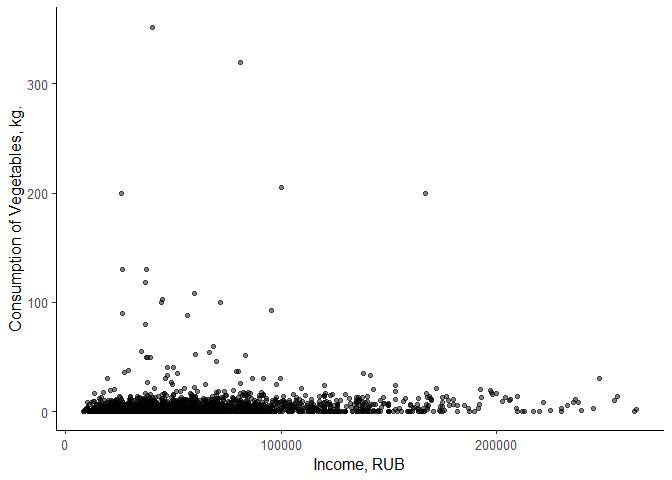

KRcodeR
================

# Подготовка к работе

## Загрузка пакетов

``` r
library(readr)
library(dplyr)
library(tidyr)
library(ggplot2)
library(GGally)
library(sandwich)
library(lmtest)
library(broom)
library(xtable)
library(ggpubr)
library(stargazer)
library(modelsummary)
library(nlWaldTest)
library(car)
library(margins)
library(Hmisc)
library(ggcorrplot)
library(ggstatsplot)
library(flextable)
library(car)
```

### Общая тема оформления для всех графиков и отключение экспоненциальной записи чисел

``` r
theme_set(theme_classic(base_size = 12))
options(scipen = 999) 
```

# Загрузка данных

``` r
my_data <- read.csv("dataset.csv")
```

# Избавляем от пустых значений и убираем выбросы

``` r
data <- replace(my_data,is.na(my_data),0) 

boxplot(data) # Checking outliers
```

<!-- -->

``` r
# Removing outliers from income
x <- data[data$'income' > quantile(data$'income', 0.005) & data$'income' < quantile(data$'income', 0.995),]
x <- x[x$'debt' > quantile(x$'debt', 0.005) & x$'debt' < quantile(x$'debt', 0.995),]
```

# Типы данных

``` r
x$status <- as.factor(x$status)

glimpse(x)
```

    ## Rows: 402
    ## Columns: 30
    ## $ meat               <dbl> 1.500, 1.600, 0.500, 0.000, 13.000, 2.100, 2.400, 2~
    ## $ fish               <dbl> 0.000, 1.000, 0.000, 0.000, 1.000, 0.000, 1.200, 0.~
    ## $ eggs               <dbl> 0, 10, 20, 0, 20, 10, 10, 10, 10, 0, 10, 10, 10, 0,~
    ## $ milk               <dbl> 7.000, 2.400, 8.400, 1.000, 7.500, 2.500, 1.450, 3.~
    ## $ vegetables         <dbl> 0.00, 0.00, 2.00, 0.00, 0.00, 0.00, 0.00, 0.00, 1.0~
    ## $ fruits_and_berries <dbl> 0.0, 0.0, 1.0, 0.0, 0.0, 0.0, 0.0, 1.5, 0.0, 0.4, 2~
    ## $ cereals            <dbl> 0.0, 0.0, 0.8, 2.0, 2.0, 0.0, 1.0, 0.8, 1.0, 0.0, 0~
    ## $ flour              <dbl> 8.800, 4.200, 3.300, 2.800, 7.800, 3.000, 0.500, 8.~
    ## $ sweets             <dbl> 7.00, 1.00, 2.50, 0.00, 2.00, 1.30, 1.80, 1.02, 1.3~
    ## $ softdrinks         <dbl> 0.000, 0.000, 0.000, 0.250, 0.200, 0.000, 0.000, 0.~
    ## $ alcodrinks         <dbl> 0.00, 0.00, 0.00, 0.00, 0.00, 0.25, 5.00, 0.00, 0.0~
    ## $ sum_rub_buy        <dbl> 2644.00, 1331.00, 1785.00, 517.00, 7573.00, 1243.00~
    ## $ income             <dbl> 105400, 28900, 60000, 72000, 166100, 35000, 60000, ~
    ## $ diplom             <int> 0, 0, 0, 0, 1, 0, 1, 1, 0, 1, 0, 0, 1, 1, 1, 0, 0, ~
    ## $ car                <int> 1, 0, 0, 1, 1, 1, 1, 1, 1, 1, 0, 1, 0, 1, 0, 1, 0, ~
    ## $ plot_bi            <int> 1, 1, 1, 1, 1, 1, 1, 1, 1, 1, 0, 1, 0, 1, 0, 1, 0, ~
    ## $ plot_size          <dbl> 25.0, 2.0, 3.0, 2.0, 24.0, 4.0, 6.0, 7.0, 4.5, 18.0~
    ## $ famsize            <int> 3, 1, 2, 3, 4, 1, 2, 3, 2, 2, 1, 2, 4, 6, 1, 3, 1, ~
    ## $ water              <int> 1, 1, 1, 0, 1, 1, 0, 1, 1, 1, 1, 1, 1, 1, 1, 1, 1, ~
    ## $ sanitation         <int> 1, 1, 1, 0, 1, 1, 0, 0, 1, 1, 1, 1, 1, 1, 1, 1, 1, ~
    ## $ fridge             <int> 1, 1, 1, 1, 1, 1, 0, 0, 1, 1, 0, 1, 1, 1, 1, 1, 1, ~
    ## $ internet           <int> 1, 0, 1, 1, 1, 1, 1, 1, 1, 1, 1, 1, 1, 1, 1, 1, 0, ~
    ## $ pfuel              <dbl> 5000, 0, 0, 7000, 10000, 5000, 4000, 3000, 4000, 20~
    ## $ ptransp            <dbl> 0, 0, 9000, 2000, 7000, 0, 0, 0, 0, 435, 0, 250, 10~
    ## $ phome              <dbl> 11000, 5600, 8000, 1300, 8000, 5000, 1500, 3500, 50~
    ## $ debt               <int> 500000, 100000, 200000, 300000, 60000, 50000, 70000~
    ## $ govsubs            <dbl> 105400, 26900, 0, 0, 26100, 0, 0, 22000, 20300, 176~
    ## $ nongovsubs         <int> 0, 0, 0, 0, 0, 0, 0, 0, 0, 0, 0, 0, 0, 0, 0, 0, 0, ~
    ## $ inval              <int> 0, 1, 0, 0, 0, 0, 0, 0, 0, 0, 0, 0, 0, 0, 0, 0, 0, ~
    ## $ status             <fct> 4, 4, 4, 4, 4, 4, 2, 2, 2, 2, 2, 2, 2, 2, 2, 2, 2, ~

# Описательные статистики

``` r
#summary(x)
desc <- datasummary(All(x) ~ mean + SD + Min + Max,data = x, output = 'krdatatable.docx')
desc_print <- datasummary(All(x) ~ mean + SD + Min + Max,data = x)
desc
```

    ## [1] "krdatatable.docx"

``` r
desc_print
```

|                    |      mean |        SD |      Min |        Max |
|:-------------------|----------:|----------:|---------:|-----------:|
| meat               |      3.83 |      3.34 |     0.00 |      27.00 |
| fish               |      0.50 |      0.84 |     0.00 |       6.00 |
| eggs               |     11.66 |     11.48 |     0.00 |      60.00 |
| milk               |      4.60 |      3.96 |     0.00 |      26.00 |
| vegetables         |      7.68 |     30.11 |     0.00 |     352.00 |
| fruits_and_berries |      2.23 |      2.84 |     0.00 |      21.00 |
| cereals            |      0.76 |      1.17 |     0.00 |      12.00 |
| flour              |      4.16 |      4.25 |     0.00 |      56.45 |
| sweets             |      2.17 |      2.38 |     0.00 |      18.00 |
| softdrinks         |      1.02 |      2.20 |     0.00 |      25.05 |
| alcodrinks         |      0.85 |      1.74 |     0.00 |      10.00 |
| sum_rub_buy        |   3165.30 |   2363.17 |     0.00 |   18671.00 |
| income             |  73941.51 |  42297.22 | 10000.00 |  247700.00 |
| diplom             |      0.49 |      0.50 |     0.00 |       1.00 |
| car                |      0.61 |      0.49 |     0.00 |       1.00 |
| plot_bi            |      0.51 |      0.50 |     0.00 |       1.00 |
| plot_size          |      5.77 |     12.77 |     0.00 |     200.00 |
| famsize            |      3.06 |      1.63 |     1.00 |      11.00 |
| water              |      0.89 |      0.31 |     0.00 |       1.00 |
| sanitation         |      0.74 |      0.44 |     0.00 |       1.00 |
| fridge             |      0.74 |      0.44 |     0.00 |       1.00 |
| internet           |      0.82 |      0.38 |     0.00 |       1.00 |
| pfuel              |   3174.35 |   4088.46 |     0.00 |   41000.00 |
| ptransp            |   1135.13 |   2772.80 |     0.00 |   41000.00 |
| phome              |   4756.05 |   3224.48 |     0.00 |   25400.00 |
| debt               | 370911.94 | 500521.33 |   200.00 | 2800000.00 |
| govsubs            |  14403.72 |  17987.15 |     0.00 |  105400.00 |
| nongovsubs         |    140.57 |   1920.04 |     0.00 |   35000.00 |
| inval              |      0.09 |      0.29 |     0.00 |       1.00 |

# Графики

## Плотность распределения: доход в руб.

``` r
x %>% 
  ggplot(aes(income)) + 
  geom_density(alpha = 0.25) +
  xlab("Доход в руб.") +
  ylab("")
```

<!-- -->

## Плотность распределения: расходы на питание в руб.

``` r
x %>% 
  ggplot(aes(sum_rub_buy)) + 
  geom_density(alpha = 0.25) +
  xlab("Расходы в руб.") +
  ylab("")
```

<!-- -->

## Корреляция между категориями еды и доходом

``` r
correlation = x %>% select(1:16)
rcorr(as.matrix(correlation))
```

    ##                    meat fish  eggs milk vegetables fruits_and_berries cereals
    ## meat               1.00 0.27  0.42 0.47       0.05               0.35    0.27
    ## fish               0.27 1.00  0.18 0.26       0.04               0.31    0.15
    ## eggs               0.42 0.18  1.00 0.29       0.00               0.28    0.16
    ## milk               0.47 0.26  0.29 1.00       0.03               0.27    0.16
    ## vegetables         0.05 0.04  0.00 0.03       1.00               0.05    0.18
    ## fruits_and_berries 0.35 0.31  0.28 0.27       0.05               1.00    0.15
    ## cereals            0.27 0.15  0.16 0.16       0.18               0.15    1.00
    ## flour              0.57 0.23  0.17 0.46      -0.01               0.21    0.23
    ## sweets             0.55 0.35  0.25 0.44       0.06               0.31    0.30
    ## softdrinks         0.21 0.13  0.06 0.20       0.18               0.07    0.06
    ## alcodrinks         0.21 0.06  0.03 0.05      -0.03               0.00    0.01
    ## sum_rub_buy        0.84 0.40  0.48 0.61       0.08               0.44    0.31
    ## income             0.34 0.19  0.30 0.29       0.03               0.21    0.14
    ## diplom             0.15 0.01  0.17 0.18       0.03               0.11    0.02
    ## car                0.20 0.12  0.13 0.23       0.04               0.17    0.05
    ## plot_bi            0.09 0.12 -0.08 0.16       0.00              -0.04    0.15
    ##                    flour sweets softdrinks alcodrinks sum_rub_buy income diplom
    ## meat                0.57   0.55       0.21       0.21        0.84   0.34   0.15
    ## fish                0.23   0.35       0.13       0.06        0.40   0.19   0.01
    ## eggs                0.17   0.25       0.06       0.03        0.48   0.30   0.17
    ## milk                0.46   0.44       0.20       0.05        0.61   0.29   0.18
    ## vegetables         -0.01   0.06       0.18      -0.03        0.08   0.03   0.03
    ## fruits_and_berries  0.21   0.31       0.07       0.00        0.44   0.21   0.11
    ## cereals             0.23   0.30       0.06       0.01        0.31   0.14   0.02
    ## flour               1.00   0.56       0.03       0.07        0.61   0.23   0.04
    ## sweets              0.56   1.00       0.18       0.18        0.70   0.28   0.03
    ## softdrinks          0.03   0.18       1.00       0.20        0.31   0.21   0.00
    ## alcodrinks          0.07   0.18       0.20       1.00        0.28   0.12   0.01
    ## sum_rub_buy         0.61   0.70       0.31       0.28        1.00   0.46   0.17
    ## income              0.23   0.28       0.21       0.12        0.46   1.00   0.36
    ## diplom              0.04   0.03       0.00       0.01        0.17   0.36   1.00
    ## car                 0.15   0.13       0.08       0.00        0.26   0.38   0.25
    ## plot_bi             0.23   0.16       0.03      -0.04        0.10   0.03  -0.12
    ##                     car plot_bi
    ## meat               0.20    0.09
    ## fish               0.12    0.12
    ## eggs               0.13   -0.08
    ## milk               0.23    0.16
    ## vegetables         0.04    0.00
    ## fruits_and_berries 0.17   -0.04
    ## cereals            0.05    0.15
    ## flour              0.15    0.23
    ## sweets             0.13    0.16
    ## softdrinks         0.08    0.03
    ## alcodrinks         0.00   -0.04
    ## sum_rub_buy        0.26    0.10
    ## income             0.38    0.03
    ## diplom             0.25   -0.12
    ## car                1.00    0.19
    ## plot_bi            0.19    1.00
    ## 
    ## n= 402 
    ## 
    ## 
    ## P
    ##                    meat   fish   eggs   milk   vegetables fruits_and_berries
    ## meat                      0.0000 0.0000 0.0000 0.2755     0.0000            
    ## fish               0.0000        0.0002 0.0000 0.4795     0.0000            
    ## eggs               0.0000 0.0002        0.0000 0.9316     0.0000            
    ## milk               0.0000 0.0000 0.0000        0.5933     0.0000            
    ## vegetables         0.2755 0.4795 0.9316 0.5933            0.2720            
    ## fruits_and_berries 0.0000 0.0000 0.0000 0.0000 0.2720                       
    ## cereals            0.0000 0.0033 0.0016 0.0011 0.0003     0.0019            
    ## flour              0.0000 0.0000 0.0008 0.0000 0.8128     0.0000            
    ## sweets             0.0000 0.0000 0.0000 0.0000 0.2026     0.0000            
    ## softdrinks         0.0000 0.0112 0.1963 0.0000 0.0003     0.1505            
    ## alcodrinks         0.0000 0.2030 0.5579 0.3022 0.5851     0.9796            
    ## sum_rub_buy        0.0000 0.0000 0.0000 0.0000 0.1285     0.0000            
    ## income             0.0000 0.0002 0.0000 0.0000 0.5187     0.0000            
    ## diplom             0.0030 0.8749 0.0005 0.0003 0.5697     0.0346            
    ## car                0.0000 0.0136 0.0109 0.0000 0.4642     0.0005            
    ## plot_bi            0.0795 0.0156 0.1109 0.0014 0.9646     0.3711            
    ##                    cereals flour  sweets softdrinks alcodrinks sum_rub_buy
    ## meat               0.0000  0.0000 0.0000 0.0000     0.0000     0.0000     
    ## fish               0.0033  0.0000 0.0000 0.0112     0.2030     0.0000     
    ## eggs               0.0016  0.0008 0.0000 0.1963     0.5579     0.0000     
    ## milk               0.0011  0.0000 0.0000 0.0000     0.3022     0.0000     
    ## vegetables         0.0003  0.8128 0.2026 0.0003     0.5851     0.1285     
    ## fruits_and_berries 0.0019  0.0000 0.0000 0.1505     0.9796     0.0000     
    ## cereals                    0.0000 0.0000 0.2259     0.8878     0.0000     
    ## flour              0.0000         0.0000 0.5225     0.1802     0.0000     
    ## sweets             0.0000  0.0000        0.0003     0.0003     0.0000     
    ## softdrinks         0.2259  0.5225 0.0003            0.0000     0.0000     
    ## alcodrinks         0.8878  0.1802 0.0003 0.0000                0.0000     
    ## sum_rub_buy        0.0000  0.0000 0.0000 0.0000     0.0000                
    ## income             0.0036  0.0000 0.0000 0.0000     0.0160     0.0000     
    ## diplom             0.6723  0.4151 0.6080 0.9643     0.8761     0.0008     
    ## car                0.3070  0.0031 0.0082 0.1052     0.9326     0.0000     
    ## plot_bi            0.0028  0.0000 0.0011 0.5904     0.4217     0.0365     
    ##                    income diplom car    plot_bi
    ## meat               0.0000 0.0030 0.0000 0.0795 
    ## fish               0.0002 0.8749 0.0136 0.0156 
    ## eggs               0.0000 0.0005 0.0109 0.1109 
    ## milk               0.0000 0.0003 0.0000 0.0014 
    ## vegetables         0.5187 0.5697 0.4642 0.9646 
    ## fruits_and_berries 0.0000 0.0346 0.0005 0.3711 
    ## cereals            0.0036 0.6723 0.3070 0.0028 
    ## flour              0.0000 0.4151 0.0031 0.0000 
    ## sweets             0.0000 0.6080 0.0082 0.0011 
    ## softdrinks         0.0000 0.9643 0.1052 0.5904 
    ## alcodrinks         0.0160 0.8761 0.9326 0.4217 
    ## sum_rub_buy        0.0000 0.0008 0.0000 0.0365 
    ## income                    0.0000 0.0000 0.5223 
    ## diplom             0.0000        0.0000 0.0170 
    ## car                0.0000 0.0000        0.0001 
    ## plot_bi            0.5223 0.0170 0.0001

## Корреляция между независимыми переменными

``` r
correlation1 = data %>% select(17:29)
rcorr(as.matrix(correlation1))
```

    ##            plot_size famsize water sanitation fridge internet pfuel ptransp
    ## plot_size       1.00    0.08 -0.14      -0.17  -0.02     0.02  0.04   -0.02
    ## famsize         0.08    1.00  0.02      -0.13   0.20     0.37  0.39    0.11
    ## water          -0.14    0.02  1.00       0.58   0.10     0.12  0.03    0.07
    ## sanitation     -0.17   -0.13  0.58       1.00   0.02     0.06 -0.02    0.10
    ## fridge         -0.02    0.20  0.10       0.02   1.00     0.20  0.15    0.06
    ## internet        0.02    0.37  0.12       0.06   0.20     1.00  0.27    0.14
    ## pfuel           0.04    0.39  0.03      -0.02   0.15     0.27  1.00    0.00
    ## ptransp        -0.02    0.11  0.07       0.10   0.06     0.14  0.00    1.00
    ## phome          -0.07    0.14  0.25       0.37   0.09     0.14  0.16    0.16
    ## debt           -0.01    0.12  0.04       0.03   0.03     0.11  0.26    0.04
    ## govsubs         0.00    0.05  0.03       0.04   0.00    -0.14 -0.08   -0.07
    ## nongovsubs      0.00    0.00  0.02       0.00   0.01     0.00  0.10    0.00
    ## inval           0.00    0.02  0.01       0.03  -0.04    -0.09 -0.02   -0.02
    ##            phome  debt govsubs nongovsubs inval
    ## plot_size  -0.07 -0.01    0.00       0.00  0.00
    ## famsize     0.14  0.12    0.05       0.00  0.02
    ## water       0.25  0.04    0.03       0.02  0.01
    ## sanitation  0.37  0.03    0.04       0.00  0.03
    ## fridge      0.09  0.03    0.00       0.01 -0.04
    ## internet    0.14  0.11   -0.14       0.00 -0.09
    ## pfuel       0.16  0.26   -0.08       0.10 -0.02
    ## ptransp     0.16  0.04   -0.07       0.00 -0.02
    ## phome       1.00  0.08   -0.01       0.01 -0.02
    ## debt        0.08  1.00   -0.10       0.05 -0.03
    ## govsubs    -0.01 -0.10    1.00      -0.04  0.36
    ## nongovsubs  0.01  0.05   -0.04       1.00 -0.02
    ## inval      -0.02 -0.03    0.36      -0.02  1.00
    ## 
    ## n= 2390 
    ## 
    ## 
    ## P
    ##            plot_size famsize water  sanitation fridge internet pfuel  ptransp
    ## plot_size            0.0002  0.0000 0.0000     0.3559 0.2617   0.0331 0.2266 
    ## famsize    0.0002            0.3819 0.0000     0.0000 0.0000   0.0000 0.0000 
    ## water      0.0000    0.3819         0.0000     0.0000 0.0000   0.1717 0.0004 
    ## sanitation 0.0000    0.0000  0.0000            0.2461 0.0030   0.3119 0.0000 
    ## fridge     0.3559    0.0000  0.0000 0.2461            0.0000   0.0000 0.0053 
    ## internet   0.2617    0.0000  0.0000 0.0030     0.0000          0.0000 0.0000 
    ## pfuel      0.0331    0.0000  0.1717 0.3119     0.0000 0.0000          0.9366 
    ## ptransp    0.2266    0.0000  0.0004 0.0000     0.0053 0.0000   0.9366        
    ## phome      0.0004    0.0000  0.0000 0.0000     0.0000 0.0000   0.0000 0.0000 
    ## debt       0.6735    0.0000  0.0424 0.2160     0.1483 0.0000   0.0000 0.0467 
    ## govsubs    0.9447    0.0178  0.1581 0.0523     0.9425 0.0000   0.0002 0.0004 
    ## nongovsubs 0.8375    0.9959  0.3382 0.9329     0.6278 0.8902   0.0000 0.9903 
    ## inval      0.8106    0.3457  0.7361 0.1810     0.0716 0.0000   0.2750 0.2838 
    ##            phome  debt   govsubs nongovsubs inval 
    ## plot_size  0.0004 0.6735 0.9447  0.8375     0.8106
    ## famsize    0.0000 0.0000 0.0178  0.9959     0.3457
    ## water      0.0000 0.0424 0.1581  0.3382     0.7361
    ## sanitation 0.0000 0.2160 0.0523  0.9329     0.1810
    ## fridge     0.0000 0.1483 0.9425  0.6278     0.0716
    ## internet   0.0000 0.0000 0.0000  0.8902     0.0000
    ## pfuel      0.0000 0.0000 0.0002  0.0000     0.2750
    ## ptransp    0.0000 0.0467 0.0004  0.9903     0.2838
    ## phome             0.0002 0.7441  0.6506     0.3576
    ## debt       0.0002        0.0000  0.0240     0.1806
    ## govsubs    0.7441 0.0000         0.0780     0.0000
    ## nongovsubs 0.6506 0.0240 0.0780             0.4453
    ## inval      0.3576 0.1806 0.0000  0.4453

### График корреляции между категориями еды и доходом

``` r
ggcorrplot(cor(correlation))
```

<!-- -->

``` r
b = rcorr(as.matrix(data))
tidy(b)
```

    ## # A tibble: 435 x 5
    ##    column1    column2 estimate     n      p.value
    ##    <chr>      <chr>      <dbl> <int>        <dbl>
    ##  1 fish       meat      0.191   2390 0           
    ##  2 eggs       meat      0.383   2390 0           
    ##  3 eggs       fish      0.116   2390 0.0000000131
    ##  4 milk       meat      0.400   2390 0           
    ##  5 milk       fish      0.178   2390 0           
    ##  6 milk       eggs      0.318   2390 0           
    ##  7 vegetables meat      0.109   2390 0.0000000937
    ##  8 vegetables fish      0.0300  2390 0.143       
    ##  9 vegetables eggs      0.0815  2390 0.0000670   
    ## 10 vegetables milk      0.0741  2390 0.000286    
    ## # ... with 425 more rows

### График корреляции между независимыми переменными

``` r
ggcorrplot(cor(correlation1))
```

<!-- -->

## Совместное распределение дохода в руб. и расходы на питание в руб.

``` r
x %>% 
  ggplot(aes(x = income, y = sum_rub_buy)) +
  geom_jitter(width = 0.25, alpha = 0.5) +  
  scale_y_continuous(name = "Расходы на питание в руб.") +
  scale_x_continuous(name = "Доходы в руб.")
```

<!-- -->

``` r
abs_inq <- select(x, meat, fish, eggs, milk, vegetables, fruits_and_berries, cereals, flour, sweets, softdrinks, alcodrinks, income)

abs_inq <- abs_inq %>% 
  mutate(decile = ntile(income, 10))

food_consumption_long <- abs_inq %>% 
  pivot_longer(cols = -c(income, decile), names_to = "food_category", values_to = "consumption")

food_consumption_by_decile <- food_consumption_long %>% 
  group_by(food_category, decile)

food_consumption_table <- food_consumption_by_decile %>% 
  summarise(avg_consumption = mean(consumption)) %>% 
  pivot_wider(names_from = decile, values_from = avg_consumption)
```

    ## `summarise()` has grouped output by 'food_category'. You can override using the
    ## `.groups` argument.

``` r
names(food_consumption_table)[-1] <- paste0("Decile ", 1:10)

food_consumption_table
```

    ## # A tibble: 11 x 11
    ## # Groups:   food_category [11]
    ##    food_category Decil~1 Decil~2 Decil~3 Decil~4 Decil~5 Decil~6 Decil~7 Decil~8
    ##    <chr>           <dbl>   <dbl>   <dbl>   <dbl>   <dbl>   <dbl>   <dbl>   <dbl>
    ##  1 alcodrinks      0.446   0.665   0.51    0.609   0.774   0.959   0.726   1.91 
    ##  2 cereals         0.363   0.615   0.62    0.955   0.828   0.865   0.811   0.562
    ##  3 eggs            6.59   10       7.55   10.4    10      13.9    11.6    13.5  
    ##  4 fish            0.376   0.567   0.246   0.315   0.380   0.687   0.396   0.677
    ##  5 flour           2.33    3.58    3.14    4.12    3.21    4.80    3.77    5.69 
    ##  6 fruits_and_b~   0.644   1.50    1.50    2.75    1.8     2.78    3.16    2.7  
    ##  7 meat            1.54    3.05    2.58    4.04    3.29    4.91    4.10    4.31 
    ##  8 milk            2.38    3.00    3.63    4.64    4.56    5.81    4.89    4.78 
    ##  9 softdrinks      0.403   0.629   0.64    0.713   0.961   1.06    1.45    1.32 
    ## 10 sweets          1.37    1.45    1.33    2.05    1.89    2.79    1.90    2.42 
    ## 11 vegetables      7.42    7.02   10.5     5.64    3.57    2.82   14.0    11.6  
    ## # ... with 2 more variables: `Decile 9` <dbl>, `Decile 10` <dbl>, and
    ## #   abbreviated variable names 1: `Decile 1`, 2: `Decile 2`, 3: `Decile 3`,
    ## #   4: `Decile 4`, 5: `Decile 5`, 6: `Decile 6`, 7: `Decile 7`, 8: `Decile 8`

``` r
# Step 1: Reshape the data from wide to long format
abs_inq <- select(x, meat, fish, eggs, milk, vegetables, fruits_and_berries, cereals, flour, sweets, softdrinks, alcodrinks, diplom)
food_consumption_long <- abs_inq %>% 
  pivot_longer(cols = -diplom, names_to = "food_category", values_to = "consumption")


# Step 2: Group the data by food_category and diplom
food_consumption_by_diplom <- food_consumption_long %>% 
  group_by(food_category, diplom)

# Step 3: Calculate the average consumption for each food category and for each value of diplom
food_consumption_table <- food_consumption_by_diplom %>% 
  summarise(avg_consumption = mean(consumption)) %>% 
  pivot_wider(names_from = diplom, values_from = avg_consumption)
```

    ## `summarise()` has grouped output by 'food_category'. You can override using the
    ## `.groups` argument.

``` r
# Step 4: Rename the column names to show the binary variable
names(food_consumption_table)[-1] <- c("No diploma", "At least one member with diploma")

# View the resulting table
food_consumption_table
```

    ## # A tibble: 11 x 3
    ## # Groups:   food_category [11]
    ##    food_category      `No diploma` `At least one member with diploma`
    ##    <chr>                     <dbl>                              <dbl>
    ##  1 alcodrinks                0.836                              0.863
    ##  2 cereals                   0.738                              0.788
    ##  3 eggs                      9.69                              13.7  
    ##  4 fish                      0.493                              0.506
    ##  5 flour                     3.98                               4.33 
    ##  6 fruits_and_berries        1.94                               2.54 
    ##  7 meat                      3.35                               4.33 
    ##  8 milk                      3.90                               5.32 
    ##  9 softdrinks                1.02                               1.01 
    ## 10 sweets                    2.11                               2.23 
    ## 11 vegetables                6.83                               8.54

``` r
# Step 1: Reshape the data from wide to long format
abs_inq <- select(x, meat, fish, eggs, milk, vegetables, fruits_and_berries, cereals, flour, sweets, softdrinks, alcodrinks, car)
food_consumption_long <- abs_inq %>% 
  pivot_longer(cols = -car, names_to = "food_category", values_to = "consumption")


# Step 2: Group the data by food_category and diplom
food_consumption_by_car <- food_consumption_long %>% 
  group_by(food_category, car)

# Step 3: Calculate the average consumption for each food category and for each value of diplom
food_consumption_table <- food_consumption_by_car%>% 
  summarise(avg_consumption = mean(consumption)) %>% 
  pivot_wider(names_from = car, values_from = avg_consumption)
```

    ## `summarise()` has grouped output by 'food_category'. You can override using the
    ## `.groups` argument.

``` r
# Step 4: Rename the column names to show the binary variable
names(food_consumption_table)[-1] <- c("No car", "At least one member with a car")

# View the resulting table
food_consumption_table
```

    ## # A tibble: 11 x 3
    ## # Groups:   food_category [11]
    ##    food_category      `No car` `At least one member with a car`
    ##    <chr>                 <dbl>                            <dbl>
    ##  1 alcodrinks            0.840                            0.856
    ##  2 cereals               0.688                            0.811
    ##  3 eggs                  9.84                            12.8  
    ##  4 fish                  0.371                            0.582
    ##  5 flour                 3.38                             4.65 
    ##  6 fruits_and_berries    1.62                             2.63 
    ##  7 meat                  2.98                             4.38 
    ##  8 milk                  3.47                             5.32 
    ##  9 softdrinks            0.794                            1.16 
    ## 10 sweets                1.78                             2.42 
    ## 11 vegetables            6.30                             8.56

# Построение регрессий

## Модель 1: линейная

### Зависимая перменная: количество купленного за 7 дней мяса и мясных продуктов, кг. (meat)

``` r
model1_meat <- lm(meat ~ 1 + income + diplom + car + status + water + fridge + sanitation + internet + inval + govsubs
                + phome + pfuel + ptransp + famsize, data = x)
cov_model1_meat <- vcovHC(model1_meat, type = "HC0")
coeftest(model1_meat, df = Inf, vcov = cov_model1_meat)
```

    ## 
    ## z test of coefficients:
    ## 
    ##                  Estimate    Std. Error z value   Pr(>|z|)    
    ## (Intercept)  0.6810274115  0.7504091329  0.9075    0.36412    
    ## income       0.0000101546  0.0000054447  1.8650    0.06217 .  
    ## diplom       0.1237964578  0.3052978700  0.4055    0.68511    
    ## car          0.0897868321  0.3821514853  0.2350    0.81425    
    ## status2     -0.3612050945  0.3388069914 -1.0661    0.28637    
    ## status3      0.6006212339  0.7170504983  0.8376    0.40224    
    ## status4      0.0589519120  0.5673372141  0.1039    0.91724    
    ## water       -0.1577921385  0.6031308802 -0.2616    0.79361    
    ## fridge       0.0363102866  0.3952600416  0.0919    0.92681    
    ## sanitation   0.5010629168  0.5058083243  0.9906    0.32187    
    ## internet     0.2242347565  0.4924225556  0.4554    0.64884    
    ## inval        0.7836204512  0.7637786149  1.0260    0.30490    
    ## govsubs     -0.0000101458  0.0000103064 -0.9844    0.32491    
    ## phome       -0.0000244027  0.0000467615 -0.5219    0.60177    
    ## pfuel        0.0000266135  0.0000616122  0.4320    0.66578    
    ## ptransp      0.0000520404  0.0000531683  0.9788    0.32769    
    ## famsize      0.6432302537  0.1605897824  4.0054 0.00006191 ***
    ## ---
    ## Signif. codes:  0 '***' 0.001 '**' 0.01 '*' 0.05 '.' 0.1 ' ' 1

``` r
vif(model1_meat)
```

    ##                GVIF Df GVIF^(1/(2*Df))
    ## income     2.039840  1        1.428230
    ## diplom     1.244981  1        1.115787
    ## car        1.792466  1        1.338830
    ## status     1.660652  3        1.088211
    ## water      1.615134  1        1.270879
    ## fridge     1.095199  1        1.046518
    ## sanitation 2.237167  1        1.495716
    ## internet   1.283762  1        1.133032
    ## inval      1.148096  1        1.071493
    ## govsubs    1.264738  1        1.124606
    ## phome      1.331272  1        1.153808
    ## pfuel      1.924205  1        1.387157
    ## ptransp    1.076866  1        1.037722
    ## famsize    1.628775  1        1.276235

### Зависимая перменная: количество купленной за 7 дней рыбы и морепродуктов, кг. (fish)

``` r
model1_fish <- lm(fish ~ 1 + income + diplom + car + status + water + fridge + sanitation + internet + inval + govsubs
                + phome + pfuel + ptransp + famsize, data = x)
cov_model1_fish <- vcovHC(model1_fish, type = "HC0")
coeftest(model1_fish, df = Inf, vcov = cov_model1_fish)
```

    ## 
    ## z test of coefficients:
    ## 
    ##                  Estimate    Std. Error z value Pr(>|z|)   
    ## (Intercept)  0.1222508658  0.1724853380  0.7088 0.478473   
    ## income       0.0000017208  0.0000012682  1.3569 0.174822   
    ## diplom      -0.0582853461  0.0785910956 -0.7416 0.458313   
    ## car          0.1784883928  0.0995978345  1.7921 0.073118 . 
    ## status2     -0.0359573041  0.0868351851 -0.4141 0.678811   
    ## status3      0.3706216086  0.1934416546  1.9159 0.055373 . 
    ## status4      0.0498207246  0.1245811546  0.3999 0.689226   
    ## water       -0.0424482695  0.1576901387 -0.2692 0.787785   
    ## fridge       0.0529219020  0.0962130827  0.5500 0.582286   
    ## sanitation   0.0483828782  0.1357539482  0.3564 0.721540   
    ## internet    -0.3485034352  0.1158413789 -3.0085 0.002626 **
    ## inval        0.4478516700  0.2002195844  2.2368 0.025299 * 
    ## govsubs      0.0000040654  0.0000027898  1.4572 0.145049   
    ## phome        0.0000074928  0.0000150153  0.4990 0.617769   
    ## pfuel       -0.0000142631  0.0000127780 -1.1162 0.264326   
    ## ptransp      0.0000158495  0.0000104549  1.5160 0.129521   
    ## famsize      0.0963103077  0.0373379393  2.5794 0.009897 **
    ## ---
    ## Signif. codes:  0 '***' 0.001 '**' 0.01 '*' 0.05 '.' 0.1 ' ' 1

### Зависимая перменная: количество купленных за 7 дней яиц, шт. (eggs)

``` r
model1_eggs <- lm(eggs ~ 1 + income + diplom + car + status + water + fridge + sanitation + internet + inval + govsubs
                + phome + pfuel + ptransp + famsize + plot_bi + nongovsubs + debt, data = x)
cov_model1_eggs <- vcovHC(model1_eggs, type = "HC0")
coeftest(model1_eggs, df = Inf, vcov = cov_model1_eggs)
```

    ## 
    ## z test of coefficients:
    ## 
    ##                  Estimate    Std. Error z value Pr(>|z|)   
    ## (Intercept)  6.1299526406  2.6960481193  2.2737 0.022985 * 
    ## income       0.0000629705  0.0000217434  2.8961 0.003779 **
    ## diplom       1.5470510755  1.1535292677  1.3411 0.179873   
    ## car          0.1488700463  1.3139158265  0.1133 0.909791   
    ## status2     -2.4043871336  1.2410990383 -1.9373 0.052708 . 
    ## status3     -1.4560529443  2.4229181462 -0.6010 0.547873   
    ## status4     -1.6484371572  1.8667502782 -0.8831 0.377208   
    ## water        0.0026201154  2.1785572800  0.0012 0.999040   
    ## fridge       0.5828962095  1.2098675089  0.4818 0.629959   
    ## sanitation   2.5268796346  1.9367038701  1.3047 0.191984   
    ## internet    -3.2382414112  1.6909383873 -1.9151 0.055485 . 
    ## inval        0.1514918898  1.9499317564  0.0777 0.938074   
    ## govsubs     -0.0000914959  0.0000343043 -2.6672 0.007649 **
    ## phome        0.0001390267  0.0002118381  0.6563 0.511639   
    ## pfuel       -0.0000259990  0.0001514236 -0.1717 0.863676   
    ## ptransp     -0.0001590217  0.0001878948 -0.8463 0.397367   
    ## famsize      1.3555294743  0.5081409446  2.6676 0.007639 **
    ## plot_bi     -0.7897054159  1.2002962445 -0.6579 0.510586   
    ## nongovsubs   0.0000951518  0.0002246719  0.4235 0.671920   
    ## debt        -0.0000031441  0.0000011682 -2.6914 0.007115 **
    ## ---
    ## Signif. codes:  0 '***' 0.001 '**' 0.01 '*' 0.05 '.' 0.1 ' ' 1

### Зависимая перменная: количество купленного за 7 дней молока и молочных продуктов, л. (milk)

``` r
model1_milk <- lm(milk ~ 1 + income + diplom + car + status + water + fridge + sanitation + internet + inval + govsubs
                + phome + pfuel + ptransp + famsize + plot_bi + nongovsubs + debt, data = x)
cov_model1_milk <- vcovHC(model1_milk, type = "HC0")
coeftest(model1_milk, df = Inf, vcov = cov_model1_milk)
```

    ## 
    ## z test of coefficients:
    ## 
    ##                   Estimate     Std. Error z value   Pr(>|z|)    
    ## (Intercept) -0.25361315881  0.87378217640 -0.2902    0.77163    
    ## income      -0.00000206089  0.00000706106 -0.2919    0.77039    
    ## diplom       0.81274021093  0.39434255997  2.0610    0.03930 *  
    ## car          0.35358888363  0.46480454720  0.7607    0.44682    
    ## status2      0.09059134248  0.43289774799  0.2093    0.83424    
    ## status3      1.56504386151  0.82356971320  1.9003    0.05739 .  
    ## status4      0.53700247048  0.61321726163  0.8757    0.38119    
    ## water       -0.36504099773  0.69000882464 -0.5290    0.59678    
    ## fridge      -0.30352866842  0.43706458561 -0.6945    0.48739    
    ## sanitation   1.34883058050  0.65226747375  2.0679    0.03865 *  
    ## internet    -0.10130044460  0.39207528853 -0.2584    0.79612    
    ## inval        0.82030977325  0.68734653521  1.1934    0.23270    
    ## govsubs      0.00001891707  0.00001090772  1.7343    0.08287 .  
    ## phome        0.00001091764  0.00005801873  0.1882    0.85074    
    ## pfuel        0.00002608475  0.00006476581  0.4028    0.68713    
    ## ptransp      0.00004102774  0.00005184388  0.7914    0.42873    
    ## famsize      0.85190607512  0.21445665028  3.9724 0.00007115 ***
    ## plot_bi      1.01606777427  0.40033287736  2.5381    0.01115 *  
    ## nongovsubs  -0.00002652023  0.00002990134 -0.8869    0.37512    
    ## debt         0.00000034845  0.00000046165  0.7548    0.45037    
    ## ---
    ## Signif. codes:  0 '***' 0.001 '**' 0.01 '*' 0.05 '.' 0.1 ' ' 1

### Зависимая перменная: количество купленных за 7 дней овощей, кг. (vegetables)

``` r
model1_vegetables <- lm(vegetables ~ 1 + income + diplom + car + status + water + fridge + sanitation + internet + inval + govsubs
                + phome + pfuel + ptransp + famsize + plot_bi + nongovsubs + debt, data = x)
cov_model1_vegetables <- vcovHC(model1_vegetables, type = "HC0")
coeftest(model1_vegetables, df = Inf, vcov = cov_model1_vegetables)
```

    ## 
    ## z test of coefficients:
    ## 
    ##                   Estimate     Std. Error z value Pr(>|z|)  
    ## (Intercept) 13.17107632433  6.45896264471  2.0392  0.04143 *
    ## income       0.00003947197  0.00005495918  0.7182  0.47263  
    ## diplom       1.36825755134  2.56323586064  0.5338  0.59348  
    ## car          1.69229214961  2.66718635133  0.6345  0.52576  
    ## status2      3.81962095870  3.81342568937  1.0016  0.31652  
    ## status3     -0.20916871941  3.54614952834 -0.0590  0.95296  
    ## status4     -6.55912209191  4.64495007803 -1.4121  0.15792  
    ## water        2.49837344180  8.28604804761  0.3015  0.76302  
    ## fridge       3.29745019303  2.58150833931  1.2773  0.20148  
    ## sanitation  -8.15049078026  7.54915939218 -1.0797  0.28030  
    ## internet    -8.38704507662  4.50332843483 -1.8624  0.06255 .
    ## inval       -2.92070570290  2.32500265536 -1.2562  0.20904  
    ## govsubs     -0.00005826570  0.00005822454 -1.0007  0.31697  
    ## phome       -0.00029130989  0.00020490884 -1.4217  0.15513  
    ## pfuel       -0.00013816739  0.00033847965 -0.4082  0.68313  
    ## ptransp     -0.00010801710  0.00016431425 -0.6574  0.51094  
    ## famsize      0.81471262597  1.16112335451  0.7017  0.48289  
    ## plot_bi     -1.66872736283  3.11514188143 -0.5357  0.59218  
    ## nongovsubs  -0.00029954360  0.00013645295 -2.1952  0.02815 *
    ## debt        -0.00000008796  0.00000404936 -0.0217  0.98267  
    ## ---
    ## Signif. codes:  0 '***' 0.001 '**' 0.01 '*' 0.05 '.' 0.1 ' ' 1

### Зависимая перменная: количество купленных за 7 дней фруктов и ягод, кг. (fruits_and_berries)

``` r
model1_fruits_and_berries <- lm(fruits_and_berries ~ 1 + income + diplom + car + status + water + fridge + sanitation + internet + inval + govsubs
                + phome + pfuel + ptransp + famsize, data = x)
cov_model1_fruits_and_berries <- vcovHC(model1_fruits_and_berries, type = "HC0")
coeftest(model1_fruits_and_berries, df = Inf, vcov = cov_model1_fruits_and_berries)
```

    ## 
    ## z test of coefficients:
    ## 
    ##                  Estimate    Std. Error z value  Pr(>|z|)    
    ## (Intercept)  0.0072621858  0.4575518809  0.0159 0.9873366    
    ## income       0.0000087730  0.0000047389  1.8513 0.0641289 .  
    ## diplom       0.1195359331  0.2879091066  0.4152 0.6780055    
    ## car          0.9403234571  0.3565189032  2.6375 0.0083516 ** 
    ## status2     -0.1989258683  0.3251844432 -0.6117 0.5407148    
    ## status3      1.5771429848  0.8846096070  1.7829 0.0746076 .  
    ## status4     -0.2231468941  0.3866415255 -0.5771 0.5638438    
    ## water        0.6237916649  0.4002327753  1.5586 0.1190977    
    ## fridge       0.0234865023  0.3346619363  0.0702 0.9440506    
    ## sanitation   0.5660700670  0.4524516686  1.2511 0.2108917    
    ## internet    -0.4348832486  0.3672623234 -1.1841 0.2363649    
    ## inval        1.2397277977  0.6097710513  2.0331 0.0420420 *  
    ## govsubs     -0.0000081572  0.0000092544 -0.8814 0.3780789    
    ## phome       -0.0000461291  0.0000522130 -0.8835 0.3769772    
    ## pfuel       -0.0001149500  0.0000365993 -3.1408 0.0016851 ** 
    ## ptransp     -0.0000150311  0.0000292985 -0.5130 0.6079281    
    ## famsize      0.3175779401  0.0905708343  3.5064 0.0004542 ***
    ## ---
    ## Signif. codes:  0 '***' 0.001 '**' 0.01 '*' 0.05 '.' 0.1 ' ' 1

### Зависимая перменная: количество купленных за 7 дней круп и злаковых, кг. (cereals)

``` r
model1_cereals <- lm(cereals ~ 1 + income + diplom + car + status + water + fridge + sanitation + internet + inval + govsubs
                + phome + pfuel + ptransp + famsize, data = x)
cov_model1_cereals <- vcovHC(model1_cereals, type = "HC0")
coeftest(model1_cereals, df = Inf, vcov = cov_model1_cereals)
```

    ## 
    ## z test of coefficients:
    ## 
    ##                  Estimate    Std. Error z value  Pr(>|z|)    
    ## (Intercept)  0.4181158994  0.2185219768  1.9134 0.0556992 .  
    ## income       0.0000020618  0.0000018309  1.1261 0.2601137    
    ## diplom      -0.0298250880  0.1164655363 -0.2561 0.7978851    
    ## car         -0.1087244025  0.1518253120 -0.7161 0.4739203    
    ## status2      0.0328787508  0.1405355237  0.2340 0.8150212    
    ## status3     -0.0196709847  0.2097538252 -0.0938 0.9252829    
    ## status4      0.0033026450  0.1608274691  0.0205 0.9836163    
    ## water       -0.0014540961  0.2134484121 -0.0068 0.9945645    
    ## fridge       0.1165544949  0.1227658836  0.9494 0.3424149    
    ## sanitation  -0.3219079942  0.1944177230 -1.6558 0.0977716 .  
    ## internet    -0.1416688664  0.1718974191 -0.8241 0.4098556    
    ## inval        0.0051857280  0.2047976047  0.0253 0.9797987    
    ## govsubs     -0.0000046978  0.0000032452 -1.4476 0.1477303    
    ## phome        0.0000263914  0.0000359007  0.7351 0.4622660    
    ## pfuel       -0.0000017934  0.0000197735 -0.0907 0.9277314    
    ## ptransp      0.0000166498  0.0000221724  0.7509 0.4526979    
    ## famsize      0.1501503429  0.0405714368  3.7009 0.0002148 ***
    ## ---
    ## Signif. codes:  0 '***' 0.001 '**' 0.01 '*' 0.05 '.' 0.1 ' ' 1

### Зависимая перменная: количество купленных за 7 дней муки и мучных продуктов (flour)

``` r
model1_flour <- lm(flour ~ 1 + income + diplom + car + status + water + fridge + sanitation + internet + inval + govsubs
                + phome + pfuel + ptransp + famsize, data = x)
cov_model1_flour <- vcovHC(model1_flour, type = "HC0")
coeftest(model1_flour, df = Inf, vcov = cov_model1_flour)
```

    ## 
    ## z test of coefficients:
    ## 
    ##                  Estimate    Std. Error z value              Pr(>|z|)    
    ## (Intercept) -0.4684319734  1.0669138229 -0.4391             0.6606230    
    ## income      -0.0000017103  0.0000049604 -0.3448             0.7302510    
    ## diplom      -0.0890448361  0.3689469601 -0.2413             0.8092849    
    ## car         -0.1331704223  0.3405962114 -0.3910             0.6958031    
    ## status2      0.2901999984  0.3615462799  0.8027             0.4221693    
    ## status3      2.3862431276  0.6526784886  3.6561             0.0002561 ***
    ## status4      2.2027990115  0.9353850006  2.3550             0.0185244 *  
    ## water       -0.3458728500  0.4818000965 -0.7179             0.4728336    
    ## fridge      -0.2635173467  0.3348602230 -0.7869             0.4313127    
    ## sanitation   1.0222897348  0.7350907672  1.3907             0.1643168    
    ## internet     0.2251210358  0.3726260624  0.6041             0.5457457    
    ## inval        0.0969251272  0.7299583646  0.1328             0.8943660    
    ## govsubs      0.0000208588  0.0000182051  1.1458             0.2518902    
    ## phome       -0.0000408472  0.0000576474 -0.7086             0.4785918    
    ## pfuel       -0.0000030857  0.0000375494 -0.0822             0.9345062    
    ## ptransp     -0.0000370648  0.0000446152 -0.8308             0.4061059    
    ## famsize      1.1808912845  0.1379987482  8.5573 < 0.00000000000000022 ***
    ## ---
    ## Signif. codes:  0 '***' 0.001 '**' 0.01 '*' 0.05 '.' 0.1 ' ' 1

### Зависимая перменная: количество купленных за 7 дней кондитерских и содержащих высокий уровень сахара изделий, кг. (sweets)

``` r
model1_sweets <- lm(sweets ~ 1 + income + diplom + car + status + water + fridge + sanitation + internet + inval + govsubs
                + phome + pfuel + ptransp + famsize , data = x)
cov_model1_sweets <- vcovHC(model1_sweets, type = "HC0")
coeftest(model1_sweets, df = Inf, vcov = cov_model1_sweets)
```

    ## 
    ## z test of coefficients:
    ## 
    ##                  Estimate    Std. Error z value      Pr(>|z|)    
    ## (Intercept)  0.2130564125  0.4878381928  0.4367       0.66230    
    ## income       0.0000051488  0.0000035181  1.4635       0.14332    
    ## diplom      -0.3491261668  0.2044030688 -1.7080       0.08763 .  
    ## car         -0.0822960264  0.2551107007 -0.3226       0.74701    
    ## status2      0.0841735823  0.2348036660  0.3585       0.71998    
    ## status3      0.9234472551  0.7174510372  1.2871       0.19805    
    ## status4      0.5700724336  0.3947321872  1.4442       0.14868    
    ## water       -0.7295740152  0.3543638897 -2.0588       0.03951 *  
    ## fridge      -0.1386077651  0.2798125050 -0.4954       0.62035    
    ## sanitation   0.4190767644  0.3753516366  1.1165       0.26421    
    ## internet     0.2194805353  0.2179665671  1.0069       0.31396    
    ## inval       -0.3719586273  0.4627772399 -0.8038       0.42154    
    ## govsubs      0.0000110094  0.0000090746  1.2132       0.22505    
    ## phome        0.0000157138  0.0000332531  0.4726       0.63653    
    ## pfuel        0.0000038511  0.0000422701  0.0911       0.92741    
    ## ptransp      0.0000417757  0.0000253740  1.6464       0.09968 .  
    ## famsize      0.5200285061  0.0953913198  5.4515 0.00000004994 ***
    ## ---
    ## Signif. codes:  0 '***' 0.001 '**' 0.01 '*' 0.05 '.' 0.1 ' ' 1

### Зависимая перменная: количество купленных за 7 дней безалкогольных напитков, л. (softdrinks)

``` r
model1_softdrinks <- lm(softdrinks ~ 1 + income + diplom + car + status + water + fridge + sanitation + internet + inval + govsubs
                + phome + pfuel + ptransp + famsize, data = x)
cov_model1_softdrinks <- vcovHC(model1_softdrinks, type = "HC0")
coeftest(model1_softdrinks, df = Inf, vcov = cov_model1_softdrinks)
```

    ## 
    ## z test of coefficients:
    ## 
    ##                  Estimate    Std. Error z value Pr(>|z|)  
    ## (Intercept)  0.3247326974  0.4434518613  0.7323  0.46400  
    ## income       0.0000111000  0.0000079913  1.3890  0.16483  
    ## diplom      -0.4410784937  0.3314332828 -1.3308  0.18325  
    ## car          0.0540666452  0.2927612267  0.1847  0.85348  
    ## status2      0.1249348196  0.2875519097  0.4345  0.66394  
    ## status3      1.0451424502  0.5634399415  1.8549  0.06361 .
    ## status4     -0.1663084885  0.3048471276 -0.5455  0.58538  
    ## water       -0.1730087957  0.3597343745 -0.4809  0.63056  
    ## fridge      -0.3164327551  0.2359921889 -1.3409  0.17997  
    ## sanitation  -0.1368353802  0.3418105593 -0.4003  0.68892  
    ## internet     0.2126395476  0.2225839209  0.9553  0.33941  
    ## inval       -0.1151128032  0.2713715527 -0.4242  0.67143  
    ## govsubs     -0.0000081394  0.0000052256 -1.5576  0.11933  
    ## phome        0.0000142132  0.0000379928  0.3741  0.70833  
    ## pfuel       -0.0000011307  0.0000416517 -0.0271  0.97834  
    ## ptransp      0.0000754474  0.0000309666  2.4364  0.01483 *
    ## famsize      0.0982426518  0.1461305456  0.6723  0.50140  
    ## ---
    ## Signif. codes:  0 '***' 0.001 '**' 0.01 '*' 0.05 '.' 0.1 ' ' 1

### Зависимая перменная: количество купленных за 7 дней алкогольных напитков, л. (alcodrinks)

``` r
model1_alcodrinks <- lm(alcodrinks ~ 1 + income + diplom + car + status + water + fridge + sanitation + internet + inval + govsubs
                + phome + pfuel + ptransp + famsize, data = x)
cov_model1_alcodrinks <- vcovHC(model1_alcodrinks, type = "HC0")
coeftest(model1_softdrinks, df = Inf, vcov = cov_model1_alcodrinks)
```

    ## 
    ## z test of coefficients:
    ## 
    ##                  Estimate    Std. Error z value   Pr(>|z|)    
    ## (Intercept)  0.3247326974  0.3894921602  0.8337   0.404431    
    ## income       0.0000111000  0.0000027419  4.0483 0.00005159 ***
    ## diplom      -0.4410784937  0.1758657349 -2.5080   0.012140 *  
    ## car          0.0540666452  0.2023586465  0.2672   0.789329    
    ## status2      0.1249348196  0.2029440090  0.6156   0.538150    
    ## status3      1.0451424502  0.3508673789  2.9787   0.002894 ** 
    ## status4     -0.1663084885  0.2379098246 -0.6990   0.484527    
    ## water       -0.1730087957  0.3137664984 -0.5514   0.581364    
    ## fridge      -0.3164327551  0.2438371664 -1.2977   0.194383    
    ## sanitation  -0.1368353802  0.2348865531 -0.5826   0.560190    
    ## internet     0.2126395476  0.1860518984  1.1429   0.253078    
    ## inval       -0.1151128032  0.3274314719 -0.3516   0.725166    
    ## govsubs     -0.0000081394  0.0000053439 -1.5231   0.127728    
    ## phome        0.0000142132  0.0000269014  0.5283   0.597259    
    ## pfuel       -0.0000011307  0.0000214948 -0.0526   0.958049    
    ## ptransp      0.0000754474  0.0000540103  1.3969   0.162441    
    ## famsize      0.0982426518  0.0712541746  1.3788   0.167968    
    ## ---
    ## Signif. codes:  0 '***' 0.001 '**' 0.01 '*' 0.05 '.' 0.1 ' ' 1

# Построение регрессий

## Модель 2: с логарифмированным доходом

### Зависимая перменная: количество купленного за 7 дней мяса и мясных продуктов, кг. (meat)

``` r
model2_meat <- lm(meat ~ 1 + log(income) + diplom + car + plot_bi + famsize + water + sanitation + fridge + internet +  pfuel + ptransp + phome
                  + debt + govsubs + inval + status, data = x)
cov_model2_meat <- vcovHC(model2_meat, type = "HC0")
coeftest(model2_meat, df = Inf, vcov = cov_model2_meat)
```

    ## 
    ## z test of coefficients:
    ## 
    ##                   Estimate     Std. Error z value  Pr(>|z|)    
    ## (Intercept) -7.58492606345  3.28421956579 -2.3095 0.0209155 *  
    ## log(income)  0.79713092651  0.33451366945  2.3830 0.0171743 *  
    ## diplom       0.17584881618  0.31622192342  0.5561 0.5781472    
    ## car         -0.16517588771  0.38341840506 -0.4308 0.6666152    
    ## plot_bi      0.54750695293  0.36084505368  1.5173 0.1291932    
    ## famsize      0.62497685313  0.17799764000  3.5112 0.0004462 ***
    ## water       -0.02828952929  0.61253488649 -0.0462 0.9631633    
    ## sanitation   0.64616024396  0.52097379132  1.2403 0.2148670    
    ## fridge       0.02563635011  0.39817033680  0.0644 0.9486634    
    ## internet     0.21735598547  0.48391039299  0.4492 0.6533121    
    ## pfuel        0.00004358100  0.00006154109  0.7082 0.4788453    
    ## ptransp      0.00004065921  0.00004919201  0.8265 0.4084973    
    ## phome       -0.00002342191  0.00004764094 -0.4916 0.6229779    
    ## debt        -0.00000021753  0.00000044276 -0.4913 0.6232182    
    ## govsubs     -0.00001346996  0.00001078412 -1.2491 0.2116452    
    ## inval        0.77005030439  0.76400763384  1.0079 0.3134981    
    ## status2     -0.38720176339  0.34361048900 -1.1269 0.2598006    
    ## status3      0.70733372611  0.72479648953  0.9759 0.3291107    
    ## status4      0.06117477597  0.57334505110  0.1067 0.9150286    
    ## ---
    ## Signif. codes:  0 '***' 0.001 '**' 0.01 '*' 0.05 '.' 0.1 ' ' 1

### Зависимая перменная: количество купленной за 7 дней рыбы и морепродуктов, кг. (fish)

``` r
model2_fish <- lm(fish ~ 1 + log(income) + diplom + car + plot_bi + famsize + water + sanitation + fridge + internet +  pfuel + ptransp + phome
                  + debt + govsubs + inval + status, data = x)
cov_model2_fish <- vcovHC(model2_fish, type = "HC0")
coeftest(model2_fish, df = Inf, vcov = cov_model2_fish)
```

    ## 
    ## z test of coefficients:
    ## 
    ##                     Estimate       Std. Error z value Pr(>|z|)   
    ## (Intercept) -0.1216480979821  0.8547555965882 -0.1423 0.886828   
    ## log(income)  0.0197876965278  0.0857670117311  0.2307 0.817537   
    ## diplom      -0.0274883332656  0.0821160828208 -0.3347 0.737814   
    ## car          0.1523398259595  0.1010584957149  1.5074 0.131697   
    ## plot_bi      0.0868658956774  0.0814611292478  1.0663 0.286266   
    ## famsize      0.1081916317579  0.0416425119948  2.5981 0.009374 **
    ## water       -0.0283602199882  0.1585114709138 -0.1789 0.858004   
    ## sanitation   0.0752610642193  0.1378231681732  0.5461 0.585018   
    ## fridge       0.0612300380193  0.0960747766541  0.6373 0.523919   
    ## internet    -0.3452422144270  0.1180517046074 -2.9245 0.003450 **
    ## pfuel       -0.0000085415071  0.0000122596545 -0.6967 0.485980   
    ## ptransp      0.0000171497439  0.0000103967647  1.6495 0.099040 . 
    ## phome        0.0000104745027  0.0000152763149  0.6857 0.492922   
    ## debt         0.0000000033007  0.0000001101459  0.0300 0.976093   
    ## govsubs      0.0000041988706  0.0000029633341  1.4169 0.156500   
    ## inval        0.4441973722063  0.2005314205334  2.2151 0.026753 * 
    ## status2     -0.0450599342805  0.0856836819416 -0.5259 0.598967   
    ## status3      0.3651238996647  0.1975792623542  1.8480 0.064604 . 
    ## status4      0.0412642796551  0.1268438825872  0.3253 0.744942   
    ## ---
    ## Signif. codes:  0 '***' 0.001 '**' 0.01 '*' 0.05 '.' 0.1 ' ' 1

### Зависимая перменная: количество купленных за 7 дней яиц, шт. (eggs)

``` r
model2_eggs <- lm(eggs ~ 1 + log(income) + diplom + car + plot_bi + famsize + water + sanitation + fridge + internet +  pfuel + ptransp + phome
                  + debt + govsubs + inval + status, data = x)
cov_model2_eggs <- vcovHC(model2_eggs, type = "HC0")
coeftest(model2_eggs, df = Inf, vcov = cov_model2_eggs)
```

    ## 
    ## z test of coefficients:
    ## 
    ##                   Estimate     Std. Error z value Pr(>|z|)   
    ## (Intercept) -30.2340812864  13.3898224074 -2.2580 0.023946 * 
    ## log(income)   3.6853618618   1.3186786033  2.7947 0.005194 **
    ## diplom        1.6641560685   1.1630205832  1.4309 0.152461   
    ## car          -0.3538164351   1.3478997646 -0.2625 0.792940   
    ## plot_bi      -0.8803276898   1.2063158465 -0.7298 0.465534   
    ## famsize       1.4527013994   0.5432026249  2.6743 0.007488 **
    ## water         0.2455545388   2.1632424116  0.1135 0.909624   
    ## sanitation    2.4626625545   1.9396438988  1.2696 0.204210   
    ## fridge        0.4204035680   1.2046592750  0.3490 0.727103   
    ## internet     -3.4257941672   1.6910962470 -2.0258 0.042787 * 
    ## pfuel         0.0000532675   0.0001449477  0.3675 0.713250   
    ## ptransp      -0.0001660864   0.0001860190 -0.8928 0.371939   
    ## phome         0.0001453725   0.0002073939  0.7009 0.483335   
    ## debt         -0.0000030624   0.0000012085 -2.5340 0.011276 * 
    ## govsubs      -0.0000867796   0.0000336672 -2.5776 0.009950 **
    ## inval         0.1955479391   2.0042197673  0.0976 0.922275   
    ## status2      -2.3629586520   1.2436942167 -1.9000 0.057439 . 
    ## status3      -1.2737307110   2.4750179710 -0.5146 0.606808   
    ## status4      -1.4300075739   1.8829684626 -0.7594 0.447587   
    ## ---
    ## Signif. codes:  0 '***' 0.001 '**' 0.01 '*' 0.05 '.' 0.1 ' ' 1

### Зависимая перменная: количество купленного за 7 дней молока и молочных продуктов, л. (milk)

``` r
model2_milk <- lm(milk ~ 1 + log(income) + diplom + car + plot_bi + famsize + water + sanitation + fridge + internet +  pfuel + ptransp + phome
                  + debt + govsubs + inval + status, data = x)
cov_model2_milk <- vcovHC(model2_milk, type = "HC0")
coeftest(model2_milk, df = Inf, vcov = cov_model2_milk)
```

    ## 
    ## z test of coefficients:
    ## 
    ##                   Estimate     Std. Error z value  Pr(>|z|)    
    ## (Intercept) -1.45121503020  4.07367142764 -0.3562 0.7216589    
    ## log(income)  0.11663105454  0.42646352784  0.2735 0.7844810    
    ## diplom       0.75943154316  0.39434370727  1.9258 0.0541279 .  
    ## car          0.34489576905  0.45962239463  0.7504 0.4530202    
    ## plot_bi      1.01624598724  0.40079720531  2.5356 0.0112267 *  
    ## famsize      0.81790194406  0.21388071912  3.8241 0.0001312 ***
    ## water       -0.37703357346  0.68593359620 -0.5497 0.5825493    
    ## sanitation   1.34854775302  0.64859758625  2.0792 0.0376013 *  
    ## fridge      -0.31565749529  0.43608745947 -0.7238 0.4691640    
    ## internet    -0.10275825926  0.39101234712 -0.2628 0.7927043    
    ## pfuel        0.00001620570  0.00006171565  0.2626 0.7928692    
    ## ptransp      0.00003520153  0.00005167389  0.6812 0.4957293    
    ## phome        0.00000495850  0.00005847877  0.0848 0.9324272    
    ## debt         0.00000030831  0.00000047155  0.6538 0.5132300    
    ## govsubs      0.00001766127  0.00001085483  1.6270 0.1037280    
    ## inval        0.82153986222  0.68940255027  1.1917 0.2333909    
    ## status2      0.10622244654  0.43397199511  0.2448 0.8066361    
    ## status3      1.60351795952  0.81273449673  1.9730 0.0484966 *  
    ## status4      0.54837818872  0.61441480698  0.8925 0.3721137    
    ## ---
    ## Signif. codes:  0 '***' 0.001 '**' 0.01 '*' 0.05 '.' 0.1 ' ' 1

### Зависимая перменная: количество купленных за 7 дней овощей, кг. (vegetables)

``` r
model2_vegetables <- lm(vegetables ~ 1 + log(income) + diplom + car + plot_bi + famsize + water + sanitation + fridge + internet +  pfuel + ptransp + phome
                  + debt + govsubs + inval + status, data = x)
cov_model2_vegetables <- vcovHC(model2_vegetables, type = "HC0")
coeftest(model2_vegetables, df = Inf, vcov = cov_model2_vegetables)
```

    ## 
    ## z test of coefficients:
    ## 
    ##                    Estimate      Std. Error z value Pr(>|z|)  
    ## (Intercept) -10.80362705493  27.01477329614 -0.3999  0.68922  
    ## log(income)   2.39649715706   2.94089411179  0.8149  0.41514  
    ## diplom        1.44649509465   2.57202010844  0.5624  0.57385  
    ## car           1.42744224681   2.61438059606  0.5460  0.58507  
    ## plot_bi      -1.62000169879   3.11212538774 -0.5205  0.60268  
    ## famsize       0.86530769795   1.10989002548  0.7796  0.43561  
    ## water         2.39401138396   8.19012241094  0.2923  0.77005  
    ## sanitation   -7.96781360936   7.47985640387 -1.0652  0.28677  
    ## fridge        3.27872954749   2.60229153164  1.2599  0.20769  
    ## internet     -8.40355889741   4.53303462179 -1.8538  0.06376 .
    ## pfuel        -0.00009131601   0.00028611668 -0.3192  0.74961  
    ## ptransp      -0.00011457994   0.00016355675 -0.7006  0.48358  
    ## phome        -0.00028507645   0.00019911637 -1.4317  0.15223  
    ## debt         -0.00000004933   0.00000398315 -0.0124  0.99012  
    ## govsubs      -0.00005423557   0.00005983041 -0.9065  0.36468  
    ## inval        -2.90688086668   2.33834144235 -1.2431  0.21382  
    ## status2       3.92367180875   3.78442692254  1.0368  0.29983  
    ## status3      -0.05599152036   3.54206472813 -0.0158  0.98739  
    ## status4      -6.41107188657   4.66630376943 -1.3739  0.16947  
    ## ---
    ## Signif. codes:  0 '***' 0.001 '**' 0.01 '*' 0.05 '.' 0.1 ' ' 1

### Зависимая перменная: количество купленных за 7 дней фруктов и ягод, кг. (fruits_and_berries)

``` r
model2_fruits_and_berries <- lm(fruits_and_berries ~ 1 + log(income) + diplom + car + plot_bi + famsize + water + sanitation + fridge + internet +  pfuel + ptransp + phome
                  + debt + govsubs + inval + status, data = x)
cov_model2_fruits_and_berries <- vcovHC(model2_fruits_and_berries, type = "HC0")
coeftest(model2_fruits_and_berries, df = Inf, vcov = cov_model2_fruits_and_berries)
```

    ## 
    ## z test of coefficients:
    ## 
    ##                    Estimate      Std. Error z value  Pr(>|z|)    
    ## (Intercept) -8.231751547992  3.125489360912 -2.6337 0.0084448 ** 
    ## log(income)  0.856049538863  0.306772796549  2.7905 0.0052627 ** 
    ## diplom       0.012902875091  0.290217134124  0.0445 0.9645382    
    ## car          0.936985332448  0.368610302615  2.5419 0.0110239 *  
    ## plot_bi     -0.420698150144  0.310289762978 -1.3558 0.1751553    
    ## famsize      0.292263643656  0.096777465341  3.0200 0.0025281 ** 
    ## water        0.602833606714  0.407927603780  1.4778 0.1394625    
    ## sanitation   0.434744981664  0.442620087434  0.9822 0.3259974    
    ## fridge      -0.050325808756  0.330665597181 -0.1522 0.8790328    
    ## internet    -0.495415276252  0.367747974718 -1.3472 0.1779288    
    ## pfuel       -0.000120625194  0.000034368034 -3.5098 0.0004484 ***
    ## ptransp     -0.000021631200  0.000030357049 -0.7126 0.4761185    
    ## phome       -0.000057211498  0.000053039977 -1.0786 0.2807444    
    ## debt         0.000000055811  0.000000279154  0.1999 0.8415370    
    ## govsubs     -0.000007104883  0.000009659539 -0.7355 0.4620167    
    ## inval        1.266902454445  0.609837676020  2.0774 0.0377608 *  
    ## status2     -0.141118693872  0.326194649134 -0.4326 0.6652900    
    ## status3      1.641994381421  0.905763524297  1.8128 0.0698582 .  
    ## status4     -0.129677560460  0.387695675603 -0.3345 0.7380152    
    ## ---
    ## Signif. codes:  0 '***' 0.001 '**' 0.01 '*' 0.05 '.' 0.1 ' ' 1

### Зависимая перменная: количество купленных за 7 дней круп и злаковых, кг. (cereals)

``` r
model2_cereals <- lm(cereals ~ 1 + log(income) + diplom + car + plot_bi + famsize + water + sanitation + fridge + internet +  pfuel + ptransp + phome
                  + debt + govsubs + inval + status, data = x)
cov_model2_cereals <- vcovHC(model2_cereals, type = "HC0")
coeftest(model2_cereals, df = Inf, vcov = cov_model2_cereals)
```

    ## 
    ## z test of coefficients:
    ## 
    ##                    Estimate      Std. Error z value  Pr(>|z|)    
    ## (Intercept) -0.950655708312  1.373419937660 -0.6922 0.4888234    
    ## log(income)  0.116946279011  0.135969634588  0.8601 0.3897388    
    ## diplom       0.003793263009  0.116303353619  0.0326 0.9739814    
    ## car         -0.210665936682  0.170549736465 -1.2352 0.2167497    
    ## plot_bi      0.322375384611  0.144165866704  2.2361 0.0253425 *  
    ## famsize      0.147602746691  0.043112275838  3.4237 0.0006178 ***
    ## water        0.057610963651  0.213452279466  0.2699 0.7872365    
    ## sanitation  -0.262722818958  0.201770469017 -1.3021 0.1928865    
    ## fridge       0.123434488094  0.122333235916  1.0090 0.3129736    
    ## internet    -0.150509760105  0.173047574412 -0.8698 0.3844319    
    ## pfuel        0.000001648155  0.000018324339  0.0899 0.9283321    
    ## ptransp      0.000015607064  0.000021277931  0.7335 0.4632621    
    ## phome        0.000029269147  0.000035864780  0.8161 0.4144445    
    ## debt         0.000000083016  0.000000140954  0.5890 0.5558919    
    ## govsubs     -0.000005719451  0.000003782691 -1.5120 0.1305324    
    ## inval       -0.006999353385  0.200532949285 -0.0349 0.9721565    
    ## status2      0.011912303527  0.136255387014  0.0874 0.9303327    
    ## status3     -0.012479153998  0.209751328477 -0.0595 0.9525579    
    ## status4     -0.028376638021  0.160069746803 -0.1773 0.8592910    
    ## ---
    ## Signif. codes:  0 '***' 0.001 '**' 0.01 '*' 0.05 '.' 0.1 ' ' 1

### Зависимая перменная: количество купленных за 7 дней муки и мучных продуктов (flour)

``` r
model2_flour <- lm(flour ~ 1 + log(income) + diplom + car + plot_bi + famsize + water + sanitation + fridge + internet +  pfuel + ptransp + phome
                  + debt + govsubs + inval + status, data = x)
cov_model2_flour <- vcovHC(model2_flour, type = "HC0")
coeftest(model2_flour, df = Inf, vcov = cov_model2_flour)
```

    ## 
    ## z test of coefficients:
    ## 
    ##                   Estimate     Std. Error z value              Pr(>|z|)    
    ## (Intercept)  0.45170635418  3.18168540102  0.1420             0.8871031    
    ## log(income) -0.18150358930  0.32602848753 -0.5567             0.5777250    
    ## diplom       0.03058456766  0.38457168851  0.0795             0.9366119    
    ## car         -0.46717099767  0.34933949580 -1.3373             0.1811254    
    ## plot_bi      1.34593171544  0.37284421691  3.6099             0.0003063 ***
    ## famsize      1.16136457090  0.14102336762  8.2353 < 0.00000000000000022 ***
    ## water       -0.13180564746  0.48108291572 -0.2740             0.7841023    
    ## sanitation   1.24196264192  0.76898312932  1.6151             0.1062952    
    ## fridge      -0.21264208221  0.32557933434 -0.6531             0.5136795    
    ## internet     0.19837740086  0.36836089407  0.5385             0.5902037    
    ## pfuel       -0.00000454936  0.00003560762 -0.1278             0.8983359    
    ## ptransp     -0.00003669914  0.00004834362 -0.7591             0.4477742    
    ## phome       -0.00002875642  0.00005932129 -0.4848             0.6278485    
    ## debt         0.00000051961  0.00000042018  1.2366             0.2162236    
    ## govsubs      0.00001667437  0.00001742076  0.9572             0.3384891    
    ## inval        0.03884725476  0.71886177109  0.0540             0.9569033    
    ## status2      0.19364551452  0.34763336033  0.5570             0.5775004    
    ## status3      2.35395125306  0.60830756226  3.8697             0.0001090 ***
    ## status4      2.02117123020  0.90806572577  2.2258             0.0260277 *  
    ## ---
    ## Signif. codes:  0 '***' 0.001 '**' 0.01 '*' 0.05 '.' 0.1 ' ' 1

### Зависимая перменная: количество купленных за 7 дней кондитерских и содержащих высокий уровень сахара изделий, кг. (sweets)

``` r
model2_sweets <- lm(sweets ~ 1 + log(income) + diplom + car + plot_bi + famsize + water + sanitation + fridge + internet +  pfuel + ptransp + phome
                  + debt + govsubs + inval + status, data = x)
cov_model2_sweets <- vcovHC(model2_sweets, type = "HC0")
coeftest(model2_sweets, df = Inf, vcov = cov_model2_sweets)
```

    ## 
    ## z test of coefficients:
    ## 
    ##                   Estimate     Std. Error z value     Pr(>|z|)    
    ## (Intercept) -1.50751641934  2.35956913930 -0.6389      0.52289    
    ## log(income)  0.14232123141  0.23110210824  0.6158      0.53800    
    ## diplom      -0.26213008326  0.20998236545 -1.2483      0.21191    
    ## car         -0.23536776323  0.26094202040 -0.9020      0.36706    
    ## plot_bi      0.49972062141  0.24496910445  2.0399      0.04136 *  
    ## famsize      0.53894432963  0.10754264759  5.0114 0.0000005402 ***
    ## water       -0.64157853219  0.35672138841 -1.7985      0.07209 .  
    ## sanitation   0.51774176861  0.38184827636  1.3559      0.17514    
    ## fridge      -0.11797372580  0.28304714606 -0.4168      0.67683    
    ## internet     0.20805899926  0.22289736110  0.9334      0.35060    
    ## pfuel        0.00001579870  0.00004032822  0.3918      0.69524    
    ## ptransp      0.00004407189  0.00002502954  1.7608      0.07827 .  
    ## phome        0.00002424633  0.00003381780  0.7170      0.47339    
    ## debt         0.00000017405  0.00000032880  0.5293      0.59658    
    ## govsubs      0.00001043522  0.00000944962  1.1043      0.26946    
    ## inval       -0.39179925893  0.45467504810 -0.8617      0.38885    
    ## status2      0.04638310442  0.23381247546  0.1984      0.84275    
    ## status3      0.91055475561  0.75785750948  1.2015      0.22956    
    ## status4      0.51545198871  0.39628114579  1.3007      0.19335    
    ## ---
    ## Signif. codes:  0 '***' 0.001 '**' 0.01 '*' 0.05 '.' 0.1 ' ' 1

### Зависимая перменная: количество купленных за 7 дней безалкогольных напитков, л. (softdrinks)

``` r
model2_softdrinks <- lm(softdrinks ~ 1 + log(income) + diplom + car + plot_bi + famsize + water + sanitation + fridge + internet +  pfuel + ptransp + phome
                  + debt + govsubs + inval + status, data = x)
cov_model2_softdrinks <- vcovHC(model2_softdrinks, type = "HC0")
coeftest(model2_softdrinks, df = Inf, vcov = cov_model2_softdrinks)
```

    ## 
    ## z test of coefficients:
    ## 
    ##                   Estimate     Std. Error z value Pr(>|z|)   
    ## (Intercept) -4.61009212037  4.04438203157 -1.1399 0.254338   
    ## log(income)  0.49637970633  0.39442175569  1.2585 0.208211   
    ## diplom      -0.42974665729  0.30551478144 -1.4066 0.159537   
    ## car         -0.02280256153  0.25714625106 -0.0887 0.929340   
    ## plot_bi      0.03745830834  0.24145665206  0.1551 0.876715   
    ## famsize      0.12847681058  0.13097959643  0.9809 0.326646   
    ## water       -0.13807574594  0.37043669794 -0.3727 0.709344   
    ## sanitation  -0.22450962395  0.34837625463 -0.6444 0.519286   
    ## fridge      -0.34704224917  0.23168897156 -1.4979 0.134164   
    ## internet     0.12345666263  0.21797544027  0.5664 0.571136   
    ## pfuel        0.00000079717  0.00003804275  0.0210 0.983282   
    ## ptransp      0.00008441679  0.00003165748  2.6666 0.007663 **
    ## phome        0.00001883951  0.00003588520  0.5250 0.599587   
    ## debt         0.00000067172  0.00000035693  1.8819 0.059844 . 
    ## govsubs     -0.00000474783  0.00000552754 -0.8589 0.390374   
    ## inval       -0.11270834289  0.27124627794 -0.4155 0.677761   
    ## status2      0.13683972013  0.28764535567  0.4757 0.634271   
    ## status3      0.98327899484  0.56775208241  1.7319 0.083295 . 
    ## status4     -0.17858146268  0.29891506393 -0.5974 0.550219   
    ## ---
    ## Signif. codes:  0 '***' 0.001 '**' 0.01 '*' 0.05 '.' 0.1 ' ' 1

### Зависимая перменная: количество купленных за 7 дней алкогольных напитков, л. (alcodrinks)

``` r
model2_alcodrinks <- lm(alcodrinks ~ 1 + log(income) + diplom + car + plot_bi + famsize + water + sanitation + fridge + internet +  pfuel + ptransp + phome
                  + debt + govsubs + inval + status, data = x)
cov_model2_alcodrinks <- vcovHC(model2_alcodrinks, type = "HC0")
coeftest(model2_alcodrinks, df = Inf, vcov = cov_model2_alcodrinks)
```

    ## 
    ## z test of coefficients:
    ## 
    ##                   Estimate     Std. Error z value Pr(>|z|)   
    ## (Intercept) -1.14313866444  2.01171092839 -0.5682 0.569871   
    ## log(income)  0.22450929522  0.20861953805  1.0762 0.281853   
    ## diplom      -0.31111684254  0.17733977985 -1.7544 0.079370 . 
    ## car         -0.12338264470  0.22795158683 -0.5413 0.588324   
    ## plot_bi     -0.15593063192  0.21905788718 -0.7118 0.476574   
    ## famsize      0.11697169586  0.07242602986  1.6151 0.106300   
    ## water       -0.45093414562  0.31475350310 -1.4327 0.151956   
    ## sanitation   0.09656184612  0.24172557862  0.3995 0.689548   
    ## fridge      -0.67048845465  0.24934645851 -2.6890 0.007167 **
    ## internet     0.47197334807  0.18437272344  2.5599 0.010471 * 
    ## pfuel        0.00000821863  0.00002112586  0.3890 0.697253   
    ## ptransp      0.00009427141  0.00005409329  1.7428 0.081376 . 
    ## phome       -0.00002521313  0.00002704227 -0.9324 0.351150   
    ## debt         0.00000031003  0.00000017581  1.7634 0.077828 . 
    ## govsubs      0.00000061959  0.00000550947  0.1125 0.910460   
    ## inval        0.09374075274  0.32353268983  0.2897 0.772014   
    ## status2     -0.27681028492  0.20448340847 -1.3537 0.175830   
    ## status3     -0.39080904071  0.35382821554 -1.1045 0.269369   
    ## status4     -0.53524951475  0.24021655615 -2.2282 0.025867 * 
    ## ---
    ## Signif. codes:  0 '***' 0.001 '**' 0.01 '*' 0.05 '.' 0.1 ' ' 1

``` r
# Calculate first quantile of income variable
first_quantile <- quantile(x$income, probs = 0.25)

# Create new dataframe with only observations under first income quantile
quantile1 <- x[x$income <= first_quantile, ]

model2_meat <- lm(meat ~ 1 + log(income) + diplom + car + status + water + fridge + sanitation + internet + inval + govsubs
                + phome + pfuel + ptransp + famsize + plot_bi + nongovsubs + log(debt), data = quantile1)
cov_model2_meat <- vcovHC(model2_meat, type = "HC0")
coeftest(model2_meat, df = Inf, vcov = cov_model2_meat)
```

    ## 
    ## z test of coefficients:
    ## 
    ##                   Estimate     Std. Error z value Pr(>|z|)   
    ## (Intercept) -13.9516969032   5.2502572340 -2.6573 0.007876 **
    ## log(income)   1.3867761646   0.6343923329  2.1860 0.028816 * 
    ## diplom       -0.7402313757   0.5100670493 -1.4512 0.146712   
    ## car          -0.2431787014   0.7202482818 -0.3376 0.735641   
    ## status2      -0.2419696208   0.4527400906 -0.5345 0.593026   
    ## status3      -0.3200508788   0.7847467381 -0.4078 0.683391   
    ## status4      -0.2501058106   0.5929136629 -0.4218 0.673153   
    ## water         0.9326175450   0.7442865469  1.2530 0.210193   
    ## fridge       -0.0471258961   0.4030679876 -0.1169 0.906925   
    ## sanitation   -0.5896419101   0.7082899531 -0.8325 0.405134   
    ## internet      0.1952731622   0.5893772563  0.3313 0.740402   
    ## inval         0.4820697992   1.0854334077  0.4441 0.656951   
    ## govsubs      -0.0000201626   0.0000256051 -0.7874 0.431020   
    ## phome        -0.0000266923   0.0000958575 -0.2785 0.780661   
    ## pfuel         0.0002794696   0.0002210336  1.2644 0.206095   
    ## ptransp      -0.0004043187   0.0002122248 -1.9051 0.056761 . 
    ## famsize       0.1167451289   0.2281881273  0.5116 0.608918   
    ## plot_bi      -0.1955165773   0.3954023075 -0.4945 0.620971   
    ## nongovsubs    0.0000022334   0.0000239235  0.0934 0.925620   
    ## log(debt)     0.2005150097   0.1320324267  1.5187 0.128843   
    ## ---
    ## Signif. codes:  0 '***' 0.001 '**' 0.01 '*' 0.05 '.' 0.1 ' ' 1

``` r
# Calculate first and second quantile of income variable
first_quantile <- quantile(x$income, probs = 0.25)
second_quantile <- quantile(x$income, probs = 0.5)

# Create new dataframe with only observations between first and second income quantiles
quantile2 <- x[x$income > first_quantile & x$income <= second_quantile, ]


model2_meat <- lm(meat ~ 1 + log(income) + diplom + car + status + water + fridge + sanitation + internet + inval + govsubs
                + phome + pfuel + ptransp + famsize + plot_bi + nongovsubs + debt, data = quantile2)
cov_model2_meat <- vcovHC(model2_meat, type = "HC0")
coeftest(model2_meat, df = Inf, vcov = cov_model2_meat)
```

    ## 
    ## z test of coefficients:
    ## 
    ##                   Estimate     Std. Error z value   Pr(>|z|)    
    ## (Intercept) -4.38318885284 21.12213264131 -0.2075    0.83561    
    ## log(income)  0.34604483375  1.91493928750  0.1807    0.85660    
    ## diplom      -0.02340309143  0.57137762174 -0.0410    0.96733    
    ## car         -1.62509273237  0.90734621814 -1.7910    0.07329 .  
    ## status2      0.38859983113  0.60787136196  0.6393    0.52264    
    ## status3      3.27618708436  0.75445543483  4.3425 0.00001409 ***
    ## status4     -1.25565000595  1.12789781737 -1.1133    0.26559    
    ## water        0.25282074674  0.84472613432  0.2993    0.76472    
    ## fridge       0.55051580376  0.48333781868  1.1390    0.25471    
    ## sanitation   0.50959390671  0.75046852761  0.6790    0.49712    
    ## internet    -1.28654415501  1.10678585053 -1.1624    0.24507    
    ## inval        0.08801002729  0.94118107787  0.0935    0.92550    
    ## govsubs     -0.00001416939  0.00001878117 -0.7544    0.45058    
    ## phome        0.00004391375  0.00008018755  0.5476    0.58394    
    ## pfuel        0.00053088150  0.00029722457  1.7861    0.07408 .  
    ## ptransp      0.00042664150  0.00041859181  1.0192    0.30809    
    ## famsize      1.12108637970  0.26138897247  4.2890 0.00001795 ***
    ## plot_bi      1.16695329524  0.77030525969  1.5149    0.12979    
    ## nongovsubs  -0.00007767899  0.00005778636 -1.3442    0.17887    
    ## debt        -0.00000060790  0.00000064471 -0.9429    0.34573    
    ## ---
    ## Signif. codes:  0 '***' 0.001 '**' 0.01 '*' 0.05 '.' 0.1 ' ' 1

``` r
# Calculate second and third quantiles of income variable
second_quantile <- quantile(x$income, probs = 0.5)
third_quantile<- quantile(x$income, probs = 0.75)

# Create new dataframe with only observations between second and third income quantiles
quantile3 <- x[x$income > second_quantile & x$income <= third_quantile, ]

model2_meat <- lm(meat ~ 1 + log(income) + diplom + car + status + water + fridge + sanitation + internet + inval + govsubs
                + phome + pfuel + ptransp + famsize + plot_bi + nongovsubs + debt, data = quantile3)
cov_model2_meat <- vcovHC(model2_meat, type = "HC0")
coeftest(model2_meat, df = Inf, vcov = cov_model2_meat)
```

    ## 
    ## z test of coefficients:
    ## 
    ##                   Estimate     Std. Error z value             Pr(>|z|)    
    ## (Intercept) 26.69739662735 26.38952916842  1.0117              0.31170    
    ## log(income) -2.05916695294  2.36445383438 -0.8709              0.38382    
    ## diplom      -0.00364267280  0.47135679737 -0.0077              0.99383    
    ## car         -0.93963104446  0.73118166771 -1.2851              0.19876    
    ## status2      0.57317592923  0.59843996090  0.9578              0.33817    
    ## status3      0.28852922465  0.80531987738  0.3583              0.72013    
    ## status4      1.55923873803  0.74575763860  2.0908              0.03654 *  
    ## water       -1.56580848735  1.67953925092 -0.9323              0.35119    
    ## fridge       0.55100838400  0.68154990561  0.8085              0.41882    
    ## sanitation   1.31340164438  0.88429960617  1.4852              0.13748    
    ## internet     0.44546233841  0.80472009788  0.5536              0.57988    
    ## inval        0.32988215108  0.81318717389  0.4057              0.68499    
    ## govsubs     -0.00001903097  0.00001356968 -1.4025              0.16078    
    ## phome       -0.00004640240  0.00008041185 -0.5771              0.56390    
    ## pfuel        0.00004312782  0.00011687412  0.3690              0.71212    
    ## ptransp     -0.00001998709  0.00002990304 -0.6684              0.50388    
    ## famsize      0.40814044473  0.23843245746  1.7118              0.08694 .  
    ## plot_bi     -0.32421629889  0.65289015936 -0.4966              0.61948    
    ## nongovsubs   0.00176424170  0.00019061963  9.2553 < 0.0000000000000002 ***
    ## debt        -0.00000093411  0.00000036667 -2.5476              0.01085 *  
    ## ---
    ## Signif. codes:  0 '***' 0.001 '**' 0.01 '*' 0.05 '.' 0.1 ' ' 1

``` r
# Calculate third and fourth quantiles of income variable
third_quantile <- quantile(x$income, probs = 0.75)
fourth_quantile <- quantile(x$income, probs = 1)

# Create new dataframe with only observations between third and fourth income quantiles
quantile4 <- data[x$income > third_quantile & x$income <= fourth_quantile, ]

model2_meat <- lm(meat ~ 1 + income + diplom + car + factor(status) + water + fridge + sanitation + internet + inval + govsubs
                + phome + pfuel + ptransp + famsize + plot_bi + nongovsubs + debt, data = quantile4)
cov_model2_meat <- vcovHC(model2_meat, type = "HC0")
coeftest(model2_meat, df = Inf, vcov = cov_model2_meat)
```

    ## 
    ## z test of coefficients:
    ## 
    ##                       Estimate     Std. Error z value       Pr(>|z|)    
    ## (Intercept)      1.23599332237  0.51901790205  2.3814       0.017247 *  
    ## income          -0.00000218978  0.00000182588 -1.1993       0.230411    
    ## diplom          -0.57561955508  0.21639678309 -2.6600       0.007814 ** 
    ## car             -0.03351125565  0.28548391326 -0.1174       0.906556    
    ## factor(status)2  0.13557730018  0.22380940427  0.6058       0.544667    
    ## factor(status)3  0.56685193583  0.43230834797  1.3112       0.189783    
    ## factor(status)4  0.06949053679  0.38857776406  0.1788       0.858069    
    ## water            0.26437785202  0.43603393920  0.6063       0.544300    
    ## fridge          -0.20836956954  0.28912925548 -0.7207       0.471107    
    ## sanitation       0.41895487245  0.40968955556  1.0226       0.306490    
    ## internet        -0.71980711404  0.28817984625 -2.4978       0.012498 *  
    ## inval           -0.17261854686  0.30639593925 -0.5634       0.573173    
    ## govsubs          0.00000034926  0.00000621108  0.0562       0.955157    
    ## phome            0.00000632218  0.00004077801  0.1550       0.876791    
    ## pfuel            0.00011665481  0.00005928472  1.9677       0.049102 *  
    ## ptransp          0.00006225259  0.00004936460  1.2611       0.207281    
    ## famsize          0.85321090126  0.13973162540  6.1061 0.000000001021 ***
    ## plot_bi         -0.00731853258  0.28457025409 -0.0257       0.979482    
    ## nongovsubs      -0.00029913257  0.00016300374 -1.8351       0.066487 .  
    ## debt             0.00000019579  0.00000027819  0.7038       0.481558    
    ## ---
    ## Signif. codes:  0 '***' 0.001 '**' 0.01 '*' 0.05 '.' 0.1 ' ' 1

``` r
model2_meat <- lm(eggs ~ 1 + income + diplom + car + factor(status) + water + fridge + sanitation + internet + inval + govsubs
                + phome + pfuel + ptransp + famsize + plot_bi + debt, data = quantile4)
cov_model2_meat <- vcovHC(model2_meat, type = "HC0")
coeftest(model2_meat, df = Inf, vcov = cov_model2_meat)
```

    ## 
    ## z test of coefficients:
    ## 
    ##                       Estimate     Std. Error z value    Pr(>|z|)    
    ## (Intercept)      6.34382678828  2.50902035263  2.5284     0.01146 *  
    ## income           0.00000253665  0.00001035998  0.2449     0.80657    
    ## diplom          -0.86212793068  0.87720994041 -0.9828     0.32570    
    ## car             -2.19218347241  1.15922390807 -1.8911     0.05861 .  
    ## factor(status)2  0.64427400799  0.91612801217  0.7033     0.48190    
    ## factor(status)3 -3.38722272852  1.61115099533 -2.1024     0.03552 *  
    ## factor(status)4 -3.43759796196  1.68729055639 -2.0373     0.04162 *  
    ## water           -1.18720469685  1.96713077804 -0.6035     0.54616    
    ## fridge           0.30622596946  0.94602589178  0.3237     0.74617    
    ## sanitation       0.55646290084  1.74447972454  0.3190     0.74974    
    ## internet        -0.39318409364  1.03616286566 -0.3795     0.70435    
    ## inval           -0.05447019047  0.95545239210 -0.0570     0.95454    
    ## govsubs         -0.00001530793  0.00002529037 -0.6053     0.54499    
    ## phome            0.00034495826  0.00016237328  2.1245     0.03363 *  
    ## pfuel            0.00027799806  0.00024251987  1.1463     0.25168    
    ## ptransp         -0.00013999208  0.00015861001 -0.8826     0.37744    
    ## famsize          2.38844316196  0.48839119935  4.8904 0.000001006 ***
    ## plot_bi         -1.60060823571  1.02463530706 -1.5621     0.11826    
    ## debt            -0.00000030338  0.00000085253 -0.3559     0.72194    
    ## ---
    ## Signif. codes:  0 '***' 0.001 '**' 0.01 '*' 0.05 '.' 0.1 ' ' 1

``` r
third_quantile
```

    ##   75% 
    ## 95300

``` r
quantile3
```

    ##        meat  fish eggs   milk vegetables fruits_and_berries cereals flour
    ## 19    0.000 0.000    0  1.000       0.00                0.0    2.00  2.80
    ## 112   3.000 2.000   10  4.500       0.00                0.0    1.00  8.00
    ## 128   7.185 0.000   10  9.139      12.90                3.5    1.00  6.20
    ## 147   0.000 0.000    0  7.600       0.00                3.0    0.00  2.90
    ## 161   2.325 0.000   10  6.060       8.00                2.5    0.00  3.00
    ## 186   7.340 0.420   30  8.800       1.40                4.0    3.00  6.76
    ## 187   3.500 2.000    0  0.000       0.00                3.0    2.00 13.80
    ## 191   2.300 0.300   20  3.600       1.30                4.0    0.00  2.55
    ## 402   1.900 0.000    0  1.000       9.50                0.8    0.80  1.15
    ## 410   0.000 1.200    0  0.000       0.00                3.0    0.00  1.45
    ## 416   3.800 0.000   20  4.300       3.00                5.0    2.00  6.50
    ## 447   5.200 0.000   20  2.300       0.00                6.0    0.00  8.50
    ## 476   4.000 0.800   20  4.530      10.00                2.0    0.80  1.30
    ## 504   4.000 0.000    0  1.250      17.90                0.5    5.00  3.60
    ## 517   8.600 0.000   15  8.300      11.00                3.0    2.00  5.00
    ## 532   1.900 0.000   10  1.300       0.00                1.2    0.90  2.40
    ## 541   5.000 0.000    0  3.300       0.00                0.0    2.00  2.70
    ## 546   3.400 0.160    0  8.600       0.00                3.0    0.00  6.00
    ## 547   0.600 0.000   15  1.000       0.00                1.0    0.50  3.45
    ## 607   8.300 1.000   30  4.300      15.00               16.0    2.00  6.40
    ## 617   4.325 0.000   20  5.000       0.00                1.0    2.00  6.00
    ## 623   7.500 1.000   20  5.300       0.00                7.0    1.00  8.00
    ## 648   2.500 1.950    0  2.550       0.00                5.2    0.00  3.85
    ## 667   7.000 0.000   10  0.000       0.20                0.0    2.00  6.00
    ## 687   6.500 0.000   10  6.700       8.00                3.0    0.00 10.50
    ## 688   9.000 1.000   30  5.000       2.30                3.0    1.35  3.80
    ## 703   1.000 1.000    0  1.500       0.00                0.0    0.00  4.20
    ## 705   2.000 0.000   20  2.000       3.00                2.0    0.00  1.80
    ## 718   3.300 0.000    0  0.000       0.00                0.0    1.40  9.40
    ## 771   3.000 0.000    0  4.500       0.00                5.0    0.00  3.70
    ## 893   8.838 2.676   20  9.400       2.00                3.0    3.00  6.90
    ## 895   7.076 1.200    0  6.800       0.00                2.5    2.00  5.60
    ## 908  10.000 1.500   30 12.800       5.00                3.0    0.00 15.00
    ## 949   2.180 0.000    0  9.600       2.00                1.7    0.00  2.30
    ## 953   5.000 0.000   20  2.320       5.90                1.9    0.00  3.79
    ## 967   1.900 0.000    0  2.520       7.47                3.8    0.00  1.60
    ## 986   2.200 0.300   20  9.400       0.00                3.7    3.20  2.50
    ## 1009  2.700 0.800    0  4.900       1.20                1.5    0.00  1.20
    ## 1088  1.800 0.000   20  2.200       0.00                0.0    0.00  0.80
    ## 1128  4.400 0.000   20  3.000       6.00                4.0    0.00  2.70
    ## 1132  4.900 2.000   30  6.800       9.50               13.0    0.00  2.52
    ## 1288 15.000 1.000    0 15.000       0.00                0.0    0.00  7.00
    ## 1290  2.300 0.000    0  3.500       0.00                1.0    0.00  1.50
    ## 1315  5.500 0.000    0  9.000     320.00                6.0    1.60  2.30
    ## 1330  5.500 3.200   10  9.880       1.50                2.2    2.00  5.50
    ## 1342  1.000 0.500    0 14.940       0.00                3.0    1.00  4.00
    ## 1403  4.750 0.000   30  2.900       8.70                1.5    2.00  2.10
    ## 1457  6.700 0.000   20  7.000       6.50                7.0    0.00  3.00
    ## 1464  6.500 0.000   20  3.200       0.00                3.0    0.00  5.00
    ## 1465  4.000 0.000   20  4.000       1.00                2.0    0.00  6.00
    ## 1467  8.000 2.000   20  8.500       0.00                4.0    1.00  7.00
    ## 1468  4.000 1.000   20  9.000       0.00                5.0    0.00  5.00
    ## 1480  2.600 0.000   10  1.250       3.50                1.0    0.90  0.55
    ## 1593  3.500 0.400   20  6.650       2.70                2.0    0.80  2.25
    ## 1602  5.500 0.000   10  4.400       1.50                2.0    0.00  3.30
    ## 1608  0.400 1.000   10  1.000       0.50                2.0    0.00  0.70
    ## 1609  2.500 1.000   10  5.660       0.90                5.8    2.00  2.25
    ## 1611  4.800 0.000   10  5.180       1.80                0.0    0.80  3.00
    ## 1627  3.336 2.040   10  4.700       8.00                4.2    1.00  1.10
    ## 1632  6.000 1.880   20  7.300       6.20                2.5    1.00  3.40
    ## 1646  5.000 0.000   20  2.730       0.00                1.2    0.00  8.80
    ## 1649  7.270 3.000   30  4.400      15.00                6.0    1.00  5.50
    ## 1689  7.000 0.000   10  3.800       3.00               10.0    1.00  9.80
    ## 1692  5.000 1.000   10  6.500       2.00                7.0    1.00  8.20
    ## 1723  8.000 0.000   10  3.800       0.00                3.0    0.00  7.50
    ## 1733  4.500 0.000   10  2.250       0.00                9.0    0.00  1.80
    ## 1741  4.500 0.000   10 15.000       0.00                0.0    1.00  7.90
    ## 1753  1.300 0.000   10  2.900       2.00                1.0    0.80  1.10
    ## 1763  6.900 1.500    0  4.200       0.00                7.1    2.00 12.00
    ## 1796  7.000 0.000   30  6.530       3.35                1.5    1.00  8.00
    ## 1804  2.000 0.000   20  2.300      19.30                2.0    0.00  2.50
    ## 1807 10.000 0.000   30  8.515      15.00                3.0    0.00  5.90
    ## 1833  2.500 0.300    0  1.000       4.50                0.0    0.00  1.40
    ## 1845  4.500 2.000   30  4.875       5.00                5.0    0.00  5.00
    ## 1846  3.300 1.000    0  9.700       2.00                1.0    1.00  3.97
    ## 1860 12.300 0.600    0  2.700       0.00                0.0    0.00  6.60
    ## 1887  4.800 0.000   10  2.000       0.00                0.0    0.00  3.40
    ## 1907  6.000 0.000   10  6.000      37.00                4.2    0.90  4.60
    ## 1953  6.200 0.000   20 10.900       3.50                3.0    0.00  5.80
    ## 2014  3.000 0.000    0 17.000      15.00                3.0    1.00 16.00
    ## 2032  1.800 0.000    0  2.300       0.00                0.0    0.00  0.40
    ## 2082  1.400 0.000   10  4.500       1.00                0.0    0.00  2.20
    ## 2157  4.000 0.000   20  5.000       3.00                2.0    0.00  4.60
    ## 2162  0.750 2.000   20  7.000       0.00                2.0    0.00  4.00
    ## 2171  5.600 0.000   30 22.000       0.00                2.0    2.00 13.00
    ## 2206  5.100 0.000   20  2.800       2.50                2.0    0.00  2.35
    ## 2218  4.300 0.000   10  3.000       1.50                2.0    0.00  0.65
    ## 2226  2.900 0.000   10 10.300       3.40                1.6    0.80  3.00
    ## 2242  2.600 0.000   10  2.500       5.30                2.0    0.00  1.03
    ## 2247  3.600 1.300   10  2.680       1.50                1.5    0.00  2.05
    ## 2270  5.000 0.000   30  5.800       0.00                3.0    0.80  3.00
    ## 2287  8.000 1.400   20  5.800      11.30                2.9    3.00  7.40
    ## 2289  4.000 0.000   10  0.200       0.00                0.0    0.00  1.00
    ## 2301  3.500 0.000   10  5.000       4.00                3.0    0.00  3.00
    ## 2329  3.000 0.000   10  4.500       1.00                1.0    0.00  3.30
    ## 2345  2.800 2.200   20  3.100       6.90                1.8    1.00  3.70
    ## 2354  2.500 0.000   30  3.000       3.00                0.0    0.00  2.40
    ## 2376  1.500 0.000    0  3.500       0.00                0.0    0.00  0.00
    ## 2390  4.500 0.300   20  9.860      51.60                2.0    2.00  9.40
    ##      sweets softdrinks alcodrinks sum_rub_buy income diplom car plot_bi
    ## 19     0.00      0.250       0.00      517.00  72000      0   1       1
    ## 112    1.60      0.200       0.00     2822.00  90000      1   1       1
    ## 128    2.50      0.240       0.00     4019.00  73000      0   1       0
    ## 147    0.00      0.000       1.50     1007.00  68300      0   1       1
    ## 161    1.70      0.000       0.00     2090.00  88000      1   0       0
    ## 186    4.50      0.145       0.50     5230.00  75000      1   0       1
    ## 187    6.30      0.000       0.00     2516.00  71946      0   1       1
    ## 191    4.10      2.200       8.80     6448.00  80000      0   1       0
    ## 402    0.45      0.000       0.00      922.00  79026      1   0       0
    ## 410    0.60      0.000       0.00      840.00  88000      0   1       0
    ## 416    3.20      0.000       0.00     4791.00  90000      1   1       1
    ## 447    0.50      0.150       0.00     3436.00  88000      0   1       1
    ## 476    0.50      0.180       0.00     2724.00  84000      1   1       0
    ## 504    1.00      6.250       3.00     2596.00  85000      0   0       0
    ## 517    0.80      2.175       0.00     3029.00  68200      1   1       0
    ## 532    1.50      0.220      10.00     2497.00  95000      1   0       0
    ## 541    0.30      0.250       0.50     3165.00  83900      1   1       1
    ## 546    6.20      3.290       3.00     4836.00  86600      0   1       1
    ## 547    0.45      1.190       0.00     1369.00  78500      1   0       0
    ## 607    4.00      0.100       0.00     5360.00  82000      0   0       0
    ## 617    3.00      0.000       3.70     2929.00  75391      0   0       1
    ## 623    4.20      0.190       0.00     5665.00  72000      1   0       1
    ## 648    2.85      0.000       0.00     2614.00  80500      0   1       1
    ## 667    1.50      0.350       0.00     3050.00  69000      0   0       1
    ## 687    3.50      0.200       0.70     4495.00  67000      1   1       0
    ## 688    2.40      0.075       0.00     5455.00  88000      1   1       1
    ## 703    6.00      0.200       0.00     1577.00  66800      1   1       1
    ## 705    0.00      0.000       0.00     1302.00  81740      0   0       1
    ## 718    0.30      9.000       4.50     1890.00  94600      0   1       1
    ## 771    1.50      0.000       0.00     2790.00  91800      1   1       1
    ## 893    7.00      0.300       4.70     8250.00  75000      0   1       1
    ## 895    6.30      0.100       0.00     5023.00  67000      0   1       1
    ## 908    5.00      0.670       0.00     8304.00  93000      0   1       0
    ## 949    0.50      2.000       0.00     2641.00  85000      1   1       0
    ## 953    1.20      0.150       9.00     5121.00  88660      1   0       0
    ## 967    0.80      0.290       0.00     2514.00  82100      1   0       0
    ## 986    4.95      2.200       0.00     3598.00  86000      1   1       1
    ## 1009   2.00      2.750       8.00     4106.00  90000      1   0       0
    ## 1088   1.00      0.000       0.00      804.00  74000      1   1       0
    ## 1128   0.70      0.000       1.00     1653.00  67000      0   0       0
    ## 1132   1.00      0.000       1.25     3618.00  75400      1   0       0
    ## 1288   7.50     10.250       6.00     8082.00  74200      0   0       0
    ## 1290   2.00      0.150       8.00     2664.00  67900      0   1       1
    ## 1315   1.70     18.250       1.00     5497.00  81000      1   1       0
    ## 1330   3.03      2.050       3.00     6910.00  75000      1   1       1
    ## 1342   1.50      1.000       0.00     2807.00  86000      1   1       0
    ## 1403   2.10      0.000       1.00     4395.00  76000      1   1       0
    ## 1457   0.50      0.000       3.00     6489.00  68000      0   1       0
    ## 1464   1.00      4.000       0.00     4344.00  93000      0   1       1
    ## 1465   0.00      1.000       1.00     3618.00  89000      1   1       1
    ## 1467   3.50      0.100       0.00     6548.00  69000      0   0       1
    ## 1468   5.00      2.000       0.00     5090.00  81500      0   1       1
    ## 1480   0.25      0.250       0.00     1552.00  77000      1   1       0
    ## 1593   2.70      2.500       0.00     3418.99  70000      1   0       0
    ## 1602   1.50      0.000       0.00     3333.00  83000      1   1       0
    ## 1608   0.50      0.000       1.50     1330.00  70000      1   1       0
    ## 1609   0.90      0.000       1.00     2193.00  84000      1   1       1
    ## 1611   1.30      1.000       3.00     4578.00  80500      0   1       1
    ## 1627   4.70      2.100       0.50     6015.00  80000      0   0       0
    ## 1632   5.50      2.100       0.00     8407.00  72600      0   1       1
    ## 1646   0.70      2.200       1.50     2545.00  90760      1   0       1
    ## 1649   6.70      2.500       5.00     7982.00  90000      1   1       0
    ## 1689   3.50      0.100       0.00     3485.00  78000      0   1       0
    ## 1692   5.50      0.100       0.00     4002.00  67000      0   0       0
    ## 1723   2.00      0.200       0.00     3884.00  72000      1   1       1
    ## 1733   0.00      0.000       0.00     1661.00  65500      0   1       1
    ## 1741   2.00      0.100       0.00     3640.00  89000      1   1       0
    ## 1753   1.50      2.600       1.50     2295.00  75000      0   1       0
    ## 1763   0.90      0.000       0.00     3510.00  85000      0   1       1
    ## 1796   2.35      2.145       0.00     4807.00  77200      1   1       0
    ## 1804   1.30      2.100       1.50     2238.00  78000      1   1       0
    ## 1807   2.70      0.195       0.00     5587.00  84000      1   1       0
    ## 1833   6.00      4.000       0.00     2287.00  70000      0   1       1
    ## 1845   2.00      2.145       0.00     3925.00  67000      1   1       1
    ## 1846   3.50      1.770       0.00     4040.00  68500      0   1       1
    ## 1860   0.00      0.000       0.00     2716.00  78300      1   1       1
    ## 1887   2.00      0.200       0.00     2386.00  68790      0   1       0
    ## 1907   2.80      0.100       0.00     4944.00  79300      0   0       0
    ## 1953   8.00      3.000       1.00     4310.00  70000      1   0       0
    ## 2014   5.50      0.390       0.00     5560.00  91000      0   0       1
    ## 2032   0.00      6.000       0.00     1197.00  90000      0   0       0
    ## 2082   1.30      3.700       1.00     2420.00  95000      0   1       1
    ## 2157   0.50      3.100       0.00     2640.00  90000      1   1       0
    ## 2162   0.00      3.090       0.00     2730.00  75500      0   1       0
    ## 2171   0.20      0.490       0.00     5938.00  65700      1   1       1
    ## 2206   3.00      0.000       1.50     3649.00  93500      1   1       1
    ## 2218   1.00      2.000       0.00     2234.00  74800      1   1       0
    ## 2226   2.75      7.100       0.00     5291.80  79380      1   0       0
    ## 2242   1.30      1.000       3.00     1910.00  83000      0   1       0
    ## 2247   2.50      2.000       3.00     2660.00  88600      0   0       0
    ## 2270   0.50      0.000       3.00     3700.00  88150      0   0       1
    ## 2287   2.30      0.500       0.00     7800.00  70000      0   0       0
    ## 2289   0.00      0.000       0.00     1352.00  83000      1   1       0
    ## 2301   3.00      0.000       0.00     2965.00  85000      0   1       0
    ## 2329   1.20      0.075       0.00     2473.00  76000      0   1       1
    ## 2345   1.90      2.090       0.75     5180.00  88300      0   0       0
    ## 2354   0.90      1.000       0.00     2280.00  75000      1   1       0
    ## 2376   1.00      0.000       0.00     1210.00  82000      1   0       0
    ## 2390   3.80      0.240       0.00     4723.00  83500      1   1       1
    ##      plot_size famsize water sanitation fridge internet pfuel ptransp phome
    ## 19           2       3     0          0      1        1  7000    2000  1300
    ## 112          6       4     1          1      1        1  3000       0 15000
    ## 128          0       3     1          1      0        1  5000     240  5700
    ## 147          4       2     1          1      0        0  2500       0  2000
    ## 161          0       3     1          1      0        1     0    1000  5800
    ## 186          6       4     1          1      1        1     0     960  5000
    ## 187          7      11     1          1      1        1  5000    2000  1000
    ## 191          0       4     1          1      0        1  5000       0  7000
    ## 402          0       3     1          1      0        1     0    1000  2800
    ## 410          0       2     1          1      1        0  3000       0  4400
    ## 416          6       5     1          1      1        0  6000     400  4000
    ## 447         10       2     1          1      1        1  9000       0  2800
    ## 476          0       4     1          1      1        1  5000    1000  4900
    ## 504          0       1     1          1      1        1     0    1500  2100
    ## 517          0       6     1          1      0        1  6000     900  5900
    ## 532          0       1     1          1      0        1     0       0  2800
    ## 541          4       3     1          1      1        1 11500    1000  3900
    ## 546          6       4     1          1      0        1  8000    1000  4500
    ## 547          0       4     1          1      1        1     0       0  3700
    ## 607          0       3     1          1      1        1     0       0  1500
    ## 617          8       4     0          0      1        1     0    1400   300
    ## 623         40       3     1          1      1        1   500    1500  1500
    ## 648         40       2     1          1      1        1  4000       0  1600
    ## 667         42       3     0          0      0        0     0     800   500
    ## 687          0       3     1          1      1        1  4000     700  4500
    ## 688          3       4     1          1      1        1  6000    2000  6000
    ## 703         21       4     1          0      1        1  4000     200  3300
    ## 705          8       2     1          0      1        1     0    1200  3600
    ## 718          8       7     1          0      0        1  4000       0  5000
    ## 771          6       4     1          0      0        0  1000       0  1100
    ## 893         20       5     1          1      1        1  5000     800  4000
    ## 895         15       5     1          0      1        1  3000    1000  4000
    ## 908          0       3     1          1      1        1  5000       0     0
    ## 949          0       3     1          1      1        1  2000    2300  4000
    ## 953          0       2     1          1      0        1     0    2300  3240
    ## 967          0       2     1          1      0        1     0    3900  4182
    ## 986         15       3     1          1      1        1  8000    1472  4800
    ## 1009         0       1     1          1      1        1  2000   41000  8000
    ## 1088         0       3     1          1      1        1  3600       0  3900
    ## 1128         0       3     1          1      1        1     0     450  3680
    ## 1132         0       3     1          1      1        1     0    4000  8000
    ## 1288         0       6     0          0      0        1     0     700  2000
    ## 1290         3       4     0          0      1        1  4000     200  1740
    ## 1315         0       5     1          1      1        1  6000    1500  5000
    ## 1330         5       3     0          0      1        1  5000    2550  1500
    ## 1342         0       4     1          1      1        1 10000       0  5700
    ## 1403         0       3     1          1      1        1  8000       0  5000
    ## 1457         0       2     1          1      1        1  3000       0  6000
    ## 1464         6       4     1          1      1        1  8000       0  3500
    ## 1465        18       4     0          0      1        0  8000       0   500
    ## 1467         5       3     0          0      1        0     0    1000   600
    ## 1468         6       4     1          1      1        0  1250       0  2000
    ## 1480         0       2     1          1      1        1  5000     300  3500
    ## 1593         0       4     1          1      1        1     0     100  6750
    ## 1602         0       4     1          1      1        1  5000    2100 15000
    ## 1608         0       2     1          1      0        1  8000    2000  4000
    ## 1609         4       2     1          1      0        1  1000    1000  3800
    ## 1611        13       3     1          1      1        1  5000    1500 15500
    ## 1627         0       3     1          1      1        1     0    6000 10000
    ## 1632         4       5     1          1      1        1  6000    3000  6000
    ## 1646        10       5     1          1      1        1     0    2000  7000
    ## 1649         0       3     1          1      1        1  6500    6000  4500
    ## 1689         0       4     1          1      1        1  2000       0  1500
    ## 1692         0       4     1          1      1        1     0    2000  5000
    ## 1723        14       2     1          0      1        1  5000       0  4000
    ## 1733         9       2     1          0      0        0  1000       0  2500
    ## 1741         0       5     1          1      1        1  4000       0  4000
    ## 1753         0       4     1          1      1        1  6000     500  3000
    ## 1763        12       4     1          1      1        0  5000    2000  4500
    ## 1796         0       4     1          0      1        1  4500     200  3700
    ## 1804         0       3     1          0      1        1  4000       0  2300
    ## 1807         0       6     1          1      1        1  8000     400  4000
    ## 1833         4       3     1          0      1        1  4000    9000  2000
    ## 1845        11       4     1          0      1        1  7000       0  3500
    ## 1846        10       3     1          0      1        1  4500       0  4000
    ## 1860        14       3     1          0      0        1  2060    2000  7000
    ## 1887         0       2     1          1      1        1  3000       0  7000
    ## 1907         0       5     1          1      1        1     0    3800  7000
    ## 1953         0       2     1          1      1        1     0    1800  6000
    ## 2014         6       6     1          1      1        1     0    1000  4500
    ## 2032         0       2     1          1      0        1     0    1000  8500
    ## 2082         6       4     1          1      1        1  5000       0 14500
    ## 2157         0       3     1          1      1        1 10000       0  7000
    ## 2162         0       2     1          1      1        0  6000       0  8800
    ## 2171        10       6     1          1      1        1  5000       0  5500
    ## 2206         5       2     1          1      1        0  5000       0  4200
    ## 2218         0       3     1          1      1        1  6000    2000  5000
    ## 2226         0       3     1          1      1        1     0    2000  4280
    ## 2242         0       3     1          1      1        1  6000    1200 12000
    ## 2247         0       5     1          1      1        1     0    3000  3000
    ## 2270         5       4     1          1      1        1     0    1200  6500
    ## 2287         0       2     1          1      1        1     0   10000  9000
    ## 2289         0       1     1          1      1        1  4500       0  4500
    ## 2301         0       3     1          1      1        1  3000       0  5000
    ## 2329         1       2     1          1      0        1     0    3500  7000
    ## 2345         0       3     1          1      1        1     0    1000  7000
    ## 2354         0       2     1          1      0        1  4000   15000  7000
    ## 2376         0       1     1          1      0        1     0    1200 15000
    ## 2390         6       5     1          1      1        1  2000       0  7800
    ##         debt govsubs nongovsubs inval status
    ## 19    300000       0          0     0      4
    ## 112   800000   28000          0     1      2
    ## 128   128000    8000          0     1      2
    ## 147   300000   36100          0     1      2
    ## 161   120000       0          0     0      2
    ## 186   340000       0          0     0      4
    ## 187   200000   30206          0     0      2
    ## 191   300000       0          0     0      2
    ## 402   400000   34600          0     0      1
    ## 410   150000   21800          0     0      1
    ## 416   760000    1000          0     0      1
    ## 447   100000       0          0     0      1
    ## 476   130000       0          0     0      1
    ## 504  1100000       0          0     0      1
    ## 517    80000   21200          0     0      1
    ## 532  1350000       0          0     0      1
    ## 541   800000       0          0     0      1
    ## 546   550000    3600          0     0      1
    ## 547   700000       0          0     0      1
    ## 607   300000       0          0     0      2
    ## 617    16780   62791          0     0      2
    ## 623   400000   10000          0     0      2
    ## 648   120000       0          0     0      2
    ## 667    70000       0          0     0      4
    ## 687   740000   13000          0     0      2
    ## 688   230000   18000          0     0      2
    ## 703   860000   12000          0     0      4
    ## 705   380000   40000          0     0      4
    ## 718    30000    4600          0     0      2
    ## 771   100000   21058          0     0      4
    ## 893   100000       0          0     0      4
    ## 895   100000       0          0     0      4
    ## 908   100000       0          0     0      1
    ## 949   840000   18500          0     0      1
    ## 953   650000    7860          0     0      1
    ## 967    90000   47100          0     0      1
    ## 986   410000       0          0     0      1
    ## 1009  107000       0          0     0      1
    ## 1088  880000       0          0     0      1
    ## 1128  632000   26480          0     0      1
    ## 1132 1124000   44400          0     0      1
    ## 1288   50000   34200          0     0      2
    ## 1290  150000   26400          0     0      2
    ## 1315 1500000       0          0     0      2
    ## 1330  150000       0          0     0      2
    ## 1342   50000       0          0     0      2
    ## 1403  600000       0          0     0      1
    ## 1457  250000   16000          0     0      4
    ## 1464  800000    1200          0     0      4
    ## 1465  420000       0          0     0      4
    ## 1467   16000   24000          0     1      4
    ## 1468   80000   11500          0     0      4
    ## 1480   36000   27000          0     0      2
    ## 1593  600000       0          0     0      1
    ## 1602  350000       0          0     0      1
    ## 1608  800000       0          0     0      1
    ## 1609  200000   18000          0     0      1
    ## 1611  200000       0          0     0      1
    ## 1627  200000       0          0     0      1
    ## 1632  380000   12600          0     0      1
    ## 1646  550000   35960          0     0      1
    ## 1649   60000       0          0     0      1
    ## 1689  350000   28000          0     0      4
    ## 1692  500000       0          0     0      4
    ## 1723  700000       0          0     0      4
    ## 1733  300000   30400          0     0      4
    ## 1741  150000   27000          0     0      4
    ## 1753  780000       0          0     0      1
    ## 1763  400000       0          0     0      3
    ## 1796 1100000   11200          0     0      4
    ## 1804  210000       0          0     0      4
    ## 1807   30000       0          0     0      4
    ## 1833  270000   10000          0     0      4
    ## 1845   10000       0          0     0      4
    ## 1846   35000   58500          0     1      4
    ## 1860  100000   30300       6000     1      1
    ## 1887  200000   22790          0     0      1
    ## 1907   40000   12600          0     1      1
    ## 1953 1500000       0          0     0      1
    ## 2014 2000000   33000          0     0      2
    ## 2032  100000       0          0     0      1
    ## 2082  210000   15000          0     0      1
    ## 2157  180000       0          0     0      3
    ## 2162 1500000   34500          0     0      3
    ## 2171 1602000       0          0     0      4
    ## 2206  300000   26500          0     0      2
    ## 2218   80000   11000          0     0      2
    ## 2226 1140000    6180          0     0      3
    ## 2242 2700000       0          0     0      2
    ## 2247  200000   13000          0     0      2
    ## 2270   10000   62700          0     0      2
    ## 2287  200000       0          0     0      2
    ## 2289  930000   18000          0     0      2
    ## 2301  800000       0          0     0      2
    ## 2329  300000   16000          0     0      2
    ## 2345  200000   60520          0     0      1
    ## 2354  500000       0          0     0      2
    ## 2376   50000       0          0     0      2
    ## 2390   45000   13500          0     0      3

``` r
# Analysing first quarter


# Calculate first quantile of income variable
first_quantile <- quantile(x$income, probs = 0.25)

# Create new dataframe with only observations under first income quantile
quantile1 <- x[x$income <= first_quantile, ]

model2_meat <- lm(meat ~ 1 + log(income) + diplom + car + plot_bi + famsize + water + sanitation + fridge + internet +  pfuel + ptransp + phome
                  + debt + govsubs + inval + status, data = quantile1)
cov_model2_meat <- vcovHC(model2_meat, type = "HC0")
coeftest(model2_meat, df = Inf, vcov = cov_model2_meat)
```

    ## 
    ## z test of coefficients:
    ## 
    ##                    Estimate      Std. Error z value  Pr(>|z|)    
    ## (Intercept) -13.83717988345   4.18472361740 -3.3066 0.0009444 ***
    ## log(income)   1.57092500565   0.45462427756  3.4554 0.0005494 ***
    ## diplom       -0.84290459814   0.49310989067 -1.7094 0.0873834 .  
    ## car          -0.00681130269   0.67846901984 -0.0100 0.9919900    
    ## plot_bi      -0.07866226370   0.37701655340 -0.2086 0.8347261    
    ## famsize       0.03269347267   0.19649206859  0.1664 0.8678534    
    ## water         0.70204589994   0.63671091260  1.1026 0.2701951    
    ## sanitation   -0.40604881773   0.61954282960 -0.6554 0.5122098    
    ## fridge        0.01798452143   0.40846732339  0.0440 0.9648811    
    ## internet      0.36354672257   0.58790414468  0.6184 0.5363265    
    ## pfuel         0.00018235366   0.00020970029  0.8696 0.3845235    
    ## ptransp      -0.00051318884   0.00023956741 -2.1421 0.0321816 *  
    ## phome        -0.00003465803   0.00009013722 -0.3845 0.7006057    
    ## debt          0.00000185996   0.00000095563  1.9463 0.0516174 .  
    ## govsubs      -0.00001468068   0.00002368566 -0.6198 0.5353808    
    ## inval         0.51042468944   1.01116751184  0.5048 0.6137081    
    ## status2      -0.32456652747   0.44688801544 -0.7263 0.4676662    
    ## status3      -0.32188137428   0.73683738574 -0.4368 0.6622261    
    ## status4      -0.33680670142   0.56468972692 -0.5964 0.5508776    
    ## ---
    ## Signif. codes:  0 '***' 0.001 '**' 0.01 '*' 0.05 '.' 0.1 ' ' 1

``` r
model2_fish <- lm(fish ~ 1 + log(income) + diplom + car + plot_bi + famsize + water + sanitation + fridge + internet +  pfuel + ptransp + phome
                  + debt + govsubs + inval + status, data = quantile1)
cov_model2_fish <- vcovHC(model2_fish, type = "HC0")
coeftest(model2_fish, df = Inf, vcov = cov_model2_fish)
```

    ## 
    ## z test of coefficients:
    ## 
    ##                   Estimate     Std. Error z value Pr(>|z|)  
    ## (Intercept) -0.21133353153  1.83432628775 -0.1152  0.90828  
    ## log(income)  0.01853275288  0.19244941775  0.0963  0.92328  
    ## diplom      -0.02733137774  0.18445593764 -0.1482  0.88221  
    ## car          0.47095420516  0.24717639105  1.9053  0.05674 .
    ## plot_bi     -0.01435323071  0.14996010409 -0.0957  0.92375  
    ## famsize      0.01264500705  0.04770005795  0.2651  0.79094  
    ## water       -0.08013201191  0.22068379566 -0.3631  0.71652  
    ## sanitation   0.43690736633  0.20203107086  2.1626  0.03057 *
    ## fridge      -0.00572825552  0.12759978240 -0.0449  0.96419  
    ## internet    -0.16931179999  0.17302006318 -0.9786  0.32779  
    ## pfuel       -0.00004112378  0.00005526586 -0.7441  0.45681  
    ## ptransp     -0.00008899539  0.00006521303 -1.3647  0.17235  
    ## phome       -0.00002994708  0.00003178584 -0.9422  0.34612  
    ## debt         0.00000009298  0.00000015135  0.6143  0.53898  
    ## govsubs      0.00002052682  0.00000830119  2.4728  0.01341 *
    ## inval        0.03536749988  0.27542650321  0.1284  0.89782  
    ## status2      0.10041264185  0.15594223675  0.6439  0.51963  
    ## status3      0.14989612188  0.28266811256  0.5303  0.59591  
    ## status4      0.32638317633  0.21344193426  1.5291  0.12623  
    ## ---
    ## Signif. codes:  0 '***' 0.001 '**' 0.01 '*' 0.05 '.' 0.1 ' ' 1

``` r
model2_eggs<- lm(eggs ~ 1 + log(income) + diplom + car + plot_bi + famsize + water + sanitation + fridge + internet +  pfuel + ptransp + phome
                 + debt + govsubs + inval + status, data = quantile1)
cov_model2_eggs <- vcovHC(model2_eggs, type = "HC0")
coeftest(model2_eggs, df = Inf, vcov = cov_model2_eggs)
```

    ## 
    ## z test of coefficients:
    ## 
    ##                    Estimate      Std. Error z value Pr(>|z|)  
    ## (Intercept) -27.29846805964  23.41749378794 -1.1657  0.24372  
    ## log(income)   4.17135569806   2.43012462556  1.7165  0.08607 .
    ## diplom       -2.15808280845   2.07596912859 -1.0396  0.29855  
    ## car           4.12031713552   3.17507193695  1.2977  0.19439  
    ## plot_bi      -3.34781400419   2.03142104975 -1.6480  0.09935 .
    ## famsize      -0.22334759729   0.79888685562 -0.2796  0.77980  
    ## water         0.54823751925   2.78848211999  0.1966  0.84413  
    ## sanitation    1.26743965546   2.77317837009  0.4570  0.64765  
    ## fridge       -2.19970735602   1.85993749480 -1.1827  0.23694  
    ## internet     -3.70217884455   2.10157333100 -1.7616  0.07813 .
    ## pfuel        -0.00003304204   0.00080602799 -0.0410  0.96730  
    ## ptransp      -0.00096681227   0.00093040049 -1.0391  0.29874  
    ## phome         0.00010051265   0.00039976856  0.2514  0.80148  
    ## debt         -0.00000045443   0.00000238344 -0.1907  0.84879  
    ## govsubs      -0.00007336013   0.00010063318 -0.7290  0.46601  
    ## inval        -3.03955232685   2.89082688193 -1.0514  0.29305  
    ## status2      -2.64291504155   2.31348852092 -1.1424  0.25329  
    ## status3      -0.22225867744   5.74004472569 -0.0387  0.96911  
    ## status4      -3.20721941006   2.97018550089 -1.0798  0.28023  
    ## ---
    ## Signif. codes:  0 '***' 0.001 '**' 0.01 '*' 0.05 '.' 0.1 ' ' 1

``` r
model2_milk<- lm(milk ~ 1 + log(income) + diplom + car + plot_bi + famsize + water + sanitation + fridge + internet +  pfuel + ptransp + phome
                 + debt + govsubs + inval + status, data = quantile1)
cov_model2_milk <- vcovHC(model2_milk, type = "HC0")
coeftest(model2_milk, df = Inf, vcov = cov_model2_milk)
```

    ## 
    ## z test of coefficients:
    ## 
    ##                   Estimate     Std. Error z value Pr(>|z|)  
    ## (Intercept) -7.62668132832  5.38591854276 -1.4160  0.15676  
    ## log(income)  0.82388437532  0.52878422133  1.5581  0.11922  
    ## diplom       0.35368587483  0.62771132176  0.5635  0.57313  
    ## car          0.58129000518  0.77653945449  0.7486  0.45412  
    ## plot_bi      0.48803394866  0.60669939609  0.8044  0.42116  
    ## famsize      0.31234763340  0.15334529313  2.0369  0.04166 *
    ## water        0.53865105664  0.63831334561  0.8439  0.39874  
    ## sanitation   0.16312277582  0.63461957146  0.2570  0.79715  
    ## fridge      -0.41393045016  0.47271736266 -0.8756  0.38123  
    ## internet    -0.11722910235  0.68993244712 -0.1699  0.86508  
    ## pfuel        0.00021793965  0.00016019412  1.3605  0.17368  
    ## ptransp     -0.00003154761  0.00034144535 -0.0924  0.92638  
    ## phome       -0.00004002636  0.00010362373 -0.3863  0.69930  
    ## debt        -0.00000011085  0.00000049218 -0.2252  0.82181  
    ## govsubs      0.00004195216  0.00002511905  1.6701  0.09489 .
    ## inval        0.83003910441  0.65737612459  1.2627  0.20671  
    ## status2      0.21123726075  0.58482010730  0.3612  0.71795  
    ## status3     -0.95841577804  0.86505962723 -1.1079  0.26790  
    ## status4      0.20254265167  0.68160107701  0.2972  0.76635  
    ## ---
    ## Signif. codes:  0 '***' 0.001 '**' 0.01 '*' 0.05 '.' 0.1 ' ' 1

``` r
model2_vegetables<- lm(vegetables ~ 1 + log(income) + diplom + car + plot_bi + famsize + water + sanitation + fridge + internet +  pfuel + ptransp + phome
                       + debt + govsubs + inval + status, data = quantile1)
cov_model2_vegetables <- vcovHC(model2_vegetables, type = "HC0")
coeftest(model2_vegetables, df = Inf, vcov = cov_model2_vegetables)
```

    ## 
    ## z test of coefficients:
    ## 
    ##                    Estimate      Std. Error z value Pr(>|z|)   
    ## (Intercept) -158.4014589586  108.4540410578 -1.4605 0.144142   
    ## log(income)   18.8954602970   11.6253532734  1.6254 0.104084   
    ## diplom       -10.4638120431    9.2457556417 -1.1317 0.257743   
    ## car           -6.4434111316    6.5325307439 -0.9864 0.323958   
    ## plot_bi        0.8421550148    5.8866248707  0.1431 0.886241   
    ## famsize       -1.2008586089    2.8782208638 -0.4172 0.676516   
    ## water         20.0430863410   17.7490725407  1.1292 0.258794   
    ## sanitation   -37.4223322168   23.2823959242 -1.6073 0.107984   
    ## fridge         9.7858810391    8.2960384797  1.1796 0.238165   
    ## internet     -17.1615398441    6.6183389530 -2.5930 0.009513 **
    ## pfuel          0.0051929379    0.0035791523  1.4509 0.146812   
    ## ptransp        0.0050337353    0.0031467445  1.5997 0.109673   
    ## phome         -0.0018636467    0.0010862091 -1.7157 0.086211 . 
    ## debt          -0.0000077672    0.0000089606 -0.8668 0.386042   
    ## govsubs        0.0001380715    0.0004142685  0.3333 0.738915   
    ## inval        -15.6960437693    8.0593602359 -1.9476 0.051468 . 
    ## status2        9.8040651785    9.2035694955  1.0652 0.286765   
    ## status3       -0.2955350266    9.4671596721 -0.0312 0.975097   
    ## status4      -31.9302907433   14.4658917351 -2.2073 0.027294 * 
    ## ---
    ## Signif. codes:  0 '***' 0.001 '**' 0.01 '*' 0.05 '.' 0.1 ' ' 1

``` r
model2_fruits_and_berries<- lm(fruits_and_berries ~ 1 + log(income) + diplom + car + plot_bi + famsize + water + sanitation + fridge + internet +  pfuel + ptransp + phome
                               + debt + govsubs + inval + status, data = quantile1)
cov_model2_fruits_and_berries <- vcovHC(model2_fruits_and_berries, type = "HC0")
coeftest(model2_fruits_and_berries, df = Inf, vcov = cov_model2_fruits_and_berries)
```

    ## 
    ## z test of coefficients:
    ## 
    ##                   Estimate     Std. Error z value Pr(>|z|)   
    ## (Intercept) -1.80119086238  3.62438093860 -0.4970 0.619214   
    ## log(income)  0.37184232297  0.38536085488  0.9649 0.334585   
    ## diplom      -0.21154631154  0.51124387381 -0.4138 0.679030   
    ## car          1.43888713744  0.54388076313  2.6456 0.008155 **
    ## plot_bi     -0.71532960383  0.34849188705 -2.0526 0.040107 * 
    ## famsize      0.25506803140  0.11220802655  2.2732 0.023016 * 
    ## water       -0.34999766068  0.31210065124 -1.1214 0.262107   
    ## sanitation   0.59705684810  0.33209326339  1.7979 0.072199 . 
    ## fridge      -0.42244004130  0.30770266543 -1.3729 0.169788   
    ## internet    -0.15280336273  0.21994602374 -0.6947 0.487224   
    ## pfuel       -0.00013466555  0.00015236720 -0.8838 0.376792   
    ## ptransp     -0.00029751002  0.00015649944 -1.9010 0.057298 . 
    ## phome       -0.00020743512  0.00008293977 -2.5010 0.012383 * 
    ## debt         0.00000148285  0.00000094822  1.5638 0.117858   
    ## govsubs      0.00001112143  0.00001465699  0.7588 0.447984   
    ## inval        1.41540731516  0.59225715652  2.3899 0.016855 * 
    ## status2     -0.87926768912  0.41953732511 -2.0958 0.036100 * 
    ## status3      0.42411986310  0.62701724367  0.6764 0.498781   
    ## status4     -1.04016330260  0.47554085529 -2.1873 0.028719 * 
    ## ---
    ## Signif. codes:  0 '***' 0.001 '**' 0.01 '*' 0.05 '.' 0.1 ' ' 1

``` r
model2_cereals<- lm(cereals ~ 1 + log(income) + diplom + car + plot_bi + famsize + water + sanitation + fridge + internet +  pfuel + ptransp + phome
                    + debt + govsubs + inval + status, data = quantile1)
cov_model2_cereals <- vcovHC(model2_cereals, type = "HC0")
coeftest(model2_cereals, df = Inf, vcov = cov_model2_cereals)
```

    ## 
    ## z test of coefficients:
    ## 
    ##                   Estimate     Std. Error z value  Pr(>|z|)    
    ## (Intercept) -1.21824292436  2.50317711028 -0.4867 0.6264861    
    ## log(income)  0.16376515135  0.25610153664  0.6395 0.5225276    
    ## diplom      -0.01888926252  0.18966679429 -0.0996 0.9206684    
    ## car          0.59664518288  0.37348811503  1.5975 0.1101555    
    ## plot_bi      0.02836333667  0.15053743819  0.1884 0.8505523    
    ## famsize      0.16595560435  0.06480814295  2.5607 0.0104455 *  
    ## water        0.41107035667  0.28531052414  1.4408 0.1496462    
    ## sanitation  -0.59657003893  0.26701855294 -2.2342 0.0254706 *  
    ## fridge       0.04016943848  0.14630810917  0.2746 0.7836591    
    ## internet    -0.00079506703  0.16423008507 -0.0048 0.9961373    
    ## pfuel       -0.00008414674  0.00008900330 -0.9454 0.3444374    
    ## ptransp     -0.00001885897  0.00009234265 -0.2042 0.8381752    
    ## phome       -0.00009490145  0.00002869286 -3.3075 0.0009413 ***
    ## debt         0.00000011277  0.00000023163  0.4868 0.6263716    
    ## govsubs     -0.00000162616  0.00000712471 -0.2282 0.8194578    
    ## inval        0.22077371364  0.19106885842  1.1555 0.2478993    
    ## status2      0.04384853300  0.17162416713  0.2555 0.7983434    
    ## status3     -0.02910711675  0.23238342019 -0.1253 0.9003219    
    ## status4     -0.15792729050  0.28065957178 -0.5627 0.5736388    
    ## ---
    ## Signif. codes:  0 '***' 0.001 '**' 0.01 '*' 0.05 '.' 0.1 ' ' 1

``` r
model2_flour<- lm(flour ~ 1 + log(income) + diplom + car + plot_bi + famsize + water + sanitation + fridge + internet +  pfuel + ptransp + phome
                  + debt + govsubs + inval + status, data = quantile1)
cov_model2_flour <- vcovHC(model2_flour, type = "HC0")
coeftest(model2_flour, df = Inf, vcov = cov_model2_flour)
```

    ## 
    ## z test of coefficients:
    ## 
    ##                   Estimate     Std. Error z value         Pr(>|z|)    
    ## (Intercept) -3.85611808646  5.00708347117 -0.7701         0.441221    
    ## log(income)  0.59505023767  0.52708350575  1.1289         0.258919    
    ## diplom      -0.34811297038  0.53478180040 -0.6509         0.515083    
    ## car          0.72707931812  0.68333327801  1.0640         0.287320    
    ## plot_bi      0.85737084697  0.42151551846  2.0340         0.041950 *  
    ## famsize      0.99775185242  0.14665704007  6.8033 0.00000000001022 ***
    ## water       -1.29275617910  0.47500389215 -2.7216         0.006497 ** 
    ## sanitation   0.51586894949  0.57049173195  0.9043         0.365861    
    ## fridge      -0.66308824014  0.35846534655 -1.8498         0.064343 .  
    ## internet    -0.25986822577  0.38705095603 -0.6714         0.501962    
    ## pfuel       -0.00007565957  0.00015585889 -0.4854         0.627367    
    ## ptransp     -0.00013208735  0.00025048838 -0.5273         0.597972    
    ## phome       -0.00004590844  0.00009065051 -0.5064         0.612552    
    ## debt        -0.00000108617  0.00000041544 -2.6145         0.008935 ** 
    ## govsubs      0.00001150881  0.00002239867  0.5138         0.607380    
    ## inval        0.19806751875  0.52483269677  0.3774         0.705883    
    ## status2     -0.27857155250  0.54597405599 -0.5102         0.609891    
    ## status3      0.34211632886  0.84421240207  0.4052         0.685294    
    ## status4      0.16041159468  0.56313132804  0.2849         0.775754    
    ## ---
    ## Signif. codes:  0 '***' 0.001 '**' 0.01 '*' 0.05 '.' 0.1 ' ' 1

``` r
model2_sweets<- lm(sweets ~ 1 + log(income) + diplom + car + plot_bi + famsize + water + sanitation + fridge + internet +  pfuel + ptransp + phome
                   + debt + govsubs + inval + status, data = quantile1)
cov_model2_sweets <- vcovHC(model2_sweets, type = "HC0")
coeftest(model2_sweets, df = Inf, vcov = cov_model2_sweets)
```

    ## 
    ## z test of coefficients:
    ## 
    ##                    Estimate      Std. Error z value Pr(>|z|)  
    ## (Intercept)  3.440202804515  4.285988220944  0.8027  0.42217  
    ## log(income) -0.216909158268  0.442115492775 -0.4906  0.62370  
    ## diplom      -0.577750076063  0.269238371816 -2.1459  0.03188 *
    ## car         -0.443510751119  0.480221818669 -0.9236  0.35572  
    ## plot_bi      0.283151690946  0.274421301166  1.0318  0.30216  
    ## famsize      0.249360439295  0.128083018779  1.9469  0.05155 .
    ## water       -0.899180665849  0.482356460864 -1.8641  0.06230 .
    ## sanitation   0.037962253150  0.430072754842  0.0883  0.92966  
    ## fridge      -0.087404379373  0.320957002580 -0.2723  0.78537  
    ## internet    -0.038774103718  0.359383968026 -0.1079  0.91408  
    ## pfuel        0.000292553512  0.000133934343  2.1843  0.02894 *
    ## ptransp     -0.000027722490  0.000147319421 -0.1882  0.85074  
    ## phome        0.000084807006  0.000067124147  1.2634  0.20643  
    ## debt         0.000000033081  0.000000342834  0.0965  0.92313  
    ## govsubs     -0.000002401887  0.000013522711 -0.1776  0.85902  
    ## inval        0.357867268687  0.514500288747  0.6956  0.48670  
    ## status2     -0.192750840838  0.270860085292 -0.7116  0.47670  
    ## status3      0.363993972692  0.502952588140  0.7237  0.46924  
    ## status4      0.587576577069  0.452399390035  1.2988  0.19401  
    ## ---
    ## Signif. codes:  0 '***' 0.001 '**' 0.01 '*' 0.05 '.' 0.1 ' ' 1

``` r
model2_softdrinks<- lm(softdrinks ~ 1 + log(income) + diplom + car + plot_bi + famsize + water + sanitation + fridge + internet +  pfuel + ptransp + phome
                       + debt + govsubs + inval + status, data = quantile1)
cov_model2_softdrinks <- vcovHC(model2_softdrinks, type = "HC0")
coeftest(model2_softdrinks, df = Inf, vcov = cov_model2_softdrinks)
```

    ## 
    ## z test of coefficients:
    ## 
    ##                    Estimate      Std. Error z value Pr(>|z|)  
    ## (Intercept)  1.024204875264  3.577695931956  0.2863  0.77467  
    ## log(income) -0.151584112467  0.411122910555 -0.3687  0.71235  
    ## diplom      -0.120085056329  0.312872842909 -0.3838  0.70112  
    ## car         -0.365877847185  0.332930136724 -1.0990  0.27178  
    ## plot_bi      0.627572315980  0.403540477976  1.5552  0.11991  
    ## famsize     -0.014769403817  0.118415479824 -0.1247  0.90074  
    ## water       -0.238605093975  0.340759761354 -0.7002  0.48379  
    ## sanitation   0.618173658637  0.600063308338  1.0302  0.30293  
    ## fridge       0.031270444663  0.309259188954  0.1011  0.91946  
    ## internet    -0.093501247194  0.231379258827 -0.4041  0.68614  
    ## pfuel        0.000255933886  0.000134237161  1.9066  0.05657 .
    ## ptransp      0.000271910160  0.000191241824  1.4218  0.15508  
    ## phome       -0.000000074525  0.000067332508 -0.0011  0.99912  
    ## debt         0.000000175373  0.000000392469  0.4468  0.65499  
    ## govsubs     -0.000020481309  0.000008716174 -2.3498  0.01878 *
    ## inval        0.336476766137  0.404185816066  0.8325  0.40514  
    ## status2      0.479718285950  0.282072348378  1.7007  0.08900 .
    ## status3      0.464054987087  0.461807379875  1.0049  0.31496  
    ## status4      0.846959041671  0.764123557047  1.1084  0.26769  
    ## ---
    ## Signif. codes:  0 '***' 0.001 '**' 0.01 '*' 0.05 '.' 0.1 ' ' 1

``` r
model2_alcodrinks<- lm(alcodrinks ~ 1 + log(income) + diplom + car + plot_bi + famsize + water + sanitation + fridge + internet +  pfuel + ptransp + phome
                       + debt + govsubs + inval + status, data = quantile1)
cov_model2_alcodrinks <- vcovHC(model2_alcodrinks, type = "HC0")
coeftest(model2_alcodrinks, df = Inf, vcov = cov_model2_alcodrinks)
```

    ## 
    ## z test of coefficients:
    ## 
    ##                   Estimate     Std. Error z value Pr(>|z|)   
    ## (Intercept) -4.41886332963  3.77953825836 -1.1692 0.242341   
    ## log(income)  0.57753416869  0.42920571990  1.3456 0.178435   
    ## diplom      -0.62507819360  0.28262304129 -2.2117 0.026987 * 
    ## car         -0.38561785021  0.45626661356 -0.8452 0.398022   
    ## plot_bi     -0.21263957542  0.36134710031 -0.5885 0.556221   
    ## famsize     -0.06717897041  0.13134154272 -0.5115 0.609013   
    ## water       -0.41073592940  0.32719392482 -1.2553 0.209359   
    ## sanitation   0.47833781601  0.39364638583  1.2151 0.224310   
    ## fridge      -0.74437869724  0.28844402914 -2.5807 0.009861 **
    ## internet     0.38777197626  0.34232072143  1.1328 0.257309   
    ## pfuel        0.00009262217  0.00014967537  0.6188 0.536035   
    ## ptransp      0.00006397748  0.00018687887  0.3423 0.732090   
    ## phome       -0.00004771607  0.00007778244 -0.6135 0.539575   
    ## debt         0.00000065970  0.00000028836  2.2878 0.022152 * 
    ## govsubs     -0.00002813443  0.00001442008 -1.9511 0.051050 . 
    ## inval        0.64198924762  0.44460914548  1.4439 0.148756   
    ## status2      0.02150219409  0.41273729106  0.0521 0.958452   
    ## status3      0.33066775283  0.32801515902  1.0081 0.313413   
    ## status4     -0.08561461187  0.47113429860 -0.1817 0.855802   
    ## ---
    ## Signif. codes:  0 '***' 0.001 '**' 0.01 '*' 0.05 '.' 0.1 ' ' 1

``` r
model2_sum_rub_buy <- lm(sum_rub_buy ~ 1 + log(income) + diplom + car + plot_bi + famsize + water + sanitation + fridge + internet +  pfuel + ptransp + phome
                         + debt + govsubs + inval + status, data = quantile1)
cov_model2_sum_rub_buy <- vcovHC(model2_sum_rub_buy, type = "HC0")
coeftest(model2_sum_rub_buy, df = Inf, vcov = cov_model2_sum_rub_buy)
```

    ## 
    ## z test of coefficients:
    ## 
    ##                   Estimate     Std. Error z value Pr(>|z|)   
    ## (Intercept) -6247.89142416  2410.63924625 -2.5918 0.009548 **
    ## log(income)   738.84521817   260.97518037  2.8311 0.004639 **
    ## diplom       -321.29768024   259.28075277 -1.2392 0.215276   
    ## car           334.19188831   353.40905010  0.9456 0.344341   
    ## plot_bi        33.70468679   217.80938968  0.1547 0.877023   
    ## famsize       103.99997885   110.22372978  0.9435 0.345407   
    ## water           2.73628651   294.65574220  0.0093 0.992591   
    ## sanitation     81.56674567   320.50464080  0.2545 0.799113   
    ## fridge       -111.01116598   204.56246835 -0.5427 0.587353   
    ## internet      142.41107821   265.90463223  0.5356 0.592254   
    ## pfuel           0.16181832     0.10286252  1.5732 0.115684   
    ## ptransp        -0.15506580     0.12803893 -1.2111 0.225864   
    ## phome          -0.01415483     0.04749494 -0.2980 0.765682   
    ## debt            0.00077586     0.00054866  1.4141 0.157334   
    ## govsubs         0.00768289     0.01186579  0.6475 0.517320   
    ## inval         199.98159139   458.27124793  0.4364 0.662559   
    ## status2      -314.03144710   252.43683760 -1.2440 0.213500   
    ## status3        30.39273692   358.35884883  0.0848 0.932412   
    ## status4        54.75663996   366.77901025  0.1493 0.881324   
    ## ---
    ## Signif. codes:  0 '***' 0.001 '**' 0.01 '*' 0.05 '.' 0.1 ' ' 1

``` r
#####################################################################################################
```

``` r
# Analysing second quarter


# Calculate first and second quantile of income variable
first_quantile <- quantile(x$income, probs = 0.25)
second_quantile <- quantile(x$income, probs = 0.5)

# Create new dataframe with only observations between first and second income quantiles
quantile2 <- x[x$income > first_quantile & x$income <= second_quantile, ]


model2_meat <- lm(meat ~ 1 + log(income) + diplom + car + plot_bi + famsize + water + sanitation + fridge + internet +  pfuel + ptransp + phome
                  + debt + govsubs + inval + status, data = quantile2)
cov_model2_meat <- vcovHC(model2_meat, type = "HC0")
coeftest(model2_meat, df = Inf, vcov = cov_model2_meat)
```

    ## 
    ## z test of coefficients:
    ## 
    ##                   Estimate     Std. Error z value    Pr(>|z|)    
    ## (Intercept) -2.58854061076 20.64501825069 -0.1254     0.90022    
    ## log(income)  0.17166648870  1.86552013435  0.0920     0.92668    
    ## diplom       0.01553971268  0.56498255218  0.0275     0.97806    
    ## car         -1.63592488964  0.91106882031 -1.7956     0.07256 .  
    ## plot_bi      1.19307515268  0.76395712004  1.5617     0.11836    
    ## famsize      1.14224348320  0.25175619842  4.5371 0.000005703 ***
    ## water        0.27640014945  0.84806730687  0.3259     0.74449    
    ## sanitation   0.51620895774  0.75352237370  0.6851     0.49331    
    ## fridge       0.51917127155  0.47295653885  1.0977     0.27233    
    ## internet    -1.32315504364  1.09431006654 -1.2091     0.22662    
    ## pfuel        0.00053825669  0.00029583114  1.8195     0.06884 .  
    ## ptransp      0.00043304459  0.00041649544  1.0397     0.29846    
    ## phome        0.00004207202  0.00008043399  0.5231     0.60093    
    ## debt        -0.00000060264  0.00000064201 -0.9387     0.34790    
    ## govsubs     -0.00001397767  0.00001875898 -0.7451     0.45620    
    ## inval        0.11010578534  0.93137370333  0.1182     0.90589    
    ## status2      0.42362587911  0.60843140000  0.6963     0.48627    
    ## status3      3.36347012402  0.73066401701  4.6033 0.000004158 ***
    ## status4     -1.22438381364  1.13643089399 -1.0774     0.28130    
    ## ---
    ## Signif. codes:  0 '***' 0.001 '**' 0.01 '*' 0.05 '.' 0.1 ' ' 1

``` r
model2_fish <- lm(fish ~ 1 + log(income) + diplom + car + plot_bi + famsize + water + sanitation + fridge + internet +  pfuel + ptransp + phome
                  + debt + govsubs + inval + status, data = quantile2)
cov_model2_fish <- vcovHC(model2_fish, type = "HC0")
coeftest(model2_fish, df = Inf, vcov = cov_model2_fish)
```

    ## 
    ## z test of coefficients:
    ## 
    ##                   Estimate     Std. Error z value Pr(>|z|)  
    ## (Intercept)  0.03290713050  6.71560272993  0.0049  0.99609  
    ## log(income) -0.00086159091  0.62125520546 -0.0014  0.99889  
    ## diplom       0.06986616692  0.11793118426  0.5924  0.55356  
    ## car          0.12726909050  0.23709676514  0.5368  0.59142  
    ## plot_bi      0.08304852847  0.13734535418  0.6047  0.54540  
    ## famsize      0.05535871218  0.05024001660  1.1019  0.27051  
    ## water        0.14983668153  0.31947919681  0.4690  0.63907  
    ## sanitation  -0.17946799211  0.29872319376 -0.6008  0.54798  
    ## fridge      -0.09909339742  0.16671532558 -0.5944  0.55225  
    ## internet    -0.55441829893  0.24055387848 -2.3048  0.02118 *
    ## pfuel        0.00001732129  0.00004522434  0.3830  0.70171  
    ## ptransp      0.00005332045  0.00005635864  0.9461  0.34410  
    ## phome        0.00003727730  0.00002726918  1.3670  0.17162  
    ## debt         0.00000013834  0.00000011157  1.2400  0.21499  
    ## govsubs      0.00000616981  0.00000648484  0.9514  0.34139  
    ## inval        0.71707643808  0.37115810951  1.9320  0.05336 .
    ## status2      0.00321319887  0.10832856086  0.0297  0.97634  
    ## status3      0.88395723060  0.36014752818  2.4544  0.01411 *
    ## status4      0.37126503436  0.28508878651  1.3023  0.19282  
    ## ---
    ## Signif. codes:  0 '***' 0.001 '**' 0.01 '*' 0.05 '.' 0.1 ' ' 1

``` r
model2_eggs<- lm(eggs ~ 1 + log(income) + diplom + car + plot_bi + famsize + water + sanitation + fridge + internet +  pfuel + ptransp + phome
                 + debt + govsubs + inval + status, data = quantile2)
cov_model2_eggs <- vcovHC(model2_eggs, type = "HC0")
coeftest(model2_eggs, df = Inf, vcov = cov_model2_eggs)
```

    ## 
    ## z test of coefficients:
    ## 
    ##                  Estimate    Std. Error z value    Pr(>|z|)    
    ## (Intercept) 15.3154221712 66.9969420936  0.2286   0.8191807    
    ## log(income) -1.4936536133  6.2012844685 -0.2409   0.8096621    
    ## diplom       0.7183002730  2.0649162218  0.3479   0.7279459    
    ## car          1.0674858556  2.8145142813  0.3793   0.7044808    
    ## plot_bi      1.4434369097  2.2654279645  0.6372   0.5240215    
    ## famsize      4.3612837149  0.9447127194  4.6165 0.000003902 ***
    ## water        5.1341064848  4.8461653945  1.0594   0.2894102    
    ## sanitation  -6.0534606939  3.6705722920 -1.6492   0.0991093 .  
    ## fridge      -2.1661670118  2.0147230550 -1.0752   0.2822992    
    ## internet    -4.6871093002  3.9638526245 -1.1825   0.2370220    
    ## pfuel        0.0000176427  0.0007124625  0.0248   0.9802441    
    ## ptransp      0.0008331897  0.0007209146  1.1557   0.2477876    
    ## phome        0.0008988708  0.0002428425  3.7015   0.0002144 ***
    ## debt        -0.0000025457  0.0000020496 -1.2421   0.2142143    
    ## govsubs     -0.0001088468  0.0000764199 -1.4243   0.1543525    
    ## inval       -0.1936410714  3.0687040850 -0.0631   0.9496854    
    ## status2      0.1365066923  1.9376521561  0.0704   0.9438359    
    ## status3      1.0918335028  4.6075422575  0.2370   0.8126827    
    ## status4     -1.3942531955  3.8129660072 -0.3657   0.7146180    
    ## ---
    ## Signif. codes:  0 '***' 0.001 '**' 0.01 '*' 0.05 '.' 0.1 ' ' 1

``` r
model2_milk<- lm(milk ~ 1 + log(income) + diplom + car + plot_bi + famsize + water + sanitation + fridge + internet +  pfuel + ptransp + phome
                 + debt + govsubs + inval + status, data = quantile2)
cov_model2_milk <- vcovHC(model2_milk, type = "HC0")
coeftest(model2_milk, df = Inf, vcov = cov_model2_milk)
```

    ## 
    ## z test of coefficients:
    ## 
    ##                    Estimate      Std. Error z value  Pr(>|z|)    
    ## (Intercept) -12.95370174760  29.50491400651 -0.4390 0.6606359    
    ## log(income)   0.92197690830   2.69786650917  0.3417 0.7325443    
    ## diplom        1.73082908676   0.80498054911  2.1502 0.0315433 *  
    ## car           1.00896593674   1.14000768332  0.8851 0.3761287    
    ## plot_bi       1.18107206954   0.84692553477  1.3945 0.1631544    
    ## famsize       1.25382096773   0.37138754829  3.3760 0.0007354 ***
    ## water         0.84244439875   1.72869170713  0.4873 0.6260241    
    ## sanitation   -0.62315953030   1.23984063541 -0.5026 0.6152367    
    ## fridge        0.04285802817   0.80088571120  0.0535 0.9573229    
    ## internet     -0.13414781658   0.77521653276 -0.1730 0.8626156    
    ## pfuel         0.00005844605   0.00018220386  0.3208 0.7483825    
    ## ptransp       0.00052276644   0.00018057427  2.8950 0.0037913 ** 
    ## phome         0.00007760511   0.00008481812  0.9150 0.3602131    
    ## debt         -0.00000031689   0.00000055541 -0.5705 0.5683063    
    ## govsubs       0.00003897562   0.00003129000  1.2456 0.2129020    
    ## inval         0.84828485764   1.28744835563  0.6589 0.5099674    
    ## status2       0.47785056086   0.72662433608  0.6576 0.5107754    
    ## status3       2.04063868327   1.09021212729  1.8718 0.0612369 .  
    ## status4       1.23748330165   1.22485073474  1.0103 0.3123451    
    ## ---
    ## Signif. codes:  0 '***' 0.001 '**' 0.01 '*' 0.05 '.' 0.1 ' ' 1

``` r
model2_vegetables<- lm(vegetables ~ 1 + log(income) + diplom + car + plot_bi + famsize + water + sanitation + fridge + internet +  pfuel + ptransp + phome
                       + debt + govsubs + inval + status, data = quantile2)
cov_model2_vegetables <- vcovHC(model2_vegetables, type = "HC0")
coeftest(model2_vegetables, df = Inf, vcov = cov_model2_vegetables)
```

    ## 
    ## z test of coefficients:
    ## 
    ##                  Estimate    Std. Error z value Pr(>|z|)   
    ## (Intercept)  9.0478987769 50.5825670267  0.1789 0.858037   
    ## log(income)  0.0206058857  4.7511901218  0.0043 0.996540   
    ## diplom      -2.6901809032  1.5845510838 -1.6978 0.089554 . 
    ## car          0.9213917045  3.2705891337  0.2817 0.778158   
    ## plot_bi     -4.1541562570  1.4743772742 -2.8176 0.004839 **
    ## famsize      1.0061317514  0.8342202912  1.2061 0.227789   
    ## water       -1.8853056909  3.0145403655 -0.6254 0.531706   
    ## sanitation  -0.4558168805  2.2048179730 -0.2067 0.836215   
    ## fridge      -2.2618827407  2.1944484825 -1.0307 0.302668   
    ## internet    -1.4722571200  2.4635061583 -0.5976 0.550089   
    ## pfuel        0.0000440585  0.0011045709  0.0399 0.968183   
    ## ptransp     -0.0001659100  0.0005073225 -0.3270 0.743645   
    ## phome        0.0000956428  0.0001963937  0.4870 0.626262   
    ## debt        -0.0000016849  0.0000011463 -1.4698 0.141611   
    ## govsubs     -0.0000391903  0.0000667515 -0.5871 0.557131   
    ## inval       -2.9460442561  1.8738218651 -1.5722 0.115902   
    ## status2     -0.1736546714  1.3166142549 -0.1319 0.895067   
    ## status3      2.0371551799  1.9433168875  1.0483 0.294506   
    ## status4      3.3006322374  2.0835582140  1.5841 0.113164   
    ## ---
    ## Signif. codes:  0 '***' 0.001 '**' 0.01 '*' 0.05 '.' 0.1 ' ' 1

``` r
model2_fruits_and_berries<- lm(fruits_and_berries ~ 1 + log(income) + diplom + car + plot_bi + famsize + water + sanitation + fridge + internet +  pfuel + ptransp + phome
                               + debt + govsubs + inval + status, data = quantile2)
cov_model2_fruits_and_berries <- vcovHC(model2_fruits_and_berries, type = "HC0")
coeftest(model2_fruits_and_berries, df = Inf, vcov = cov_model2_fruits_and_berries)
```

    ## 
    ## z test of coefficients:
    ## 
    ##                   Estimate     Std. Error z value  Pr(>|z|)    
    ## (Intercept) 17.54026808188 21.92891636266  0.7999 0.4237865    
    ## log(income) -1.72843047674  2.00992031140 -0.8599 0.3898167    
    ## diplom       0.81767403165  0.54288497199  1.5062 0.1320250    
    ## car          1.23796678210  0.77980831681  1.5875 0.1123933    
    ## plot_bi     -0.63804763369  0.57575954767 -1.1082 0.2677823    
    ## famsize      0.67385628788  0.19900400735  3.3861 0.0007088 ***
    ## water        1.15134626734  1.27017284098  0.9064 0.3646985    
    ## sanitation  -0.79587304739  1.20595939680 -0.6600 0.5092858    
    ## fridge      -0.71982227251  0.89290619468 -0.8062 0.4201525    
    ## internet    -0.52138834046  0.75647245108 -0.6892 0.4906745    
    ## pfuel       -0.00001105003  0.00016570929 -0.0667 0.9468339    
    ## ptransp      0.00007898308  0.00013337344  0.5922 0.5537200    
    ## phome        0.00013245121  0.00007520155  1.7613 0.0781905 .  
    ## debt         0.00000010052  0.00000049280  0.2040 0.8383755    
    ## govsubs      0.00000506144  0.00002394608  0.2114 0.8326000    
    ## inval        1.79198635099  1.17828449460  1.5208 0.1282991    
    ## status2      0.81592332433  0.68765621925  1.1865 0.2354139    
    ## status3      2.44926231750  0.99596180968  2.4592 0.0139250 *  
    ## status4      0.55271114204  0.80943302585  0.6828 0.4947096    
    ## ---
    ## Signif. codes:  0 '***' 0.001 '**' 0.01 '*' 0.05 '.' 0.1 ' ' 1

``` r
model2_cereals<- lm(cereals ~ 1 + log(income) + diplom + car + plot_bi + famsize + water + sanitation + fridge + internet +  pfuel + ptransp + phome
                    + debt + govsubs + inval + status, data = quantile2)
cov_model2_cereals <- vcovHC(model2_cereals, type = "HC0")
coeftest(model2_cereals, df = Inf, vcov = cov_model2_cereals)
```

    ## 
    ## z test of coefficients:
    ## 
    ##                    Estimate      Std. Error z value  Pr(>|z|)    
    ## (Intercept) -7.593743177477 11.651127510426 -0.6518 0.5145558    
    ## log(income)  0.659295407882  1.035595678003  0.6366 0.5243633    
    ## diplom      -0.231010945106  0.248190752476 -0.9308 0.3519675    
    ## car         -0.112698714251  0.401740639116 -0.2805 0.7790739    
    ## plot_bi      0.422056152323  0.594530481008  0.7099 0.4777672    
    ## famsize      0.116612685373  0.104913617259  1.1115 0.2663483    
    ## water        0.752305708492  0.557878748835  1.3485 0.1774940    
    ## sanitation  -0.695582896915  0.601592688590 -1.1562 0.2475848    
    ## fridge       0.315647074895  0.271471305643  1.1627 0.2449402    
    ## internet    -0.404582782464  0.382892621842 -1.0566 0.2906722    
    ## pfuel       -0.000084217309  0.000065299613 -1.2897 0.1971527    
    ## ptransp      0.000080762213  0.000109106853  0.7402 0.4591713    
    ## phome        0.000174222062  0.000047721964  3.6508 0.0002615 ***
    ## debt        -0.000000047251  0.000000230067 -0.2054 0.8372747    
    ## govsubs     -0.000013852022  0.000014964945 -0.9256 0.3546376    
    ## inval        0.170047159138  0.499961175222  0.3401 0.7337656    
    ## status2      0.497918625114  0.366129026874  1.3600 0.1738445    
    ## status3     -0.218955623277  0.382955667251 -0.5718 0.5674901    
    ## status4      0.287602189723  0.410501567191  0.7006 0.4835454    
    ## ---
    ## Signif. codes:  0 '***' 0.001 '**' 0.01 '*' 0.05 '.' 0.1 ' ' 1

``` r
model2_flour<- lm(flour ~ 1 + log(income) + diplom + car + plot_bi + famsize + water + sanitation + fridge + internet +  pfuel + ptransp + phome
                  + debt + govsubs + inval + status, data = quantile2)
cov_model2_flour <- vcovHC(model2_flour, type = "HC0")
coeftest(model2_flour, df = Inf, vcov = cov_model2_flour)
```

    ## 
    ## z test of coefficients:
    ## 
    ##                   Estimate     Std. Error z value  Pr(>|z|)    
    ## (Intercept) -0.69336136363 18.58781226510 -0.0373 0.9702443    
    ## log(income) -0.15641294391  1.71864381580 -0.0910 0.9274850    
    ## diplom      -0.26691607810  0.51845276490 -0.5148 0.6066704    
    ## car         -1.28568349814  0.88300760862 -1.4560 0.1453850    
    ## plot_bi      1.71058707906  0.74256164430  2.3036 0.0212434 *  
    ## famsize      1.22836735730  0.33080594010  3.7133 0.0002046 ***
    ## water        1.72523335023  0.99412529706  1.7354 0.0826649 .  
    ## sanitation  -0.59335629093  0.88309683090 -0.6719 0.5016448    
    ## fridge      -0.12045539911  0.52655733064 -0.2288 0.8190552    
    ## internet     0.42439333949  0.58140713488  0.7299 0.4654258    
    ## pfuel        0.00005572174  0.00014683859  0.3795 0.7043343    
    ## ptransp     -0.00006798577  0.00018246488 -0.3726 0.7094488    
    ## phome        0.00016834153  0.00005925243  2.8411 0.0044960 ** 
    ## debt        -0.00000019104  0.00000040707 -0.4693 0.6388551    
    ## govsubs      0.00000435518  0.00001742863  0.2499 0.8026751    
    ## inval       -0.33103387495  0.96014789367 -0.3448 0.7302644    
    ## status2      0.72143403300  0.53602266605  1.3459 0.1783341    
    ## status3      1.11747469412  1.07883518934  1.0358 0.3002880    
    ## status4      1.17400519931  0.75500499761  1.5550 0.1199548    
    ## ---
    ## Signif. codes:  0 '***' 0.001 '**' 0.01 '*' 0.05 '.' 0.1 ' ' 1

``` r
model2_sweets<- lm(sweets ~ 1 + log(income) + diplom + car + plot_bi + famsize + water + sanitation + fridge + internet +  pfuel + ptransp + phome
                   + debt + govsubs + inval + status, data = quantile2)
cov_model2_sweets <- vcovHC(model2_sweets, type = "HC0")
coeftest(model2_sweets, df = Inf, vcov = cov_model2_sweets)
```

    ## 
    ## z test of coefficients:
    ## 
    ##                    Estimate      Std. Error z value      Pr(>|z|)    
    ## (Intercept) -13.63711235511  10.93381954059 -1.2472     0.2123090    
    ## log(income)   1.15336189441   0.98390126400  1.1722     0.2411034    
    ## diplom        0.23350339348   0.28678543380  0.8142     0.4155250    
    ## car          -1.04874018145   0.40998240735 -2.5580     0.0105272 *  
    ## plot_bi       0.65312682324   0.51831651187  1.2601     0.2076359    
    ## famsize       0.68386579295   0.12163553637  5.6223 0.00000001885 ***
    ## water        -0.41881659837   0.50810428029 -0.8243     0.4097845    
    ## sanitation    0.40632960578   0.49290994951  0.8243     0.4097415    
    ## fridge       -0.50882507406   0.29494810705 -1.7251     0.0845033 .  
    ## internet     -0.19724138607   0.29701965263 -0.6641     0.5066465    
    ## pfuel         0.00013310560   0.00005891554  2.2593     0.0238671 *  
    ## ptransp       0.00016113622   0.00012356673  1.3040     0.1922192    
    ## phome         0.00011601427   0.00003704510  3.1317     0.0017380 ** 
    ## debt         -0.00000010808   0.00000021792 -0.4960     0.6199051    
    ## govsubs       0.00001054357   0.00001501710  0.7021     0.4826144    
    ## inval        -0.37669965154   0.39339524017 -0.9576     0.3382845    
    ## status2       1.19927901840   0.35565982943  3.3720     0.0007463 ***
    ## status3       2.20469995661   0.61600003677  3.5791     0.0003448 ***
    ## status4       1.02920456772   0.36829671343  2.7945     0.0051980 ** 
    ## ---
    ## Signif. codes:  0 '***' 0.001 '**' 0.01 '*' 0.05 '.' 0.1 ' ' 1

``` r
model2_softdrinks<- lm(softdrinks ~ 1 + log(income) + diplom + car + plot_bi + famsize + water + sanitation + fridge + internet +  pfuel + ptransp + phome
                       + debt + govsubs + inval + status, data = quantile2)
cov_model2_softdrinks <- vcovHC(model2_softdrinks, type = "HC0")
coeftest(model2_softdrinks, df = Inf, vcov = cov_model2_softdrinks)
```

    ## 
    ## z test of coefficients:
    ## 
    ##                   Estimate     Std. Error z value Pr(>|z|)  
    ## (Intercept)  9.37485867925  9.98012402084  0.9394  0.34755  
    ## log(income) -0.76740457242  0.90615098297 -0.8469  0.39706  
    ## diplom       0.31937963466  0.39313706955  0.8124  0.41657  
    ## car         -0.85071724939  0.47331408492 -1.7974  0.07228 .
    ## plot_bi      0.68755215102  0.52184230024  1.3175  0.18766  
    ## famsize      0.05029820308  0.15315890503  0.3284  0.74261  
    ## water        0.65209928037  0.76579944099  0.8515  0.39448  
    ## sanitation  -0.74549434373  0.62042170051 -1.2016  0.22952  
    ## fridge      -0.79573551544  0.41057441367 -1.9381  0.05261 .
    ## internet    -0.70701540636  0.37474255508 -1.8867  0.05920 .
    ## pfuel        0.00019829086  0.00010155094  1.9526  0.05086 .
    ## ptransp      0.00016178379  0.00013626456  1.1873  0.23512  
    ## phome        0.00005054560  0.00005115544  0.9881  0.32311  
    ## debt         0.00000052087  0.00000036083  1.4435  0.14887  
    ## govsubs     -0.00000107017  0.00001725198 -0.0620  0.95054  
    ## inval       -0.18885345886  0.49357532562 -0.3826  0.70200  
    ## status2     -0.27085637948  0.34379200774 -0.7878  0.43078  
    ## status3      2.66476058549  1.08753617134  2.4503  0.01427 *
    ## status4     -0.44743644737  0.37022784078 -1.2085  0.22684  
    ## ---
    ## Signif. codes:  0 '***' 0.001 '**' 0.01 '*' 0.05 '.' 0.1 ' ' 1

``` r
model2_alcodrinks<- lm(alcodrinks ~ 1 + log(income) + diplom + car + plot_bi + famsize + water + sanitation + fridge + internet +  pfuel + ptransp + phome
                       + debt + govsubs + inval + status, data = quantile2)
cov_model2_alcodrinks <- vcovHC(model2_alcodrinks, type = "HC0")
coeftest(model2_alcodrinks, df = Inf, vcov = cov_model2_alcodrinks)
```

    ## 
    ## z test of coefficients:
    ## 
    ##                     Estimate       Std. Error z value Pr(>|z|)  
    ## (Intercept) -11.102574675661   7.776431977267 -1.4277  0.15337  
    ## log(income)   1.085264209835   0.720227054457  1.5068  0.13185  
    ## diplom       -0.033199392177   0.266298499493 -0.1247  0.90078  
    ## car           0.370277248483   0.539892462028  0.6858  0.49282  
    ## plot_bi       0.034328764481   0.370326575568  0.0927  0.92614  
    ## famsize       0.011925253239   0.091158575168  0.1308  0.89592  
    ## water        -0.066706211007   0.502604241349 -0.1327  0.89441  
    ## sanitation    0.112382613228   0.381183757893  0.2948  0.76813  
    ## fridge       -0.194177662836   0.354756338865 -0.5474  0.58413  
    ## internet     -0.001680922111   0.325492766084 -0.0052  0.99588  
    ## pfuel        -0.000061560894   0.000112435882 -0.5475  0.58402  
    ## ptransp       0.000088200665   0.000104797387  0.8416  0.39999  
    ## phome        -0.000001083228   0.000034353377 -0.0315  0.97485  
    ## debt          0.000000045846   0.000000198994  0.2304  0.81779  
    ## govsubs      -0.000014576214   0.000010869270 -1.3410  0.17990  
    ## inval         0.736644339668   0.726798264197  1.0135  0.31080  
    ## status2       0.043080279376   0.294527257392  0.1463  0.88371  
    ## status3      -0.381749888763   0.603709549549 -0.6323  0.52716  
    ## status4      -0.567300508748   0.340443135304 -1.6664  0.09564 .
    ## ---
    ## Signif. codes:  0 '***' 0.001 '**' 0.01 '*' 0.05 '.' 0.1 ' ' 1

``` r
model2_sum_rub_buy <- lm(sum_rub_buy ~ 1 + log(income) + diplom + car + plot_bi + famsize + water + sanitation + fridge + internet +  pfuel + ptransp + phome
                       + debt + govsubs + inval + status, data = quantile2)
cov_model2_sum_rub_buy <- vcovHC(model2_sum_rub_buy, type = "HC0")
coeftest(model2_sum_rub_buy, df = Inf, vcov = cov_model2_sum_rub_buy)
```

    ## 
    ## z test of coefficients:
    ## 
    ##                   Estimate     Std. Error z value      Pr(>|z|)    
    ## (Intercept) -1920.74872307 11591.04595294 -0.1657        0.8684    
    ## log(income)   132.59607204  1052.92779978  0.1259        0.8998    
    ## diplom        169.99869992   324.48032734  0.5239        0.6003    
    ## car          -519.59387719   521.86384372 -0.9957        0.3194    
    ## plot_bi       725.30393105   441.12235710  1.6442        0.1001    
    ## famsize       786.35552849   138.76555849  5.6668 0.00000001455 ***
    ## water         238.92989526   569.31406026  0.4197        0.6747    
    ## sanitation     92.00656211   490.33264357  0.1876        0.8512    
    ## fridge       -298.64461546   307.34168502 -0.9717        0.3312    
    ## internet     -687.73027840   566.60290938 -1.2138        0.2248    
    ## pfuel           0.23701668     0.14502043  1.6344        0.1022    
    ## ptransp         0.35740068     0.23711497  1.5073        0.1317    
    ## phome           0.10219849     0.04197486  2.4348        0.0149 *  
    ## debt           -0.00018344     0.00031684 -0.5790        0.5626    
    ## govsubs        -0.00791022     0.01188400 -0.6656        0.5057    
    ## inval         456.99950955   479.78821626  0.9525        0.3408    
    ## status2       474.02991693   355.40421107  1.3338        0.1823    
    ## status3      2716.70594540   626.13231267  4.3389 0.00001432180 ***
    ## status4       -90.47976664   638.23096157 -0.1418        0.8873    
    ## ---
    ## Signif. codes:  0 '***' 0.001 '**' 0.01 '*' 0.05 '.' 0.1 ' ' 1

``` r
####################################################################################################################################
```

``` r
# Analysing third quarter

# Calculate second and third quantiles of income variable
second_quantile <- quantile(x$income, probs = 0.5)
third_quantile<- quantile(x$income, probs = 0.75)

# Create new dataframe with only observations between second and third income quantiles
quantile3 <- x[x$income > second_quantile & x$income <= third_quantile, ]


model2_meat <- lm(meat ~ 1 + log(income) + diplom + car + plot_bi + famsize + water + sanitation + fridge + internet +  pfuel + ptransp + phome
                  + debt + govsubs + inval + status, data = quantile3)
cov_model2_meat <- vcovHC(model2_meat, type = "HC0")
coeftest(model2_meat, df = Inf, vcov = cov_model2_meat)
```

    ## 
    ## z test of coefficients:
    ## 
    ##                   Estimate     Std. Error z value Pr(>|z|)  
    ## (Intercept) 21.14898958194 28.08059107940  0.7532  0.45136  
    ## log(income) -1.55658521661  2.50688798834 -0.6209  0.53465  
    ## diplom       0.23110411250  0.50976960395  0.4534  0.65030  
    ## car         -0.48534283096  0.81773182649 -0.5935  0.55283  
    ## plot_bi     -0.17115979953  0.66755087074 -0.2564  0.79764  
    ## famsize      0.41784104561  0.23441030734  1.7825  0.07466 .
    ## water       -1.06382880277  1.70108235534 -0.6254  0.53172  
    ## sanitation   0.38305817569  1.12222340364  0.3413  0.73285  
    ## fridge       0.32535603769  0.70370405265  0.4623  0.64383  
    ## internet     0.83035384066  0.86852769269  0.9560  0.33905  
    ## pfuel       -0.00002265436  0.00012680723 -0.1787  0.85821  
    ## ptransp     -0.00001718359  0.00003192693 -0.5382  0.59043  
    ## phome       -0.00004568143  0.00008314822 -0.5494  0.58273  
    ## debt        -0.00000090906  0.00000037441 -2.4280  0.01518 *
    ## govsubs     -0.00002002171  0.00001451095 -1.3798  0.16766  
    ## inval        1.74181945262  1.30788676040  1.3318  0.18293  
    ## status2      0.14113168935  0.67009147512  0.2106  0.83319  
    ## status3      0.26192185028  0.83483780632  0.3137  0.75372  
    ## status4      0.83104522528  0.92008382067  0.9032  0.36641  
    ## ---
    ## Signif. codes:  0 '***' 0.001 '**' 0.01 '*' 0.05 '.' 0.1 ' ' 1

``` r
model2_fish <- lm(fish ~ 1 + log(income) + diplom + car + plot_bi + famsize + water + sanitation + fridge + internet +  pfuel + ptransp + phome
                  + debt + govsubs + inval + status, data = quantile3)
cov_model2_fish <- vcovHC(model2_fish, type = "HC0")
coeftest(model2_fish, df = Inf, vcov = cov_model2_fish)
```

    ## 
    ## z test of coefficients:
    ## 
    ##                   Estimate     Std. Error z value Pr(>|z|)   
    ## (Intercept)  9.67603951386  8.33185228426  1.1613 0.245507   
    ## log(income) -0.82361580774  0.73571451726 -1.1195 0.262937   
    ## diplom      -0.11549399143  0.15703271848 -0.7355 0.462049   
    ## car          0.02901981660  0.27049447331  0.1073 0.914563   
    ## plot_bi      0.12469125696  0.17299062372  0.7208 0.471034   
    ## famsize      0.05808943852  0.04653244124  1.2484 0.211898   
    ## water       -0.02220661173  0.46261931020 -0.0480 0.961715   
    ## sanitation  -0.03729172756  0.25145025970 -0.1483 0.882101   
    ## fridge       0.54214053601  0.16711642037  3.2441 0.001178 **
    ## internet    -0.17422868228  0.26649877974 -0.6538 0.513261   
    ## pfuel       -0.00001723396  0.00004259275 -0.4046 0.685755   
    ## ptransp      0.00002338704  0.00001363827  1.7148 0.086380 . 
    ## phome       -0.00000626071  0.00002721158 -0.2301 0.818033   
    ## debt        -0.00000032632  0.00000013913 -2.3454 0.019007 * 
    ## govsubs     -0.00000256879  0.00000660667 -0.3888 0.697411   
    ## inval        0.26063803547  0.36938328147  0.7056 0.480435   
    ## status2     -0.04119225952  0.16214824124 -0.2540 0.799464   
    ## status3      0.17065763551  0.38006126460  0.4490 0.653412   
    ## status4     -0.32879620462  0.24110458047 -1.3637 0.172660   
    ## ---
    ## Signif. codes:  0 '***' 0.001 '**' 0.01 '*' 0.05 '.' 0.1 ' ' 1

``` r
model2_eggs<- lm(eggs ~ 1 + log(income) + diplom + car + plot_bi + famsize + water + sanitation + fridge + internet +  pfuel + ptransp + phome
                 + debt + govsubs + inval + status, data = quantile3)
cov_model2_eggs <- vcovHC(model2_eggs, type = "HC0")
coeftest(model2_eggs, df = Inf, vcov = cov_model2_eggs)
```

    ## 
    ## z test of coefficients:
    ## 
    ##                  Estimate    Std. Error z value Pr(>|z|)  
    ## (Intercept) 79.7252727855 95.7391667191  0.8327  0.40499  
    ## log(income) -6.6913699868  8.6005306936 -0.7780  0.43656  
    ## diplom       4.4705178521  1.7611591816  2.5384  0.01114 *
    ## car         -4.9969254196  3.7991086495 -1.3153  0.18841  
    ## plot_bi      0.0445721705  2.1925913888  0.0203  0.98378  
    ## famsize     -0.2300195396  0.6102255994 -0.3769  0.70622  
    ## water       -1.1919368298  4.2660732219 -0.2794  0.77994  
    ## sanitation   7.5036659717  3.3146421913  2.2638  0.02359 *
    ## fridge       5.7891518457  2.4211125092  2.3911  0.01680 *
    ## internet    -1.0706098200  2.7307506694 -0.3921  0.69502  
    ## pfuel        0.0004889634  0.0006183263  0.7908  0.42907  
    ## ptransp     -0.0002977179  0.0002595612 -1.1470  0.25138  
    ## phome        0.0000959256  0.0003286173  0.2919  0.77036  
    ## debt        -0.0000023380  0.0000019969 -1.1708  0.24168  
    ## govsubs      0.0000209441  0.0000682952  0.3067  0.75909  
    ## inval       -3.5537907913  2.5838208097 -1.3754  0.16901  
    ## status2      0.0920909726  2.4840424224  0.0371  0.97043  
    ## status3     -0.6845408094  3.4677057025 -0.1974  0.84351  
    ## status4      5.8184894238  2.7361609909  2.1265  0.03346 *
    ## ---
    ## Signif. codes:  0 '***' 0.001 '**' 0.01 '*' 0.05 '.' 0.1 ' ' 1

``` r
model2_milk<- lm(milk ~ 1 + log(income) + diplom + car + plot_bi + famsize + water + sanitation + fridge + internet +  pfuel + ptransp + phome
                 + debt + govsubs + inval + status, data = quantile3)
cov_model2_milk <- vcovHC(model2_milk, type = "HC0")
coeftest(model2_milk, df = Inf, vcov = cov_model2_milk)
```

    ## 
    ## z test of coefficients:
    ## 
    ##                  Estimate    Std. Error z value  Pr(>|z|)    
    ## (Intercept) 12.5510082276 48.0293037741  0.2613 0.7938459    
    ## log(income) -1.2333810152  4.3131300140 -0.2860 0.7749091    
    ## diplom       1.0650449055  0.7427509887  1.4339 0.1515953    
    ## car          0.5102211221  1.3301279044  0.3836 0.7012838    
    ## plot_bi      0.2819145945  0.9159094175  0.3078 0.7582365    
    ## famsize      0.7294278464  0.4540033703  1.6067 0.1081296    
    ## water       -4.0652013414  2.0715994861 -1.9623 0.0497219 *  
    ## sanitation   4.3725226256  1.3458566106  3.2489 0.0011586 ** 
    ## fridge      -0.0018181530  0.8663467732 -0.0021 0.9983255    
    ## internet     1.8560692061  1.0032734701  1.8500 0.0643116 .  
    ## pfuel       -0.0000981932  0.0002305876 -0.4258 0.6702252    
    ## ptransp      0.0000312337  0.0000546545  0.5715 0.5676771    
    ## phome        0.0000021058  0.0001259879  0.0167 0.9866645    
    ## debt         0.0000012525  0.0000011318  1.1067 0.2684375    
    ## govsubs      0.0000084975  0.0000196760  0.4319 0.6658362    
    ## inval        3.0206831896  1.2056771423  2.5054 0.0122319 *  
    ## status2      0.6649509450  0.8585159918  0.7745 0.4386143    
    ## status3      3.1279015724  0.8452538880  3.7005 0.0002151 ***
    ## status4      3.3569336974  1.3187956578  2.5455 0.0109136 *  
    ## ---
    ## Signif. codes:  0 '***' 0.001 '**' 0.01 '*' 0.05 '.' 0.1 ' ' 1

``` r
model2_vegetables<- lm(vegetables ~ 1 + log(income) + diplom + car + plot_bi + famsize + water + sanitation + fridge + internet +  pfuel + ptransp + phome
                       + debt + govsubs + inval + status, data = quantile3)
cov_model2_vegetables <- vcovHC(model2_vegetables, type = "HC0")
coeftest(model2_vegetables, df = Inf, vcov = cov_model2_vegetables)
```

    ## 
    ## z test of coefficients:
    ## 
    ##                   Estimate     Std. Error z value Pr(>|z|)  
    ## (Intercept) -153.612013916  172.331502245 -0.8914  0.37273  
    ## log(income)   12.361122270   14.786312962  0.8360  0.40316  
    ## diplom         4.875550260    4.844403083  1.0064  0.31421  
    ## car            5.301625997    6.512858403  0.8140  0.41563  
    ## plot_bi      -10.533807617    7.483725711 -1.4076  0.15926  
    ## famsize        3.800354972    2.929507838  1.2973  0.19454  
    ## water          2.245447193    6.003756290  0.3740  0.70840  
    ## sanitation    -2.813565794    5.767440066 -0.4878  0.62567  
    ## fridge         4.312680152    3.253167561  1.3257  0.18494  
    ## internet       0.450378723    5.692070684  0.0791  0.93693  
    ## pfuel         -0.000526950    0.000980692 -0.5373  0.59104  
    ## ptransp        0.000270056    0.000330037  0.8183  0.41321  
    ## phome         -0.000526884    0.000566663 -0.9298  0.35247  
    ## debt           0.000012814    0.000013758  0.9314  0.35166  
    ## govsubs       -0.000145511    0.000108233 -1.3444  0.17881  
    ## inval         10.906607418    6.592222326  1.6545  0.09803 .
    ## status2        9.292790332    9.942073280  0.9347  0.34995  
    ## status3        4.213360997   12.149409148  0.3468  0.72874  
    ## status4       -0.742247859    3.709419239 -0.2001  0.84140  
    ## ---
    ## Signif. codes:  0 '***' 0.001 '**' 0.01 '*' 0.05 '.' 0.1 ' ' 1

``` r
model2_fruits_and_berries<- lm(fruits_and_berries ~ 1 + log(income) + diplom + car + plot_bi + famsize + water + sanitation + fridge + internet +  pfuel + ptransp + phome
                               + debt + govsubs + inval + status, data = quantile3)
cov_model2_fruits_and_berries <- vcovHC(model2_fruits_and_berries, type = "HC0")
coeftest(model2_fruits_and_berries, df = Inf, vcov = cov_model2_fruits_and_berries)
```

    ## 
    ## z test of coefficients:
    ## 
    ##                   Estimate     Std. Error z value Pr(>|z|)  
    ## (Intercept) 36.59384768530 24.70661778040  1.4811  0.13857  
    ## log(income) -3.07471961279  2.18487827264 -1.4073  0.15935  
    ## diplom      -0.38053355879  0.51091170877 -0.7448  0.45638  
    ## car         -0.78693263702  0.96291987086 -0.8172  0.41379  
    ## plot_bi     -0.00194275756  0.49020323060 -0.0040  0.99684  
    ## famsize      0.00775309482  0.13511412710  0.0574  0.95424  
    ## water        2.61016714715  1.16346721877  2.2434  0.02487 *
    ## sanitation   1.55683369342  0.82609219568  1.8846  0.05949 .
    ## fridge       0.79867262405  0.58702389300  1.3605  0.17366  
    ## internet    -1.73949536468  0.81477300069 -2.1349  0.03277 *
    ## pfuel       -0.00004127712  0.00011878333 -0.3475  0.72822  
    ## ptransp     -0.00002532942  0.00003490688 -0.7256  0.46807  
    ## phome       -0.00020682591  0.00008775724 -2.3568  0.01843 *
    ## debt        -0.00000048684  0.00000048054 -1.0131  0.31101  
    ## govsubs     -0.00000694541  0.00002430245 -0.2858  0.77504  
    ## inval       -0.38480551389  0.67254558149 -0.5722  0.56721  
    ## status2      0.59488234768  0.67314092887  0.8837  0.37684  
    ## status3      0.00773756076  0.82374256601  0.0094  0.99251  
    ## status4      0.82018677515  0.75205963355  1.0906  0.27545  
    ## ---
    ## Signif. codes:  0 '***' 0.001 '**' 0.01 '*' 0.05 '.' 0.1 ' ' 1

``` r
model2_cereals<- lm(cereals ~ 1 + log(income) + diplom + car + plot_bi + famsize + water + sanitation + fridge + internet +  pfuel + ptransp + phome
                    + debt + govsubs + inval + status, data = quantile3)
cov_model2_cereals <- vcovHC(model2_cereals, type = "HC0")
coeftest(model2_cereals, df = Inf, vcov = cov_model2_cereals)
```

    ## 
    ## z test of coefficients:
    ## 
    ##                    Estimate      Std. Error z value Pr(>|z|)   
    ## (Intercept) 10.650265255833 10.631739429886  1.0017 0.316468   
    ## log(income) -0.917092603800  0.952718757202 -0.9626 0.335745   
    ## diplom       0.012745762354  0.204588638616  0.0623 0.950324   
    ## car         -0.369841712103  0.294223981682 -1.2570 0.208751   
    ## plot_bi      0.602917489807  0.205912792660  2.9280 0.003411 **
    ## famsize      0.110075880747  0.068257358138  1.6127 0.106818   
    ## water       -0.490146766510  0.408961580391 -1.1985 0.230716   
    ## sanitation   0.597172560216  0.319665093554  1.8681 0.061745 . 
    ## fridge       0.264735845796  0.216184663643  1.2246 0.220733   
    ## internet     0.373908295269  0.273703732170  1.3661 0.171906   
    ## pfuel       -0.000009128280  0.000050888549 -0.1794 0.857641   
    ## ptransp     -0.000005858429  0.000012865938 -0.4553 0.648862   
    ## phome       -0.000047251640  0.000031342594 -1.5076 0.131661   
    ## debt        -0.000000038628  0.000000175260 -0.2204 0.825556   
    ## govsubs     -0.000013681913  0.000006203720 -2.2054 0.027423 * 
    ## inval        0.265953712729  0.236401023805  1.1250 0.260584   
    ## status2     -0.138569149855  0.217587506797 -0.6368 0.524227   
    ## status3      0.294895698154  0.318298067971  0.9265 0.354198   
    ## status4     -0.120778938780  0.303788724205 -0.3976 0.690943   
    ## ---
    ## Signif. codes:  0 '***' 0.001 '**' 0.01 '*' 0.05 '.' 0.1 ' ' 1

``` r
model2_flour<- lm(flour ~ 1 + log(income) + diplom + car + plot_bi + famsize + water + sanitation + fridge + internet +  pfuel + ptransp + phome
                  + debt + govsubs + inval + status, data = quantile3)
cov_model2_flour <- vcovHC(model2_flour, type = "HC0")
coeftest(model2_flour, df = Inf, vcov = cov_model2_flour)
```

    ## 
    ## z test of coefficients:
    ## 
    ##                    Estimate      Std. Error z value         Pr(>|z|)    
    ## (Intercept) -29.74451247988  37.64805757969 -0.7901         0.429488    
    ## log(income)   2.57044285602   3.36490706005  0.7639         0.444929    
    ## diplom       -0.25446726243   0.60320714752 -0.4219         0.673129    
    ## car           0.21578362091   0.94577312307  0.2282         0.819525    
    ## plot_bi       1.45921259910   0.61527660645  2.3716         0.017709 *  
    ## famsize       1.03748773605   0.15616483816  6.6435 0.00000000003062 ***
    ## water        -0.29101138719   1.03906966736 -0.2801         0.779424    
    ## sanitation    1.40423417890   0.86362618272  1.6260         0.103955    
    ## fridge        0.47325585493   0.49451594063  0.9570         0.338563    
    ## internet      0.91405578348   0.70069369558  1.3045         0.192063    
    ## pfuel        -0.00019321669   0.00012202068 -1.5835         0.113313    
    ## ptransp       0.00000956071   0.00002964813  0.3225         0.747095    
    ## phome        -0.00022570220   0.00010710784 -2.1072         0.035097 *  
    ## debt          0.00000083897   0.00000073687  1.1386         0.254887    
    ## govsubs      -0.00002257430   0.00001454969 -1.5515         0.120774    
    ## inval         2.20253969708   0.83923931579  2.6244         0.008679 ** 
    ## status2       0.48463001013   0.68750137328  0.7049         0.480863    
    ## status3       3.01836798115   1.29308103805  2.3342         0.019583 *  
    ## status4       1.21184468086   0.82736573622  1.4647         0.143002    
    ## ---
    ## Signif. codes:  0 '***' 0.001 '**' 0.01 '*' 0.05 '.' 0.1 ' ' 1

``` r
model2_sweets<- lm(sweets ~ 1 + log(income) + diplom + car + plot_bi + famsize + water + sanitation + fridge + internet +  pfuel + ptransp + phome
                   + debt + govsubs + inval + status, data = quantile3)
cov_model2_sweets <- vcovHC(model2_sweets, type = "HC0")
coeftest(model2_sweets, df = Inf, vcov = cov_model2_sweets)
```

    ## 
    ## z test of coefficients:
    ## 
    ##                   Estimate     Std. Error z value  Pr(>|z|)    
    ## (Intercept) 27.39264981557 21.26441775109  1.2882 0.1976792    
    ## log(income) -2.39055060574  1.89985712901 -1.2583 0.2082908    
    ## diplom      -0.54882224003  0.37471015028 -1.4647 0.1430142    
    ## car         -0.09096209180  0.49147575663 -0.1851 0.8531667    
    ## plot_bi      0.47915388164  0.43431961729  1.1032 0.2699278    
    ## famsize      0.44649790350  0.13126595655  3.4015 0.0006702 ***
    ## water        0.44669481674  0.99248312326  0.4501 0.6526542    
    ## sanitation   0.19388781978  0.78760324306  0.2462 0.8055472    
    ## fridge       0.79783761100  0.51249593480  1.5568 0.1195254    
    ## internet     0.68099544928  0.53935229948  1.2626 0.2067268    
    ## pfuel       -0.00012991860  0.00008482259 -1.5317 0.1256086    
    ## ptransp      0.00004451444  0.00002561650  1.7377 0.0822593 .  
    ## phome       -0.00010996580  0.00003864832 -2.8453 0.0044371 ** 
    ## debt        -0.00000013392  0.00000039451 -0.3395 0.7342603    
    ## govsubs     -0.00002929939  0.00001021832 -2.8673 0.0041394 ** 
    ## inval        0.13781229189  0.49782459472  0.2768 0.7819114    
    ## status2      0.12944602810  0.38115263074  0.3396 0.7341447    
    ## status3     -0.21510077116  0.54136168240 -0.3973 0.6911220    
    ## status4     -0.06791043823  0.60232405121 -0.1127 0.9102309    
    ## ---
    ## Signif. codes:  0 '***' 0.001 '**' 0.01 '*' 0.05 '.' 0.1 ' ' 1

``` r
model2_softdrinks<- lm(softdrinks ~ 1 + log(income) + diplom + car + plot_bi + famsize + water + sanitation + fridge + internet +  pfuel + ptransp + phome
                       + debt + govsubs + inval + status, data = quantile3)
cov_model2_softdrinks <- vcovHC(model2_softdrinks, type = "HC0")
coeftest(model2_softdrinks, df = Inf, vcov = cov_model2_softdrinks)
```

    ## 
    ## z test of coefficients:
    ## 
    ##                   Estimate     Std. Error z value  Pr(>|z|)    
    ## (Intercept) -45.6506454927  20.4546020422 -2.2318 0.0256280 *  
    ## log(income)   4.2469662515   1.8231293018  2.3295 0.0198330 *  
    ## diplom       -0.7971970009   0.4245752845 -1.8776 0.0604312 .  
    ## car          -0.5125557076   0.5106737247 -1.0037 0.3155303    
    ## plot_bi      -1.1826860195   0.5306643061 -2.2287 0.0258346 *  
    ## famsize       0.4386481809   0.2257893472  1.9427 0.0520486 .  
    ## water         0.2919952393   0.9473208985  0.3082 0.7579053    
    ## sanitation   -2.4444151307   0.7188834075 -3.4003 0.0006731 ***
    ## fridge       -0.6305696606   0.4663176500 -1.3522 0.1763011    
    ## internet      0.5946645189   0.5593124625  1.0632 0.2876884    
    ## pfuel         0.0000959660   0.0000814742  1.1779 0.2388483    
    ## ptransp       0.0000542441   0.0000261317  2.0758 0.0379126 *  
    ## phome        -0.0000010784   0.0000658751 -0.0164 0.9869395    
    ## debt          0.0000011367   0.0000008959  1.2688 0.2045006    
    ## govsubs      -0.0000183881   0.0000116644 -1.5764 0.1149270    
    ## inval        -0.4045059867   0.6425285953 -0.6296 0.5289869    
    ## status2       0.1601264872   0.6197698619  0.2584 0.7961257    
    ## status3       1.5525224096   1.0533226058  1.4739 0.1405008    
    ## status4      -0.8695587393   0.5017527528 -1.7330 0.0830882 .  
    ## ---
    ## Signif. codes:  0 '***' 0.001 '**' 0.01 '*' 0.05 '.' 0.1 ' ' 1

``` r
model2_alcodrinks<- lm(alcodrinks ~ 1 + log(income) + diplom + car + plot_bi + famsize + water + sanitation + fridge + internet +  pfuel + ptransp + phome
                       + debt + govsubs + inval + status, data = quantile3)
cov_model2_alcodrinks <- vcovHC(model2_alcodrinks, type = "HC0")
coeftest(model2_alcodrinks, df = Inf, vcov = cov_model2_alcodrinks)
```

    ## 
    ## z test of coefficients:
    ## 
    ##                     Estimate       Std. Error z value Pr(>|z|)  
    ## (Intercept) -49.503171464837  22.900489669737 -2.1617  0.03064 *
    ## log(income)   4.725788604566   2.067713303914  2.2855  0.02228 *
    ## diplom       -0.695717019761   0.343919575201 -2.0229  0.04308 *
    ## car           0.233547286790   0.607936472806  0.3842  0.70086  
    ## plot_bi      -0.232448093056   0.357677033399 -0.6499  0.51577  
    ## famsize       0.000063085582   0.110060017389  0.0006  0.99954  
    ## water        -2.395913456031   1.007786542309 -2.3774  0.01744 *
    ## sanitation   -0.303261685329   0.619040286167 -0.4899  0.62421  
    ## fridge       -1.322130323300   0.678299174487 -1.9492  0.05127 .
    ## internet      1.274380913911   0.593163813707  2.1484  0.03168 *
    ## pfuel        -0.000016819674   0.000076720884 -0.2192  0.82647  
    ## ptransp       0.000127069464   0.000053234703  2.3870  0.01699 *
    ## phome        -0.000048423306   0.000063077990 -0.7677  0.44268  
    ## debt          0.000000717985   0.000000439886  1.6322  0.10264  
    ## govsubs       0.000000012112   0.000010303557  0.0012  0.99906  
    ## inval        -0.792771292659   0.509867311836 -1.5549  0.11998  
    ## status2      -0.097846951605   0.436561982885 -0.2241  0.82266  
    ## status3      -0.596611140704   0.310452903936 -1.9217  0.05464 .
    ## status4      -0.573610560910   0.589280591576 -0.9734  0.33035  
    ## ---
    ## Signif. codes:  0 '***' 0.001 '**' 0.01 '*' 0.05 '.' 0.1 ' ' 1

``` r
model2_sum_rub_buy <- lm(sum_rub_buy ~ 1 + log(income) + diplom + car + plot_bi + famsize + water + sanitation + fridge + internet +  pfuel + ptransp + phome
                         + debt + govsubs + inval + status, data = quantile3)
cov_model2_sum_rub_buy <- vcovHC(model2_sum_rub_buy, type = "HC0")
coeftest(model2_sum_rub_buy, df = Inf, vcov = cov_model2_sum_rub_buy)
```

    ## 
    ## z test of coefficients:
    ## 
    ##                   Estimate     Std. Error z value Pr(>|z|)  
    ## (Intercept)  2146.02104836 20406.51923512  0.1052  0.91625  
    ## log(income)    20.48943074  1838.88679095  0.0111  0.99111  
    ## diplom       -285.30381329   359.86848000 -0.7928  0.42789  
    ## car          -384.19811074   534.35170273 -0.7190  0.47214  
    ## plot_bi       186.59525226   410.04765878  0.4551  0.64907  
    ## famsize       291.19693980   166.61456458  1.7477  0.08051 .
    ## water       -1287.98072971  1118.01808394 -1.1520  0.24931  
    ## sanitation   1231.35186668   570.18635365  2.1596  0.03081 *
    ## fridge        720.55812353   441.88496584  1.6306  0.10296  
    ## internet      511.47563121   548.92469903  0.9318  0.35145  
    ## pfuel          -0.00675853     0.06669699 -0.1013  0.91929  
    ## ptransp         0.04447833     0.03105993  1.4320  0.15214  
    ## phome          -0.02213385     0.05958017 -0.3715  0.71027  
    ## debt           -0.00029862     0.00030128 -0.9912  0.32159  
    ## govsubs        -0.02114929     0.01032492 -2.0484  0.04052 *
    ## inval         766.09721293   479.60291040  1.5974  0.11019  
    ## status2        60.97114310   435.74938415  0.1399  0.88872  
    ## status3       407.01754928   548.17319424  0.7425  0.45779  
    ## status4       729.76595518   581.62807116  1.2547  0.20959  
    ## ---
    ## Signif. codes:  0 '***' 0.001 '**' 0.01 '*' 0.05 '.' 0.1 ' ' 1

``` r
####################################################################################################################################
```

``` r
# Analysing fourth quarter

# Calculate third and fourth quantiles of income variable
third_quantile <- quantile(x$income, probs = 0.75)
fourth_quantile <- quantile(x$income, probs = 1)

# Create new dataframe with only observations between third and fourth income quantiles
quantile4 <- data[x$income > third_quantile & x$income <= fourth_quantile, ]


model2_meat <- lm(meat ~ 1 + income + diplom + car + plot_bi + famsize + water + sanitation + fridge + internet +  pfuel + ptransp + phome
                  + debt + govsubs + inval + factor(status), data = quantile4)
cov_model2_meat <- vcovHC(model2_meat, type = "HC0")
coeftest(model2_meat, df = Inf, vcov = cov_model2_meat)
```

    ## 
    ## z test of coefficients:
    ## 
    ##                       Estimate     Std. Error z value        Pr(>|z|)    
    ## (Intercept)      1.24259944944  0.51977594416  2.3906        0.016819 *  
    ## income          -0.00000239029  0.00000188837 -1.2658        0.205588    
    ## diplom          -0.57717403018  0.21646020614 -2.6664        0.007666 ** 
    ## car             -0.04308017859  0.28783321459 -0.1497        0.881024    
    ## plot_bi         -0.01739912595  0.28442406225 -0.0612        0.951221    
    ## famsize          0.85628208584  0.13981067926  6.1246 0.0000000009092 ***
    ## water            0.23697189873  0.43461172012  0.5452        0.585582    
    ## sanitation       0.44091291536  0.40892200712  1.0782        0.280930    
    ## fridge          -0.21655226512  0.28920600312 -0.7488        0.453989    
    ## internet        -0.70284942241  0.28755839685 -2.4442        0.014517 *  
    ## pfuel            0.00012048714  0.00005993875  2.0102        0.044413 *  
    ## ptransp          0.00006112333  0.00004897405  1.2481        0.212003    
    ## phome            0.00000513417  0.00004096738  0.1253        0.900268    
    ## debt             0.00000020054  0.00000027825  0.7207        0.471084    
    ## govsubs          0.00000015243  0.00000626368  0.0243        0.980585    
    ## inval           -0.15697898059  0.30688629384 -0.5115        0.608986    
    ## factor(status)2  0.14255568030  0.22418753896  0.6359        0.524857    
    ## factor(status)3  0.57124353454  0.43230663009  1.3214        0.186373    
    ## factor(status)4  0.06493614187  0.38880144953  0.1670        0.867357    
    ## ---
    ## Signif. codes:  0 '***' 0.001 '**' 0.01 '*' 0.05 '.' 0.1 ' ' 1

``` r
model2_fish <- lm(fish ~ 1 + income + diplom + car + plot_bi + famsize + water + sanitation + fridge + internet +  pfuel + ptransp + phome
                  + debt + govsubs + inval + factor(status), data = quantile4)
cov_model2_fish <- vcovHC(model2_fish, type = "HC0")
coeftest(model2_fish, df = Inf, vcov = cov_model2_fish)
```

    ## 
    ## z test of coefficients:
    ## 
    ##                        Estimate      Std. Error z value  Pr(>|z|)    
    ## (Intercept)      0.207037236144  0.198437907778  1.0433 0.2967931    
    ## income          -0.000000421454  0.000000692890 -0.6083 0.5430179    
    ## diplom          -0.059063253037  0.075801199666 -0.7792 0.4358700    
    ## car             -0.102331673038  0.097762383144 -1.0467 0.2952201    
    ## plot_bi         -0.091068936662  0.081545534967 -1.1168 0.2640857    
    ## famsize          0.133646402771  0.039040225599  3.4233 0.0006187 ***
    ## water            0.068130658207  0.158219215930  0.4306 0.6667525    
    ## sanitation      -0.060237777115  0.144228636823 -0.4177 0.6761996    
    ## fridge          -0.032740892941  0.079034440907 -0.4143 0.6786829    
    ## internet         0.045649383363  0.071001617838  0.6429 0.5202667    
    ## pfuel            0.000042098328  0.000017541504  2.3999 0.0163983 *  
    ## ptransp          0.000003091364  0.000010389708  0.2975 0.7660535    
    ## phome           -0.000006934368  0.000013030561 -0.5322 0.5946139    
    ## debt            -0.000000029601  0.000000082107 -0.3605 0.7184600    
    ## govsubs          0.000001459345  0.000001988582  0.7339 0.4630327    
    ## inval           -0.141055000208  0.090495815702 -1.5587 0.1190696    
    ## factor(status)2 -0.032044152300  0.079341857869 -0.4039 0.6863050    
    ## factor(status)3 -0.035820469792  0.145909955907 -0.2455 0.8060716    
    ## factor(status)4  0.087683127123  0.155106237852  0.5653 0.5718628    
    ## ---
    ## Signif. codes:  0 '***' 0.001 '**' 0.01 '*' 0.05 '.' 0.1 ' ' 1

``` r
model2_eggs<- lm(eggs ~ 1 + income + diplom + car + plot_bi + famsize + water + sanitation + fridge + internet +  pfuel + ptransp + phome
                 + debt + govsubs + inval + factor(status), data = quantile4)
cov_model2_eggs <- vcovHC(model2_eggs, type = "HC0")
coeftest(model2_eggs, df = Inf, vcov = cov_model2_eggs)
```

    ## 
    ## z test of coefficients:
    ## 
    ##                       Estimate     Std. Error z value    Pr(>|z|)    
    ## (Intercept)      6.34382678828  2.50902035263  2.5284     0.01146 *  
    ## income           0.00000253665  0.00001035998  0.2449     0.80657    
    ## diplom          -0.86212793068  0.87720994041 -0.9828     0.32570    
    ## car             -2.19218347241  1.15922390807 -1.8911     0.05861 .  
    ## plot_bi         -1.60060823571  1.02463530706 -1.5621     0.11826    
    ## famsize          2.38844316196  0.48839119935  4.8904 0.000001006 ***
    ## water           -1.18720469685  1.96713077804 -0.6035     0.54616    
    ## sanitation       0.55646290084  1.74447972454  0.3190     0.74974    
    ## fridge           0.30622596946  0.94602589178  0.3237     0.74617    
    ## internet        -0.39318409364  1.03616286566 -0.3795     0.70435    
    ## pfuel            0.00027799806  0.00024251987  1.1463     0.25168    
    ## ptransp         -0.00013999208  0.00015861001 -0.8826     0.37744    
    ## phome            0.00034495826  0.00016237328  2.1245     0.03363 *  
    ## debt            -0.00000030338  0.00000085253 -0.3559     0.72194    
    ## govsubs         -0.00001530793  0.00002529037 -0.6053     0.54499    
    ## inval           -0.05447019047  0.95545239210 -0.0570     0.95454    
    ## factor(status)2  0.64427400799  0.91612801217  0.7033     0.48190    
    ## factor(status)3 -3.38722272852  1.61115099533 -2.1024     0.03552 *  
    ## factor(status)4 -3.43759796196  1.68729055639 -2.0373     0.04162 *  
    ## ---
    ## Signif. codes:  0 '***' 0.001 '**' 0.01 '*' 0.05 '.' 0.1 ' ' 1

``` r
model2_milk<- lm(milk ~ 1 + income + diplom + car + plot_bi + famsize + water + sanitation + fridge + internet +  pfuel + ptransp + phome
                 + debt + govsubs + inval + factor(status), data = quantile4)
cov_model2_milk <- vcovHC(model2_milk, type = "HC0")
coeftest(model2_milk, df = Inf, vcov = cov_model2_milk)
```

    ## 
    ## z test of coefficients:
    ## 
    ##                      Estimate    Std. Error z value         Pr(>|z|)    
    ## (Intercept)      0.4955813352  0.6423723722  0.7715         0.440419    
    ## income           0.0000002169  0.0000026118  0.0830         0.933816    
    ## diplom           0.0647085954  0.2589449194  0.2499         0.802670    
    ## car              0.3676322499  0.3659769955  1.0045         0.315127    
    ## plot_bi          0.4196547881  0.3068171105  1.3678         0.171385    
    ## famsize          0.8614804722  0.1281305972  6.7235 0.00000000001775 ***
    ## water           -0.6410529369  0.5009107434 -1.2798         0.200624    
    ## sanitation       0.8690452645  0.5040310491  1.7242         0.084674 .  
    ## fridge          -0.5755410181  0.2762409167 -2.0835         0.037208 *  
    ## internet         0.1948358277  0.2303558254  0.8458         0.397662    
    ## pfuel           -0.0000275191  0.0000707339 -0.3891         0.697239    
    ## ptransp          0.0000811942  0.0000462056  1.7572         0.078878 .  
    ## phome            0.0000693919  0.0000432180  1.6056         0.108356    
    ## debt             0.0000001125  0.0000002405  0.4678         0.639954    
    ## govsubs          0.0000258136  0.0000080500  3.2066         0.001343 ** 
    ## inval           -0.3193834242  0.3484602189 -0.9166         0.359375    
    ## factor(status)2  0.5553924820  0.3100547804  1.7913         0.073250 .  
    ## factor(status)3 -0.5802044908  0.4765594343 -1.2175         0.223419    
    ## factor(status)4 -0.5146959069  0.4674375863 -1.1011         0.270853    
    ## ---
    ## Signif. codes:  0 '***' 0.001 '**' 0.01 '*' 0.05 '.' 0.1 ' ' 1

``` r
model2_vegetables<- lm(vegetables ~ 1 + income + diplom + car + plot_bi + famsize + water + sanitation + fridge + internet +  pfuel + ptransp + phome
                       + debt + govsubs + inval + factor(status), data = quantile4)
cov_model2_vegetables <- vcovHC(model2_vegetables, type = "HC0")
coeftest(model2_vegetables, df = Inf, vcov = cov_model2_vegetables)
```

    ## 
    ## z test of coefficients:
    ## 
    ##                       Estimate     Std. Error z value   Pr(>|z|)    
    ## (Intercept)      6.14809490432  2.53778560024  2.4226   0.015409 *  
    ## income          -0.00000267508  0.00000337542 -0.7925   0.428060    
    ## diplom          -0.52457690951  0.56284064049 -0.9320   0.351328    
    ## car             -1.37005239407  0.68457748656 -2.0013   0.045359 *  
    ## plot_bi         -2.07536883896  0.65261044683 -3.1801   0.001472 ** 
    ## famsize          1.04821032837  0.26557184762  3.9470 0.00007914 ***
    ## water            1.10217001953  2.09179919378  0.5269   0.598263    
    ## sanitation      -3.59336552866  2.54886546889 -1.4098   0.158602    
    ## fridge          -0.05925778016  0.99371312847 -0.0596   0.952448    
    ## internet        -1.36181089408  1.07263077443 -1.2696   0.204228    
    ## pfuel            0.00007942463  0.00009294007  0.8546   0.392784    
    ## ptransp         -0.00010244183  0.00005990695 -1.7100   0.087263 .  
    ## phome            0.00018537360  0.00013899253  1.3337   0.182304    
    ## debt            -0.00000064717  0.00000026606 -2.4325   0.014996 *  
    ## govsubs         -0.00000286645  0.00001267765 -0.2261   0.821121    
    ## inval           -1.13439837927  0.88020034332 -1.2888   0.197469    
    ## factor(status)2  0.28115821118  0.81125015643  0.3466   0.728911    
    ## factor(status)3 -1.05816272113  1.05473767033 -1.0032   0.315742    
    ## factor(status)4 -3.06256812430  2.04843329477 -1.4951   0.134894    
    ## ---
    ## Signif. codes:  0 '***' 0.001 '**' 0.01 '*' 0.05 '.' 0.1 ' ' 1

``` r
model2_fruits_and_berries<- lm(fruits_and_berries ~ 1 + income + diplom + car + plot_bi + famsize + water + sanitation + fridge + internet +  pfuel + ptransp + phome
                               + debt + govsubs + inval + factor(status), data = quantile4)
cov_model2_fruits_and_berries <- vcovHC(model2_fruits_and_berries, type = "HC0")
coeftest(model2_fruits_and_berries, df = Inf, vcov = cov_model2_fruits_and_berries)
```

    ## 
    ## z test of coefficients:
    ## 
    ##                       Estimate     Std. Error z value  Pr(>|z|)    
    ## (Intercept)      0.99948222162  0.49461881687  2.0207 0.0433096 *  
    ## income           0.00000079418  0.00000387957  0.2047 0.8378003    
    ## diplom          -0.53014619076  0.27665099460 -1.9163 0.0553270 .  
    ## car             -0.16476851196  0.34967675534 -0.4712 0.6374962    
    ## plot_bi         -0.30999922677  0.28204079550 -1.0991 0.2717118    
    ## famsize          0.55144936429  0.14834672604  3.7173 0.0002014 ***
    ## water            0.70610352255  0.60419236306  1.1687 0.2425353    
    ## sanitation      -0.06977122721  0.48427981494 -0.1441 0.8854435    
    ## fridge           0.76759154697  0.25825630579  2.9722 0.0029567 ** 
    ## internet         0.46040977577  0.27593058556  1.6686 0.0952024 .  
    ## pfuel            0.00010715023  0.00007148320  1.4990 0.1338849    
    ## ptransp          0.00002242284  0.00004674433  0.4797 0.6314471    
    ## phome           -0.00012347756  0.00005014227 -2.4625 0.0137955 *  
    ## debt            -0.00000015826  0.00000025843 -0.6124 0.5402693    
    ## govsubs         -0.00000014973  0.00000809495 -0.0185 0.9852425    
    ## inval           -0.52758930413  0.29747494903 -1.7736 0.0761362 .  
    ## factor(status)2 -0.77348659914  0.25947744467 -2.9809 0.0028737 ** 
    ## factor(status)3 -1.28172442421  0.41987859055 -3.0526 0.0022686 ** 
    ## factor(status)4 -0.38913266770  0.36302118932 -1.0719 0.2837523    
    ## ---
    ## Signif. codes:  0 '***' 0.001 '**' 0.01 '*' 0.05 '.' 0.1 ' ' 1

``` r
model2_cereals<- lm(cereals ~ 1 + income + diplom + car + plot_bi + famsize + water + sanitation + fridge + internet +  pfuel + ptransp + phome
                    + debt + govsubs + inval + factor(status), data = quantile4)
cov_model2_cereals <- vcovHC(model2_cereals, type = "HC0")
coeftest(model2_cereals, df = Inf, vcov = cov_model2_cereals)
```

    ## 
    ## z test of coefficients:
    ## 
    ##                        Estimate      Std. Error z value   Pr(>|z|)    
    ## (Intercept)      0.073486138073  0.175874593065  0.4178   0.676070    
    ## income          -0.000000066587  0.000000752318 -0.0885   0.929473    
    ## diplom          -0.117397989923  0.078121140476 -1.5028   0.132899    
    ## car             -0.026305630321  0.101753714526 -0.2585   0.796004    
    ## plot_bi          0.158256529280  0.091400800412  1.7315   0.083370 .  
    ## famsize          0.150867836198  0.035765077645  4.2183 0.00002462 ***
    ## water           -0.029077388082  0.140273444183 -0.2073   0.835783    
    ## sanitation       0.442223310269  0.161458812874  2.7389   0.006164 ** 
    ## fridge           0.024503732322  0.087707934541  0.2794   0.779954    
    ## internet         0.003702236806  0.078572671740  0.0471   0.962419    
    ## pfuel           -0.000000183869  0.000018479532 -0.0099   0.992061    
    ## ptransp         -0.000003463901  0.000009355905 -0.3702   0.711206    
    ## phome           -0.000035104424  0.000015125284 -2.3209   0.020292 *  
    ## debt            -0.000000021657  0.000000070504 -0.3072   0.758707    
    ## govsubs          0.000000104818  0.000002179350  0.0481   0.961640    
    ## inval           -0.176878232658  0.099319457545 -1.7809   0.074928 .  
    ## factor(status)2 -0.085487966010  0.083214933170 -1.0273   0.304272    
    ## factor(status)3  0.120046754398  0.167892403564  0.7150   0.474595    
    ## factor(status)4  0.066461004944  0.149224836601  0.4454   0.656049    
    ## ---
    ## Signif. codes:  0 '***' 0.001 '**' 0.01 '*' 0.05 '.' 0.1 ' ' 1

``` r
model2_flour<- lm(flour ~ 1 + income + diplom + car + plot_bi + famsize + water + sanitation + fridge + internet +  pfuel + ptransp + phome
                  + debt + govsubs + inval + factor(status), data = quantile4)
cov_model2_flour <- vcovHC(model2_flour, type = "HC0")
coeftest(model2_flour, df = Inf, vcov = cov_model2_flour)
```

    ## 
    ## z test of coefficients:
    ## 
    ##                       Estimate     Std. Error z value              Pr(>|z|)    
    ## (Intercept)     -1.08929675401  0.79386889027 -1.3721              0.170021    
    ## income          -0.00000432297  0.00000469185 -0.9214              0.356853    
    ## diplom          -0.44862218359  0.33280603325 -1.3480              0.177659    
    ## car             -0.96990667439  0.46559098624 -2.0832              0.037235 *  
    ## plot_bi          0.83192296179  0.33558688229  2.4790              0.013175 *  
    ## famsize          1.80129655272  0.19094530278  9.4336 < 0.00000000000000022 ***
    ## water            0.93833352096  0.75270902676  1.2466              0.212541    
    ## sanitation       0.64328465905  0.69269663290  0.9287              0.353062    
    ## fridge           0.30796287467  0.27258984645  1.1298              0.258575    
    ## internet        -0.13445729985  0.27012857451 -0.4978              0.618658    
    ## pfuel            0.00014958592  0.00010662848  1.4029              0.160656    
    ## ptransp         -0.00001559113  0.00006178513 -0.2523              0.800775    
    ## phome           -0.00033527142  0.00007549681 -4.4409           0.000008960 ***
    ## debt            -0.00000026717  0.00000025860 -1.0331              0.301550    
    ## govsubs         -0.00000396143  0.00000927278 -0.4272              0.669226    
    ## inval           -0.09183403658  0.39859719469 -0.2304              0.817786    
    ## factor(status)2  0.62177925660  0.27817087544  2.2352              0.025401 *  
    ## factor(status)3  2.34646787130  0.80924975429  2.8996              0.003737 ** 
    ## factor(status)4  2.28058386886  0.49340208610  4.6222           0.000003798 ***
    ## ---
    ## Signif. codes:  0 '***' 0.001 '**' 0.01 '*' 0.05 '.' 0.1 ' ' 1

``` r
model2_sweets<- lm(sweets ~ 1 + income + diplom + car + plot_bi + famsize + water + sanitation + fridge + internet +  pfuel + ptransp + phome
                   + debt + govsubs + inval + factor(status), data = quantile4)
cov_model2_sweets <- vcovHC(model2_sweets, type = "HC0")
coeftest(model2_sweets, df = Inf, vcov = cov_model2_sweets)
```

    ## 
    ## z test of coefficients:
    ## 
    ##                       Estimate     Std. Error z value        Pr(>|z|)    
    ## (Intercept)      0.32339796986  0.48222270843  0.6706       0.5024497    
    ## income          -0.00000407896  0.00000139789 -2.9179       0.0035234 ** 
    ## diplom          -0.10525832197  0.18361412808 -0.5733       0.5664698    
    ## car             -0.33758538270  0.24127187161 -1.3992       0.1617558    
    ## plot_bi          0.39306520739  0.21635300305  1.8168       0.0692512 .  
    ## famsize          0.62013351113  0.09813475024  6.3192 0.0000000002629 ***
    ## water           -0.66644007831  0.44242503210 -1.5063       0.1319813    
    ## sanitation       0.43847441080  0.37768455244  1.1610       0.2456606    
    ## fridge          -0.33496887326  0.21982721284 -1.5238       0.1275630    
    ## internet         0.16606536466  0.18540709396  0.8957       0.3704239    
    ## pfuel            0.00012696646  0.00005127529  2.4762       0.0132799 *  
    ## ptransp          0.00002608010  0.00002417791  1.0787       0.2807328    
    ## phome           -0.00002028604  0.00002904169 -0.6985       0.4848554    
    ## debt            -0.00000010843  0.00000018856 -0.5750       0.5652590    
    ## govsubs          0.00001010023  0.00000584926  1.7268       0.0842121 .  
    ## inval           -0.72269069697  0.23823795988 -3.0335       0.0024175 ** 
    ## factor(status)2  0.41792961313  0.16923940306  2.4695       0.0135318 *  
    ## factor(status)3  0.61615665405  0.42542674661  1.4483       0.1475259    
    ## factor(status)4  1.25200265348  0.36336219663  3.4456       0.0005698 ***
    ## ---
    ## Signif. codes:  0 '***' 0.001 '**' 0.01 '*' 0.05 '.' 0.1 ' ' 1

``` r
model2_softdrinks<- lm(softdrinks ~ 1 + income + diplom + car + plot_bi + famsize + water + sanitation + fridge + internet +  pfuel + ptransp + phome
                       + debt + govsubs + inval + factor(status), data = quantile4)
cov_model2_softdrinks <- vcovHC(model2_softdrinks, type = "HC0")
coeftest(model2_softdrinks, df = Inf, vcov = cov_model2_softdrinks)
```

    ## 
    ## z test of coefficients:
    ## 
    ##                       Estimate     Std. Error z value Pr(>|z|)   
    ## (Intercept)      0.15326770248  0.30713958405  0.4990 0.617768   
    ## income          -0.00000035876  0.00000098248 -0.3652 0.714996   
    ## diplom          -0.05254460549  0.11130365003 -0.4721 0.636867   
    ## car             -0.32765783413  0.13698432127 -2.3919 0.016760 * 
    ## plot_bi          0.21226554000  0.15787440637  1.3445 0.178780   
    ## famsize          0.19975368147  0.06251735401  3.1952 0.001397 **
    ## water            0.26142487229  0.23835535839  1.0968 0.272735   
    ## sanitation      -0.17139810306  0.23931513623 -0.7162 0.473866   
    ## fridge          -0.25361504798  0.13078892784 -1.9391 0.052487 . 
    ## internet         0.08608049944  0.10330686816  0.8333 0.404703   
    ## pfuel            0.00004674191  0.00002841274  1.6451 0.099948 . 
    ## ptransp          0.00004850691  0.00001808463  2.6822 0.007314 **
    ## phome           -0.00000498908  0.00002244230 -0.2223 0.824075   
    ## debt             0.00000018657  0.00000016559  1.1267 0.259869   
    ## govsubs          0.00000100164  0.00000353421  0.2834 0.776860   
    ## inval           -0.30542915951  0.11516718656 -2.6521 0.008000 **
    ## factor(status)2 -0.14357973638  0.11091436221 -1.2945 0.195489   
    ## factor(status)3 -0.24593362917  0.23235062418 -1.0585 0.289846   
    ## factor(status)4 -0.26147421805  0.18920115955 -1.3820 0.166975   
    ## ---
    ## Signif. codes:  0 '***' 0.001 '**' 0.01 '*' 0.05 '.' 0.1 ' ' 1

``` r
model2_alcodrinks<- lm(alcodrinks ~ 1 + income + diplom + car + plot_bi + famsize + water + sanitation + fridge + internet +  pfuel + ptransp + phome
                       + debt + govsubs + inval + factor(status), data = quantile4)
cov_model2_alcodrinks <- vcovHC(model2_alcodrinks, type = "HC0")
coeftest(model2_alcodrinks, df = Inf, vcov = cov_model2_alcodrinks)
```

    ## 
    ## z test of coefficients:
    ## 
    ##                       Estimate     Std. Error z value     Pr(>|z|)    
    ## (Intercept)      0.88629020297  0.77007377697  1.1509      0.24977    
    ## income          -0.00000092318  0.00000107700 -0.8572      0.39135    
    ## diplom          -0.05078661367  0.11177391513 -0.4544      0.64956    
    ## car             -0.05918954133  0.22269574965 -0.2658      0.79040    
    ## plot_bi         -0.38124552961  0.22058529618 -1.7283      0.08393 .  
    ## famsize          0.11846371538  0.06239361870  1.8987      0.05761 .  
    ## water           -0.47431072944  0.48390244365 -0.9802      0.32700    
    ## sanitation      -0.25398373056  0.21587394401 -1.1765      0.23938    
    ## fridge          -0.20507192195  0.15026630554 -1.3647      0.17234    
    ## internet        -0.11269537699  0.14023125206 -0.8036      0.42161    
    ## pfuel            0.00004126870  0.00004620613  0.8931      0.37178    
    ## ptransp          0.00016008772  0.00003264992  4.9032 0.0000009431 ***
    ## phome            0.00002517283  0.00001938625  1.2985      0.19412    
    ## debt             0.00000019883  0.00000016650  1.1942      0.23239    
    ## govsubs          0.00000190819  0.00000386975  0.4931      0.62194    
    ## inval           -0.12114302684  0.12121565351 -0.9994      0.31760    
    ## factor(status)2  0.06128256369  0.10655781426  0.5751      0.56522    
    ## factor(status)3 -0.08133054751  0.20406012854 -0.3986      0.69022    
    ## factor(status)4  0.13412321038  0.23286345456  0.5760      0.56463    
    ## ---
    ## Signif. codes:  0 '***' 0.001 '**' 0.01 '*' 0.05 '.' 0.1 ' ' 1

``` r
model2_sum_rub_buy <- lm(sum_rub_buy ~ 1 + income + diplom + car + plot_bi + famsize + water + sanitation + fridge + internet +  pfuel + ptransp + phome
                         + debt + govsubs + inval + factor(status), data = quantile4)
cov_model2_sum_rub_buy <- vcovHC(model2_sum_rub_buy, type = "HC0")
coeftest(model2_sum_rub_buy, df = Inf, vcov = cov_model2_sum_rub_buy)
```

    ## 
    ## z test of coefficients:
    ## 
    ##                      Estimate    Std. Error z value          Pr(>|z|)    
    ## (Intercept)      362.05190259  305.72844631  1.1842          0.236323    
    ## income            -0.00044430    0.00212766 -0.2088          0.834589    
    ## diplom          -174.14248057  136.04868615 -1.2800          0.200545    
    ## car             -306.63957852  183.95912939 -1.6669          0.095536 .  
    ## plot_bi          152.84073569  175.68257209  0.8700          0.384310    
    ## famsize          640.70902008   90.77678071  7.0581 0.000000000001688 ***
    ## water           -112.92162209  224.54843788 -0.5029          0.615046    
    ## sanitation       510.96787744  264.16120063  1.9343          0.053076 .  
    ## fridge           -15.58076270  177.26794087 -0.0879          0.929961    
    ## internet         -85.93358252  151.07513641 -0.5688          0.569483    
    ## pfuel              0.16950275    0.04257023  3.9817 0.000068418386942 ***
    ## ptransp            0.07396775    0.02702984  2.7365          0.006209 ** 
    ## phome              0.03248753    0.02886767  1.1254          0.260422    
    ## debt              -0.00003479    0.00017827 -0.1952          0.845274    
    ## govsubs            0.00317809    0.00416418  0.7632          0.445345    
    ## inval           -289.90885447  180.13177936 -1.6094          0.107523    
    ## factor(status)2   48.15139109  145.87860636  0.3301          0.741341    
    ## factor(status)3  353.01775854  278.27434368  1.2686          0.204585    
    ## factor(status)4  266.98438604  249.15900134  1.0715          0.283926    
    ## ---
    ## Signif. codes:  0 '***' 0.001 '**' 0.01 '*' 0.05 '.' 0.1 ' ' 1
