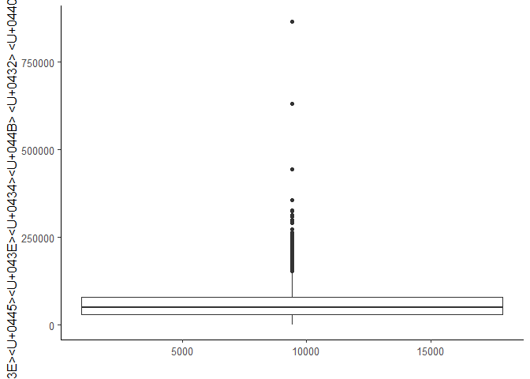
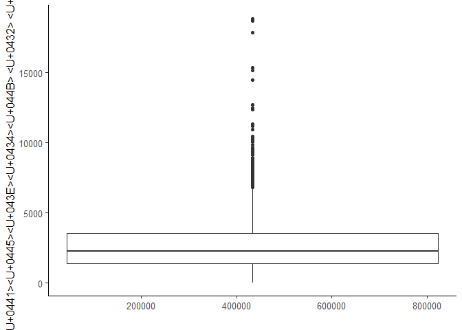
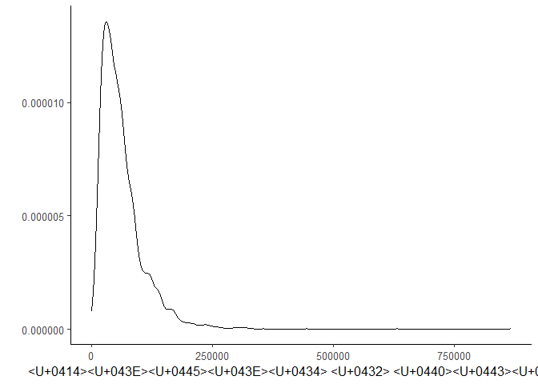
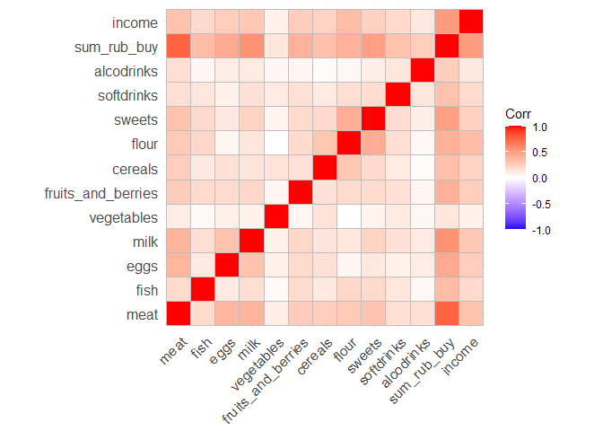
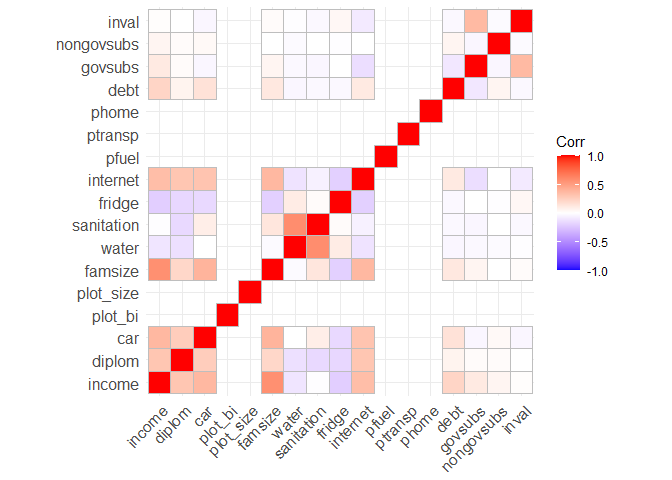
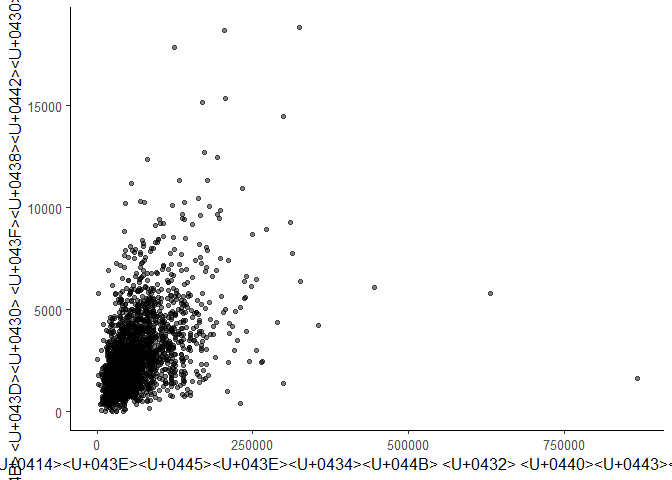

razvedanalis
================

# Подготовка к работе

## Загрузка пакетов

``` r
library(readr)
library(dplyr)
library(tidyr)
library(ggplot2)
library(GGally)
library(sandwich)
library(lmtest)
library(broom)
library(xtable)
library(ggpubr)
library(stargazer)
library(modelsummary)
library(nlWaldTest)
library(car)
library(margins)
library(Hmisc)
library(ggcorrplot)
```

### Общая тема оформления для всех графиков и отключение экспоненциальной записи чисел

``` r
theme_set(theme_classic(base_size = 12))
options(scipen = 999) 
```

# Загрузка данных

``` r
my_data <- read.csv("dataset.csv")
```

# Типы данных

``` r
glimpse(my_data)
```

    ## Rows: 2,390
    ## Columns: 29
    ## $ meat               <dbl> 0.20, 3.30, 4.50, 1.50, 1.60, 1.50, 1.60, 4.00, 1.6~
    ## $ fish               <dbl> 1.0, 0.0, 1.5, 0.0, 0.0, 0.0, 1.0, 0.0, 0.0, 0.0, 1~
    ## $ eggs               <int> 0, 20, 10, 20, 0, 0, 10, 0, 0, 50, 10, 20, 0, 20, 2~
    ## $ milk               <dbl> 0.00, 1.00, 3.00, 2.00, 2.50, 7.00, 2.40, 5.00, 2.0~
    ## $ vegetables         <dbl> 5.0, 1.5, 1.0, 12.5, 0.0, 0.0, 0.0, 0.0, 0.0, 0.0, ~
    ## $ fruits_and_berries <dbl> 1.0, 0.3, 0.0, 1.5, 0.0, 0.0, 0.0, 1.0, 0.0, 1.5, 0~
    ## $ cereals            <dbl> 0.0, 1.0, 1.0, 0.0, 1.0, 0.0, 0.0, 3.0, 1.0, 0.0, 1~
    ## $ flour              <dbl> 1.30, 1.50, 1.40, 1.20, 3.50, 8.80, 4.20, 6.40, 3.2~
    ## $ sweets             <dbl> 0.0, 1.2, 2.0, 2.0, 1.5, 7.0, 1.0, 2.0, 1.0, 4.0, 0~
    ## $ softdrinks         <dbl> 0.00, 0.00, 0.00, 0.00, 0.15, 0.00, 0.00, 0.25, 0.0~
    ## $ alcodrinks         <dbl> 0.0, 0.0, 0.0, 0.0, 0.0, 0.0, 0.0, 0.0, 0.0, 0.0, 0~
    ## $ sum_rub_buy        <dbl> 336, 1298, 1834, 924, 1208, 2644, 1331, 3528, 844, ~
    ## $ income             <dbl> 28161, 36900, 68070, 59000, 25000, 105400, 28900, 6~
    ## $ diplom             <int> 1, 0, 1, 1, 0, 0, 0, 0, 0, 0, 0, 1, 0, 0, 0, 0, 0, ~
    ## $ car                <int> 0, 1, 1, 0, 0, 1, 0, 1, 0, 1, 0, 1, 0, 0, 0, 0, 0, ~
    ## $ plot_bi            <dbl> NA, 1, 1, 1, 1, 1, 1, 1, NA, 1, NA, NA, 1, 1, 1, NA~
    ## $ plot_size          <dbl> NA, 12.0, 10.4, 6.0, 6.0, 25.0, 2.0, 10.0, NA, 8.0,~
    ## $ famsize            <int> 1, 2, 2, 2, 1, 3, 1, 2, 1, 2, 1, 2, 2, 2, 1, 1, 2, ~
    ## $ water              <int> 1, 1, 2, 1, 1, 1, 1, 1, 1, 1, 1, 1, 2, 1, 1, 1, 2, ~
    ## $ sanitation         <int> 1, 1, 2, 1, 1, 1, 1, 1, 1, 1, 1, 1, 2, 1, 1, 1, 2, ~
    ## $ fridge             <int> 1, 2, 2, 1, 1, 1, 1, 1, 1, 1, 1, 1, 1, 1, 1, 1, 1, ~
    ## $ internet           <int> 0, 1, 0, 1, 0, 1, 0, 1, 0, 1, 0, 1, 1, 1, 0, 0, 1, ~
    ## $ pfuel              <dbl> NA, NA, NA, NA, NA, 5000, NA, 4000, NA, 3000, NA, 6~
    ## $ ptransp            <dbl> NA, 3000, NA, 1200, NA, NA, NA, NA, NA, NA, NA, 430~
    ## $ phome              <dbl> 6200.00, 10000.00, NA, 5800.00, 7000.00, 11000.00, ~
    ## $ debt               <int> 0, 0, 0, 0, 0, 500000, 100000, 0, 0, 0, 0, 0, 0, 20~
    ## $ govsubs            <dbl> 26732, 26300, 66100, 29720, 23000, 105400, 26900, 5~
    ## $ nongovsubs         <int> 0, 0, 0, 0, 0, 0, 0, 0, 0, 0, 0, 0, 0, 0, 0, 0, 0, ~
    ## $ inval              <int> 0, 0, 1, 0, 0, 0, 1, 0, 1, 0, 0, 1, 0, 0, 0, 0, 0, ~

# Описательные статистики

``` r
summary(my_data)
```

    ##       meat             fish             eggs             milk       
    ##  Min.   : 0.000   Min.   :0.0000   Min.   :  0.00   Min.   : 0.000  
    ##  1st Qu.: 1.500   1st Qu.:0.0000   1st Qu.:  0.00   1st Qu.: 1.550  
    ##  Median : 2.800   Median :0.0000   Median : 10.00   Median : 3.000  
    ##  Mean   : 3.431   Mean   :0.5064   Mean   : 10.78   Mean   : 3.738  
    ##  3rd Qu.: 4.900   3rd Qu.:1.0000   3rd Qu.: 20.00   3rd Qu.: 5.000  
    ##  Max.   :27.000   Max.   :7.0000   Max.   :100.00   Max.   :26.000  
    ##                                                                     
    ##    vegetables     fruits_and_berries    cereals            flour      
    ##  Min.   :  0.00   Min.   : 0.000     Min.   : 0.0000   Min.   : 0.00  
    ##  1st Qu.:  0.00   1st Qu.: 0.000     1st Qu.: 0.0000   1st Qu.: 1.40  
    ##  Median :  2.00   Median : 2.000     Median : 0.0000   Median : 2.70  
    ##  Mean   :  4.76   Mean   : 2.509     Mean   : 0.6427   Mean   : 4.13  
    ##  3rd Qu.:  5.50   3rd Qu.: 3.000     3rd Qu.: 1.0000   3rd Qu.: 5.00  
    ##  Max.   :352.00   Max.   :30.000     Max.   :12.0000   Max.   :56.45  
    ##                                                                       
    ##      sweets         softdrinks        alcodrinks       sum_rub_buy   
    ##  Min.   : 0.000   Min.   : 0.0000   Min.   : 0.0000   Min.   :    0  
    ##  1st Qu.: 0.500   1st Qu.: 0.0000   1st Qu.: 0.0000   1st Qu.: 1376  
    ##  Median : 1.300   Median : 0.0000   Median : 0.0000   Median : 2270  
    ##  Mean   : 1.983   Mean   : 0.6139   Mean   : 0.4633   Mean   : 2735  
    ##  3rd Qu.: 2.500   3rd Qu.: 0.3000   3rd Qu.: 0.0000   3rd Qu.: 3550  
    ##  Max.   :35.000   Max.   :30.2000   Max.   :28.0000   Max.   :18844  
    ##                                                                      
    ##      income           diplom            car            plot_bi     
    ##  Min.   :     0   Min.   :0.0000   Min.   :0.0000   Min.   :1.000  
    ##  1st Qu.: 30719   1st Qu.:0.0000   1st Qu.:0.0000   1st Qu.:1.000  
    ##  Median : 50860   Median :0.0000   Median :0.0000   Median :1.000  
    ##  Mean   : 62665   Mean   :0.4255   Mean   :0.4205   Mean   :1.004  
    ##  3rd Qu.: 80000   3rd Qu.:1.0000   3rd Qu.:1.0000   3rd Qu.:1.000  
    ##  Max.   :866000   Max.   :1.0000   Max.   :1.0000   Max.   :2.000  
    ##                                                     NA's   :1266   
    ##    plot_size          famsize           water         sanitation   
    ##  Min.   :   0.50   Min.   : 1.000   Min.   :1.000   Min.   :1.000  
    ##  1st Qu.:   5.00   1st Qu.: 1.000   1st Qu.:1.000   1st Qu.:1.000  
    ##  Median :   7.00   Median : 2.000   Median :1.000   Median :1.000  
    ##  Mean   :  13.48   Mean   : 2.572   Mean   :1.104   Mean   :1.256  
    ##  3rd Qu.:  15.00   3rd Qu.: 3.000   3rd Qu.:1.000   3rd Qu.:2.000  
    ##  Max.   :1430.00   Max.   :13.000   Max.   :2.000   Max.   :2.000  
    ##  NA's   :1271                                                      
    ##      fridge         internet          pfuel          ptransp     
    ##  Min.   :1.000   Min.   :0.0000   Min.   :  430   Min.   :    0  
    ##  1st Qu.:1.000   1st Qu.:0.0000   1st Qu.: 3000   1st Qu.:  350  
    ##  Median :1.000   Median :1.0000   Median : 4000   Median :  850  
    ##  Mean   :1.272   Mean   :0.7046   Mean   : 4796   Mean   : 1377  
    ##  3rd Qu.:2.000   3rd Qu.:1.0000   3rd Qu.: 6000   3rd Qu.: 1800  
    ##  Max.   :2.000   Max.   :1.0000   Max.   :60000   Max.   :50000  
    ##                                   NA's   :1427    NA's   :938    
    ##      phome              debt            govsubs         nongovsubs      
    ##  Min.   :  163.9   Min.   :      0   Min.   :     0   Min.   :    0.00  
    ##  1st Qu.: 2800.0   1st Qu.:      0   1st Qu.:     0   1st Qu.:    0.00  
    ##  Median : 4000.0   Median :      0   Median : 18000   Median :    0.00  
    ##  Mean   : 4576.2   Mean   :  84960   Mean   : 19887   Mean   :   87.66  
    ##  3rd Qu.: 5845.0   3rd Qu.:      0   3rd Qu.: 29608   3rd Qu.:    0.00  
    ##  Max.   :35500.0   Max.   :7380000   Max.   :106595   Max.   :50000.00  
    ##  NA's   :150                                                            
    ##      inval       
    ##  Min.   :0.0000  
    ##  1st Qu.:0.0000  
    ##  Median :0.0000  
    ##  Mean   :0.1607  
    ##  3rd Qu.:0.0000  
    ##  Max.   :1.0000  
    ## 

# Графики

## Выбросы: доходы в руб.

``` r
my_data %>% 
  ggplot(aes(y = income, x = sum_rub_buy)) + 
  geom_boxplot() +
  xlab("") + 
  ylab("Доходы в руб.")
```

<!-- -->

## Выбросы: расходы на питание в руб.

``` r
my_data %>% 
  ggplot(aes(x = income, y = sum_rub_buy)) + 
  geom_boxplot() +
  xlab("") + 
  ylab("Расходы в руб.")
```

<!-- -->

## Плотность распределения: доход в руб.

``` r
my_data %>% 
  ggplot(aes(income)) + 
  geom_density(alpha = 0.25) +
  xlab("Доход в руб.") +
  ylab("")
```

<!-- -->

## Плотность распределения: расходы на питание в руб.

``` r
my_data %>% 
  ggplot(aes(sum_rub_buy)) + 
  geom_density(alpha = 0.25) +
  xlab("Расходы в руб.") +
  ylab("")
```

<!-- -->

## Корреляция между категориями еды и доходом

``` r
correlation = my_data %>% select(1:13)
rcorr(as.matrix(correlation))
```

    ##                    meat fish eggs milk vegetables fruits_and_berries cereals
    ## meat               1.00 0.19 0.38 0.40       0.11               0.28    0.27
    ## fish               0.19 1.00 0.12 0.18       0.03               0.20    0.13
    ## eggs               0.38 0.12 1.00 0.32       0.08               0.19    0.16
    ## milk               0.40 0.18 0.32 1.00       0.07               0.23    0.15
    ## vegetables         0.11 0.03 0.08 0.07       1.00               0.05    0.16
    ## fruits_and_berries 0.28 0.20 0.19 0.23       0.05               1.00    0.16
    ## cereals            0.27 0.13 0.16 0.15       0.16               0.16    1.00
    ## flour              0.29 0.21 0.05 0.14       0.01               0.19    0.30
    ## sweets             0.31 0.20 0.13 0.24       0.06               0.19    0.20
    ## softdrinks         0.19 0.12 0.08 0.17       0.12               0.16    0.11
    ## alcodrinks         0.18 0.03 0.11 0.12       0.05               0.07    0.03
    ## sum_rub_buy        0.78 0.35 0.44 0.57       0.14               0.41    0.33
    ## income             0.29 0.18 0.23 0.27       0.07               0.24    0.20
    ##                    flour sweets softdrinks alcodrinks sum_rub_buy income
    ## meat                0.29   0.31       0.19       0.18        0.78   0.29
    ## fish                0.21   0.20       0.12       0.03        0.35   0.18
    ## eggs                0.05   0.13       0.08       0.11        0.44   0.23
    ## milk                0.14   0.24       0.17       0.12        0.57   0.27
    ## vegetables          0.01   0.06       0.12       0.05        0.14   0.07
    ## fruits_and_berries  0.19   0.19       0.16       0.07        0.41   0.24
    ## cereals             0.30   0.20       0.11       0.03        0.33   0.20
    ## flour               1.00   0.42       0.18       0.05        0.40   0.30
    ## sweets              0.42   1.00       0.19       0.10        0.49   0.21
    ## softdrinks          0.18   0.19       1.00       0.16        0.35   0.20
    ## alcodrinks          0.05   0.10       0.16       1.00        0.28   0.13
    ## sum_rub_buy         0.40   0.49       0.35       0.28        1.00   0.48
    ## income              0.30   0.21       0.20       0.13        0.48   1.00
    ## 
    ## n= 2390 
    ## 
    ## 
    ## P
    ##                    meat   fish   eggs   milk   vegetables fruits_and_berries
    ## meat                      0.0000 0.0000 0.0000 0.0000     0.0000            
    ## fish               0.0000        0.0000 0.0000 0.1432     0.0000            
    ## eggs               0.0000 0.0000        0.0000 0.0000     0.0000            
    ## milk               0.0000 0.0000 0.0000        0.0003     0.0000            
    ## vegetables         0.0000 0.1432 0.0000 0.0003            0.0103            
    ## fruits_and_berries 0.0000 0.0000 0.0000 0.0000 0.0103                       
    ## cereals            0.0000 0.0000 0.0000 0.0000 0.0000     0.0000            
    ## flour              0.0000 0.0000 0.0110 0.0000 0.6882     0.0000            
    ## sweets             0.0000 0.0000 0.0000 0.0000 0.0024     0.0000            
    ## softdrinks         0.0000 0.0000 0.0000 0.0000 0.0000     0.0000            
    ## alcodrinks         0.0000 0.0954 0.0000 0.0000 0.0195     0.0005            
    ## sum_rub_buy        0.0000 0.0000 0.0000 0.0000 0.0000     0.0000            
    ## income             0.0000 0.0000 0.0000 0.0000 0.0007     0.0000            
    ##                    cereals flour  sweets softdrinks alcodrinks sum_rub_buy
    ## meat               0.0000  0.0000 0.0000 0.0000     0.0000     0.0000     
    ## fish               0.0000  0.0000 0.0000 0.0000     0.0954     0.0000     
    ## eggs               0.0000  0.0110 0.0000 0.0000     0.0000     0.0000     
    ## milk               0.0000  0.0000 0.0000 0.0000     0.0000     0.0000     
    ## vegetables         0.0000  0.6882 0.0024 0.0000     0.0195     0.0000     
    ## fruits_and_berries 0.0000  0.0000 0.0000 0.0000     0.0005     0.0000     
    ## cereals                    0.0000 0.0000 0.0000     0.1382     0.0000     
    ## flour              0.0000         0.0000 0.0000     0.0235     0.0000     
    ## sweets             0.0000  0.0000        0.0000     0.0000     0.0000     
    ## softdrinks         0.0000  0.0000 0.0000            0.0000     0.0000     
    ## alcodrinks         0.1382  0.0235 0.0000 0.0000                0.0000     
    ## sum_rub_buy        0.0000  0.0000 0.0000 0.0000     0.0000                
    ## income             0.0000  0.0000 0.0000 0.0000     0.0000     0.0000     
    ##                    income
    ## meat               0.0000
    ## fish               0.0000
    ## eggs               0.0000
    ## milk               0.0000
    ## vegetables         0.0007
    ## fruits_and_berries 0.0000
    ## cereals            0.0000
    ## flour              0.0000
    ## sweets             0.0000
    ## softdrinks         0.0000
    ## alcodrinks         0.0000
    ## sum_rub_buy        0.0000
    ## income

## Корреляция между независимыми переменными

``` r
correlation1 = my_data %>% select(13:29)
rcorr(as.matrix(correlation1))
```

    ##            income diplom   car plot_bi plot_size famsize water sanitation
    ## income       1.00   0.30  0.37   -0.02      0.02    0.57 -0.11      -0.01
    ## diplom       0.30   1.00  0.26   -0.03     -0.05    0.21 -0.13      -0.16
    ## car          0.37   0.26  1.00    0.04      0.02    0.39  0.00       0.09
    ## plot_bi     -0.02  -0.03  0.04    1.00      -Inf   -0.03 -0.03      -0.01
    ## plot_size    0.02  -0.05  0.02    -Inf      1.00    0.05  0.08       0.09
    ## famsize      0.57   0.21  0.39   -0.03      0.05    1.00 -0.02       0.13
    ## water       -0.11  -0.13  0.00   -0.03      0.08   -0.02  1.00       0.58
    ## sanitation  -0.01  -0.16  0.09   -0.01      0.09    0.13  0.58       1.00
    ## fridge      -0.21  -0.17 -0.16    0.09      0.05   -0.20  0.10       0.02
    ## internet     0.34   0.30  0.31   -0.02      0.02    0.37 -0.12      -0.06
    ## pfuel        0.42   0.12  0.05   -0.05      0.00    0.22 -0.08      -0.09
    ## ptransp      0.21   0.12  0.04   -0.05     -0.03    0.14 -0.04      -0.04
    ## phome        0.28   0.16  0.09    0.02     -0.03    0.21 -0.28      -0.35
    ## debt         0.22   0.06  0.15   -0.01     -0.02    0.12 -0.04      -0.03
    ## govsubs      0.11   0.02 -0.04    0.01     -0.04    0.05 -0.03      -0.04
    ## nongovsubs   0.05   0.02  0.03    0.00      0.01    0.00 -0.02       0.00
    ## inval        0.01   0.00 -0.04    0.04     -0.02    0.02 -0.01      -0.03
    ##            fridge internet pfuel ptransp phome  debt govsubs nongovsubs inval
    ## income      -0.21     0.34  0.42    0.21  0.28  0.22    0.11       0.05  0.01
    ## diplom      -0.17     0.30  0.12    0.12  0.16  0.06    0.02       0.02  0.00
    ## car         -0.16     0.31  0.05    0.04  0.09  0.15   -0.04       0.03 -0.04
    ## plot_bi      0.09    -0.02 -0.05   -0.05  0.02 -0.01    0.01       0.00  0.04
    ## plot_size    0.05     0.02  0.00   -0.03 -0.03 -0.02   -0.04       0.01 -0.02
    ## famsize     -0.20     0.37  0.22    0.14  0.21  0.12    0.05       0.00  0.02
    ## water        0.10    -0.12 -0.08   -0.04 -0.28 -0.04   -0.03      -0.02 -0.01
    ## sanitation   0.02    -0.06 -0.09   -0.04 -0.35 -0.03   -0.04       0.00 -0.03
    ## fridge       1.00    -0.20 -0.12   -0.06 -0.11 -0.03    0.00      -0.01  0.04
    ## internet    -0.20     1.00  0.14    0.15  0.18  0.11   -0.14       0.00 -0.09
    ## pfuel       -0.12     0.14  1.00    0.04  0.23  0.25   -0.08       0.13  0.01
    ## ptransp     -0.06     0.15  0.04    1.00  0.15  0.05   -0.08      -0.01 -0.03
    ## phome       -0.11     0.18  0.23    0.15  1.00  0.06   -0.05       0.02 -0.03
    ## debt        -0.03     0.11  0.25    0.05  0.06  1.00   -0.10       0.05 -0.03
    ## govsubs      0.00    -0.14 -0.08   -0.08 -0.05 -0.10    1.00      -0.04  0.36
    ## nongovsubs  -0.01     0.00  0.13   -0.01  0.02  0.05   -0.04       1.00 -0.02
    ## inval        0.04    -0.09  0.01   -0.03 -0.03 -0.03    0.36      -0.02  1.00
    ## 
    ## n
    ##            income diplom  car plot_bi plot_size famsize water sanitation fridge
    ## income       2390   2390 2390    1124      1119    2390  2390       2390   2390
    ## diplom       2390   2390 2390    1124      1119    2390  2390       2390   2390
    ## car          2390   2390 2390    1124      1119    2390  2390       2390   2390
    ## plot_bi      1124   1124 1124    1124      1119    1124  1124       1124   1124
    ## plot_size    1119   1119 1119    1119      1119    1119  1119       1119   1119
    ## famsize      2390   2390 2390    1124      1119    2390  2390       2390   2390
    ## water        2390   2390 2390    1124      1119    2390  2390       2390   2390
    ## sanitation   2390   2390 2390    1124      1119    2390  2390       2390   2390
    ## fridge       2390   2390 2390    1124      1119    2390  2390       2390   2390
    ## internet     2390   2390 2390    1124      1119    2390  2390       2390   2390
    ## pfuel         963    963  963     575       572     963   963        963    963
    ## ptransp      1452   1452 1452     611       608    1452  1452       1452   1452
    ## phome        2240   2240 2240    1024      1019    2240  2240       2240   2240
    ## debt         2390   2390 2390    1124      1119    2390  2390       2390   2390
    ## govsubs      2390   2390 2390    1124      1119    2390  2390       2390   2390
    ## nongovsubs   2390   2390 2390    1124      1119    2390  2390       2390   2390
    ## inval        2390   2390 2390    1124      1119    2390  2390       2390   2390
    ##            internet pfuel ptransp phome debt govsubs nongovsubs inval
    ## income         2390   963    1452  2240 2390    2390       2390  2390
    ## diplom         2390   963    1452  2240 2390    2390       2390  2390
    ## car            2390   963    1452  2240 2390    2390       2390  2390
    ## plot_bi        1124   575     611  1024 1124    1124       1124  1124
    ## plot_size      1119   572     608  1019 1119    1119       1119  1119
    ## famsize        2390   963    1452  2240 2390    2390       2390  2390
    ## water          2390   963    1452  2240 2390    2390       2390  2390
    ## sanitation     2390   963    1452  2240 2390    2390       2390  2390
    ## fridge         2390   963    1452  2240 2390    2390       2390  2390
    ## internet       2390   963    1452  2240 2390    2390       2390  2390
    ## pfuel           963   963     446   915  963     963        963   963
    ## ptransp        1452   446    1452  1376 1452    1452       1452  1452
    ## phome          2240   915    1376  2240 2240    2240       2240  2240
    ## debt           2390   963    1452  2240 2390    2390       2390  2390
    ## govsubs        2390   963    1452  2240 2390    2390       2390  2390
    ## nongovsubs     2390   963    1452  2240 2390    2390       2390  2390
    ## inval          2390   963    1452  2240 2390    2390       2390  2390
    ## 
    ## P
    ##            income diplom car    plot_bi plot_size famsize water  sanitation
    ## income            0.0000 0.0000 0.4091  0.5995    0.0000  0.0000 0.4877    
    ## diplom     0.0000        0.0000 0.3407  0.1268    0.0000  0.0000 0.0000    
    ## car        0.0000 0.0000        0.2262  0.4401    0.0000  0.8158 0.0000    
    ## plot_bi    0.4091 0.3407 0.2262         0.0000    0.2673  0.2613 0.6950    
    ## plot_size  0.5995 0.1268 0.4401 0.0000            0.0877  0.0057 0.0041    
    ## famsize    0.0000 0.0000 0.0000 0.2673  0.0877            0.3819 0.0000    
    ## water      0.0000 0.0000 0.8158 0.2613  0.0057    0.3819         0.0000    
    ## sanitation 0.4877 0.0000 0.0000 0.6950  0.0041    0.0000  0.0000           
    ## fridge     0.0000 0.0000 0.0000 0.0042  0.1092    0.0000  0.0000 0.2461    
    ## internet   0.0000 0.0000 0.0000 0.5205  0.5225    0.0000  0.0000 0.0030    
    ## pfuel      0.0000 0.0003 0.1088 0.2065  0.9089    0.0000  0.0126 0.0049    
    ## ptransp    0.0000 0.0000 0.1485 0.2198  0.4732    0.0000  0.1238 0.1611    
    ## phome      0.0000 0.0000 0.0000 0.4940  0.3522    0.0000  0.0000 0.0000    
    ## debt       0.0000 0.0027 0.0000 0.6220  0.5486    0.0000  0.0424 0.2160    
    ## govsubs    0.0000 0.3437 0.0498 0.8500  0.1975    0.0178  0.1581 0.0523    
    ## nongovsubs 0.0226 0.2301 0.1850 0.9228  0.7327    0.9959  0.3382 0.9329    
    ## inval      0.6374 0.8571 0.0631 0.1935  0.5051    0.3457  0.7361 0.1810    
    ##            fridge internet pfuel  ptransp phome  debt   govsubs nongovsubs
    ## income     0.0000 0.0000   0.0000 0.0000  0.0000 0.0000 0.0000  0.0226    
    ## diplom     0.0000 0.0000   0.0003 0.0000  0.0000 0.0027 0.3437  0.2301    
    ## car        0.0000 0.0000   0.1088 0.1485  0.0000 0.0000 0.0498  0.1850    
    ## plot_bi    0.0042 0.5205   0.2065 0.2198  0.4940 0.6220 0.8500  0.9228    
    ## plot_size  0.1092 0.5225   0.9089 0.4732  0.3522 0.5486 0.1975  0.7327    
    ## famsize    0.0000 0.0000   0.0000 0.0000  0.0000 0.0000 0.0178  0.9959    
    ## water      0.0000 0.0000   0.0126 0.1238  0.0000 0.0424 0.1581  0.3382    
    ## sanitation 0.2461 0.0030   0.0049 0.1611  0.0000 0.2160 0.0523  0.9329    
    ## fridge            0.0000   0.0002 0.0167  0.0000 0.1483 0.9425  0.6278    
    ## internet   0.0000          0.0000 0.0000  0.0000 0.0000 0.0000  0.8902    
    ## pfuel      0.0002 0.0000          0.4084  0.0000 0.0000 0.0117  0.0000    
    ## ptransp    0.0167 0.0000   0.4084         0.0000 0.0524 0.0028  0.6139    
    ## phome      0.0000 0.0000   0.0000 0.0000         0.0034 0.0198  0.3193    
    ## debt       0.1483 0.0000   0.0000 0.0524  0.0034        0.0000  0.0240    
    ## govsubs    0.9425 0.0000   0.0117 0.0028  0.0198 0.0000         0.0780    
    ## nongovsubs 0.6278 0.8902   0.0000 0.6139  0.3193 0.0240 0.0780            
    ## inval      0.0716 0.0000   0.8402 0.1953  0.2213 0.1806 0.0000  0.4453    
    ##            inval 
    ## income     0.6374
    ## diplom     0.8571
    ## car        0.0631
    ## plot_bi    0.1935
    ## plot_size  0.5051
    ## famsize    0.3457
    ## water      0.7361
    ## sanitation 0.1810
    ## fridge     0.0716
    ## internet   0.0000
    ## pfuel      0.8402
    ## ptransp    0.1953
    ## phome      0.2213
    ## debt       0.1806
    ## govsubs    0.0000
    ## nongovsubs 0.4453
    ## inval

### График корреляции между категориями еды и доходом

``` r
ggcorrplot(cor(correlation))
```

<!-- --> \#\#\# График
корреляции между независимыми переменными

``` r
ggcorrplot(cor(correlation1))
```

<!-- -->

## Совместное распределение дохода в руб. и расходы на питание в руб.

``` r
my_data %>% 
  ggplot(aes(x = income, y = sum_rub_buy)) +
  geom_jitter(width = 0.25, alpha = 0.5) +  
  scale_y_continuous(name = "Расходы на питание в руб.") +
  scale_x_continuous(name = "Доходы в руб.")
```

<!-- -->
