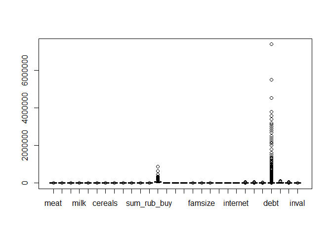

razvedanalis
================

# Подготовка к работе

## Загрузка пакетов

``` r
library(readr)
library(dplyr)
library(tidyr)
library(ggplot2)
library(GGally)
library(sandwich)
library(lmtest)
library(broom)
library(xtable)
library(ggpubr)
library(stargazer)
library(modelsummary)
library(nlWaldTest)
library(car)
library(margins)
library(Hmisc)
library(ggcorrplot)
library(ggstatsplot)
```

### Общая тема оформления для всех графиков и отключение экспоненциальной записи чисел

``` r
theme_set(theme_classic(base_size = 12))
options(scipen = 999) 
```

# Загрузка данных

``` r
my_data <- read.csv("dataset.csv")
```

# Избавляем от пустых значений и убираем выбросы

``` r
data <- replace(my_data,is.na(my_data),0) 

boxplot(data) # Checking outliers
```

<!-- -->

``` r
# Removing outliers from income
x <- data[data$'income' > quantile(data$'income', 0.005) & data$'income' < quantile(data$'income', 0.995),]
```

# Типы данных

``` r
glimpse(x)
```

    ## Rows: 2,365
    ## Columns: 29
    ## $ meat               <dbl> 0.20, 3.30, 4.50, 1.50, 1.60, 1.50, 1.60, 4.00, 1.6~
    ## $ fish               <dbl> 1.0, 0.0, 1.5, 0.0, 0.0, 0.0, 1.0, 0.0, 0.0, 0.0, 1~
    ## $ eggs               <dbl> 0, 20, 10, 20, 0, 0, 10, 0, 0, 50, 10, 20, 0, 20, 2~
    ## $ milk               <dbl> 0.00, 1.00, 3.00, 2.00, 2.50, 7.00, 2.40, 5.00, 2.0~
    ## $ vegetables         <dbl> 5.0, 1.5, 1.0, 12.5, 0.0, 0.0, 0.0, 0.0, 0.0, 0.0, ~
    ## $ fruits_and_berries <dbl> 1.0, 0.3, 0.0, 1.5, 0.0, 0.0, 0.0, 1.0, 0.0, 1.5, 0~
    ## $ cereals            <dbl> 0.0, 1.0, 1.0, 0.0, 1.0, 0.0, 0.0, 3.0, 1.0, 0.0, 1~
    ## $ flour              <dbl> 1.30, 1.50, 1.40, 1.20, 3.50, 8.80, 4.20, 6.40, 3.2~
    ## $ sweets             <dbl> 0.0, 1.2, 2.0, 2.0, 1.5, 7.0, 1.0, 2.0, 1.0, 4.0, 0~
    ## $ softdrinks         <dbl> 0.00, 0.00, 0.00, 0.00, 0.15, 0.00, 0.00, 0.25, 0.0~
    ## $ alcodrinks         <dbl> 0.0, 0.0, 0.0, 0.0, 0.0, 0.0, 0.0, 0.0, 0.0, 0.0, 0~
    ## $ sum_rub_buy        <dbl> 336, 1298, 1834, 924, 1208, 2644, 1331, 3528, 844, ~
    ## $ income             <dbl> 28161, 36900, 68070, 59000, 25000, 105400, 28900, 6~
    ## $ diplom             <int> 1, 0, 1, 1, 0, 0, 0, 0, 0, 0, 0, 1, 0, 0, 0, 0, 0, ~
    ## $ car                <int> 0, 1, 1, 0, 0, 1, 0, 1, 0, 1, 0, 1, 0, 0, 0, 0, 0, ~
    ## $ plot_bi            <int> 0, 1, 1, 1, 1, 1, 1, 1, 0, 1, 0, 0, 1, 1, 1, 0, 1, ~
    ## $ plot_size          <dbl> 0.0, 12.0, 10.4, 6.0, 6.0, 25.0, 2.0, 10.0, 0.0, 8.~
    ## $ famsize            <int> 1, 2, 2, 2, 1, 3, 1, 2, 1, 2, 1, 2, 2, 2, 1, 1, 2, ~
    ## $ water              <int> 1, 1, 0, 1, 1, 1, 1, 1, 1, 1, 1, 1, 0, 1, 1, 1, 0, ~
    ## $ sanitation         <int> 1, 1, 0, 1, 1, 1, 1, 1, 1, 1, 1, 1, 0, 1, 1, 1, 0, ~
    ## $ fridge             <int> 1, 0, 0, 1, 1, 1, 1, 1, 1, 1, 1, 1, 1, 1, 1, 1, 1, ~
    ## $ internet           <int> 0, 1, 0, 1, 0, 1, 0, 1, 0, 1, 0, 1, 1, 1, 0, 0, 1, ~
    ## $ pfuel              <dbl> 0, 0, 0, 0, 0, 5000, 0, 4000, 0, 3000, 0, 6000, 0, ~
    ## $ ptransp            <dbl> 0, 3000, 0, 1200, 0, 0, 0, 0, 0, 0, 0, 430, 410, 90~
    ## $ phome              <dbl> 6200.00, 10000.00, 0.00, 5800.00, 7000.00, 11000.00~
    ## $ debt               <int> 0, 0, 0, 0, 0, 500000, 100000, 0, 0, 0, 0, 0, 0, 20~
    ## $ govsubs            <dbl> 26732, 26300, 66100, 29720, 23000, 105400, 26900, 5~
    ## $ nongovsubs         <int> 0, 0, 0, 0, 0, 0, 0, 0, 0, 0, 0, 0, 0, 0, 0, 0, 0, ~
    ## $ inval              <int> 0, 0, 1, 0, 0, 0, 1, 0, 1, 0, 0, 1, 0, 0, 0, 0, 0, ~

# Описательные статистики

``` r
summary(x)
```

    ##       meat             fish             eggs             milk       
    ##  Min.   : 0.000   Min.   :0.0000   Min.   :  0.00   Min.   : 0.000  
    ##  1st Qu.: 1.500   1st Qu.:0.0000   1st Qu.:  0.00   1st Qu.: 1.550  
    ##  Median : 2.800   Median :0.0000   Median : 10.00   Median : 3.000  
    ##  Mean   : 3.419   Mean   :0.5067   Mean   : 10.78   Mean   : 3.731  
    ##  3rd Qu.: 4.860   3rd Qu.:1.0000   3rd Qu.: 20.00   3rd Qu.: 5.000  
    ##  Max.   :27.000   Max.   :7.0000   Max.   :100.00   Max.   :26.000  
    ##    vegetables      fruits_and_berries    cereals            flour       
    ##  Min.   :  0.000   Min.   : 0.000     Min.   : 0.0000   Min.   : 0.000  
    ##  1st Qu.:  0.000   1st Qu.: 0.000     1st Qu.: 0.0000   1st Qu.: 1.400  
    ##  Median :  2.000   Median : 1.900     Median : 0.0000   Median : 2.700  
    ##  Mean   :  4.754   Mean   : 2.494     Mean   : 0.6408   Mean   : 4.128  
    ##  3rd Qu.:  5.500   3rd Qu.: 3.000     3rd Qu.: 1.0000   3rd Qu.: 5.000  
    ##  Max.   :352.000   Max.   :30.000     Max.   :12.0000   Max.   :56.450  
    ##      sweets         softdrinks        alcodrinks       sum_rub_buy   
    ##  Min.   : 0.000   Min.   : 0.0000   Min.   : 0.0000   Min.   :    0  
    ##  1st Qu.: 0.500   1st Qu.: 0.0000   1st Qu.: 0.0000   1st Qu.: 1380  
    ##  Median : 1.300   Median : 0.0000   Median : 0.0000   Median : 2270  
    ##  Mean   : 1.983   Mean   : 0.5989   Mean   : 0.4514   Mean   : 2717  
    ##  3rd Qu.: 2.500   3rd Qu.: 0.2900   3rd Qu.: 0.0000   3rd Qu.: 3539  
    ##  Max.   :35.000   Max.   :25.0500   Max.   :28.0000   Max.   :18671  
    ##      income           diplom            car            plot_bi      
    ##  Min.   :  8300   Min.   :0.0000   Min.   :0.0000   Min.   :0.0000  
    ##  1st Qu.: 31000   1st Qu.:0.0000   1st Qu.:0.0000   1st Qu.:0.0000  
    ##  Median : 50900   Median :0.0000   Median :0.0000   Median :0.0000  
    ##  Mean   : 61297   Mean   :0.4262   Mean   :0.4199   Mean   :0.4672  
    ##  3rd Qu.: 80000   3rd Qu.:1.0000   3rd Qu.:1.0000   3rd Qu.:1.0000  
    ##  Max.   :265000   Max.   :1.0000   Max.   :1.0000   Max.   :1.0000  
    ##    plot_size           famsize          water         sanitation    
    ##  Min.   :   0.000   Min.   : 1.00   Min.   :0.000   Min.   :0.0000  
    ##  1st Qu.:   0.000   1st Qu.: 1.00   1st Qu.:1.000   1st Qu.:0.0000  
    ##  Median :   0.000   Median : 2.00   Median :1.000   Median :1.0000  
    ##  Mean   :   6.297   Mean   : 2.57   Mean   :0.896   Mean   :0.7429  
    ##  3rd Qu.:   6.250   3rd Qu.: 3.00   3rd Qu.:1.000   3rd Qu.:1.0000  
    ##  Max.   :1430.000   Max.   :13.00   Max.   :1.000   Max.   :1.0000  
    ##      fridge          internet         pfuel          ptransp       
    ##  Min.   :0.0000   Min.   :0.000   Min.   :    0   Min.   :    0.0  
    ##  1st Qu.:0.0000   1st Qu.:0.000   1st Qu.:    0   1st Qu.:    0.0  
    ##  Median :1.0000   Median :1.000   Median :    0   Median :  280.0  
    ##  Mean   :0.7285   Mean   :0.704   Mean   : 1880   Mean   :  833.4  
    ##  3rd Qu.:1.0000   3rd Qu.:1.000   3rd Qu.: 3000   3rd Qu.: 1000.0  
    ##  Max.   :1.0000   Max.   :1.000   Max.   :41000   Max.   :50000.0  
    ##      phome            debt            govsubs         nongovsubs      
    ##  Min.   :    0   Min.   :      0   Min.   :     0   Min.   :    0.00  
    ##  1st Qu.: 2389   1st Qu.:      0   1st Qu.:     0   1st Qu.:    0.00  
    ##  Median : 3918   Median :      0   Median : 18000   Median :    0.00  
    ##  Mean   : 4285   Mean   :  82622   Mean   : 19913   Mean   :   88.59  
    ##  3rd Qu.: 5600   3rd Qu.:      0   3rd Qu.: 29610   3rd Qu.:    0.00  
    ##  Max.   :35500   Max.   :7380000   Max.   :106595   Max.   :50000.00  
    ##      inval       
    ##  Min.   :0.0000  
    ##  1st Qu.:0.0000  
    ##  Median :0.0000  
    ##  Mean   :0.1611  
    ##  3rd Qu.:0.0000  
    ##  Max.   :1.0000

# Графики

## Плотность распределения: доход в руб.

``` r
x %>% 
  ggplot(aes(income)) + 
  geom_density(alpha = 0.25) +
  xlab("Доход в руб.") +
  ylab("")
```

<!-- -->

## Плотность распределения: расходы на питание в руб.

``` r
x %>% 
  ggplot(aes(sum_rub_buy)) + 
  geom_density(alpha = 0.25) +
  xlab("Расходы в руб.") +
  ylab("")
```

<!-- -->

## Корреляция между категориями еды и доходом

``` r
correlation = x %>% select(1:13)
rcorr(as.matrix(correlation))
```

    ##                    meat fish eggs milk vegetables fruits_and_berries cereals
    ## meat               1.00 0.19 0.38 0.39       0.10               0.27    0.26
    ## fish               0.19 1.00 0.11 0.17       0.03               0.19    0.12
    ## eggs               0.38 0.11 1.00 0.31       0.08               0.19    0.16
    ## milk               0.39 0.17 0.31 1.00       0.07               0.21    0.14
    ## vegetables         0.10 0.03 0.08 0.07       1.00               0.05    0.15
    ## fruits_and_berries 0.27 0.19 0.19 0.21       0.05               1.00    0.16
    ## cereals            0.26 0.12 0.16 0.14       0.15               0.16    1.00
    ## flour              0.28 0.21 0.05 0.13       0.00               0.19    0.30
    ## sweets             0.31 0.20 0.12 0.23       0.06               0.19    0.20
    ## softdrinks         0.17 0.13 0.07 0.16       0.11               0.16    0.11
    ## alcodrinks         0.17 0.04 0.10 0.11       0.04               0.05    0.02
    ## sum_rub_buy        0.77 0.35 0.44 0.56       0.13               0.40    0.33
    ## income             0.31 0.20 0.26 0.29       0.07               0.26    0.23
    ##                    flour sweets softdrinks alcodrinks sum_rub_buy income
    ## meat                0.28   0.31       0.17       0.17        0.77   0.31
    ## fish                0.21   0.20       0.13       0.04        0.35   0.20
    ## eggs                0.05   0.12       0.07       0.10        0.44   0.26
    ## milk                0.13   0.23       0.16       0.11        0.56   0.29
    ## vegetables          0.00   0.06       0.11       0.04        0.13   0.07
    ## fruits_and_berries  0.19   0.19       0.16       0.05        0.40   0.26
    ## cereals             0.30   0.20       0.11       0.02        0.33   0.23
    ## flour               1.00   0.42       0.17       0.04        0.40   0.35
    ## sweets              0.42   1.00       0.18       0.09        0.49   0.24
    ## softdrinks          0.17   0.18       1.00       0.13        0.31   0.19
    ## alcodrinks          0.04   0.09       0.13       1.00        0.26   0.12
    ## sum_rub_buy         0.40   0.49       0.31       0.26        1.00   0.51
    ## income              0.35   0.24       0.19       0.12        0.51   1.00
    ## 
    ## n= 2365 
    ## 
    ## 
    ## P
    ##                    meat   fish   eggs   milk   vegetables fruits_and_berries
    ## meat                      0.0000 0.0000 0.0000 0.0000     0.0000            
    ## fish               0.0000        0.0000 0.0000 0.1684     0.0000            
    ## eggs               0.0000 0.0000        0.0000 0.0002     0.0000            
    ## milk               0.0000 0.0000 0.0000        0.0010     0.0000            
    ## vegetables         0.0000 0.1684 0.0002 0.0010            0.0195            
    ## fruits_and_berries 0.0000 0.0000 0.0000 0.0000 0.0195                       
    ## cereals            0.0000 0.0000 0.0000 0.0000 0.0000     0.0000            
    ## flour              0.0000 0.0000 0.0203 0.0000 0.8686     0.0000            
    ## sweets             0.0000 0.0000 0.0000 0.0000 0.0043     0.0000            
    ## softdrinks         0.0000 0.0000 0.0006 0.0000 0.0000     0.0000            
    ## alcodrinks         0.0000 0.0733 0.0000 0.0000 0.0583     0.0095            
    ## sum_rub_buy        0.0000 0.0000 0.0000 0.0000 0.0000     0.0000            
    ## income             0.0000 0.0000 0.0000 0.0000 0.0004     0.0000            
    ##                    cereals flour  sweets softdrinks alcodrinks sum_rub_buy
    ## meat               0.0000  0.0000 0.0000 0.0000     0.0000     0.0000     
    ## fish               0.0000  0.0000 0.0000 0.0000     0.0733     0.0000     
    ## eggs               0.0000  0.0203 0.0000 0.0006     0.0000     0.0000     
    ## milk               0.0000  0.0000 0.0000 0.0000     0.0000     0.0000     
    ## vegetables         0.0000  0.8686 0.0043 0.0000     0.0583     0.0000     
    ## fruits_and_berries 0.0000  0.0000 0.0000 0.0000     0.0095     0.0000     
    ## cereals                    0.0000 0.0000 0.0000     0.3126     0.0000     
    ## flour              0.0000         0.0000 0.0000     0.0800     0.0000     
    ## sweets             0.0000  0.0000        0.0000     0.0000     0.0000     
    ## softdrinks         0.0000  0.0000 0.0000            0.0000     0.0000     
    ## alcodrinks         0.3126  0.0800 0.0000 0.0000                0.0000     
    ## sum_rub_buy        0.0000  0.0000 0.0000 0.0000     0.0000                
    ## income             0.0000  0.0000 0.0000 0.0000     0.0000     0.0000     
    ##                    income
    ## meat               0.0000
    ## fish               0.0000
    ## eggs               0.0000
    ## milk               0.0000
    ## vegetables         0.0004
    ## fruits_and_berries 0.0000
    ## cereals            0.0000
    ## flour              0.0000
    ## sweets             0.0000
    ## softdrinks         0.0000
    ## alcodrinks         0.0000
    ## sum_rub_buy        0.0000
    ## income

## Корреляция между независимыми переменными

``` r
correlation1 = data %>% select(13:29)
rcorr(as.matrix(correlation1))
```

    ##            income diplom   car plot_bi plot_size famsize water sanitation
    ## income       1.00   0.30  0.37    0.11      0.04    0.57  0.11       0.01
    ## diplom       0.30   1.00  0.26   -0.03     -0.04    0.21  0.13       0.16
    ## car          0.37   0.26  1.00    0.21      0.06    0.39  0.00      -0.09
    ## plot_bi      0.11  -0.03  0.21    1.00      0.22    0.18 -0.30      -0.50
    ## plot_size    0.04  -0.04  0.06    0.22      1.00    0.08 -0.14      -0.17
    ## famsize      0.57   0.21  0.39    0.18      0.08    1.00  0.02      -0.13
    ## water        0.11   0.13  0.00   -0.30     -0.14    0.02  1.00       0.58
    ## sanitation   0.01   0.16 -0.09   -0.50     -0.17   -0.13  0.58       1.00
    ## fridge       0.21   0.17  0.16    0.06     -0.02    0.20  0.10       0.02
    ## internet     0.34   0.30  0.31    0.05      0.02    0.37  0.12       0.06
    ## pfuel        0.50   0.24  0.65    0.12      0.04    0.39  0.03      -0.02
    ## ptransp      0.18   0.10 -0.06   -0.05     -0.02    0.11  0.07       0.10
    ## phome        0.22   0.16  0.10   -0.18     -0.07    0.14  0.25       0.37
    ## debt         0.22   0.06  0.15    0.02     -0.01    0.12  0.04       0.03
    ## govsubs      0.11   0.02 -0.04    0.12      0.00    0.05  0.03       0.04
    ## nongovsubs   0.05   0.02  0.03   -0.01      0.00    0.00  0.02       0.00
    ## inval        0.01   0.00 -0.04    0.04      0.00    0.02  0.01       0.03
    ##            fridge internet pfuel ptransp phome  debt govsubs nongovsubs inval
    ## income       0.21     0.34  0.50    0.18  0.22  0.22    0.11       0.05  0.01
    ## diplom       0.17     0.30  0.24    0.10  0.16  0.06    0.02       0.02  0.00
    ## car          0.16     0.31  0.65   -0.06  0.10  0.15   -0.04       0.03 -0.04
    ## plot_bi      0.06     0.05  0.12   -0.05 -0.18  0.02    0.12      -0.01  0.04
    ## plot_size   -0.02     0.02  0.04   -0.02 -0.07 -0.01    0.00       0.00  0.00
    ## famsize      0.20     0.37  0.39    0.11  0.14  0.12    0.05       0.00  0.02
    ## water        0.10     0.12  0.03    0.07  0.25  0.04    0.03       0.02  0.01
    ## sanitation   0.02     0.06 -0.02    0.10  0.37  0.03    0.04       0.00  0.03
    ## fridge       1.00     0.20  0.15    0.06  0.09  0.03    0.00       0.01 -0.04
    ## internet     0.20     1.00  0.27    0.14  0.14  0.11   -0.14       0.00 -0.09
    ## pfuel        0.15     0.27  1.00    0.00  0.16  0.26   -0.08       0.10 -0.02
    ## ptransp      0.06     0.14  0.00    1.00  0.16  0.04   -0.07       0.00 -0.02
    ## phome        0.09     0.14  0.16    0.16  1.00  0.08   -0.01       0.01 -0.02
    ## debt         0.03     0.11  0.26    0.04  0.08  1.00   -0.10       0.05 -0.03
    ## govsubs      0.00    -0.14 -0.08   -0.07 -0.01 -0.10    1.00      -0.04  0.36
    ## nongovsubs   0.01     0.00  0.10    0.00  0.01  0.05   -0.04       1.00 -0.02
    ## inval       -0.04    -0.09 -0.02   -0.02 -0.02 -0.03    0.36      -0.02  1.00
    ## 
    ## n= 2390 
    ## 
    ## 
    ## P
    ##            income diplom car    plot_bi plot_size famsize water  sanitation
    ## income            0.0000 0.0000 0.0000  0.0759    0.0000  0.0000 0.4877    
    ## diplom     0.0000        0.0000 0.1549  0.0735    0.0000  0.0000 0.0000    
    ## car        0.0000 0.0000        0.0000  0.0033    0.0000  0.8158 0.0000    
    ## plot_bi    0.0000 0.1549 0.0000         0.0000    0.0000  0.0000 0.0000    
    ## plot_size  0.0759 0.0735 0.0033 0.0000            0.0002  0.0000 0.0000    
    ## famsize    0.0000 0.0000 0.0000 0.0000  0.0002            0.3819 0.0000    
    ## water      0.0000 0.0000 0.8158 0.0000  0.0000    0.3819         0.0000    
    ## sanitation 0.4877 0.0000 0.0000 0.0000  0.0000    0.0000  0.0000           
    ## fridge     0.0000 0.0000 0.0000 0.0061  0.3559    0.0000  0.0000 0.2461    
    ## internet   0.0000 0.0000 0.0000 0.0170  0.2617    0.0000  0.0000 0.0030    
    ## pfuel      0.0000 0.0000 0.0000 0.0000  0.0331    0.0000  0.1717 0.3119    
    ## ptransp    0.0000 0.0000 0.0064 0.0206  0.2266    0.0000  0.0004 0.0000    
    ## phome      0.0000 0.0000 0.0000 0.0000  0.0004    0.0000  0.0000 0.0000    
    ## debt       0.0000 0.0027 0.0000 0.2920  0.6735    0.0000  0.0424 0.2160    
    ## govsubs    0.0000 0.3437 0.0498 0.0000  0.9447    0.0178  0.1581 0.0523    
    ## nongovsubs 0.0226 0.2301 0.1850 0.5341  0.8375    0.9959  0.3382 0.9329    
    ## inval      0.6374 0.8571 0.0631 0.0421  0.8106    0.3457  0.7361 0.1810    
    ##            fridge internet pfuel  ptransp phome  debt   govsubs nongovsubs
    ## income     0.0000 0.0000   0.0000 0.0000  0.0000 0.0000 0.0000  0.0226    
    ## diplom     0.0000 0.0000   0.0000 0.0000  0.0000 0.0027 0.3437  0.2301    
    ## car        0.0000 0.0000   0.0000 0.0064  0.0000 0.0000 0.0498  0.1850    
    ## plot_bi    0.0061 0.0170   0.0000 0.0206  0.0000 0.2920 0.0000  0.5341    
    ## plot_size  0.3559 0.2617   0.0331 0.2266  0.0004 0.6735 0.9447  0.8375    
    ## famsize    0.0000 0.0000   0.0000 0.0000  0.0000 0.0000 0.0178  0.9959    
    ## water      0.0000 0.0000   0.1717 0.0004  0.0000 0.0424 0.1581  0.3382    
    ## sanitation 0.2461 0.0030   0.3119 0.0000  0.0000 0.2160 0.0523  0.9329    
    ## fridge            0.0000   0.0000 0.0053  0.0000 0.1483 0.9425  0.6278    
    ## internet   0.0000          0.0000 0.0000  0.0000 0.0000 0.0000  0.8902    
    ## pfuel      0.0000 0.0000          0.9366  0.0000 0.0000 0.0002  0.0000    
    ## ptransp    0.0053 0.0000   0.9366         0.0000 0.0467 0.0004  0.9903    
    ## phome      0.0000 0.0000   0.0000 0.0000         0.0002 0.7441  0.6506    
    ## debt       0.1483 0.0000   0.0000 0.0467  0.0002        0.0000  0.0240    
    ## govsubs    0.9425 0.0000   0.0002 0.0004  0.7441 0.0000         0.0780    
    ## nongovsubs 0.6278 0.8902   0.0000 0.9903  0.6506 0.0240 0.0780            
    ## inval      0.0716 0.0000   0.2750 0.2838  0.3576 0.1806 0.0000  0.4453    
    ##            inval 
    ## income     0.6374
    ## diplom     0.8571
    ## car        0.0631
    ## plot_bi    0.0421
    ## plot_size  0.8106
    ## famsize    0.3457
    ## water      0.7361
    ## sanitation 0.1810
    ## fridge     0.0716
    ## internet   0.0000
    ## pfuel      0.2750
    ## ptransp    0.2838
    ## phome      0.3576
    ## debt       0.1806
    ## govsubs    0.0000
    ## nongovsubs 0.4453
    ## inval

### График корреляции между категориями еды и доходом

``` r
ggcorrplot(cor(correlation))
```

<!-- -->

``` r
b = rcorr(as.matrix(data))
tidy(b)
```

    ## # A tibble: 406 x 5
    ##    column1    column2 estimate     n      p.value
    ##    <chr>      <chr>      <dbl> <int>        <dbl>
    ##  1 fish       meat      0.191   2390 0           
    ##  2 eggs       meat      0.383   2390 0           
    ##  3 eggs       fish      0.116   2390 0.0000000131
    ##  4 milk       meat      0.400   2390 0           
    ##  5 milk       fish      0.178   2390 0           
    ##  6 milk       eggs      0.318   2390 0           
    ##  7 vegetables meat      0.109   2390 0.0000000937
    ##  8 vegetables fish      0.0300  2390 0.143       
    ##  9 vegetables eggs      0.0815  2390 0.0000670   
    ## 10 vegetables milk      0.0741  2390 0.000286    
    ## # ... with 396 more rows

### График корреляции между независимыми переменными

``` r
ggcorrplot(cor(correlation1))
```

<!-- -->

## Совместное распределение дохода в руб. и расходы на питание в руб.

``` r
x %>% 
  ggplot(aes(x = income, y = sum_rub_buy)) +
  geom_jitter(width = 0.25, alpha = 0.5) +  
  scale_y_continuous(name = "Расходы на питание в руб.") +
  scale_x_continuous(name = "Доходы в руб.")
```

<!-- -->
